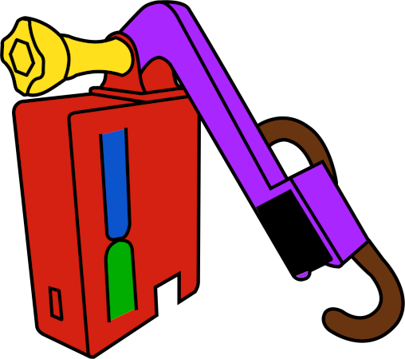

Open source, assistant controlled physical button clicker.

Note: This is a reupload of old article!

#### Contents:

1. [Introduction](#introduction)
   1. [Philosophy behind Klik](#philosophy-behind-klik)
   2. [Introduction to Klik](#introduction-to-klik)
      1. [Usage](#usage)
      2. [Component approach, open source](#component-approach-open-source)
      3. [Zero-waste, preserving existing solutions](#zero-waste-preserving-existing-solutions)
      4. [Cheap and simple](#cheap-and-simple)
2. [Components](#components)
   1. [Hardware](#hardware)
   2. [Firmware](#firmware)
      1. [Binary file](#binary-file)
      2. [Releases and versioning](#releases-and-versioning)
      3. [Source code](#source-code)
      4. [Debugging](#debugging)
      5. [3rd party](#3rd-party)
   3. [PCB](#pcb)
   4. [Case and swing-arms](#case-and-swing-arms)
3. [Device](#device)
   1. [Build](#build)
   2. [Principle of operation](#principle-of-operation)
      1. [Powering](#powering)
      2. [Buttons](#buttons)
      3. [Led (&) states](#led--states)
      4. [Connection with api and external services](#connection-with-api-and-external-services)
      5. [Swing-arm action](#swing-arm-action)
      6. [Configuration](#configuration)
   3. [Making](#making)
4. [About](#about)
5. [Licensing](#licensing)
   1. [Source code license](#source-code-license)
   2. [Case and swing-arm license](#case-and-swing-arm-license)
   3. [PCB license](#pcb-license)
   4. [Docs and webpage license](#docs-and-webpage-license)
   5. [3rd party licenses](#3rd-party-licenses)

# Introduction

---

This chapter is an introduction to Klik, philosophy behind it and description what it is supposed to do.

## Philosophy behind Klik

The main idea behind the creation of Klik is giving new life to "old" devices. This can be either devices from before the internet of things era or purely analog devices or mechanisms.

Main goals:

- reducing waste, preserving the existing equipment, bringing it to IOT era;
- modernizing devices without interfering with their internal structure;
- adaptability and openness;
- component approach;
- easy to reproduce;
- cheap.

## Introduction to Klik

Klik is as a modular, open source, assistant-controlled physical button clicker.
The project is based on Raspberry Pi-Pico W, and utilizes [Adafruit IO](https://io.adafruit.com/) API and [IFTTT](https://ifttt.com/explore) for integration with assistants. Source code is written in C.

### Usage

The basic idea for Klik is to be attached to some kind of device (electric or analog) and physically control it. Klik is equipped with servo, that with use of swing-arm, can click, un-click or tap the buttons (currently single servo is supported).

For full description go to [principle of operation](#principle-of-operation) chapter.

### Component approach, open source

Klik was designed to be adapted for user needs, so think of each component as an example rather than ready solution. For example: you can completely ditch the proposed form ([case and swingarms](#case-and-swing-arms)) of Klik and design your own, while keeping the PCB and the firmware.

### Zero-waste, preserving existing solutions

The [main goal](#philosophy-behind-klik) is to preserve the stuff you already own. Why change something working, just to get the same thing but with the internet connection. This produces both unnecessary cost and waste.

The great example are Roomba(s). The older models are still perfectly capable, but lack the option for "remote start". You can attach Klik to Roomba's dock (or even to the cleaner itself) and start it with your preferred assistant.

### Cheap and simple

Klik uses basic electronic components: headers, buttons, servo, resistors, led diode and Raspberry Pi-Pico W as it's core. The case and swing-arms examples are no larger than 10x10x10cm, so they can be reproduced on the smallest 3d printers. PCB can be easily etched at home, and all components mount onto it.

The firmware is released as binary file so you don't have to go through a hustle of preparing programming environment.
Drag and drop the file to Pi-Pico, and you are ready to go.

# Components

---

Klik consists of multiple components, both hardware and software. Each of them is shared with different licenses and stored in multiple repositories / sources.

This chapter will guide you trough the components of Klik.

## Hardware

Hardware side of Klik consists of following components:

- Raspberry Pi-Pico W;
- Tricolor (RGB) led diode;
- 3 resistors (75Ω used);
- Micro-servo (not included in a picture, MG90S used);
- 2 6x6 tact switches;
- Male and female headers (were trimmed to size).

Almost all components mount onto [PCB](#pcb), with exception of servo.

The Pi-pico W was chosen as a core of Klik due to:

- Great cost to resources ratio (comparing to Arduino);
- Onboard WiFi;
- Cheap price;
- Fresh product, mid 2022.

For wiring diagram, and PCB refer to [PCB](#pcb) chapter.

## Firmware

### Binary file

[💾 Download Klik - binary](https://github.com/dancesWithMachines/klik/releases)

The code is redistributed in binary form, so you don't have to setup programming environment, which can be painful. You can just drag and drop the file to Pi-Pico and you should be good to go!

This is a "killer feature" of Klik and it component design (especially as Pi-Pico, C/C++ sdk based product 😉🙂😉). You shouldn't have to mess with programming part if you don't want to. [Configuration](#configuration) is done entirely over serial, USB or uart.

### Releases and versioning

Klik uses following scheme for versioning: `vX.Y`

`X` - new feature added. `Y`- bug fixes.

Klik is at project phrase, there's no need for implementing a full versioning scheme at this level. This versioning will allow easy switch for standardized if necessary.

### Source code

[💾 Download source code](https://github.com/dancesWithMachines/klik)

Klik firmware is available on Github.

The code was written in C, using official C/C++ SDK for Pi-Pico. Logic is splitted between between multiple source files, based on purpose, and most of it was written with reusability in mind. For example, servo.c/h file contains only logic for handling servo.

Instructions of how to compile the code are available in [source code repository](https://github.com/dancesWithMachines/klik) readme file.

### Debugging

The pcb has pinout extension for debugging. You can set up pico-probe + gdb based debugger with [this tutorial](https://www.digikey.be/en/maker/projects/raspberry-pi-pico-and-rp2040-cc-part-2-debugging-with-vs-code/470abc7efb07432b82c95f6f67f184c0).

### 3rd party

Hardly any non standard, 3rd party libraries are used within the code, but there's a catch...

The communication with Adafruit IO API, is based on http requests. At the time of writing this, there's no official examples nor documentation, available for handling http requests on Pi-Pico with C/C++. The implementation that is present in `libs/picow_tls_client` is a **modified, appending (not yet merged with upstream) http request example, taken from development branches!** It was modified to be used as library, but with very little attention. The reason is, while it works, it's state leave much to be desired and will be probably changed till it makes it into upstream. It was moved to subdirectory as it's not an own's work and [Note from the author] "looking at it gives me pain". `picow_tls_client` uses [LwIP](https://savannah.nongnu.org/projects/lwip/) underneath.

Klik was designed to work with [Adafruit IO](https://io.adafruit.com/) API and [IFTTT](https://ifttt.com/explore). Hence, http requests are adapted to the format supported by Adafruit IO. Currently, there are no other options available.

IFTTT has many options for setting triggers that works with Adafruit IO (refer to [principle of operation](#principle-of-operation) chapter for explanation) including various assistants. They are not strictly connected to Klik, but keep in mind, that you'll be using more third party services if you want assistant integration.

**You should be aware that those solutions are "absolutely proprietary", and it's up to you if you want to give these companies access to your stuff.**

## PCB

**NOTE: Following pictures are for reference only**, download up-to-date version from source!

[💾 Download Schematic and PCB design](https://oshwlab.com/timax_/klik)

The schematic and PCB for Klik were designed in [EasyEda](https://easyeda.com/).

While schematic might not be correct from technical point of view, it is easy to follow and reproduce.

The PCB was designed to be a single layer (in EasyEda there are two layers), so it can be etched at home.
All holes can be drilled with 1mm drill bit, except the holes for led diode (use 6mm).
To print the pcb layout for thermal transfer you can use EasyEda's export feature. Export the second layer with traces, holes and mount points as PDF file, and print it in 1:1 (100%) scale.

Since the project was made with EasyEda, ordering the PCB from the PCB manufactories should be easy, but that was **not** tested.

Almost all [components](#hardware) mount onto the PCB, except servo. **Do not solder servo directly to the board**, the cable must pass through a small hole in the housing. Using opening in the boom is optional, it depends what type of servo will you use, and it's direction.

It is advised to use female headers for Pi-pico rather than soldering it directly. It can be easily swapped in case of failure.

As you can see, the schematic and PCB have additional header on top. This is the pinout for debugging.
You can skip soldering the header here it if you don't plan on messing with the code, refer to [debugging](#debugging) otherwise.

## Case and swing-arms

[💾 Download case and swing arms](https://www.thingiverse.com/thing:5632625)

Case and swing arms are available on [Thingiverse](https://www.thingiverse.com/).

All parts were designed in FreeCad, to fit 10x10x10cm 3d printers.

Some of the parts have to be glued together (outer case and GoProlike boom holder). Regular GoPro bolt can also be used to attach the boom to the holder, but hardware store nut and bolt will also do. You will also need 3mm bolt and 5mm nut to attach the pcb. The outer case has cutouts for mounting nuts.

As it was said in [component approach](#component-approach-open-source) chapter, this parts should be used as an example rather than template. While the case (with the boom) can be reproduced it is doubtful that any of swing-arms will suit your needs. Also, MG90S (servo) has multiple versions with different head sizes, so the swing-arms might simply not fit.

Note: The parts were printed (and tested) on the cheapest 3d printer on the market. They were designed with a margin by using trial and error method. Some (size) exceptions might occur.

# Device

---

This chapter describes base device, useful when you want to reproduce the device in its original/base form. Users are encouraged to change Klik however they like, as said in [component design](#component-approach-open-source) chapter.

## Build

The picture below shows all Klik components put together. For simplicity, the picture is missing servo wire and pi-pico's micro-usb port for power.

The individual elements, marked in color, are described below.

🔴 Case - holds all components together.

🟢 Main button - used to perform manual click (on/off).

🔵 Reset button - used to reset the device, for e.g. when configuration was changed.

🟣 Boom - holds the servo and swing-arm. The boom can be adjusted to change the swing-arm distance.

🟡 Boom screw - used to attach the boom to the case.

⚫️ Servo - used to move the swing-arm.

🟤 Swing-arm - used to interact with external devices. Swing-arm shown in the picture is only an example.

## Principle of operation

Klik, clicks buttons... but there's more than that to it.

### Powering

Klik receives power via micro-usb port, directly attached to pi-pico. It can be powered from normal usb charger or power-bank.

### Buttons

There are two buttons that are integral part of closing lid. The lower one, is used to perform click action (on or off) by click (and hold) of the button. This is useful when the swing-arm is directly connected to something, and it could not be moved without changing swing-arm position. Second button is used to reset/restart if errors are present during bootup or configuration has changed. Refer to [Configuration](#configuration) for more.

### Led (&) states

Klik has build in 3 color led, that is used to indicate device state. Below is the list of states with corresponding led pattern:

- SETUP STATE - Device is performing initialization. Normal behaviour. Led cycles between green and blue.
- CONNECTING STATE - Device is connecting to WIFI. Normal behaviour. Led cycles between blue and red.
- CONNECTION ERROR STATE - Device was unable to connect to WIFI. Check your WIFI configuration, or device is to far from WIFI source. Led blinks red once a second.
- REQUEST ERROR STATE - Device cannot connect to Adafruit IO. Check your api configuration (key, name, feed name). Led blinks blue once a second.
- WORKING STATE - Device has successfully completed initialization, has WIFI connection and gets data from Adafruit IO. Normal behaviour. Led blinks green once for five seconds.

### Connection with api and external services

The diagram of connection with external services is presented below.

Let's start with the main service that is Adafruit IO. Adafruit has so called "feeds". Feeds are related to account, user can have multiple of them. It basically is a space on the internet, that you can write (from) and read (to). The structure of feed resembles stack, approaching values are put on top. The flow has a single variable (of whatever type) called "value". For more detailed description refer to [Adafruit IO documentation](https://learn.adafruit.com/adafruit-io-basics-feeds).

Klik uses http requests and [Adafruit IO http api](https://io.adafruit.com/api/docs/#adafruit-io-http-api) to read and write the value to Adafruit IO. Device checks feed once in a second and performs [swing-arm action](#swing-arm-action) accordingly. Klik also writes to feed, when it ends performing an action or when action is requested manually (by push of a button).

Simple numeric value is used in process. Below is the list of currently supported values and swing arm actions:

0. Move swing arm to 0 position.
1. Move swing arm to max angle position.
2. Perform tap action.
3. Perform double tap action.

Refer to [swing-arm action](#swing-arm-action) chapter for action explanation.

Next important service, present on the diagram is [IFTTT](https://ifttt.com/explore/new_to_ifttt). It has both Adafruit IO and various assistants integration. IFTTT acts like a communication layer between various services. In this exact case, it allows assistant (trigger) to write specific value to Adafruit IO (action). Below is a simple applet for this scenario (the picture is a modified screenshot of applet on IFTTT website).

Use of IFTTT is required only for integration with assistant. This step be completely skipped if you are planning to use custom app to send requests to Adafruit IO. It also should be fairly easy to connect Klik to your own http based api, as the code basically looks for pattern `"value":<value>` in incoming responses. This however, would require changes in source code.

### Swing-arm action

Klik's swing arm is used to interact with external devices. Swing-arm distance can be adjusted by loosing and tightening the screw that holds the boom to the case. Swing-arm stroke (amount of movement) can be [configured](#configuration) over Serial. Swing arms mount directly onto servo and can be changed for specific needs.

Swing arm can move in two ways:

1. On/off action - swing arm changes it's position from corner to corner position (0 to max configured angle, and conversely) with push of the button. Button must be held until servo moves, it shouldn't take longer than 2 seconds. A specific position can be requested remotely, with the use of an assistant or different trigger.
2. Tapping action - swing arm goes to 0 position, and performs tap motion (0 to max angle and back). After tap, swing-arm stays in off position. Klik also supports double tap.

For the list of values that request specific movement go to [connection with api and external services](#connection-with-api-and-external-services) chapter.

### Configuration

Configuration is done entirely over Serial via USB or UART.
Default settings are: `BAUD RATE: 115200`, `DATA BITS: 8`, `STOP BITS: 1`, `SERIAL PARITY: 0`.

Before explanation how to connect to Klik, let's talk through configuration string pattern.

Each configuration string has pattern like this: `MODE SETTING VALUE`. Elements in configuration strings are separated by spaces. Below is the list of supported options for each element.

`MODE` options:

- `RST` - resets config to defaults, standalone command, does not require additional parameters.
- `GET` - used to get / display the value of setting.
- `SET` - used to set setting's value.

`SETTING` options:

- `SSID` - WIFI ssid name.
- `PASS` - WIFI password.
- `USRN` - Adafruit IO username.
- `FNME` - Adafruit IO feed name.
- `APIK` - Adafruit IO api key.
- `ANGL` - Maximum angle of swing-arm (servo) stroke, max value is 180.
- `MESS` - Message, it can be whatever you like.
- `CONF` - Valid only in `GET` mode. Prints current configuration.

Using `SET` mode, requires value to be specified for each setting.

All settings are stored in the flash memory. Settings are applied during boot sequence, so after changing configuration, the device should be restarted.

Klik stores configuration at the beginning of the last available flash sector for writing. On first boot-up it will check if configuration is present, and if not, apply default values.

Below is the example of configuring Klik via serial over USB.

Two terminal windows were used, one running minicom to receive the feedback, and one to send configuration strings.
As shown in the picture, Klik provides simple feedback indicating whether command was valid.

## Making

Making Klik in it's base form is a matter of putting all components together and configuring.

Suggested order of putting Klik together:

1. Etch or get the PCB and solder all necessary components. Use female headers rather than soldering Pi-Pico directly. Decide if you'll be using debug port, and if so, solder the header for debug also.
2. Flash Pi-Pico W with firmware. Connect it to pc in flash mode and drag and drop binary file into pi-pico's directory.
3. Mount Pi-Pico onto PCB and check if led suggests activity.
4. Print or get Klik's casing.
5. Glue outer case and boom holder together.
6. Mount PCB inside the casing.
7. Secure PCB and boom with nuts and bolts.
8. Attach servo to boom. Plug servo cable to pcb using hole on the side of outer casing.
9. Create account on Adafruit IO and configure the feed. Write 0 as initial feed value.
10. Perform initial device configuration.
11. Check if device connects to Adafruit IO.
12. Perform manual swing-arm position change, by pressing and holding the main button. If successful, you should also observe that feed value changes in Adafruit IO feed.
13. Close the case by attaching the lid.
14. Create IFTTT account and connect it with your assistant of choice and your Adafruit IO feed.
15. Create 4 applets in IFTTT. Configure trigger and action, each should write values as described in [connections with external services](#connection-with-api-and-external-services) chapter to your feed.
16. Test all supported swing-arm actions.
17. Mount Klik to device of choice.
18. Attach swing-arm of choice. Adjust the boom (manually), and the swing-arm stroke (configuration).
19. Test the setup.

# About

---

Klik 2022 by M.Kusiak (timax).

Check [licensing](#licensing) chapter for licensing information.

# Licensing

---

This chapter is focused on individual components and 3rd party licenses.

## Source code license

Klik's source code is released under [BSD 3 license](https://opensource.org/licenses/BSD-3-Clause).
Contributions to the source code are highly welcome.

Copyright 2022 M.Kusiak (timax)

Redistribution and use in source and binary forms, with or without modification, are permitted provided that the following conditions are met:

1. Redistributions of source code must retain the above copyright notice, this list of conditions and the following disclaimer.

2. Redistributions in binary form must reproduce the above copyright notice, this list of conditions and the following disclaimer in the documentation and/or other materials provided with the distribution.

3. Neither the name of the copyright holder nor the names of its contributors may be used to endorse or promote products derived from this software without specific prior written permission.

THIS SOFTWARE IS PROVIDED BY THE COPYRIGHT HOLDERS AND CONTRIBUTORS "AS IS" AND ANY EXPRESS OR IMPLIED WARRANTIES, INCLUDING, BUT NOT LIMITED TO, THE IMPLIED WARRANTIES OF MERCHANTABILITY AND FITNESS FOR A PARTICULAR PURPOSE ARE DISCLAIMED. IN NO EVENT SHALL THE COPYRIGHT HOLDER OR CONTRIBUTORS BE LIABLE FOR ANY DIRECT, INDIRECT, INCIDENTAL, SPECIAL, EXEMPLARY, OR CONSEQUENTIAL DAMAGES (INCLUDING, BUT NOT LIMITED TO, PROCUREMENT OF SUBSTITUTE GOODS OR SERVICES; LOSS OF USE, DATA, OR PROFITS; OR BUSINESS INTERRUPTION) HOWEVER CAUSED AND ON ANY THEORY OF LIABILITY, WHETHER IN CONTRACT, STRICT LIABILITY, OR TORT (INCLUDING NEGLIGENCE OR OTHERWISE) ARISING IN ANY WAY OUT OF THE USE OF THIS SOFTWARE, EVEN IF ADVISED OF THE POSSIBILITY OF SUCH DAMAGE.

## Case and swing-arm license

Case and swing-arms are released under [Creative Commons - Attribution 4.0 International](https://creativecommons.org/licenses/by/4.0/) license.

You can do whatever you want with both stl and FreeCad files, as long as you credit the author.

If you design your own things from ground up, there is no need to credit Klik's author.

It is not obligatory, but encouraged to share your designs. They might be helpful to other users, and will help Klik grow.

## PCB license

The pcb and schematic are released under [Creative Commons - Attribution 3.0 Unported](https://creativecommons.org/licenses/by/3.0/)

You can do whatever you want with the files as long as you credit the author, add link to license and indicate changes.

If you design your own things from ground up, there is no need to credit Klik's author.

It is not obligatory, but encouraged to share your designs. They might be helpful to other users, and will help Klik grow.

## Docs and webpage license

Documentation in form of web page, follows the license of [dancesWithMachines](dancesWithMachines.github.io) web page. Check [web page repository](https://github.com/dancesWithMachines/dancesWithMachines.github.io) for information.

## 3rd party licenses

Copyright (c) 2001-2004 Swedish Institute of Computer Science.
All rights reserved.

Redistribution and use in source and binary forms, with or without modification,
are permitted provided that the following conditions are met:

1. Redistributions of source code must retain the above copyright notice,
   this list of conditions and the following disclaimer.
2. Redistributions in binary form must reproduce the above copyright notice,
   this list of conditions and the following disclaimer in the documentation
   and/or other materials provided with the distribution.
3. The name of the author may not be used to endorse or promote products
   derived from this software without specific prior written permission.

THIS SOFTWARE IS PROVIDED BY THE AUTHOR ``AS IS AND ANY EXPRESS OR IMPLIED
WARRANTIES, INCLUDING, BUT NOT LIMITED TO, THE IMPLIED WARRANTIES OF
MERCHANTABILITY AND FITNESS FOR A PARTICULAR PURPOSE ARE DISCLAIMED. IN NO EVENT
SHALL THE AUTHOR BE LIABLE FOR ANY DIRECT, INDIRECT, INCIDENTAL, SPECIAL,
EXEMPLARY, OR CONSEQUENTIAL DAMAGES (INCLUDING, BUT NOT LIMITED TO, PROCUREMENT
OF SUBSTITUTE GOODS OR SERVICES; LOSS OF USE, DATA, OR PROFITS; OR BUSINESS
INTERRUPTION) HOWEVER CAUSED AND ON ANY THEORY OF LIABILITY, WHETHER IN
CONTRACT, STRICT LIABILITY, OR TORT (INCLUDING NEGLIGENCE OR OTHERWISE) ARISING
IN ANY WAY OUT OF THE USE OF THIS SOFTWARE, EVEN IF ADVISED OF THE POSSIBILITY
OF SUCH DAMAGE.

---

Copyright 2020 (c) 2020 Raspberry Pi (Trading) Ltd.

Redistribution and use in source and binary forms, with or without modification, are permitted provided that the
following conditions are met:

1. Redistributions of source code must retain the above copyright notice, this list of conditions and the following
   disclaimer.

2. Redistributions in binary form must reproduce the above copyright notice, this list of conditions and the following
   disclaimer in the documentation and/or other materials provided with the distribution.

3. Neither the name of the copyright holder nor the names of its contributors may be used to endorse or promote products
   derived from this software without specific prior written permission.

THIS SOFTWARE IS PROVIDED BY THE COPYRIGHT HOLDERS AND CONTRIBUTORS "AS IS" AND ANY EXPRESS OR IMPLIED WARRANTIES,
INCLUDING, BUT NOT LIMITED TO, THE IMPLIED WARRANTIES OF MERCHANTABILITY AND FITNESS FOR A PARTICULAR PURPOSE ARE
DISCLAIMED. IN NO EVENT SHALL THE COPYRIGHT HOLDER OR CONTRIBUTORS BE LIABLE FOR ANY DIRECT, INDIRECT, INCIDENTAL,
SPECIAL, EXEMPLARY, OR CONSEQUENTIAL DAMAGES (INCLUDING, BUT NOT LIMITED TO, PROCUREMENT OF SUBSTITUTE GOODS OR
SERVICES; LOSS OF USE, DATA, OR PROFITS; OR BUSINESS INTERRUPTION) HOWEVER CAUSED AND ON ANY THEORY OF LIABILITY,
WHETHER IN CONTRACT, STRICT LIABILITY, OR TORT (INCLUDING NEGLIGENCE OR OTHERWISE) ARISING IN ANY WAY OUT OF THE USE OF
THIS SOFTWARE, EVEN IF ADVISED OF THE POSSIBILITY OF SUCH DAMAGE.
