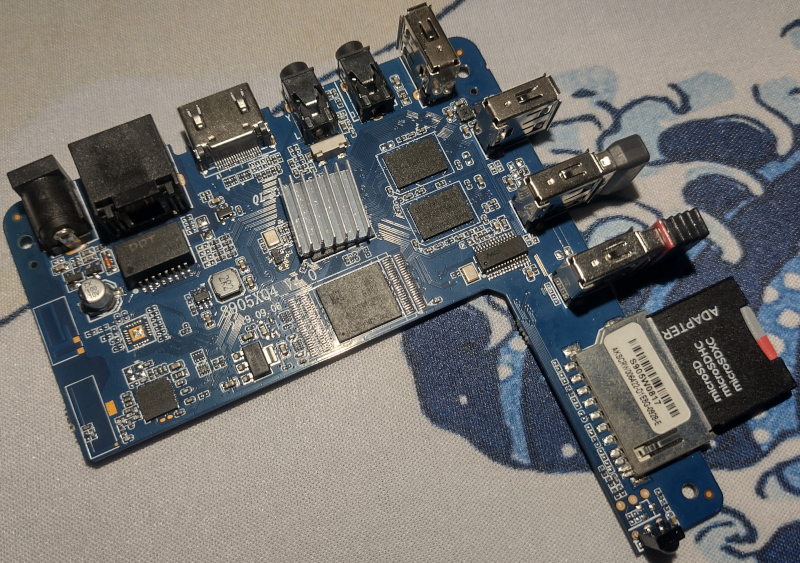
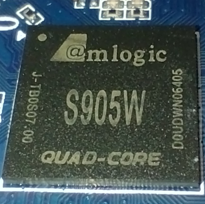
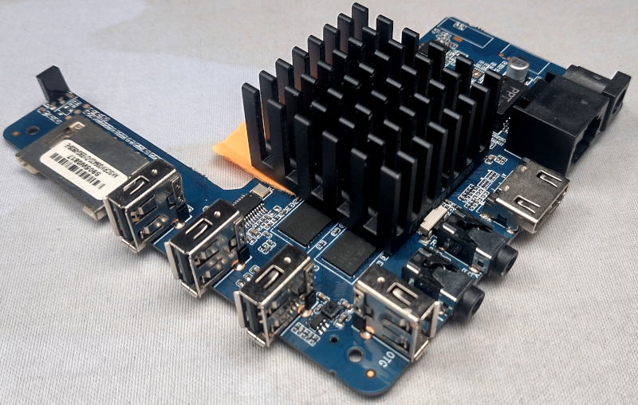
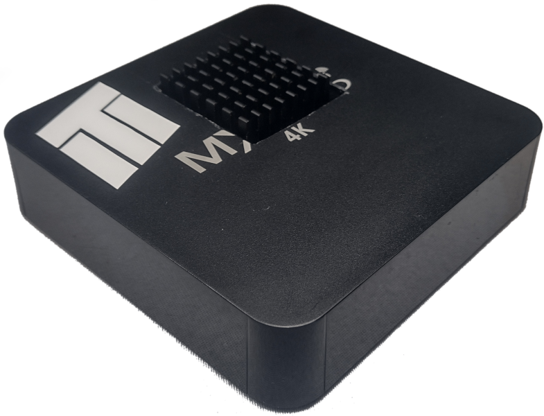

Note: This is a reupload of old article!

Due to lack of Raspberry Pi availability on the market, android TV boxes became great and possibly the cheapest replacement (especially used ones) for this micro-computers, as most of them can run Linux. This approach to the problem however has a downside, being lack of any support for the system.

As a part of entertainment and "creative procrastination" I turned el cheapo, spyware TV box into RetroPie machine. This report contains all quirks and features, tips and tricks I gathered in the process, to hopefully help someone replicating this "experiment".

Note: If you are trying to replicate this project, you should have knowledge of linux, at least on the level when if something doesn't work, you know what to google. This article is provided as it is, I take no responsibility nor give warranty that these instructions will work for you (or overtime).

**Contents**:

1. [YouTube video](#youtube-video)
2. [Quick links](#quick-links)
3. [Hardware](#hardware)
   1. [TV box lottery](#tv-box-lottery)
   2. [Tv box used](#tv-box-used)
      1. [Specs](#specs)
      2. [Motherboard illustrative photos](#motherboard-illustrative-photos)
   3. [CPU Throttling](#cpu-throttling)
      1. [My cooling solution](#my-cooling-solution)
4. [Operating System](#operating-system)
   1. [Installing Armbian](#installing-armbian)
      1. [iso used](#iso-used)
      2. [Choosing right iso](#choosing-right-iso)
      3. ["Installing" OS on s905 to internal memory](#installing-os-on-s905-to-internal-memory)
      4. [Suppressing "noisy" drivers](#suppressing-noisy-drivers)
   2. [Preparing OS for RetroPie installation](#preparing-os-for-retropie-installation)
      1. [Onboard WI-FI card not supported](#onboard-wi-fi-card-not-supported)
      2. [Setup via armbianconfig](#setup-via-armbianconfighttpsdocsarmbiancomuser-guide_armbian-config)
      3. [Additional software needed](#additional-software-needed)
      4. [Setup auto login](#setup-auto-login)
      5. [Fix faulty GPU drivers](#fix-faulty-gpu-drivers)
      6. [Allow non-root user to shutdown machine](#allow-non-root-user-to-shutdown-machine)
      7. [Enable sound via HDMI](#enable-sound-via-hdmi)
      8. [Set OS display resolution and disable wallpaper](#set-os-display-resolution-and-disable-wallpaper)
5. [RetroPie](#retropie)
   1. [Installing RetroPie](#installing-retropie)
      1. [It's not really a classic installation...](#its-not-really-a-classic-installation)
      2. [Prepare CPU for workload](#prepare-cpu-for-workload)
      3. [Establish good internet connection](#establish-good-internet-connection)
      4. [Temporarily disable GUI](#temporarily-disable-gui)
      5. [Prepare RetroPie installation](#prepare-retropie-installation)
      6. [Install RetroPie](#install-retropie)
6. [Summary](#summary)

## YouTube video

---

I did a video regarding this project. This article is an addon for it it.

<div style="width:100%">
  <iframe
    src="https://www.youtube.com/embed/d9u-pe_GYpE"
    title="YouTube video player"
    allow="accelerometer; autoplay; clipboard-write; encrypted-media; gyroscope; picture-in-picture; web-share"
    referrerpolicy="strict-origin-when-cross-origin"
    allowfullscreen
    style="width:100%; aspect-ratio:16/9; border:0;"
  ></iframe>
</div>

## Quick links

---

Here you can find a set of links I used throughout this article for quick reference.

[Installation Instructions for TV Boxes with Amlogic CPUs - Armbian Forum](https://forum.armbian.com/topic/17106-installation-instructions-for-tv-boxes-with-amlogic-cpus/)

[Armbian configuration utility - Armbian.com](https://docs.armbian.com/User-Guide_Armbian-Config/)

[simpledrm module prevents Mali G-31 hardware acceleration - Armbian Jira](https://armbian.atlassian.net/browse/AR-1641)

[Fix HDMI No Sound Armbian 20.10 bionic s905x - YouTube](https://youtu.be/ywLIuP0C5Jk?t=53)

[How to Install Retropie/Emulationstation on OrangePi3 - instructables.com](https://www.instructables.com/How-to-Install-RetropieEmulationstation-on-OrangeP/)

[RetroPie-Setup - GitHub](https://github.com/RetroPie/RetroPie-Setup)

## Hardware

---

### TV box lottery

As a host system I used MXQ PRO 4K 5G. ...however, this information is useless.

This cheap android boxes are victims of rebranding. Not only you can get same (mother)board from different manufactures, but single TV box model can have multiple motherboards types, with different CPUs. Like Forrest Gump said: "buying TV box is like opening a box of chocolates, you never know what you're going to get". You should keep this in mind while hunting for one.

### Tv box used

#### Specs

| Parameter | Value                    |
| :-------- | :----------------------- |
| Name      | MXQ PRO 4K 5G            |
| CPU       | Amlogic S905w (4x1,2GHZ) |
| RAM       | 1GB                      |
| ROM       | 8GB                      |
| System ID | p281                     |

Additional info:

- Onboard WI-FI, does not work under Linux. This is probably specific to this "5G(hz) WI-FI module", I have another MXQ Pro 4K without 5G (with S905 SoC) and WI-Fi works fine;
- OS cannot be installed to onboard memory.

#### Motherboard illustrative photos




### CPU Throttling

During the testing I noticed that in stock case SoC (CPU + GPU) starts throttling after a few minutes of gameplay, making games unplayable. This isn't surprizing, as the hot air inside the case has nowhere to escape.

You should consider modding the case for better (or in this case any) airflow. You might consider drilling holes in upper surface. If that won't be enough, adding fan or swapping heatsink might be necessary. It is worth noting, that I didn't experience throttling even with stock cooler when motherboard was used outside the case, but don't take that for granted as I was testing this setup for short period of time.

#### My cooling solution


Note: The orange paper was here to support radiator until termo glue cured.


## Operating System

---

### Installing Armbian

Armbian is the Linux distro I used on my TV box, simply because there aren't other alternatives. Armbian can be a little rough on the edges, but it's a very good OS, with massive amount of work done and it's easy to use as it's based on Ubuntu.

Detailed instruction of how to install Armbian on Amlogic based TV boxes can be found [**here**](https://forum.armbian.com/topic/17106-installation-instructions-for-tv-boxes-with-Amlogic-cpus/).
This instruction is for TV boxes with Amlogic CPU. If you've got CPU from different manufacturer you can search Armbian forum for suitable manual.

#### iso used

In setup OS was installed from file: Armbian_23.02.2_Aml-s9xx-box_jammy_current_6.1.11_xfce_desktop.img

#### Choosing right iso

There are (at least for my case) two OS iso(s) to download: with or without GUI. To run RetroPie, you need to have GUI installed on the system, so choose iso with xfce desktop preinstalled. If you "installed" non-GUI version, xfce can be later installed via [armbianconfig](https://docs.armbian.com/User-Guide_Armbian-Config/).

Also it is equally important to choose version with Ubuntu repositories, not Debian!
I used "jammy" as "buster" means Debian based.

#### "Installing" OS on s905 to internal memory

For s905 CPUs, according to OS installation manual from forum, it is impossible to install Armbian on internal memory. I'm running system from U1 SD card and the system is pretty snappy + I can have as much memory as I want.

#### Suppressing "noisy" drivers

From this project I learned, that some linux drivers might be... let's say wack-ly written or compiled... For example, some of them might spam your console/terminal with logs when you're trying to perform initial system setup. If you have such an issue you can add command `dmesg -n 1` to `/etc/rc.local` script. This will suppress their output, leaving console to you. This should be done somewhen around editing `extlinux.conf` file according to installation manual. Just mount the second partition and add command to said file.

### Preparing OS for RetroPie installation

Before installing RetroPie it is necessary to prepare the OS itself first.

#### Onboard WI-FI card not supported

Internet connection is absolutely necessary for RetroPie setup. I converted two android tv boxes to run Linux, and with on this one, WI-FI chip is not supported with said OS. Luckily, Armbian has support for common USB WI-FI dongles. If your WI-FI dongle is not supported out of the box, there's a chance that support can be added by [installing firmware packages](#installing-software-and-firmware-via-armbianconfig). If none of your dongles are supported, you should perform setup by connecting to the internet via ethernet cable.

#### Setup via [armbianconfig](https://docs.armbian.com/User-Guide_Armbian-Config/)

Armbian config is utility similar to raspi-config on Raspberry Pi OS. It allows managing most of the system functions via semi-graphical utility.
Via armbianconfig, you want to configure following things:

- `System/Defreeze` - This will enable OS and app updates on your system, meaning you could use most up to date applications. Might be needed to succesfully install RetroPie but I didn't test that, just enabled it for the peace of mind. I'd suggest running `apt update && apt upgrade` after the switch.
- `System/Avahi`(optional) - This setting will announce your system on the network. This comes handy if you don't know the ip of your device, or when connecting to ssh.
- `System/SSH` - Installing ssh is an absolute must. Installing RetroPie is a process that literally takes multiple days. You do not wan't to have TV box connected to your daily monitor for this long.
- `Network/WiFi`(optional) - Self explanatory. You'll need internet connection to install RetroPie. You can set up WiFi from here, if you do not have Ethernet cable plugged int.
- `Personal/Hostname` (optional) - With this option you can change your system hostname. I named my "poormanspie".
- `Software/Firmware` - This option will install all firmware (drivers etc.) for many peripteral and usb devices, including Wi-Fi dongles. If your wi-fi dongle or usb device is not supported out of the box, running this might make it function under the system. In my case, I had two wi-fi dongles, one of them was working at the beginning but stopped (dunno why), the other not working at all. Installing firmware packages fixed both of them for me. From observations, you might need to run this option multiple times until "Install all firmware packages" turns to "Install mini firmware package". I don't know why that is. It's seems like it not doing anything first time, but after second rerun it works.
- Uninstalling unnecessary software (optional) - From `Software` submenu, you've got option to uninstall some default software (Gimp, Thunderbird or Libre office) to save more space for the games.

#### Additional software needed

As It was said in [setup via armbianconfig](#setup-via-armbianconfig) chapter, update repositories and install following software via `apt`:

- tmux - It'll come handy for installing RetroPie, more on that later;
- git.

#### Setup auto login

Auto login is needed for RetroPie to be automatically started after system boot. This will disable initial lock screen and will immediately show xfce desktop. To enable auto login in armian, you have to add follwing lines to `/etc/lightdm/lightdm.conf.d/11-armbian.conf`:

```text
[Seat:*]
autologin-user=<your_user_name>
autologin-user-timeout=0
[...]
```

#### Fix faulty GPU drivers

If the mouse feel choppy on the desktop, and you see CPU usage spikes when moving the mouse (or doing anything GUI related) you possibly don't have hardware acceleration enabled. In my case it was due to faulty GPU driver `simpledrm`, same as described in [this issue](https://armbian.atlassian.net/browse/AR-1641)(I spend days looking for solution, and found this). You can test if you have same problem by running `glxinfo -B` in the terminal. Note that you have to have display attached to run this command, it'll fail otherwise. If it returns `Hardware accel:no` and errors related to simpledrm this is possibly the issue. To fix the issue, and load proper driver for Mali-450 (for me) I had to blacklist `simpledrm` in boot options. To do so, I added `module_blacklist=simpledrm` to `/boot/extlinux/extlinux.conf`. The end result looked like this:

```text
LABEL Armbian
LINUX /uImage
INITRD /uInitrd

FDT /dtb/amlogic/meson-gxl-s905w-p281.dtb

  append root=UUID=196e0179-c9c4-4c80-8604-f3ca0ed9af88 rootflags=data=writeback console=ttyAML0,115200n8 console=tty0 rw no_console_suspend consoleblank=0 fsck.fix=yes fsck.repair=yes net.ifnames=0 splash plymouth.ignore-serial-consoles module_blacklist=simpledrm
```

After reboot `glxinfo -B` should show hardware acceleration as enabled and no errors from simpledrm. Mouse and GUI should also feel much snappier.

#### Allow non-root user to shutdown machine

This step in necessary to shutdown/reboot machine directly from Emulation Station without password (using keyboard).
Use command `sudo visudo`, and in following line (possibly last one):

```text
@includedir /etc/sudoers.d
user ALL=(ALL) NOPASSWD: /usr/bin/psd-overlay-helper
```

add `/sbin/poweroff, /sbin/reboot, /sbin/shutdown`. End result should be:

```text
@includedir /etc/sudoers.d
user ALL=(ALL) NOPASSWD: /usr/bin/psd-overlay-helper, /sbin/poweroff, /sbin/reboot, /sbin/shutdown
```

#### Enable sound via HDMI

Out of the box, sound via HDMI might be disabled on Armbian. It can be enabled via `alsamixer` utility. Scroll left to item `AIU HDMI CTRL SRC` and change it from `disabled` to `I2S` ([reference video](https://youtu.be/ywLIuP0C5Jk?t=53)). After that, sound via HDMI should be working.

#### Set OS display resolution and disable wallpaper

For most of the emulators I tried, Full HD resolution was too much to handle, but they worked fine™ with resolution set to 720p. When you are done with previous OS setting, set your resolution via GUI to 720p. This way, you won't have to set resolution for each emulator (although it doesn't work this way) and you'll avoid Emulation Station scaling glitches. Also, I found out that disabling wallpaper and using solid color helps saving several dozen megs of ram.

## RetroPie

---

### Installing RetroPie

To start off, I'm obligated to say that this part of the article is heavy dependent on article [How to Install Retropie/Emulationstation on OrangePi3](https://www.instructables.com/How-to-Install-RetropieEmulationstation-on-OrangeP/) and the whole project wouldn't be possible without it. The article is written in Engrish, some things are missing and some paths are wrong... so here's how I installed it.

#### It's not really a classic installation...

RetroPie prepared installation script for OSes based on Ubuntu. This allows to basically make any OS a RetroPie (RetroPie itself is a linux distro for RPIs). This is why it was necessary to choose Arbian iso with Ubuntu repositories.

The script does not download prebuild binaries as you might thought it would, but it **BUILDS EVERYTHING LOCALY**. Yes, emulators (cores), games, everything will be build on your 5W arm, TV box CPU. That's exactly why this process literally takes days, but don't worry, you don't need to sit and observe it compiling.

#### Prepare CPU for workload

As it was previously said, during installation CPU will be heavily stressed for few days. Default case is very air restrictive and the CPU might start throttling quick. I strongly advise, at least putting the motherboard out of the case for installation process, to help cpu cool off.

#### Establish good internet connection

Make sure your internet connection is good. It is advised to run installation via ssh, so you don't need your TV box to be connected to monitor. It is advised to connect TV box via ethernet cable into router, or at least keep it near if connecting via WI-FI.

#### Temporarily disable GUI

Xfce is surprisingly very ram thirsty in Armbian's implementation, so it's best to turn it off for installation process to have more resources to play with. To do so, add `3` (yep, that's it) to boot options in `/boot/extlinux/extlinux.conf`. It should look like this:

```text
  append root=UUID=196e0179-c9c4-4c80-8604-f3ca0ed9af88 rootflags=data=writeback console=ttyAML0,115200n8 console=tty0 rw no_console_suspend consoleblank=0 fsck.fix=yes fsck.repair=yes net.ifnames=0 splash plymouth.ignore-serial-consoles module_blacklist=simpledrm 3
```

After reboot, you should end up in text mode. To reverse the changes after the installation, remove `3` from boot options inside said file, and reboot the machine.

#### Prepare RetroPie installation

Run following command to clone RetroPie installation scripts:

```bash
git clone --depth=1 https://github.com/RetroPie/RetroPie-Setup.git
```

Next, some files must be removed from downloaded repository for installation to complete. Why? I don't know, the original author of the article didn't explain this, but I suppose it's due to compatibility reasons (architecture, etc.). Below is the list of files that needs to be removed:

```text
./scriptmodules/emulators/basilisk.sh
./scriptmodules/emulators/jzintv.sh
./scriptmodules/emulators/ppsspp.sh
./scriptmodules/emulators/scummvm.sh
./scriptmodules/emulators/scummvm-sdl1.sh
./scriptmodules/emulators/mupen64plus.sh
./scriptmodules/emulators/reicast/reicast.sh
./scriptmodules/emulators/reicast.sh
./scriptmodules/libretrocores/lr-flycast.sh
./scriptmodules/libretrocores/lr-mame2000.sh
./scriptmodules/libretrocores/lr-mame2010.sh
./scriptmodules/libretrocores/lr-ppsspp.sh
./scriptmodules/libretrocores/lr-mupen64plus-next.sh
./scriptmodules/libretrocores/lr-mupen64plus.sh
./scriptmodules/ports/kodi.sh
./scriptmodules/ports/uqm.sh
./scriptmodules/supplementary/scraper.sh
./scriptmodules/supplementary/skyscraper.sh
```

#### Install RetroPie

##### Connect to TV box via ssh and start tmux session

Connect via ssh to your tv box and create new tmux session with:

```bash
tmux new -s <session_name>
```

Running the installation script inside tmux session will first of all, keep ssh session alive unlimited amount of time, meaning you won't be disconnected in the middle. Secondly, even if for some reason you get disconnected, you can still reconnect to the machine via ssh and access installation process by running:

```bash
tmux a -t <session_name>
```

##### Install base RetroPie components

Run RetroPie installation script with following command:

```bash
sudo __platform=generic-x11 ./retropie_setup.sh
```

The script will download few things and after some time you should see GUI-like window with first option being `Basic install`. Make sure your machine is prepared for extended workload (steps [this](#establish-good-internet-connection), [this](#prepare-cpu-for-workload) and [that](#temporarily-disable-gui)) and run this option. Script will start downloading and compiling RetroPie components. This process took quite a few hours on my TV box, since it has to compile everything from source. Don't worry if you see warnings. They might look like errors, but those are warnings returned by compilers, about unused variables, etc. You will know that the installation was successfully completed if you end up on the initial GUI-like screen and no errors needed confirmation from your side.

##### Install additional components

When base installation is done, now it's time to compile and install additional packages. This process will take even longer (in my case about 1,5 days). Go to `Manage packages -> opt` and select option `Install all optional packages`. After the process is done you might see some errors this time, but don't worry if single component installation fails, rest of the modules are installed, and you can always rerun installation for single component. In my case I had a single error related to `eduke32` which is open-source port of Duke Nukem 3D. I decided to roll with it, and didn't try to install it again.

##### Setup RetroPie to launch at OS start

This is the last step to installing RetroPie. In installation script go to `Configuration / tools` and set up `180 autostart` for Emulation Station to start after OS boot. This completes installing RetroPie.

##### Test if success

Reboot the machine. After xfce desktop appears, Emulation Station should start launching soon.

##### Emulators and games

Default emulators migh work sluggish as it was in my case, so they might need to be changed to another. I won't descibe it here since I tested only two consoles and there are plenty of guides showing how to do it. This also applies to downloading games.

## Summary

---

So those are all quirks and features I can remember from installing RetroPie on my AmLogic based TV box. Once again, I want to remember that this "instruction" is provided as it is. Is a hard process and you should know what you're signing up for. I know that this document reasembles tutorial, but keep in mind that it isn't one. You might run into different issues not descibed here, and let me tell you... debugging uncommon system/setup is hard. This project took me several weeks of evenings to complete, but in the end... mission was accomplished.
