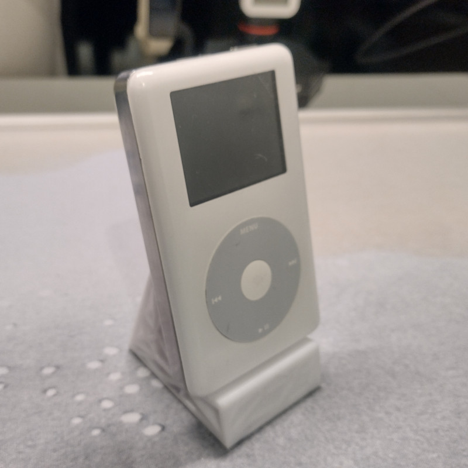
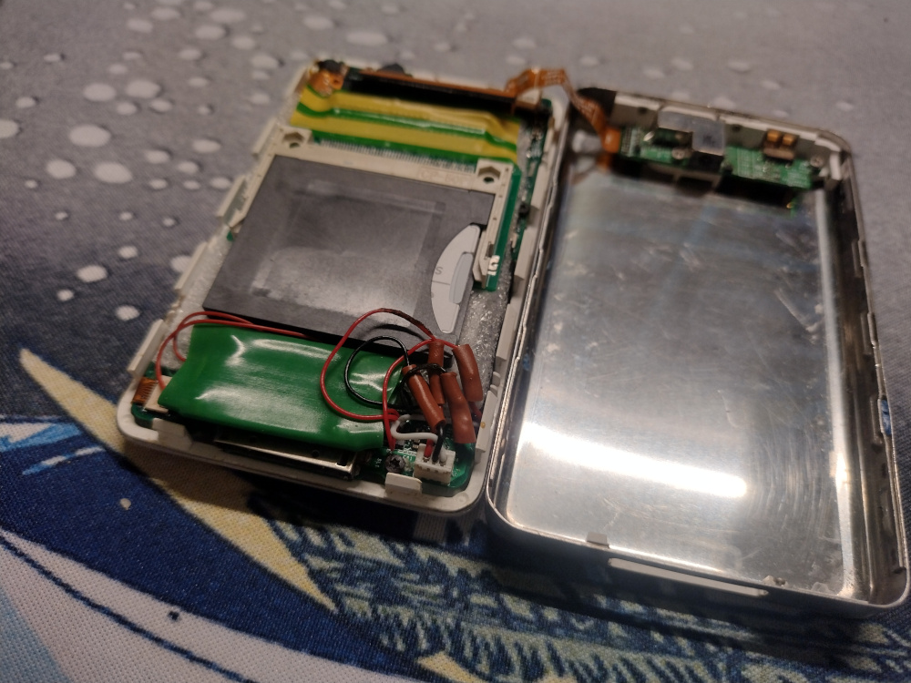
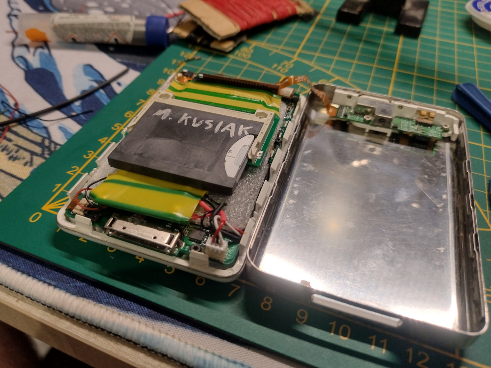
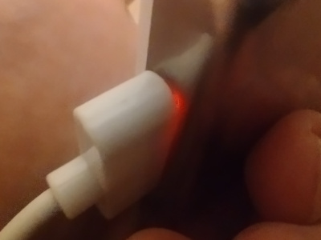

Today's post is about replacing the battery in my cursed iPod Photo (4th gen). You'd think that for a device this old, you'd simply swap the old battery for a new one, and the job would be done. Well, not for this iPod.

# Backstory

---

I got into modding iPods after discovering [DankPods](https://www.youtube.com/@DankPods/videos), back when the channel focused on iPods. My first was an iPod Nano 3G, but I quickly ran out of storage. So, I took a gamble and bought a broken iPod Classic, specifically a 4th gen (Photo). Most of these fail due to hard drive issues, so took a leap of faith and replaced the broken drive with an SD card (yes, you can do that with a chain of adapters :D). Initially, the operation seemed successful, the iPod was alive, and I even made a video about it:

<iframe width="560" height="315" src="https://www.youtube.com/embed/PDO8IemA0io?si=IRQih4rD277PFCtU" title="YouTube video player" frameborder="0" allow="accelerometer; autoplay; clipboard-write; encrypted-media; gyroscope; picture-in-picture; web-share" referrerpolicy="strict-origin-when-cross-origin" allowfullscreen></iframe>

Unfortunately, I soon discovered another issue: the iPod took days (yes, **days**) to charge. I recall reading on some forum that this could be due to a faulty charging IC, which I supposedly then confirmed with the built-in iPod hardware diagnostic test. Sadly, I can't find that source anymore, so you'll have to take my word for it. At the time, I was a broke student, so I went for the simplest solution I could think of, and thus the...

# Spaghetti

---

Take a look at the green "thing" and the wires attached to it:

Yup, I bypassed the integrated charging IC with a cheap Li-Po charging module. I soldered wires to the 30-pin connector from the inside to pull 5V and GND. For the battery, I spliced the wires to solder the module between the motherboard connector and the battery itself.

Is this cursed? **Yes.**  
Does it work? **Also yes.**

You can also admire my **precisely** selected heat shrinks for the job (sarcasm intended). All jokes aside, this solution keeps this 20-year-old device alive, which I think is better than letting it become just another piece of e-waste.

# Battery Replacement

---

The reason for this post is that I needed to replace the battery again, as it could no longer last more than two hours of playback. This meant redoing the entire job, but this time, I did it more properly. I figured this might be a fun post to make. I finally used the correct-sized heat shrinks and hot air instead of a lighter, so the wires didn’t get crusty. You can judge the result yourself:

I think the "junky" look gives it a charm.

With this "mod", the iPod acquired a new feature. :D

# Why Bother?

---

So, why do I use an old iPod in 2024? Let me explain: this is no ordinary iPod. It has over 500+ CDs ripped onto it in FLAC format, preserving the original (CD) quality. To fit all those FLAC files, I upgraded its storage with an SD card mod, boosting its capacity to 256GB, more than three times the stock size. Additionally, stock iPods can’t play FLAC files, but mine runs [RockBox](https://www.rockbox.org/), an open-source firmware that makes this possible.

But beyond the technical specs, here’s why I still prefer this 20-year-old MP3 player:

- **Single-purpose device**: It's just a pocket music player. I plug it in, and that’s it. No distracting notifications, no need for internet access, and no worries about storage limits (modern smartphones rarely have SD card slots anymore). This reminds me of...
- **3.5mm headphone jack**: What a concept! A device with a built-in DAC that produces sound without needing a dongle. It works with 100% of wired headphones and Hi-Fi systems.
- **Sound quality**: Despite its age, this was once a high-end device, and it shows. My current smartphone, a Motorola G30, doesn’t come close to matching the iPod's audio quality.
- **Higher bitrates**: Spotify's "High Quality" streams max out at [320 kbps](https://support.spotify.com/us/article/audio-quality/). A CD, by comparison, has a bitrate of [1,411 kbps](https://www.adobe.com/creativecloud/video/discover/audio-bitrate.html)—more than 4 times higher! While the difference isn't always noticeable, in certain moments, it is huge. It’s similar to video streaming: have you ever noticed pixelation during fast-moving scenes? That’s compression, and audio is not free of it either. When many things are happening at once, you can't differentiate various sounds anymore, you just hear a combined noise. That's at least my experience.
- **Ownership and freedom**: No monthly subscriptions, no data mining, no TOS changes, no disappearing songs, and no price hikes. What's more. at least in Poland, many famous albums and songs are missing from streaming services or are only available in live versions. Sometimes, the only way to hear a specific version is to own the original CD.
- **Preservation**: This one’s personal. I enjoy preserving old devices and finding new purposes for them. Modding is part of the fun, and the iPod is no exception.

And that wraps up my rant about modern music consumption, which all started with a simple battery replacement.
