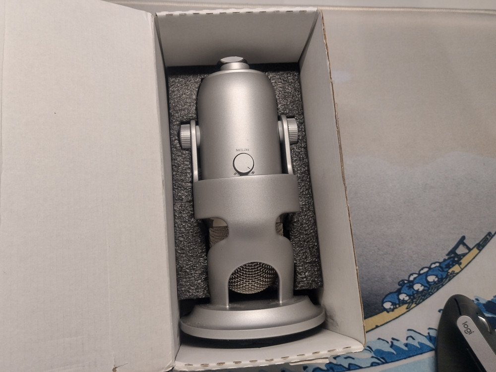
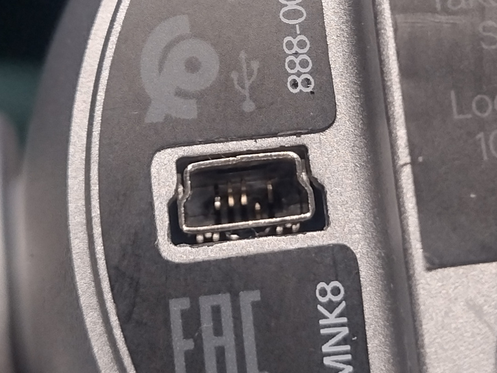
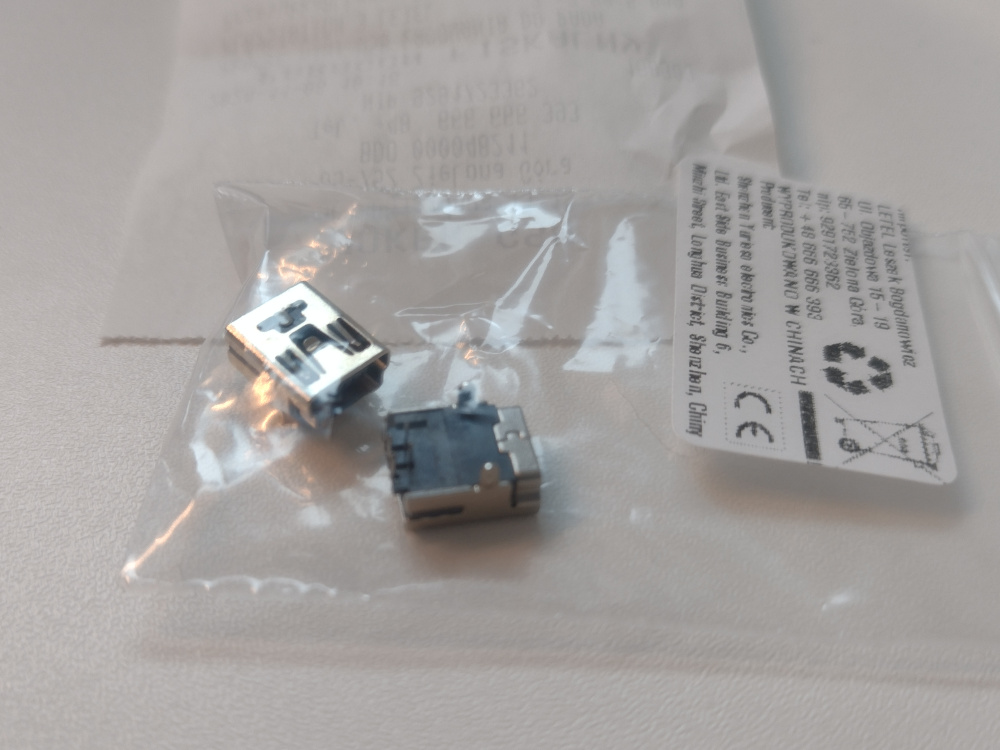
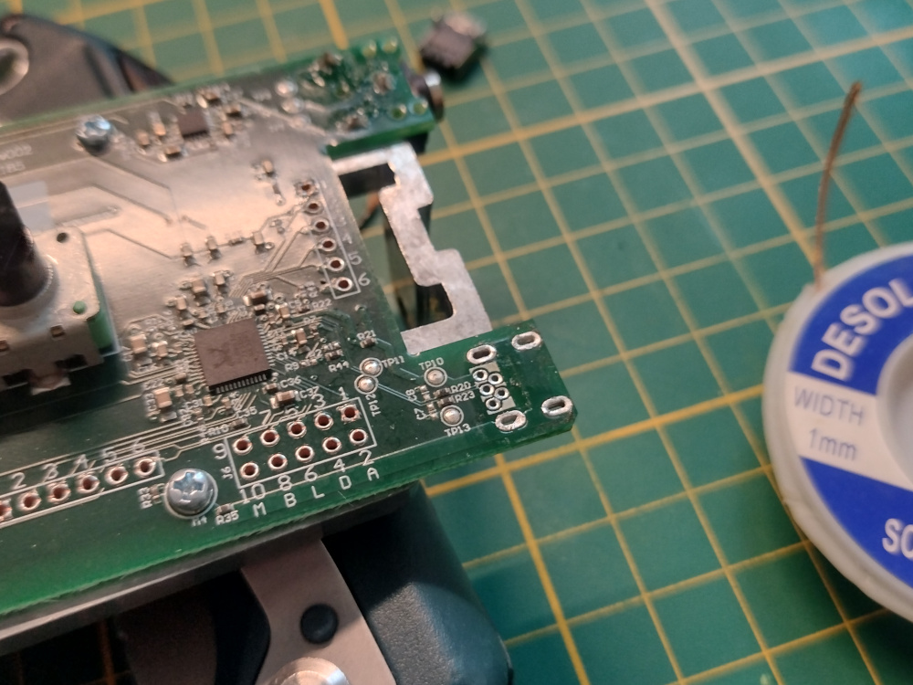
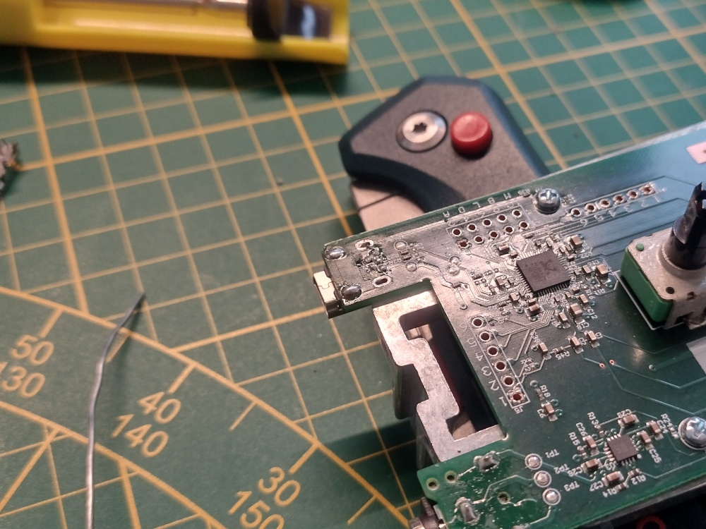
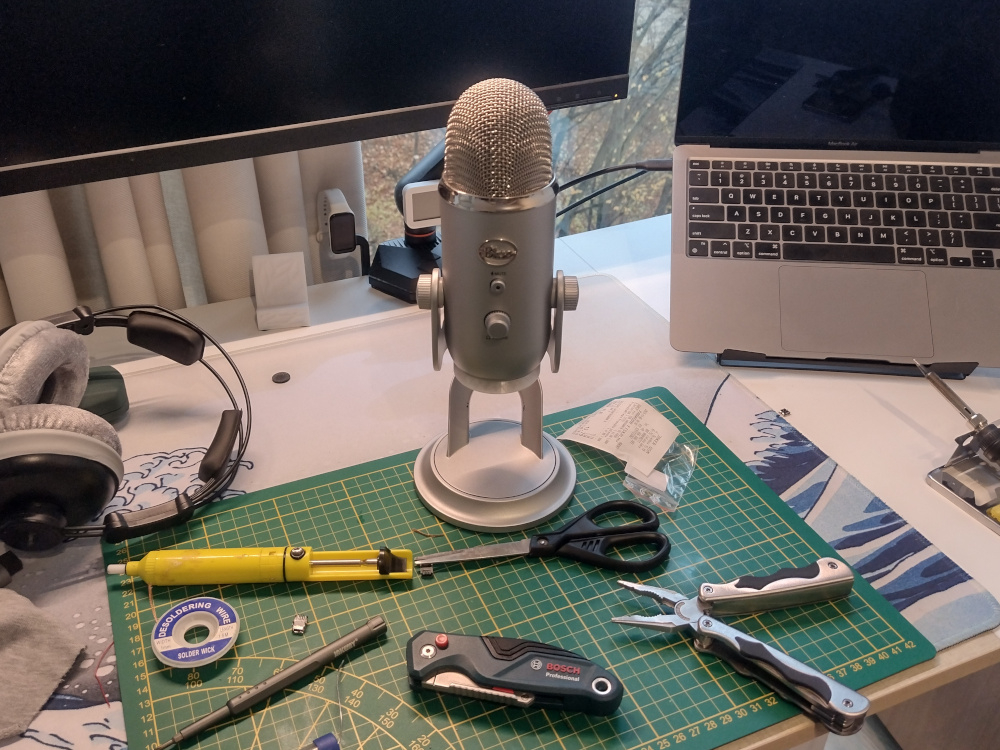

Today’s post is about bringing a broken Blue Yeti microphone back to life.
My brother, who runs a page dedicated to old-timer cars, recently decided to expand into video content for YouTube.
Naturally, he wanted to invest in a good microphone, specifically the iconic [Blue Yeti](https://en.wikipedia.org/wiki/Blue_Microphones).

# Yeti and Me

---

The Blue Yeti has been around forever, it was [released in 2009](http://recordinghacks.com/microphones/Blue-Microphones/Yeti) and still kicking in 2024.
Although the Blue brand was [phased out by Logitech in 2023](https://www.pcworld.com/article/1947945/logitech-kills-off-blue-microphones-but-yeti-stays-alive.html),
modernized, Blue branded Yeti mics remain available in stores.

Why am I telling you this? Well, back in middle school, my buddies and I were into making videos.
While most kids stuck to PowerPoint presentations, we’d submit video projects.
Teachers liked them too, even tough we smuggled a lotta jokes and sketches into them.

Back then, the Blue Yeti was the gold standard for recording voiceovers, but being a middle schooler I couldn’t afford one.
All the popular YouTubers used it then, and still many use it today.
The best I could manage back then was a [Trust Starzz mic](https://www.farnell.com/datasheets/2615079.pdf) for around 40zł (~$11 in 2015), and even that felt like a serious investment.
Fast forward to today, after all those years, I finally...

# I Bought a Blue Yeti

---

Well, sorta... I bought it for my brother... and I bought it broken...

The issue?
A damaged mini USB-B port, a common problem for these mics. Usually, the solder joints break, causing intermittent connection or total failure.
Here's a closer look:

# The Repair

---

The fix was straightforward: open the mic, desolder the damaged port, and replace it with a new one.
Luckily, there are [plenty of guides](https://youtu.be/Y2sNQonIPSs) on how to do this.

This repair gave me a chance to finally use the hot-air gun on my soldering station.
Since the port sits at the edge of the board with minimal surrounding components, it was a low-risk way to practice.

Here’s the process:

  
  

_Note: The new port only has two support legs. I used a port from a PS3 controller since the pinout matches._

# The Result

---

Success! The microphone is back in action, and after some testing, it’s now with my brother.

### Was it worth it?

The cheapest new Blue-branded Yeti I could find was 492zł (~$121) on Amazon.
Used, (seemingly) working ones can be found for 200zł (~$49).

Here’s the breakdown of what I spent:

- 190zł for the broken mic
- 2.9zł + 5,8zł shipping for the replacement port

That’s around 199zł (~$49), so it's almost the same price of a working used Yeti.
At the time of purchase, though, working ones were going for over 300zł.
I'd still call it a win as even ones sold as working, are rather closer than further to developing port issues, and that's now taken care of.
Giving 40% of the MSRP for now fully functional semi-professional mic is a good deal in my opinion.

If you’re wondering, my brother paid for the mic and the port, but I did the repair for free.
It was my idea to go for a used one to save him some cash. I remember the struggle of being a student.
Money and students rarely get along! 😄
