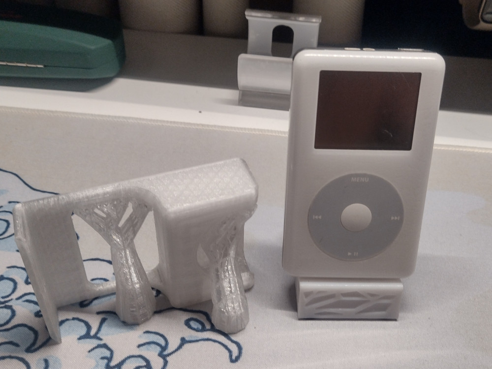

I recently replaced a battery in my modified iPod 4gen (Photo), which I described [in this post](./2024-11-12-cursed-solution-for-non-charging-ipods.md). I intend to use it more often, but I haven't got a place for it and I don't like having random things on my desk. There are some iPod docks still available to buy, but there wasn't any that I liked, nor did I particularly want a classic dock as it would take up space on my desk. I decided to approach this the other way and launched FreeCAD, coming up with this design:

**Note:** [On 18.11.2024 version 1.0 of FreeCAD was released](https://wiki.freecad.org/Release_notes_1.0/pl)! Still need to update.

Then, I printed part of the profile to see if the dimensions I took and margins were accurate and proceeded with printing the whole part.

All that was left was to secure the stand to the desk. Here's the final result:

The stand was printed with transparent PETG at 33% infill. I tried to add the rounds in the design, but I don't think I particularly succeeded. I also added a window for a floating effect and to avoid hiding the background (real window) as much as possible. The dimensions are spot on, but if I were to redesign this, I'd add some profiling to the pillars. The stand tends to resonate back and forth a bit if I shake the desk.

As with all my designs that I feel are worth sharing, this one is open-sourced as well, and you can download it [here](https://www.thingiverse.com/thing:6848090).
