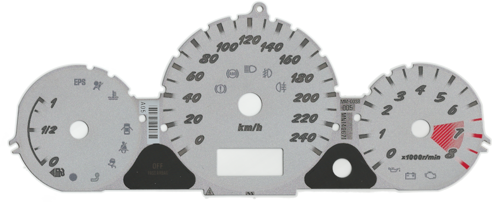
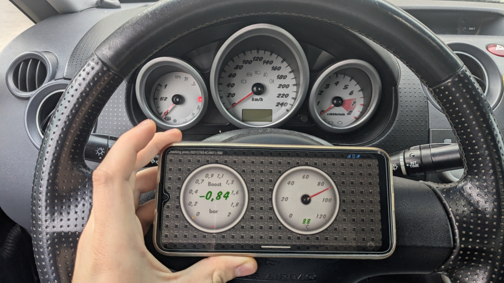

I'm once again into a phase where I feel like experimenting with car electronics. I got the idea from YouTuber [Upir](https://www.youtube.com/watch?v=ugS3rKBZVVc), whose recent videos focus on recreating car instrument clusters using various types of screens controlled by microcontrollers. It's a great concept I'd like to explore. However, integrating such a solution into my car would require hacking into its [CAN BUS](https://dewesoft.com/blog/what-is-can-bus) system and reading data with some kind of a microcontroller. While this isn't overly difficult, it would be time-consuming, and I'm already juggling another automotive project, which I'll probably share here later.

That project started to feel overwhelming, so I decided to do some "creative procrastination," as [Scott Yu-Jan](https://www.youtube.com/@ScottYuJan) calls it. I wanted to work on something that would bring me closer to custom gauges for my car without committing to another major project. That's why I made custom gauges for...

# The Torque App

---

[Torque](https://play.google.com/store/apps/details?id=org.prowl.torque) is a mobile app that, with the help of cheap Bluetooth [OBD2](https://www.csselectronics.com/pages/obd2-explained-simple-intro) adapters, can read and display a car's real-time parameters using various types of gauges and graphs. One of the app's cool features is the ability to create custom gauges, so naturally, I gave it a try.

# Tools for Creating Gauges

---

It's worth noting that Torque doesn't include a built-in gauge creator, so you’ll need at least basic skills in graphic design software. To recreate (let’s not say “design”) my car’s gauges, I used [GIMP](https://www.gimp.org/). To quickly test my designs, I enabled USB debugging on my Android smartphone and used Android Studio to transfer the files. Everything you need to know about creating custom themes for Torque is documented in the [Torque Wiki](https://wiki.torque-bhp.com/view/Themes).

For reasons I'll explain later, I also used [FontCreator](https://www.high-logic.com/font-editor/fontcreator). As an open-source enthusiast, I initially tried [FontForge](https://fontforge.org/en-US/), but I couldn't get it to produce usable results.

# The Car

---

I own a 2006 Mitsubishi Colt CZC in the "Turbo" trim, a small cabriolet based on the regular Colt, designed and produced by Pininfarina. With this trim level, is nearly identical to the Colt CZT, but with a retractable roof of course. It shares the same `4G15T` engine, suspension parts, Scorpion exhaust, and some interior trim pieces, like the special white gauges and center console overlay. Unlike the [Miata](https://en.wikipedia.org/wiki/Mazda_MX-5):

- It's relatively uncommon.
- It looks goofy with the roof up (gotta give em that).
- It's cheap.
- It's fairly quick.
- It has a turbo.
- It doesn’t rust.

Of course, comparing a Miata to a Colt is like comparing apples to oranges. The Miata is a sports car, while the Colt is a sporty minivan with a chopped roof. If you're curious about the car, I have a [dedicated YouTube channel](https://www.youtube.com/@coltczcturbo) for it.

Despite its sporty character, the Colt lacks both a boost pressure gauge and a coolant temperature gauge, so that is something I aim to change.

# Getting Reference Material

---

I wanted my virtual gauges to resemble the white OEM gauges from the turbo trim. To get accurate reference images, I would have needed to remove the gauges from my car and scan them. Luckily, someone was parting out a Colt CZT and sold me the gauges for a steal. I bought and disassembled the gauges to scan the graphics layer of the cluster, as shown below.

I also took reference photos of the assembled cluster and the car interior. These helped me sample colors, create patterns, and even extract elements like the needle for use in my virtual gauges.

# The Result

---

Here’s the final result of my custom gauges:

You can decide if I successfully recreated the factory look. In my opinion, it’s not perfect, but it does closely match the original.

What I think turned out well:

- **Fonts**: I found a suitable replacement font. Although I initially planned to extract the font from my scans, this proved too challenging. You can read more about the fonts in the repository README (details below).
- **Depth**: I added depth by incorporating shadows and glows.
- **Styling**: I matched the car’s interior design, including its signature square pattern.
- **Color Matching**: The colors are pretty spot on, in my opinion.

I believe, this is as close as I can get given...

# The Limitations

---

The Torque app’s theme system has several limitations. Some key elements from the original design couldn't be replicated, such as the unique tick marks (scale stripes). Custom ticks aren’t supported, but I had already started designing them before realizing this limitation.

Main limitations include:

- No custom ticks.
- No control over tick thickness.
- No separate night/day gauge modes (the factory cluster is pitch black at night with green illumination).
- No specific font assignment for different text elements (I had to merge fonts to achieve the desired look).
- No font modifiers (italic, bold).
- No control over tick count.
- Some settings affect gauge types they shouldn't.
- No font size changes for displays.

# Download

---

You can download the source files (raw photos, scans, and the theme) from [this repository](https://github.com/dancesWithMachines/cz_turbo_theme), but note that I still have to test the gauges in practice. The project is open source, so feel free to contribute. If the theme becomes downloadable directly within the Torque app, I’ll update this post accordingly.

# Summing It All Up

---

This was a fun side project and probably the simplest way to get matching gauges for my car. Yes, it requires an Android smartphone or radio, but this extra data is only occasionally useful anyway, it's not like I drive on redline all the time.

For me, if I decide to pursue standalone custom gauges like the ones Upir showcases, I now have more experience recreating gauges and a wealth of reference photos to boot.
