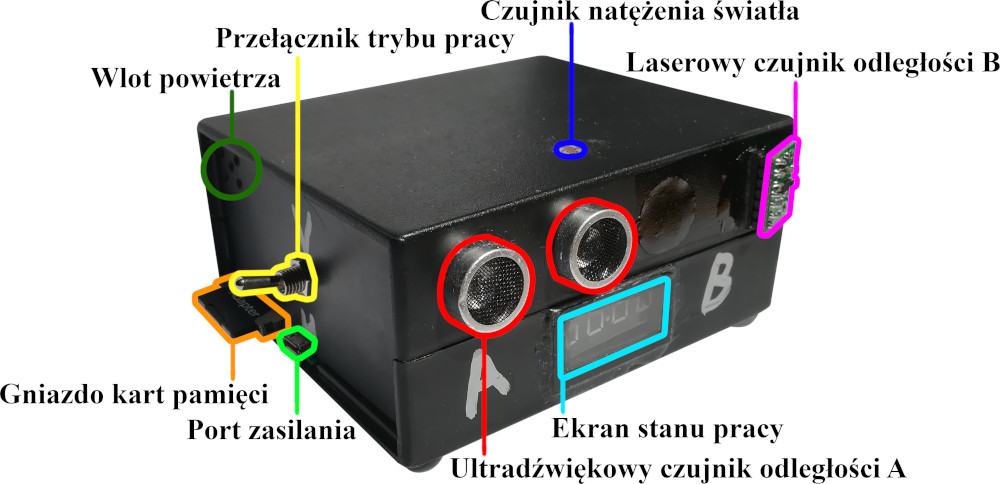
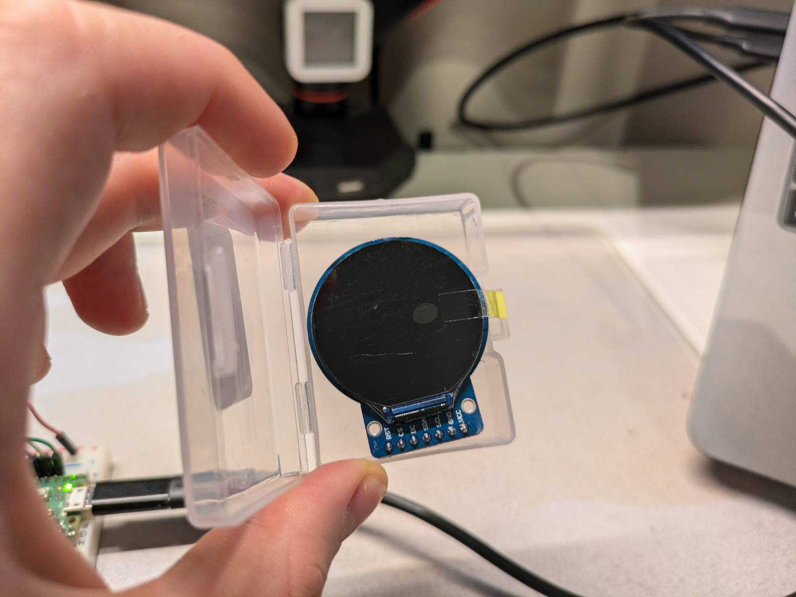
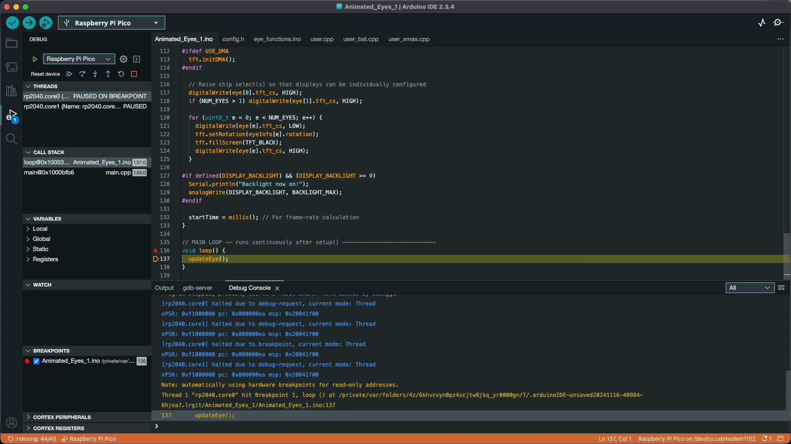
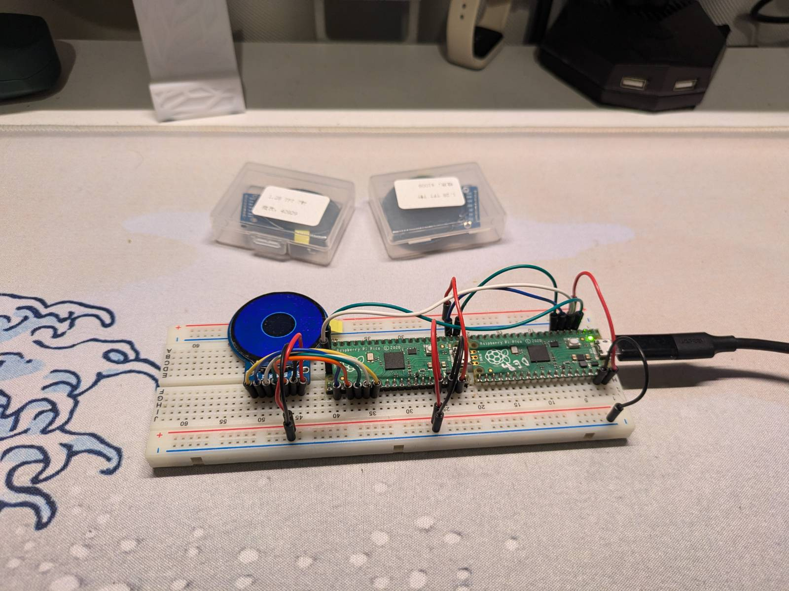

Today's post is about my thoughts on the Arduino platform and non-Arduino microcontrollers.

# A Bit of Backstory (as Always)

---

## My Experience with the Arduino Platform

Arduino is a popular platform among tinkerers, beginners in coding/electronics, and hobbyists who love making stuff. It made embedded programming simple.

Like many others, my first projects were Arduino-based. I got an Arduino Uno along with a book that taught the basics of programming, and I was hooked. Even at university, my bachelor's thesis project was based on Arduino. I built a device that could count how many people visited a shop and at what times. It also had basic weather-measuring instruments, though I didn't use them during the test run, as the device was placed inside the shop.

With that [machine-generated data](https://www.indicative.com/resource/machine-generated-data/) (the thesis topic), I could determine the busiest hours. Compared to Google Maps' popular times, my results were much more precise. Below is a picture of said contraption:

## Outgrowing the Arduino

This project made me realize that, to make Arduino accessible to everyone, many shortcuts were taken that made it less suitable for "professional" use. The main issues I encountered were:

- [Specific programming language](https://emeritus.org/blog/coding-arduino-programming-language/) - based on C++ but not fully C++;
- Limited toolset - no debuggers\*, clunky IDE;
- Limited hardware - more on that below.

_Note: \* - for the boards I used._

I based my thesis project on an Arduino Nano clone and faced multiple issues. Debugging was done by printing stuff on serial (a method I now know is called "crying for help", not debugging). At the time, I didn't know any better, nor I had any other options. Another problem was the project occasionally stalling. It turned out I was running out of SRAM memory. Arduino boards have pretty limited hardware. The Arduino Nano I used had only [2kB of SRAM](https://docs.arduino.cc/resources/datasheets/A000005-datasheet.pdf). Compare that to the newer Raspberry Pi Pico, which has [520kB of SRAM](https://www.raspberrypi.com/documentation/microcontrollers/pico-series.html) (260 times more) and costs about the same. While the comparison isn't entirely fair, in terms of price-to-performance ratio, the Pico is the winner.

Finally, the Arduino language itself is platform-specific. While there's nothing inherently wrong with it, I knew that if I wanted a future in programming, I needed to move to C/C++, the industry standard for embedded systems. With these limitations in mind, I decided to transition to the Raspberry Pi Pico, the newest platform at the time.

## To the Point

So why am I telling you all this? Well, I recently bought a small circular TFT display from AliExpress to experiment with. My plan is to use it for custom car gauges. If you're familiar with the hobbyist embedded world, you know that hardware without a library is pretty much useless, and this brings us back to the Arduino platform.

The main issue with the Pico's C/C++ SDK is the lack of libraries for many devices, and display I wanted to use was no exception. I wasn't about to write my own library for such a complex screen just for a small project, so I started looking for alternatives.

I found the [TFT_eSPI](https://github.com/Bodmer/TFT_eSPI) library, which supports the Raspberry Pi Pico. However, there's a catch: [the library must be used within the Arduino IDE](https://github.com/Bodmer/TFT_eSPI/discussions/1887).

> The library uses a mix of Arduino library functions and sdk functions, so the Arduino board package is needed.

Faced with the option of rewriting the library for the Pico SDK or using the Arduino IDE, I went with the latter. ¯\\_(ツ)_/¯

# Setting Up Arduino IDE for the Pico

---

## Environment

At first, I tried to avoid the Arduino IDE and use VS Code with the "Arduino" extension... but it turned out it [become deprecated](https://github.com/microsoft/vscode-arduino/issues/1760) since I last checked. Thanks, Microsoft. It looked like I had no choice but to use the Arduino IDE and say goodbye to my precious extensions. Surprisingly, the rest of the process went smoothly.

I was suprised that Raspberry Pi Pico is now supported out of the box in the Arduino IDE. However, I downloaded a [third-party Pico board package](https://github.com/earlephilhower/arduino-pico) as recommended by the library docs. I installed the library directly in the Arduino IDE, edited the `User_Setup` file as per the documentation, connected the screen to the Pico, uploaded the example sketch, and got it working!

## Connecting the Screen

This section is mostly for future me, so here's how to connect the display to the Pico. The labels on the display PCB are confusing, suggesting I2C instead of SPI (e.g. RST, CS, DS, SDA, SCL). The Pico doesn't make it easier, labeling SPI pins as TX/RX instead of MOSI/MISO, which can be misleading. Below is a table of how to connect the display to the Pico:

| Display Pin | SPI Function | Pi Pico Default GPIO | Notes                                        |
| ----------- | ------------ | -------------------- | -------------------------------------------- |
| RST         | Reset        | Any GPIO (GPIO 21)   | Reset line for the display.                  |
| CS          | Chip Select  | GPIO 17 (SPI0 CSn)   | Determines which device should receive data. |
| DS          | Data/Command | Any GPIO (GPIO 20)   | Controls commands vs. data.                  |
| SDA         | MOSI         | GPIO 19 (SPI0 TX)    | Transmits data from Pico to the display.     |
| SCL         | SCK          | GPIO 18 (SPI0 SCK)   | SPI clock for synchronization.               |
| GND         | Ground       | GND                  | Common ground.                               |
| VCC         | Power        | 3V3(OUT)             | Power for the display.                       |

_Note: I used the default SPI pins from the [Pico pinout](https://www.raspberrypi.com/documentation/microcontrollers/pico-series.html), with the other two chosen sequentially._

## Debugger

Setting up the debugger was surprisingly easy. The Pico can be used as a hardware debugger. I downloaded the [correct Picoprobe firmware](https://github.com/earlephilhower/arduino-pico/discussions/1299) and flashed it to the Pico by simply draging and dropping the binary file to Pico in flash mode. Then, following [the documentation](https://datasheets.raspberrypi.com/pico/getting-started-with-pico.pdf), I connected everything.

Finally, I set the upload method to Picoprobe in the Arduino IDE, and voilà! A working hardware debugger.

## Result

Uploading the example sketch confirmed the setup works.

And this is where I'm at currently. I've experiments to run, there is research to be done...

# Standing here...

---

I realized I've become the very thing I made fun of when I started programming. I used to make fun of those who dismissed Arduino as "just for kids" and when asked something insisted on using C/C++. My response back then was, "Then go write your own libraries."

Now, when I try to create Pico-based projects, I often (if not always) find there are no ready-made libraries, so I end up writing my own. By the time I'm done, I've lost interest in the project itself. Looks like I've come full circle and returned to the Arduino IDE, but this this time with a debugger and better hardware. The only thing left is the Arduino language.

I don't dislike the Arduino language, but the reality is that it should be outgrown eventually. If you aim for a career in embedded systems, the same people who dismiss Arduino as "for kids" will be the ones recruiting you. Yet, amazing things can be achieved with Arduino, and there’s a library for almost everything.

So here I am. If I finish this project and recruiters see it, I'll have to explain why I dared to use the Arduino framework. My alternatives are rewriting the library for the Pico SDK or switching platforms for eg. STM (if the libraries for it exist). No thanks. I'll stick with Arduino for this one, because, above all, I just want to finish the project.
