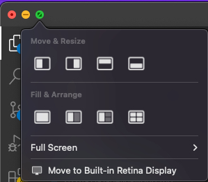
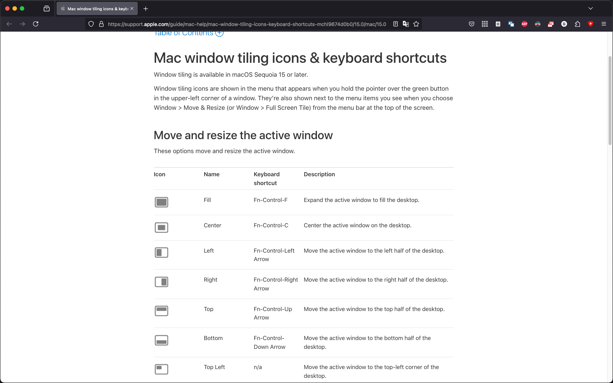
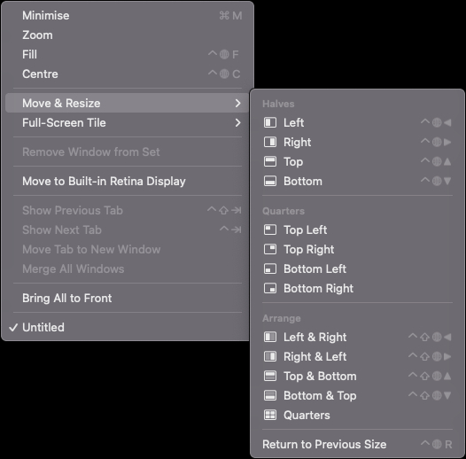
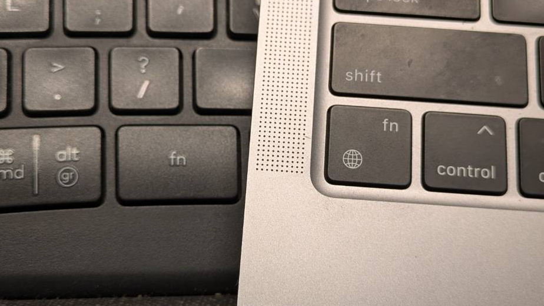
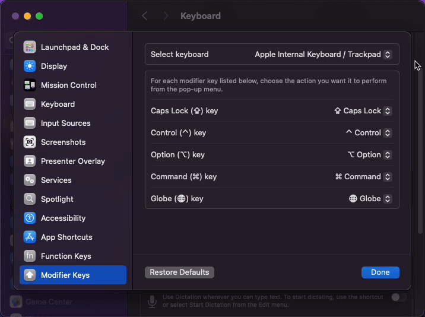

A new year has just started, and with it comes the classic "new year, new me" cliché. Funny thing is, I started this year jobless after parting ways with Intel as part of their [cost reduction plans for 2025](https://www.theverge.com/2024/8/1/24210656/intel-is-laying-off-over-10000-employees-and-will-cut-10-billion-in-costs). But hey, at least I got to joke that if [Pat's leaving](https://www.intc.com/news-events/press-releases/detail/1719/intel-announces-retirement-of-ceo-pat-gelsinger), I'm leaving too!

The good news? I've already found a new job that I believe I'll enjoy. It involves both Linux and embedded systems, two fields I’m eager to grow in. This year looks like it's going to be full of new challenges, and that’s a good thing!

But enough about that, let’s get to the main topic of this post.

This post is a bit different. I spent the holiday season properly resting and reading (guides, to be specific), so I don’t have any creative projects to share right now. Since I gave myself permission to talk about anything I want on this blog, I’ll use this post to ease back into the habit of posting stuff here after the holiday break, and to explain how Apple is screwing over their users (shocking, I know) with the so-called "Globe Key."

## macOS Window Tiling

---

With macOS Sequoia, Apple finally delivered a "killer feature" (that every other system already had): window tiling. As the name suggests, tiling lets you organize application windows in a grid rather than dealing with multiple floating and often overlapping windows.

Most of the time, this feature works. You can drag windows to the edges or corners of the screen, much like in Microsoft's Windows. However, this implementation feels worse than Microsoft's, in my opinion.

For example, to maximize a window, you’re supposed to drag it to the top of the screen. The problem is that if your mouse reaches the screen’s top edge and you’re still moving it physically, a desktop selection window opens instead. To snap the window to full screen, you must stop moving the mouse at precisely the top edge. As you can imagine, trying to do this fast quickly becomes a pain.

The other way to tile windows is by hovering over the green (full-screen) window control button. This opens a set of options to arrange windows in a grid. But this method is also annoying: you need to carefully position the mouse, wait a moment for the options to appear, and then select the desired layout. It’s slow and demands precision.

Luckily, there’s a third method... **which I can’t use!**

## The Globe Key Scam

---

### Tiling Windows with Keyboard Shortcuts

Window tiling can also be managed using keyboard shortcuts. If you search Google for these shortcuts, you’ll find they all require the `fn` (function) key. Even [Apple's own website](https://support.apple.com/guide/mac-help/mac-window-tiling-icons-keyboard-shortcuts-mchl9674d0b0/15.0/mac/15.0) says so:

_Source: Apple, link embedded in the screenshot._

But if you enable window tiling in the settings and try these shortcuts on a **non-Apple keyboard**, you’ll be surprised when nothing happens. I assure you, your `fn` key works. You cant test it by using `fn` + arrow keys in any text editor to move the cursor to the borders.

So maybe the shortcuts are different? Following the logic that every keyboard shortcut maps to an OS/application action, I checked the `Window` menu:

As you can see, there’s no mention of the `fn` key. Instead, the shortcuts listed here replace `fn` with the so-called `globe` key.

Now, take a look at the photo below. On the left is my Logitech K860 keyboard; on the right is the built-in keyboard of a 2020 M1 MacBook Air. Can you spot something strange?

I think you see where this is going...

### Want to Use Shortcuts? Buy Our Keyboard

That’s right, the Logitech keyboard has only the `fn` key, while the built-in MacBook keyboard combines `fn` and `globe` into one key. This renders all shortcuts using the globe key inaccessible on non-Apple keyboards.

Can you change keyboard shortcuts for tiling windows? _No._

Can you remap the globe key to another key or combination? _Nope._

A lazy research (googling "Apple globe key") confirms this. [This Reddit post](https://www.reddit.com/r/mac/comments/1by2q3i/is_there_a_keyboard_with_specific_globe_key_like/), [this GitHub issue on ZMK](https://github.com/zmkfirmware/zmk/issues/947), and [this QMK patch](https://gist.github.com/fauxpark/010dcf5d6377c3a71ac98ce37414c6c4) might help if you want to dig deeper or find a workaround.

Why does Apple do this? It’s anyone’s guess. Some say it’s to push customers toward buying their peripherals. Others speculate that Apple might want to charge OEMs a fee for “official support”, similar to the MFi program for Lightning cables. So far, I haven’t found any [third-party keyboard with globe key support](https://www.reddit.com/r/mac/comments/1by2q3i/is_there_a_keyboard_with_specific_globe_key_like/). I expect I'll be hearing more about this issue in the future.

## Workaround and My Take

---

As for managing my windows, I’ve already reinstalled [Rectangle](https://rectangleapp.com/). Even the free version offers same functionality, letting me snap windows with `ctrl` + `opt`.

Regarding Apple, this whole situation makes me angry and sad at the same time. As Louis Rossmann often says, someone had to deliberately spend time and resources to make others lives more miserable. I used a word "scam" in the title because I refuse to believe they couldn't have implemented this differently. They could have allowed custom shortcuts or whatever. Even worse, their own website lists the `fn` key for shortcuts when it’s obviously not used. I refuse to believe this is unintentional.

Bottom line: I can’t use a built-in macOS feature because I don’t have an Apple keyboard.  
##MyLastMacEver
