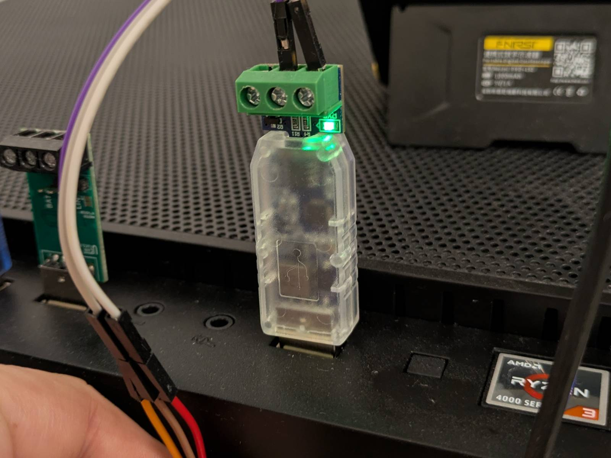
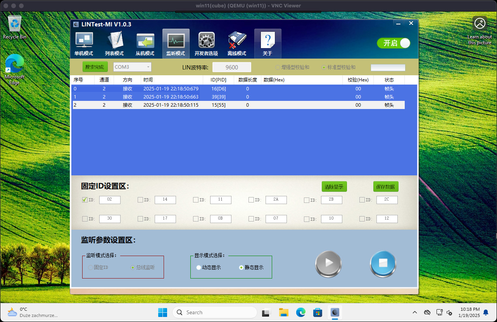
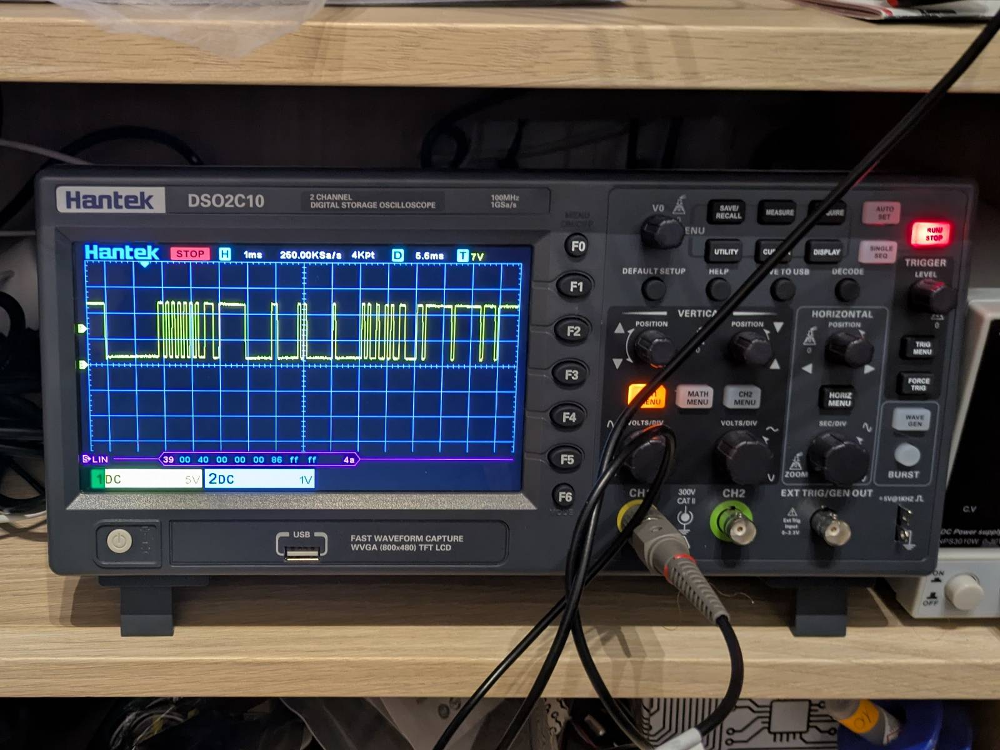
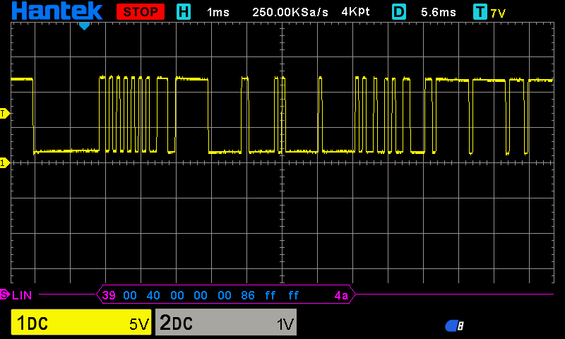
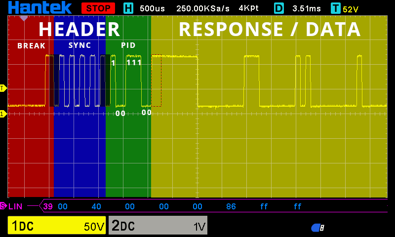
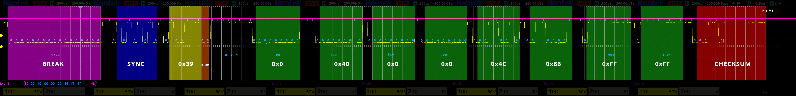
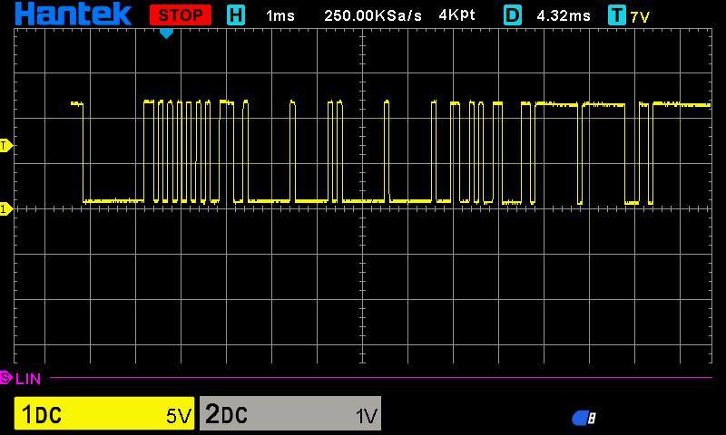
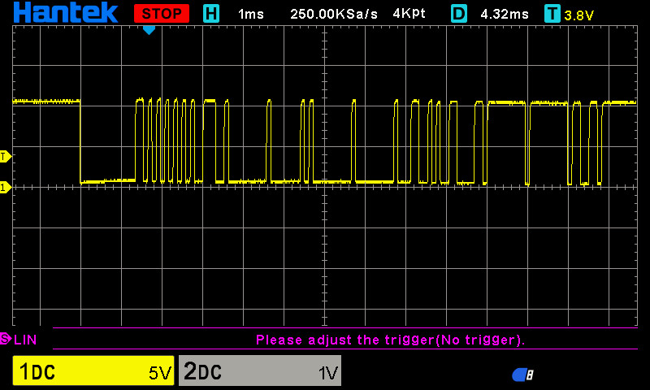

This blog post is a continuation of the first part of the series "Hacking Car Instrument Cluster." To understand the full context, please catch up by reading [part one]().

-pt1/setup.jpg>)

## Yet Another LIN Adapter

---

At the end of the first part, I teased you with another LIN-to-USB adapter, this time from Aliexpress. The exact model I got is `BJT-LIN-M1-V1.1`, which I snagged on sale for 40.88zł (~$10). The main issue I expected to face was running some sketchy, Chinese proprietary software with an interface in Mandarin. ...And I was partially right.

### Obtaining the Toolset

The biggest challenge with this adapter was obtaining the toolset/software. Initially, I tried to get it on my own via the link provided by the seller in Aliexpress listing. However, that turned out to be impossible. The tools were only available for download from [Baidu](https://www.techtarget.com/whatis/definition/Baidu), which is essentially the Chinese equivalent of Google, complete with its own Drive-like service. The problem? You need a Chinese phone number to register and download anything. I tried various SMS gateways, but none worked.

In the end, I just contacted the seller, and they sent it to me via email. ...So, if you happen to get your hands on `BJT-LIN-M1-V1.1` and are looking for the software, just contact the seller (Google, please index this).

### Getting It to Work

Getting the adapter up and running was pretty straightforward. I connected the LIN bus line to `LIN` and ground to `GND`. After plugging the adapter into my PC, a small LED started blinking, showing activity on the bus (such a small detail, but oddly satisfying). The adapter also has a [12V **output** up to 0.5A](https://www.aliexpress.com/item/1005007460915625.html), which I didn't need to use.

I passed the device through to my Windows 11 VM. From there, it was just a matter of launching the executable (remember, if you're running software from an untrusted source, do it in a controlled environment), using Google Translate's camera feature to navigate the UI, and figuring out the correct settings. ...And voilà, we got something.

Before we discuss the results, a few things to note:

1. I really like this combo. Despite the hassle of obtaining the software and the interface being in Mandarin, it's actually well thought out. I can't complain about the price, as alternatives basically don't exist.
2. Unlike [LUC](https://ucandevices.github.io/ulc.html) (which I discussed in part 1), the baud rates aren't predefined, so I can set it to whatever I want.
3. The software bundle included the source code for the app (written in .NET C# using Windows Forms) which is great! I didn't bother analyzing or compiling it since that's beyond the scope of this project.

### The Results

Well, I had big hopes, [but I still haven't found what I'm looking for](https://youtu.be/e3-5YC_oHjE).

The issue is the same as with LUC. The adapter/software combo seems to be receiving something, but again, I can only see the IDs. No actual data is being reported. Meh...

## The Big Guns

---

I swore to myself that I would at least understand what's going on with this cluster and why I can't see anything using any of the adapters I have. ...Even if it means analyzing the transmission bit by bit (you can see where this is going).

### The Oscilloscope

That's right, I bought this beast.

_Note: A few more purchases like this, and I could've bought an entire Alfa Romeo 159 in hooptie condition._

I consider this purchase an investment in the future (a lot of embedded jobs require being handy with oscilloscope), but I'd be lying if I said I wasn't primarily motivated by this project. The oscilloscope is the Hantek DSO2C10 (DSO2000 series), and it has a neat built-in LIN triggering and decoding feature.

### Decoding the Wave

_Note: From this point forward, I'll be discussing LIN transmission. If you want to get up to speed with the LIN protocol, I recommend reading [this article](https://www.csselectronics.com/pages/lin-bus-protocol-intro-basics)._

I set up the oscilloscope, hooked it up to the LIN probe pin on my PCB, and after a few attempts, I successfully configured LIN triggering and decoding.

I noticed multiple types of messages flying over the network. The traffic changes depending on whether the auxiliary instrument cluster is connected to the bus or not. Here's one of the messages I captured.

At first glance, the waveform looks like it could fit the LIN standard. There's an obvious `sync break` at the beginning followed by the `sync field`. But the closer you look, the weirder it gets...

### What Am I Looking At?

To explain what I mean by "weird," let's zoom in and focus on the LIN message header.

Several issues stand out compared to how a reference LIN signal should look:

- The delimiter in the `sync break` is two bits long (double logical 1s). It should be a single logical 1 followed by a logical 0 (a start bit for the `sync field`).
- The `stop bit` and `start bit` pair seems to be missing between `HEADER` and `RESPONSE / DATA`.
- The `RESPONSE / DATA` section looks messy at best. I haven't tried decoding it yet, but the missing start and stop bits make me doubt it adheres to the standard.

On the plus side, I was able to confirm where PID `0x39` (reported by both the LIN USB adapter and the oscilloscope) came from. In the LIN protocol, data is transmitted with the Least Significant Bit (LSB) sent first, so `111001` gives the value `0x39` in hex, bit number 6 and 7 are parity bits.

### Don't Need Sleep, Need Answers

Long story short I spent a few evenings in GIMP trying to make sense of this. Here's the "collage" I created:

_Note: Click to zoom in._

I essentially "zoomed in" on the waveform to make the bits readable and then scrolled horizontally in consistent time intervals to take screenshots. Then I pieced them together in Gimp. Was there a better way of doing it? Probably, but in the end it worked. By measuring the length of a single bit using Gimp's measure tools, I could then count the number of bits in sequences. Then it was a matter of counting logical ones and zeros, figuring out a pattern that could at least reassemble LIN message, grouping bits into frames, and the result is a "decoded" LIN message (I make it sound easy, but I spend few evenings on this).

### Decoding the Wave Pt. II

As you can see, the results of "analog decoding" pretty much match what was reported by oscilloscope. The oscilloscope seems to have missed 4th byte (0x4C), you can see the output in bottom left corner. Although the sequences of stop bits are concerning, especially the one after PID field, it's a good news the wave reassembles a LIN-like pattern. Chat-gpt "believes" that these sequences comply with the LIN standard and that they represent an idle time. I guess I still have some reading to do.

## What's Next?

---

This is where part II ends. As always, I seem to have chosen the most cursed LIN device possible to hack.

I tried sending my decoded LIN frame using both adapters, but the auxiliary cluster didn’t react at all. Strangely, the messages sent from these adapters couldn't even be interpreted by the oscilloscope. Why? No clue and if I had one, I can't alter their behavior either. Here's a comparison of the outputs:

**BJT-LIN-M1-V1.1**

**LUC**

At this point, I feel like I’ve hit a wall. The next logical step would be building my own LIN adapter, but that’s a project for another time. For now, I’ll be shifting focus to other things, but I’ll be back to tame this cursed thing eventually.
