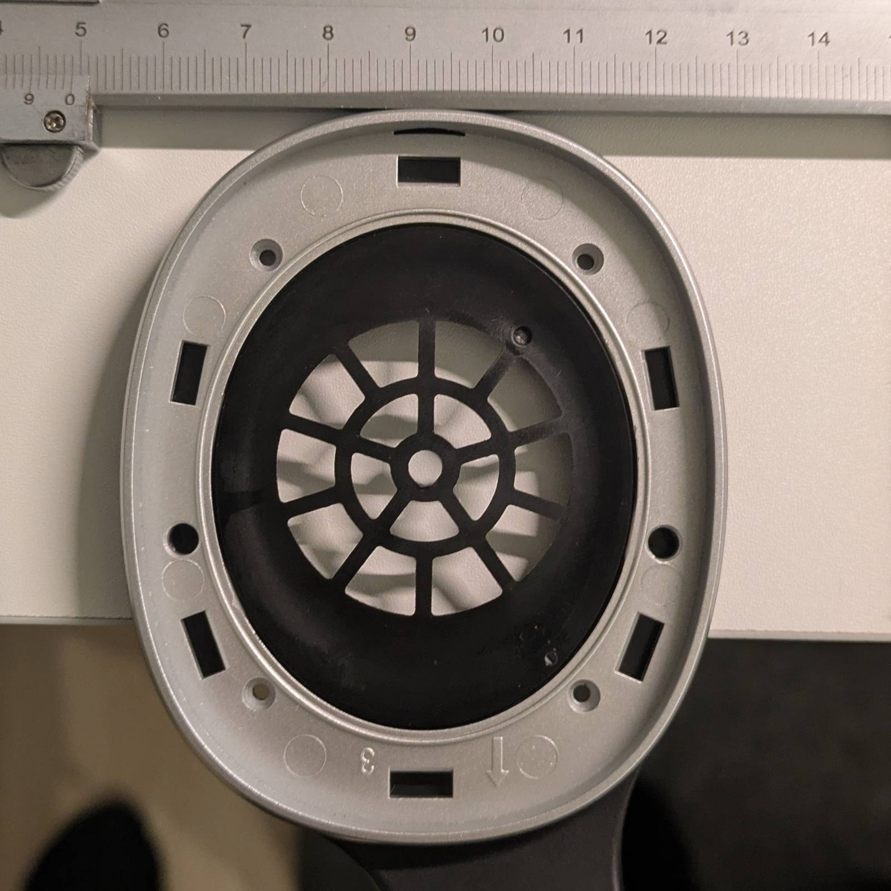

Today's post is about fixing a pair of cheap headphones with 3D printing.

## "You'll die when I allow it" approach

---

My issue with modern headphones is that most of them are not designed to be repaired in any way and are meant to be disposed of when they break. Manufacturers cut corners wherever they can, yet even "cheap" headphones can be quite expensive, despite them being just a pair of speakers, a few meters of wire, and a plastic shell slapped together (at least for analog ones).

It so happened that my headphones broke recently, and I had to make a choice whether to replace them (as a manufacturer would prefer) or attempt to fix them. The same thing happened to my brother almost at the same time, and since he's not as technical as me, he asked if I could fix them.

Long story short, since I recently don't feel like spending money on unnecessary things, I decided to accept the challenge and fix both pairs.

## Edifier W800BT PLUS

---

I treated myself to a pair of wireless headphones (I believe) more than two years ago and chose the Edifier W800BT Plus. I needed headphones that weren't expensive, as I knew they'd take a beating during my daily commute to university. They managed to survive past my university phase, and to this day, I use them daily, as they sound good enough, battery life is excellent, and having no cables is convenient.

### What broke & how I fixed it

Breaking the headphones was my fault, as I threw them on the desk with too much force. One of the speakers got physically damaged and started sounding flat and low.

I took the headphones apart to verify it was possible, measured the impedance and diameter of the speakers, and proceeded to AliExpress to search for a new pair. I decided on [this](https://www.aliexpress.com/item/1005007967122807.html) set as they matched the specs and were made of some kind of fiber rather than plastic. They cost me 43zł (~$11) for a pair. I didn’t want to go with the cheapest speakers, as I knew that if I hated the sound, I'd end up buying new headphones and spending even more. When they arrived, they didn’t fit the housing...

So what's the issue when I have a 3D printer, right? I saw potential in the trim piece, I could use it as part of a new housing. So, I took some pictures, went to FreeCAD, and with minimal measurements and the best design method known to man (eyeballing), I came up with a new housing. Then, it was a matter of printing a pair of housings, gluing them in, and using a rotary tool to grind down the old ones. Here are some reference pictures to help you understand what had to be done:

I'm glad to report that the headphones are working after the modifications. In terms of sound quality, the sound is more bass-heavy. I prefer the more natural sound of the stock units, but I’ve gotten used to it.

## Sony MDR-RF855RK

---

My brother’s Sony(s) broke from fatigue. Both earphone yokes developed cracks, eventually causing one to snap.

I had to reverse-engineer the yoke. Once again, that involved taking pictures, measuring, prying, and spending a good amount of hours creating a replacement model. ...and then I did something stupid.

You see, FreeCAD uses [parametric modeling](https://www.sciencedirect.com/topics/engineering/parametric-modeling), which **IN THEORY** should allow you to make changes in earlier layers of a project. The issue with FreeCAD is that it rarely works, or specifically (from my experience), it only works for changing dimensions. If you dare to interfere with geometry in earlier layers, you can say goodbye to your project computing successfully. ...and that’s what I did. I made changes to one of the first layers, and my unconditional habit of saving must have kicked in making the project broken. A few hours of my life wasted. Thankfully, I exported an STL model beforehand, so I saved some work there, but then I had to import the STL model and work on it. If you've done some 3D modeling before, you know is not convenient.

In the end, the model works, but it’s not free of mistakes (mostly related to FreeCAD handling floating points). The headphones are resurrected, and that’s all I care about.

## Summing it up

---

Two cheap headphone sets got a second life and will hopefully serve for another few years. Is it worth doing? For the Sonys, the cost was next to nothing, not counting the time spent. It’s obviously better for the environment (and our wallets) to fix stuff rather than buy new. Realistically, though, two saved headphones are just a drop in the ocean, and people without a knack for fixing stuff would just replace them. I’d say they can’t be blamed for this. As I said in the beginning, this kind of stuff is not serviceable (or even disposable when broken), so maybe that’s the real issue here?

Either way, the headphones are fixed. As always, the models for both headphones are published on Thingiverse to serve the public:

- [Speaker housing for Edifier W800BT Plus](https://www.thingiverse.com/thing:6948529)
- [Sony MDR-RF855RK replacement earphone yoke](https://www.thingiverse.com/thing:6948497)
