This is the first part of Raspberry Pi Zero 2W based Storage Server Shenanigans.

In this series, I'm gonna be turning a Raspberry Pi Zero 2W into a super cheap, storage-server wannabe! The plan is as follows:

- Design a custom case, print it, and assemble the "server"
- Set it up as a network storage server (I'm talking RAID, hot-swappable drives, etc.):
  - First using some basic tools like `mdadm` and Samba
  - Then I'll try running OpenMediaVault
- Do some benchmarks
- Do some overclocking
- See what happens if I start breaking things intentionally

I'm well aware that you can put together a much better NAS for the price of a Pi Zero ([I did it myself](https://youtu.be/eTSuSAn0o7c)), but this project is purely for fun and experimentation. So, my answer to "Why do this?" is:

> "For science. You monster." – GLaDOS

If this sounds like something you're into, follow along to watch me build, configure, and break possibly the slowest, yet the cutest storage server in existence.

...or if you want to skip to next part of the series, here's the list:

- [**P1: Custom Case & Hardware**]() (current)
- [P2: Overclocking & Power Usage](../pi-zero-storage-server-shenanigans-pt-2-overclocking-power-consumption/)
- [P3: Drive Performance](../pi-zero-storage-server-shenanigans-pt-3-drive-performance/)

## Part One: Custom Case & Hardware

---

In this particular blog post, I'm gonna focus on the hardware side of things: how I designed and printed the case, what hardware is needed, and how it all comes together. Basically, this is gonna be a computer build report — the difference being that the "computer" is a Raspberry Pi, the case was designed by me, and some components had to be modified.

## Raspberry Pi Zero 2W storage case

---

I wanted to design a Raspberry Pi case that looked like a storage server. It had to have the following: a front drive bay, an indicator lights panel, the so-called "rack mount ears," and a rectangular form.

Not gonna lie, I'm quite proud of how it came out — but let's go through it from the beginning.

### Modeling software (FreeCad)

I designed the case in [FreeCad](https://www.freecad.org/), an open-source parametric 3D modeling tool.

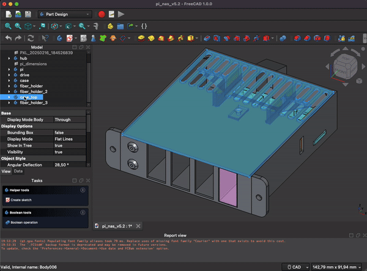

The current version of the model is 5.2. It took me around 1.5 months to get it "finished." That might sound like a long time, but I only have access to my 3D printer once a week. Due to my small apartment (and [free](https://media0.giphy.com/media/v1.Y2lkPTc5MGI3NjExcG1zbW12djRsaTlqazJnem1xd2V0NDZ4cTB2aXVwcTdlZGFkZTBqZiZlcD12MV9pbnRlcm5hbF9naWZfYnlfaWQmY3Q9Zw/8VSaCyIdcnbuE/giphy.gif) electricity at mom’s), it ["lives" in my parents’ basement](https://www.youtube.com/watch?v=w3UVF6Ipt-E).

It took time to print and test various versions of the case, along with the mounting elements. There are challenges not only in designing, but also in printing things at this scale. These include:

- Working with relatively small resolution (0.4mm on my printer) — you can read in the next section why dimensions should be multiples of 0.4mm or 0.2mm. But the thing is... non-3D-printed objects hardly ever follow this principle.
- Theory doesn't transfer to practice 1:1 — trust me, a hole with 1.6mm in a sketch becomes a ~1mm hole when printed in a certain orientation. The old saying goes: even if something is mathematically correct, it doesn’t mean it can actually be produced.
- No margin for error — the bigger the part, the greater the tolerance for small mistakes. For large components, being off by a couple of millimeters might not matter. But in this project, that margin basically doesn’t exist — measurements have to be spot on.
- Test parts, not just designs — this kinda overlaps with the previous point, but some mistakes only become obvious when you're physically holding the part. A real-life example: I initially planned to use 2mm diameter fiber, but when I tried assembling the "server," I just couldn’t make the bends I needed to make it fit.

#### Best practices for modeling in FreeCad

I learned a few things while working on this model, and ended up extending my list of principles I try to follow when modeling. I’ve shared that list below — it gives some insight into the "software side" of designing the case. If you don't care about 3D modeling and are just here for the results, you can [skip this chapter](#printing-the-case).

- **Use a spreadsheet to store dimensions** – FreeCad has a built-in spreadsheet mechanism that lets you store dimensions (as variables) and use them in calculations. It also makes changing values super quick. This is a must for larger projects.

- **Design for the printing technology** – I do FDM printing, so I optimize my models for that. That often means using multiples of 0.4mm for `x/y` axis and 0.2mm for `z` axis dimensions (common resolution for a 0.4mm nozzle), and avoiding overhangs when possible.

- **Design multiple models in a single project** – Including several models in one project helps uncover design issues early. It also allows for creating references between parts, saving time on setting dimensions. Plus, it helps to...

- **Do mockup models** – When I designed the case, I first created simple mockups of the components (Raspberry Pi, hub), positioned them in space, and then designed the case around them. Using mockups saves time and helps ensure the final print fits properly.

- **Use photos and schematics** – To make sure dimensions are accurate, you can overlay images onto your models. One way is to take a picture of the component with a ruler next to it, then scale it accordingly. This works decently for flat objects and _okay-ish_ for more dimensional ones — the issue is that lenses tend to distort reality a bit. A much better method is using a dimensional schematic if available (I used one for the Raspberry Pi).

- **Split the design into smaller sections** – I learned it's way better to split your model into smaller parts and allow yourself to make mistakes. I had to reprint the whole case once because one of the fiber holders was a bit off-center relative to the LED. Before reprinting it, I made the fiber holder a separate model. That way, I could make multiple attempts at getting it right — spending just a gram of filament and a few minutes of printing each time. For comparison, the full case takes about ~40g of filament and prints for a few hours (on my printer).

- **Do version control and save wisely** – FreeCad being Freecad can crash at any moment, but just saving frequently isn’t a solution. Since FreeCad uses [parametric modeling](https://www.sciencedirect.com/topics/engineering/parametric-modeling), you can make changes to early steps in the model — _but_ that means breaking things is really easy.

  Now imagine: you spend a whole day modeling something, then decide to tweak a dimension in one of early sketches. You make the change... The project stops computing properly, so you do "undo" to restore it to latest working state. Now imagine: you did that change, saved by accident and your favorite modeling program crashed. When you reopen it, there's no "Ctrl + Z" anymore... and your project is toast. (Ask me how I know.)

  That’s why some form of versioning is essential with FreeCad. Personally, I just use "Save As" with a version number in the filename every time I’m about to make a major change — simple but effective.

### Printing the case

I printed the case with my Ender III clone made by Anycubic (2/10, do not recommend), and here are the results. Fun fact: the lid was literally the last successful print before the bed leveling sensor decided to head out. There are some visual issues with how it turned out, but I currently can’t reprint it since the printer’s out of commission.

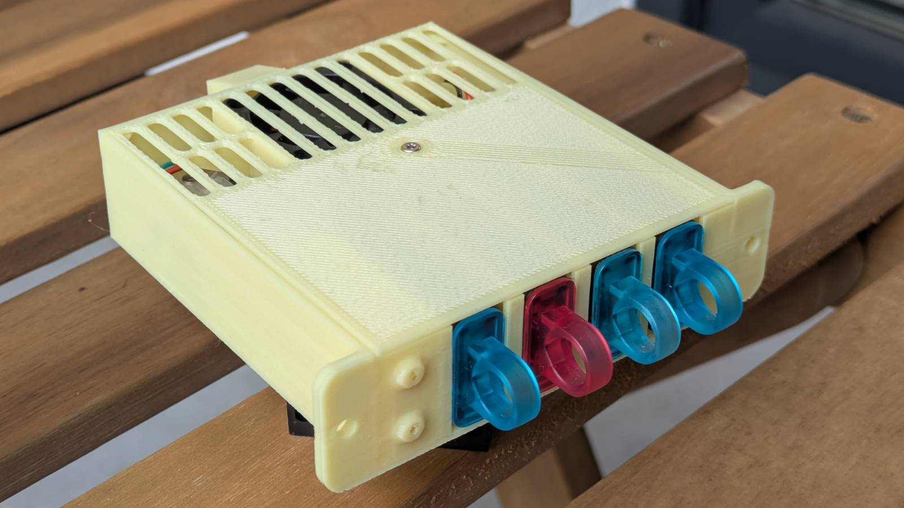
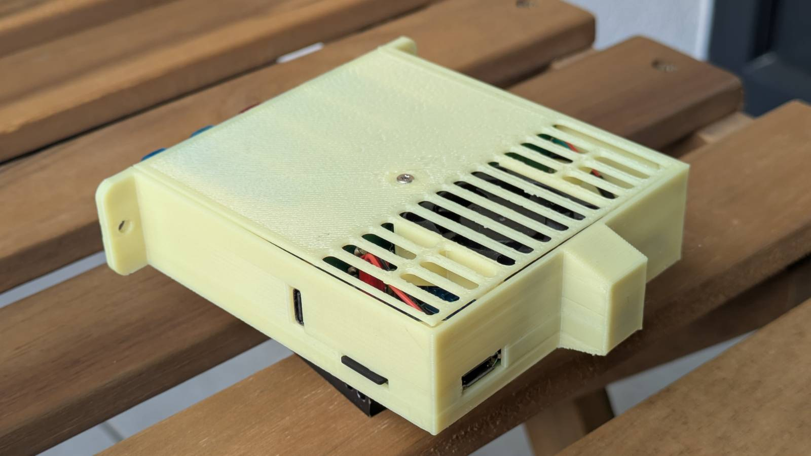

The case was printed in PETG filament to handle the heat generated by the hardware. Some supports were needed — especially for the outer bottom of the micro-USB bulk cover (on the case) and the fan mount tensioner (on the lid). I used a standard 0.4mm nozzle with 0.2mm layer height. If I recall correctly, the case took less than 40 grams of filament to print.

If you’re planning to print the case yourself, I’d suggest _not_ generating supports for the fiber tunnels, nut cutouts, or the inside of the micro-USB bulk cover. These parts are small enough that your printer should handle them just fine without supports. If my printer managed to do it, then any halfway decent one should have no trouble at all.

### Hardware

Let's talk hardware!

#### Raspberry Pi Zero 2W

The heart of the project is a Raspberry Pi Zero 2W — the whole thing was built around it.

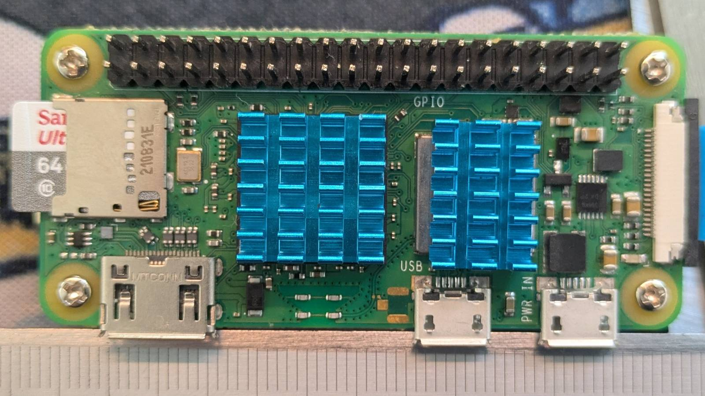

The story behind this project is pretty simple: I had a Pi Zero 2W lying around and decided to finally do something with it. That said, it turned out to be a perfect fit. The $15 Raspberry Pi Zero 2W is, to me, the essence of computing. It’s a fully fledged computer... for fifteen bucks. How cool is that?

I added some heatsinks, which will hopefully help keep the Pi cool when overclocked. They also serve one additional purpose, but I’ll get to that later. My unit has GPIO pins already soldered in — they’re only used to power the fan in this build.

If you're planning to do something similar, I highly recommend going with the Pi Zero 2W instead of one of its predecessors. It has a quad-core processor, which is a massive performance upgrade for just a tiny bit more cash.

#### USB hub

Another equally important hardware element of the setup is the USB hub.

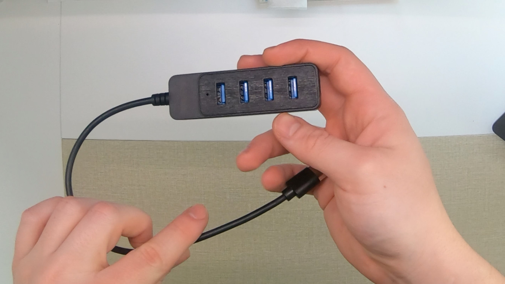

This is a no-name $2 USB 3.0 hub from Aliexpress, and I’ve got to say, for such a small price, it’s actually a really solid piece of hardware. I was surprised to see that it came with a shielded cable, and the power wires are noticeably thicker than the data wires. I’ll go into more detail on how it was modified later.

#### [Drives](https://youtu.be/MV_3Dpw-BRY?t=10)

I decided to use Kingston flash drives for the "drives".

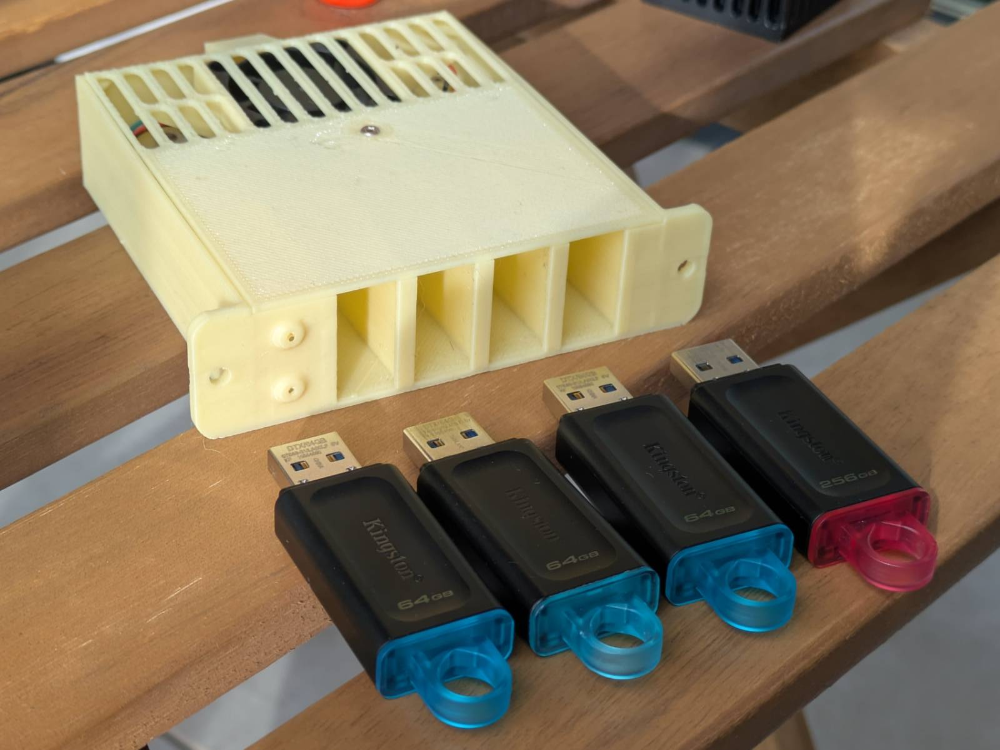

These are cheap, common, and come in various storage sizes. I happened to already have two of them (could’ve sworn I had more), but I had to buy two more to fill all the slots.

#### The rest

Here are some of the smaller bits and bobs that complete the build:

- **PI-FAN 30mm fan** – Probably not needed for stock frequencies, but I’m planning on overclocking my unit, so it's a precaution.
- **Small micro-USB male plug** – This is used to connect the hub to the Raspberry Pi. The hub comes with a USB plug that needs to be swapped for a micro-USB. Another option would be to solder the USB wires directly to the pads on the Pi, but for some reason, I really don't like that idea.
- **1mm diameter fiber wire** – Used to "transfer" the lights to the front panel. I'll discuss this in more detail later.
- **A set of M2 bolts and nuts** – The entire "server" is assembled using M2 nuts and bolts. You can find small sets with various M2 bolt lengths and nuts cheaply on sites like Amazon.

### The Drive Bae!

Let’s finally talk about the case, but first, here’s a little peek inside the assembled server.

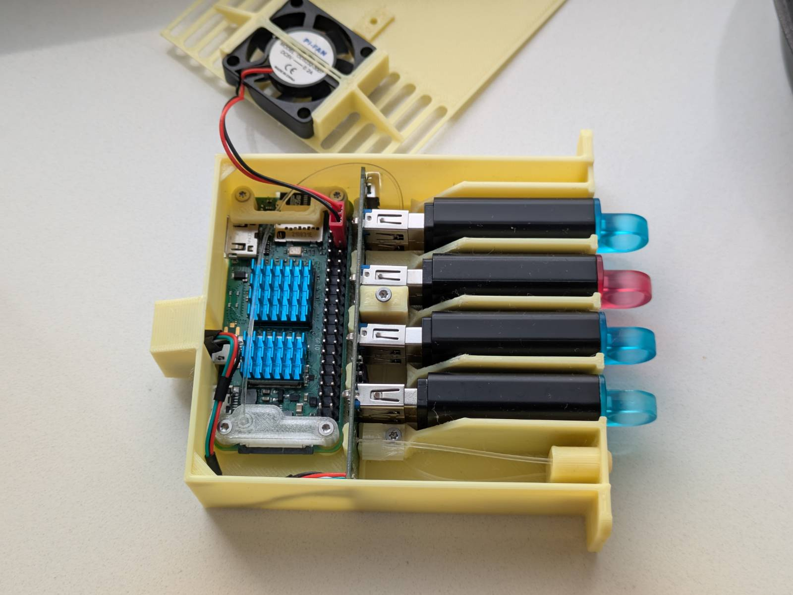

I personally love how it came out. There were a lot of challenges to overcome to fit everything into such a small space, but let’s start from the beginning.

This project turned out so well that I thought it deserved a name. I decided on "Drive [bae](https://www.urbandictionary.com/define.php?term=Bae)!" Why? Because, obviously, it’s a homophone joke (bay/bae), and honestly, I find it cute.

Now, let’s go over some of the features/solutions I managed to incorporate into the design and how it all comes together.

#### Drive bay

The front drive bay is a feature that really sets my case apart from others.

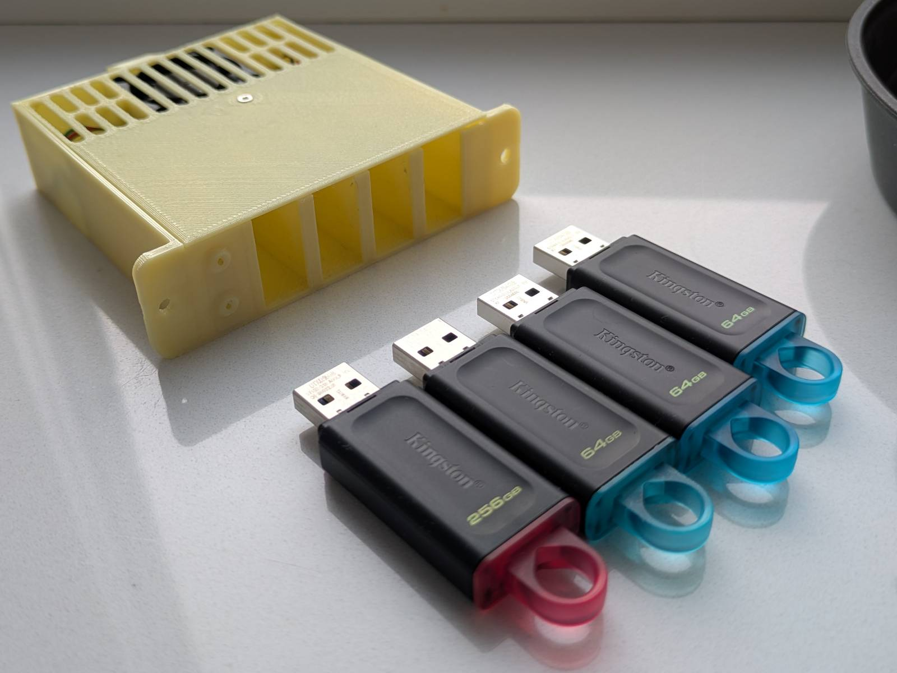

It’s designed to fit up to 4 Kingston flash drives, as I mentioned earlier. There are two things I really like about this element:

- **The guides** – I added guides to make it easier to slide the drives into their slots. Plus, the fact that there’s no air gap between the drives makes everything feel more secure and well-tied.
- **Alignment** – It just so happens that the height of the drives (when placed in their slots in the bay) almost perfectly matches the height of the hub PCB, so the USB plug and port are aligned by default. Neat.

#### Front light panel

I managed to include light indicators on the front panel without any soldering!

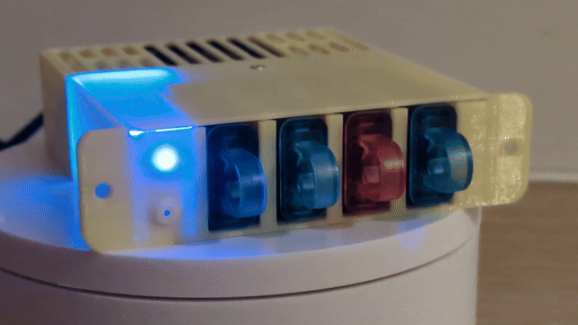

...although I have to admit, that blue light is so strong it could blind you.

The blue light simply means the machine (contraption) is powered on. The source of this light is the hub. The less intense bottom light blinks when the Pi performs operations on the SD card. As you might guess, the source of that light is the Raspberry Pi.

I’ve managed to get the lights on the front panel via the...

#### Fibers

I used fibers to transfer the light sources, so they’re visible from the front of the case.

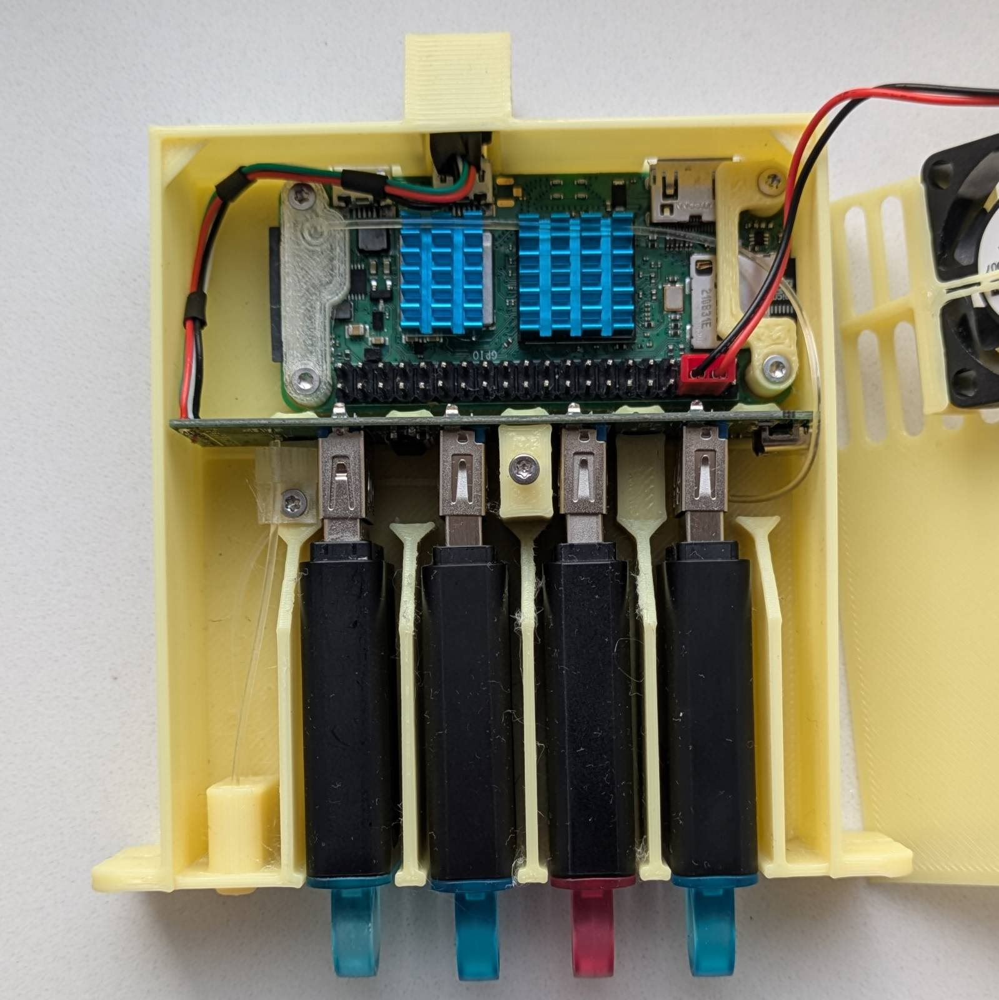

Here, you should be able to see exactly how they’re routed. Let’s focus first on the one that comes from the Pi. As you can see, I designed two brackets for the Pi that also serve as mounting points/guides. To make that first bend and avoid cracking the wire, I placed the fiber tip into boiling water for a while, and then I was able to bend it into the desired shape.

Another “cha cha reel smooth" move was using the space between the radiator fins as a guide for the fiber. Moving to the hub area, I used the available space to route the fiber above the hub. Thankfully, the hub has these notches cut out, which were just enough for the fiber to pass through and allow the lid to close. After that, the wire is routed through tunnels in the so-called towers (the things that support the hub from the front) and under the USB ports. Finally, the wire goes through a hole in the front panel and is cut to the precise length needed using a sharp knife.

The "power-on" light solution is much simpler (and shorter). But I’d like to highlight the mounting solution.

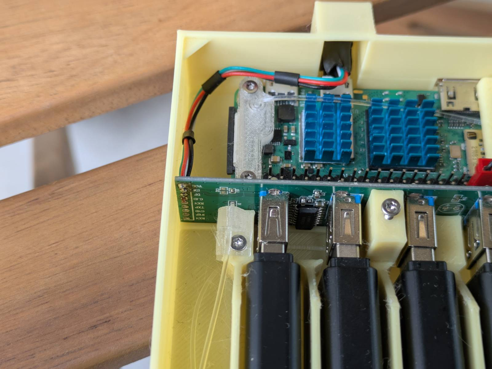

This is what I described in the [best design practices in FreeCad](#best-practices-for-modeling-in-freecad) section. I made this part separate from the case so I could get it right without reprinting the entire case. I also want to point out that the mounts are printed in transparent PETG to allow the light to shine through. Whether that’s good or bad, I’ll leave that up to you to decide.

#### HUB

The hub is held in place by friction, but I obviously had to decapsulate it first.

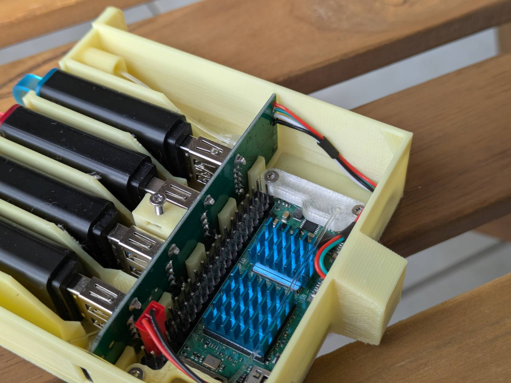

Additionally, I had to remove and resolder the wires onto the other side. You might have also noticed that there are only 4 wires coming out of it. That’s right, the solution is unfortunately limited to USB 2.0 speeds due to the Raspberry Pi's limitations — the biggest drawback of this project. ...but hey, I’m doing this for fun after all!

If you decide to attempt this project, make sure the wires are long enough to be routed as shown in the picture. The reason for this is that there’s no space under the fan for them to go through. You’ll also need a small micro-USB plug. I harvested mine from an old cable.

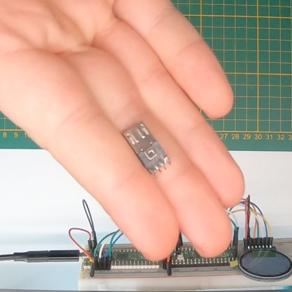

One tip: connect the plug to the Raspberry Pi and use its probing points to check if you soldered the wires correctly. The pins are labeled on both the Pi and the hub’s PCB.

#### Ports

Let’s quickly talk about the ports.

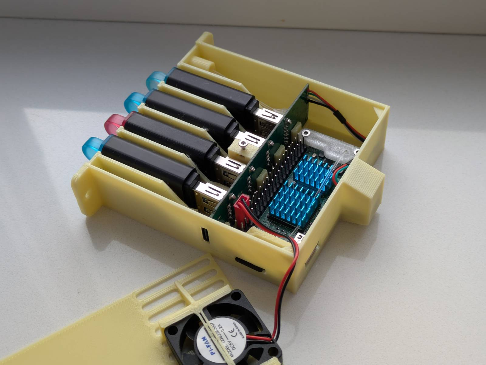

As you can see, I managed to leave all the ports accessible, except for the micro-USB data port. This one is covered purely for aesthetic reasons, as it’s used for the hub. I know I’d hate it if a cable were sticking out just to be plugged into that port, so I did the next best thing and designed a cover for it. Initially, I wasn’t too fond of the design, but it grew on me. It has that CRT vibe.

The most important "hole" however, is the one for the SD card. I wanted it to be easily accessible without needing to disassemble the whole thing.

#### Nuts and bolts

The case has various cutouts for M2 bolts and nuts.

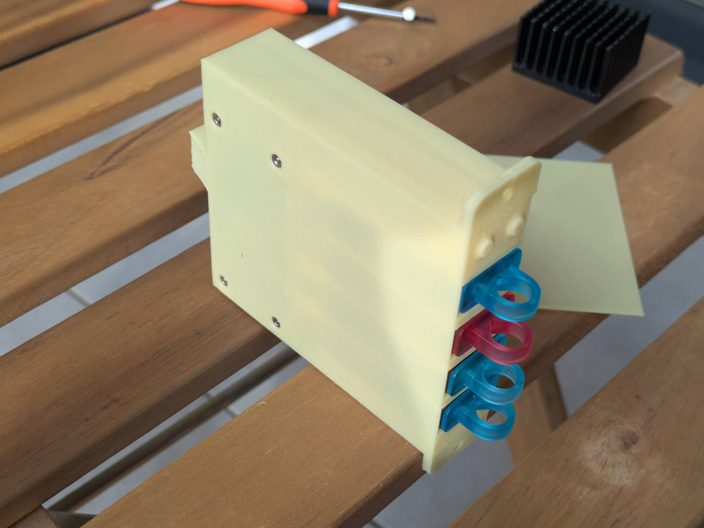

This method is much more reliable than screwing directly into the plastic, and it’s also cheaper and easier than using threaded inserts.

#### Lid

The last thing I want to talk about is the lid and fan mount.

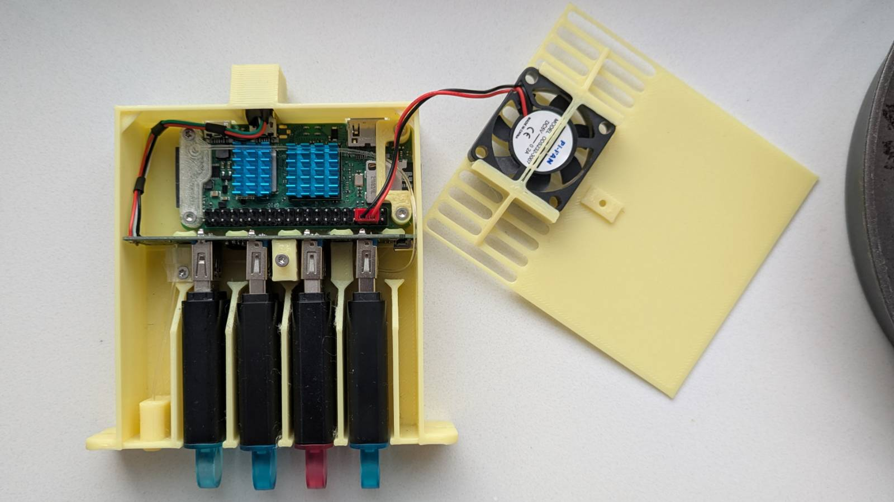

The lid is secured with a single screw and features a built-in fan attachment. The lid is so thin that I had to add reinforcements to both sides of the fan holders and additional the tensioner connecting them. Without these reinforcements, the lid wouldn’t stay flush with the case, as there’s barely any space inside. The fan cable alone would make it stick out.

This is probably my least favorite part of the design, mainly because of the large overhang the tensioner creates (supports are required when printing). As mentioned earlier, I can’t make any changes right now since my printer is broken, so it’ll have to stay as is for now.

### It's free real estate!

As with all of my designs, you can download both the 3D models and the FreeCad source file for this project from Thingiverse. The project is shared under a CC BY-SA license, so you’re free to do whatever you like with it, as long as you tag me.

**Link**: [https://www.thingiverse.com/thing:7013090](https://www.thingiverse.com/thing:7013090)

## Summing it up

---

That wraps up this blog post. When the other parts of this series are published, I’ll update this section with links to the next installments of the _Pi Zero Storage Server Shenanigans_.

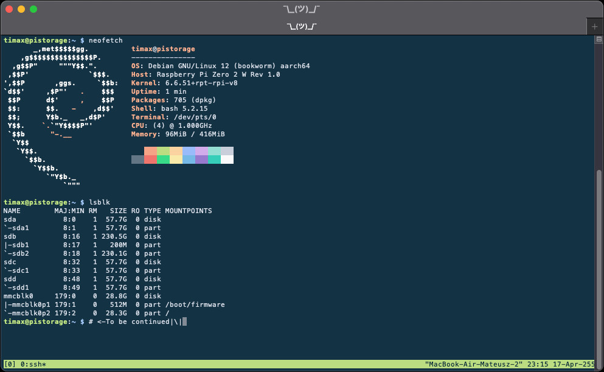

[Next part -->](../pi-zero-storage-server-shenanigans-pt-2-overclocking-power-consumption/)
