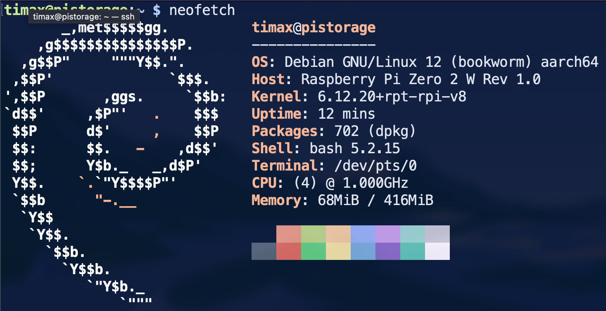
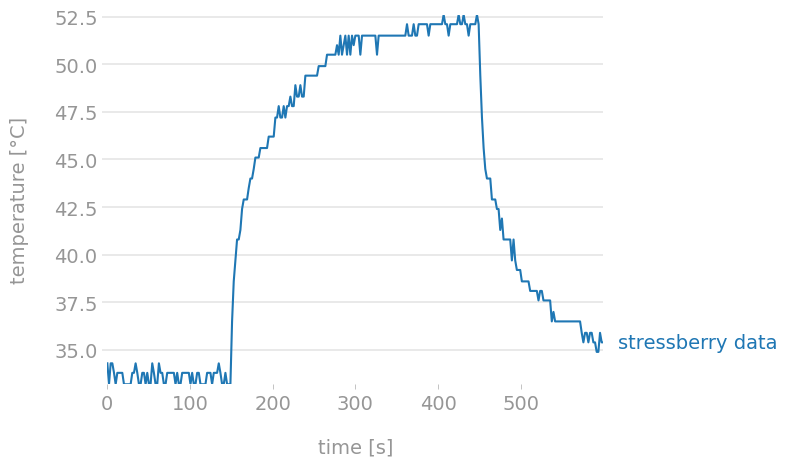
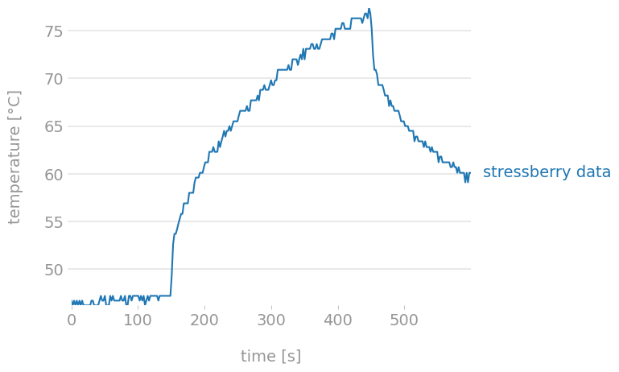
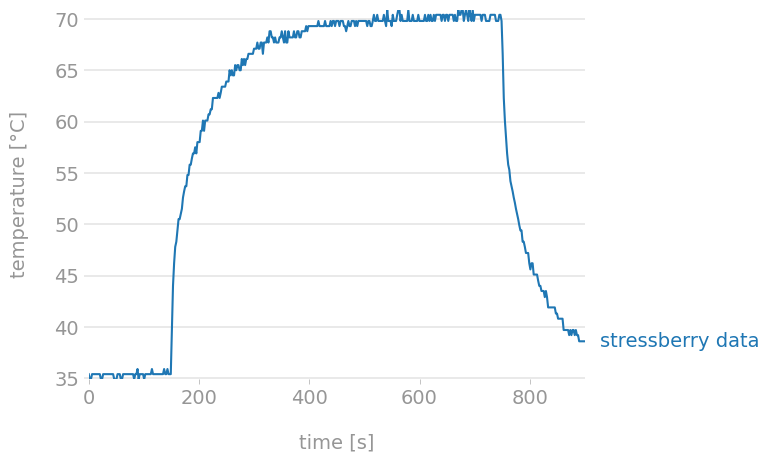
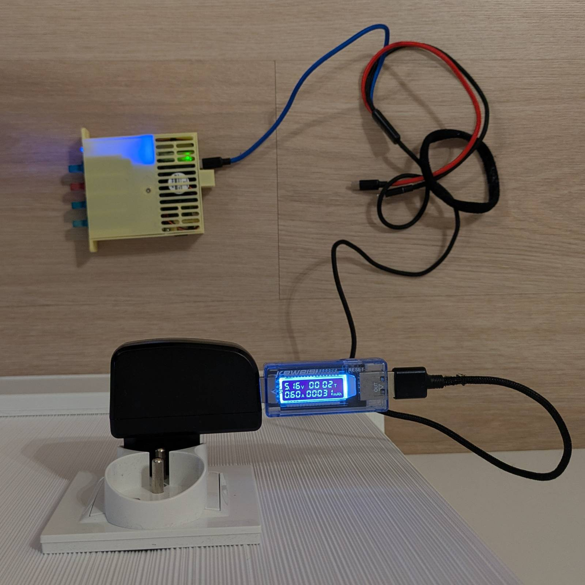
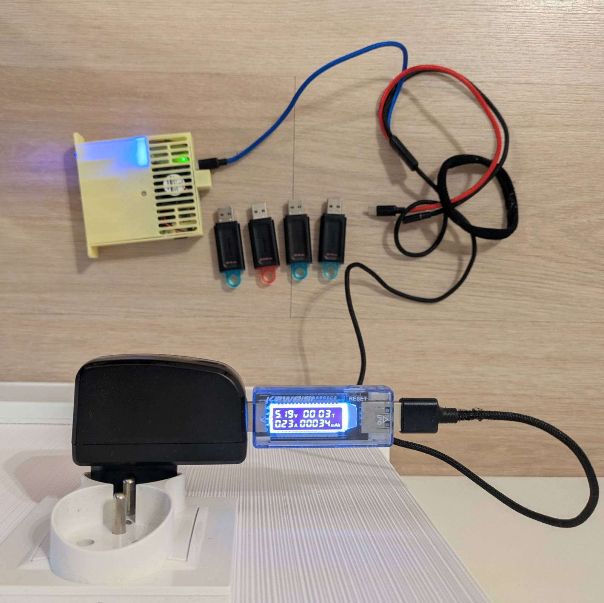
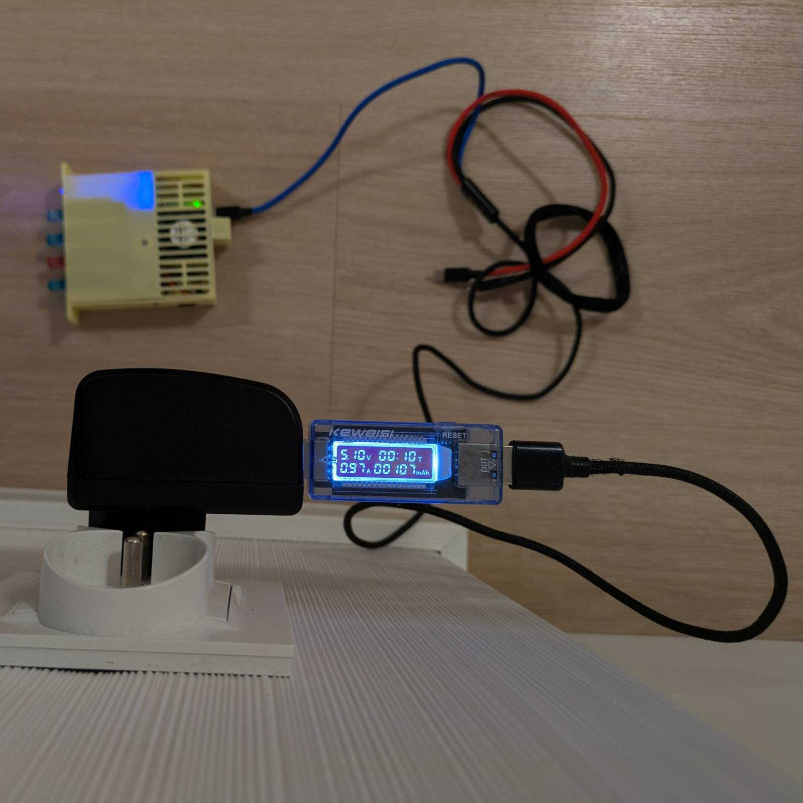
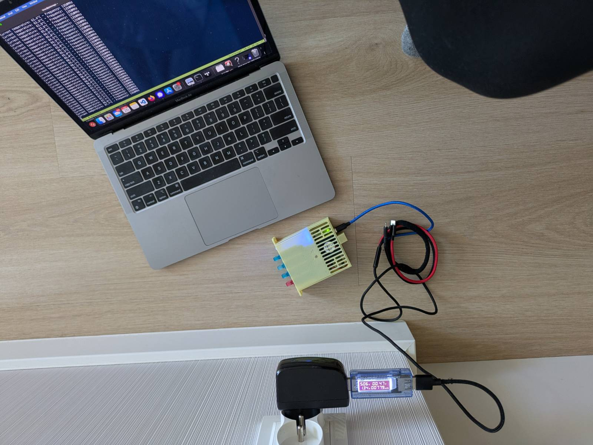

This is the second part of the Raspberry Pi Zero 2W-based Storage Server Shenanigans.


In this series, I'm transforming a Raspberry Pi Zero 2W into a super cheap storage server wannabe!

If you want to catch up on what I've done so far, check out the previous parts:

- [P1: Custom Case & Hardware](../../posts/pi-zero-storage-server-shenanigans-pt-1-custom-case-hardware/)
- [**P2: Overclocking & Power Usage**]() (current)
- [P3: Drive Performance](../pi-zero-storage-server-shenanigans-pt-3-drive-performance/)
- [P4: mdadm & Samba](../pi-zero-storage-server-shenanigans-pt-4-mdadm-and-samba/)

## Part Two: Overclocking

---

The end goal of this blog post is to have a working "overclock configuration." I’m using the term "end goal" because, for this post, I’ll be writing as I go. This way, I can provide you with a list of commands I'm using in real-time and save myself from trying to remember the process later. Ready? Let's go!

### Starting Point

I’ve already flashed Raspberry Pi OS Lite onto an SD card to use with my RPi Zero 2W. I set up the network connection, user credentials, and passwordless SSH directly in [Raspberry Pi Imager](https://www.raspberrypi.com/software/). Then, I ran the good old:

```bash
sudo apt update && sudo apt upgrade
```

...to ensure the system is up to date. Since this is the RPi Zero, I had to wait **QUITE A WHILE** for it to complete.

#### Installing packages

Now, let's start by installing the packages that I'll be using throughout this setup. I updated the commands below each time I installed a package, so these should be all I needed.

```bash
sudo apt install neofetch tmux vim stress python3-pip python3-venv
```

...and let's run the most crucial package of them all.



## Base Measurements

---

Let’s take base temperature measurements so we have a point of comparison when overclocked.

### Stress Testing the Pi

I'm going to use `stressberry` to stress test the Pi, as recommended in [this article by Adrian Kingsley-Hughes on ZDNet](https://www.zdnet.com/article/how-to-overclock-and-stress-test-your-raspberry-pi/). However, it’s not as easy as the author makes it seem. On Debian (which Raspberry Pi OS is based on), one cannot simply install Python packages system-wide. So, I’m going to create a simple virtual environment and install `stressberry` inside.

```bash
python3 -m venv ~/stressberry-env
source ~/stressberry-env/bin/activate
pip install stressberry
```

Then, I ran the following to perform the benchmark and create the graph.

```bash
stressberry-run out.dat && \
stressberry-plot out.dat -o out.png
```

Here's the generated graph. Neat.



The graph shows that the temperature peaked at around 52.5°C. ...but I bet you’re wondering how effective the fan is. Well, here’s the graph from running the case closed with the fan removed.



Gotta say, the difference is noticeable. Both the starting and peak temperatures were much higher, with the peak going above 75°C. But also, look at the shape of the graph. With the fan attached, the temperature started to stabilize around ~52.5°C. Comparing this to the run with no fan, it seems there was still potential for reaching even higher temperatures if I had run the test longer.

## Overclocking - Theory

---

Let's overclock **the beast**. Here's a [really nice paper](https://github.com/raspberrypi/documentation/blob/develop/documentation/asciidoc/computers/config_txt/overclocking.adoc) that lists all overclocking parameters. I'm aiming to increase the CPU frequency only, so I'll be focusing on the `arm_freq` parameter. I also wonder how the CPU frequency relates to over-voltage. Is there a golden ratio for how much the over-voltage should be increased for every `n` MHz?

### Overvoltage

From a quick Google search, it seems that the [RPI firmware **should** handle overvoltage on its own](https://forums.raspberrypi.com/viewtopic.php?t=315469) (spoiler: it did not) when the CPU frequency is increased. The Pi 4 series features [DVFS](https://www.raspberrypi.com/documentation/computers/raspberry-pi.html#use-dvfs), which scales overvoltage as needed rather than setting a fixed value at boot. ...but this is a Pi Zero 2W, so it’s not useful for me anyway.

It would, however, be interesting to test that theory of the firmware handling overvoltage. The current voltage can be viewed with the following command.

```bash
vcgencmd measure_volts core
```

To prove that overvoltage isn't dynamically adjusted, I simply ran

```bash
watch -n1 vcgencmd measure_volts core
```

...and ran the stress test in a separate tmux pane. Then, it was a matter of observing whether the value changed. It didn’t; the value stayed steady at `1.2563V`. I also rebooted the Pi, and the value remained the same. I guess it's time to try increasing the frequency to see if it changes.

### Increasing frequency - test run

Let’s try increasing the frequency by 200 MHz at a time, running the stress test after each change. I simply added `arm_freq=1200` to `/boot/firmware/config.txt`, and after reboot...

```text
timax@pistorage:~ $ cat /sys/devices/system/cpu/cpu0/cpufreq/cpuinfo_max_freq
1200000
```

Success, but...

```text
timax@pistorage:~ $ vcgencmd measure_volts core
volt=1.2563V
```

No changes to the overvoltage, it seems. I’ll be looking at this this when I push the frequency further. For now, I’ll continue trying to hit the limit and share the results in the next section.

## Overclocking - Practice

---

I've managed to bump the CPU frequency from the stock 1 GHz to 1.350 GHz. Before I show you the graphs, let's discuss a few things.

### Overvoltage

The Raspberry Pi Zero 2W does not automatically adjust overvoltage on its own. When I tried 1300 MHz after the initial run, the Pi failed to boot early in the process. This made me suspect that overvoltage auto-adjustment isn’t a thing for the RPi Zero 2W. I started increasing the overvoltage by 1 each time, which allowed the Pi to boot, but to make it stable, more "bumps" of overvoltage were needed.

```text
(stressberry-env) timax@pistorage:~ $ cat  /boot/firmware/config.txt | grep over_voltage
over_voltage=6
(stressberry-env) timax@pistorage:~ $ vcgencmd measure_volts core
volt=1.3938V
```

Could I have gone for more? Yes, but as stated in the [mentioned overclocking paper](https://github.com/raspberrypi/documentation/blob/develop/documentation/asciidoc/computers/config_txt/overclocking.adoc), that would require the Pi to constantly run in turbo mode, which I did not want to do.

### Overclocking Approach

Now I know that the 200 MHz initial bump I did was just pure luck. I ended up taking a different approach than I had originally anticipated.

The first step was to find the maximum bootable frequency. I bumped the frequency by 100 MHz each time and increased the overvoltage by one if the Pi failed to boot. Once I hit 1400 MHz and set `over_voltage=6`, the Pi didn’t boot, so I dropped the frequency increase by half and landed at 1350 MHz.

Then, I used the [bisection](<https://en.wikipedia.org/wiki/Bisection_(software_engineering)>) approach and ran a stress test with the default 5-minute duration after each frequency bump/drop. This landed me at 1380 MHz. At that point, I wanted to ensure the system's stability, so I increased the test duration to 10 minutes. The 1380 MHz proved to be unstable for that duration, so I decreased the frequency by 10 MHz with each unsuccessful attempt, and that landed me at the final 1350 MHz. I ran the test 2 more times (3 in total) to confirm stability.

### The Graph and Final Result

The graph and settings for the final stress test runs are as follows.



```text
timax@pistorage:~ $ cat /sys/devices/system/cpu/cpu0/cpufreq/cpuinfo_max_freq
1400000
timax@pistorage:~ $ cat  /boot/firmware/config.txt | grep freq
arm_freq=1350
```

As mentioned earlier, the final stable frequency I managed to achieve is 1.35 GHz, which is 350 MHz above stock. The Pi reports the maximum frequency as 1.4 GHz, but the stress test shows the correct frequency. The temperature stabilizes very nicely at about ~70°C, leaving about 15°C before the Pi would start throttling. Note that the temperature is lower compared to the run without a fan.

What surprised me, however, was that I was not limited by temperature, but by plain old instability. While the tests were running, I could see various instances of stack smashing being detected.

## Power Consumption

---

For the second part of this blog post, let’s check out the power usage of the "complete" setup.

### Without Overclock

First, let’s check out the power usage on idle without overclock.



Without overclock, the Pi uses 0.6A with all the drives connected. How much of this is due to the drives, you ask?



The answer is ~0.37A, and it is consistent with or without overclock, at idle or during the stress test. Although, you have to remember that the drives are doing nothing in all these scenarios. How about under stress?



Without overclock and with the drives attached, the setup uses about ~0.97A during stress. Let’s now check out how the values look like when overclocked.

### With Overclock

In terms of power usage, during idle, it didn’t change at all. ...at least not enough to show on my cheap measuring tool. However, in terms of power usage during the stress test with the drive attached, it looks as follows.



With overclock, the power usage oscillated around 1.34A.

## Extra - Backing Up Disk Image

---

The upcoming parts of this series will focus more on setting up and testing various methods to make the storage server from the Pi. The thing I’m concerned about is that the two approaches I’m about to take might interfere with each other. That’s why, now that I’ve prepared a running, stable setup, I want to back it up so that each approach for creating a storage server has a clean start.

### Optimizing for Compression

I'm using a 32GB card in my Pi, so if I use `dd` to create a backup of the image, it'll take approximately the same amount of memory on the hard drive of my computer. To reduce the size further, I can compress the image and store it as a compressed archive. The issue here is that `dd` copies everything at the byte level, so all the various bytes in the filesystem that used to make files are now just garbage that gets copied over as well. This significantly reduces compression efficiency, resulting in a bigger archive.

The solution to this was suggested to me by a work buddy, and it's simple yet effective. The idea is to create a file filled with zeros (or ones) that will take up all the remaining space on the filesystem. This will flip all the leftover garbage bytes to zero, which can then be effectively compressed. After this operation, the file can be safely removed.

Obviously, filling up your entire space while it's running is a questionable idea, so let's attach the Pi's SD card to another system and create that file there.

```text
timax@cube:~$ lsblk | grep "NAME\|sdd"
NAME        MAJ:MIN RM   SIZE RO TYPE  MOUNTPOINTS
sdd           8:48   1  28.8G  0 disk
|-sdd1        8:49   1   512M  0 part
`-sdd2        8:50   1  28.3G  0 part  /media/rpi
timax@cube:~$ sudo dd if=/dev/zero of=/media/rpi/zero.fill bs=1M status=progress || true
[sudo] password for timax:
26392657920 bytes (26 GB, 25 GiB) copied, 1749 s, 15.1 MB/s
dd: error writing '/media/rpi/zero.fill': No space left on device
25175+0 records in
25174+0 records out
26397229056 bytes (26 GB, 25 GiB) copied, 1749.64 s, 15.1 MB/s
timax@cube:~$ sync
timax@cube:~$ sudo rm /media/rpi/zero.fill
[sudo] password for timax:
timax@cube:~$ sync
```

I used the above commands to create the zero-filled file on the `rootfs` partition, and then repeated the same for the `bootfs` partition.

### Creating Image File

Rather than creating an image file with `dd` and compressing it later, let's just pipe the output to `xz`.

```text
timax@cube:/media/share/images$ sudo dd if=/dev/sdd bs=4M iflag=fullblock status=progress | xz -T0 -9 > pistorage-base.img.xz
xz: Reduced the number of threads from 8 to 3 to not exceed the memory usage limit of 3969 MiB
30870077440 bytes (31 GB, 29 GiB) copied, 585 s, 52.8 MB/s
7380+0 records in
7380+0 records out
30953963520 bytes (31 GB, 29 GiB) copied, 588.08 s, 52.6 MB/s
timax@cube:/media/share/images$ ls
pistorage-base.img.xz
timax@cube:/media/share/images$ ls -lh pistorage-base.img.xz
-rw-r--r-- 1 timax share_users 745M Apr 27 12:04 pistorage-base.img.xz
```

The resulting backup image is only ~745 MB. Noice!

## Summing It Up

---

Wrapping up this blog post... I’ve managed to increase the Pi's CPU frequency from the stock 1 GHz to 1.35 GHz per core, measure the power used by the setup, and create a backup image so that each approach for configuring it as a storage server has a clean start in the future. Coming next is probably creating a simple storage server with `mdadm` and Samba, but we’ll see how it goes.

[<- Previous part](../pi-zero-storage-server-shenanigans-pt-1-custom-case-hardware/) \| [Next part ->](../pi-zero-storage-server-shenanigans-pt-3-drive-performance/)
