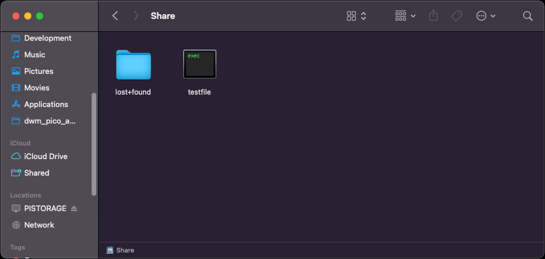
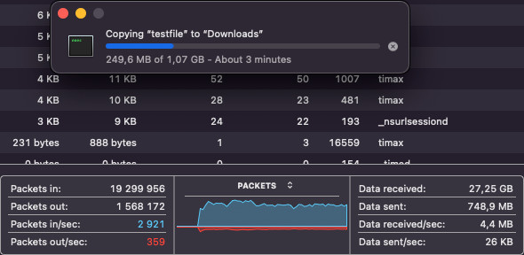
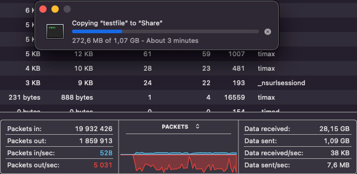
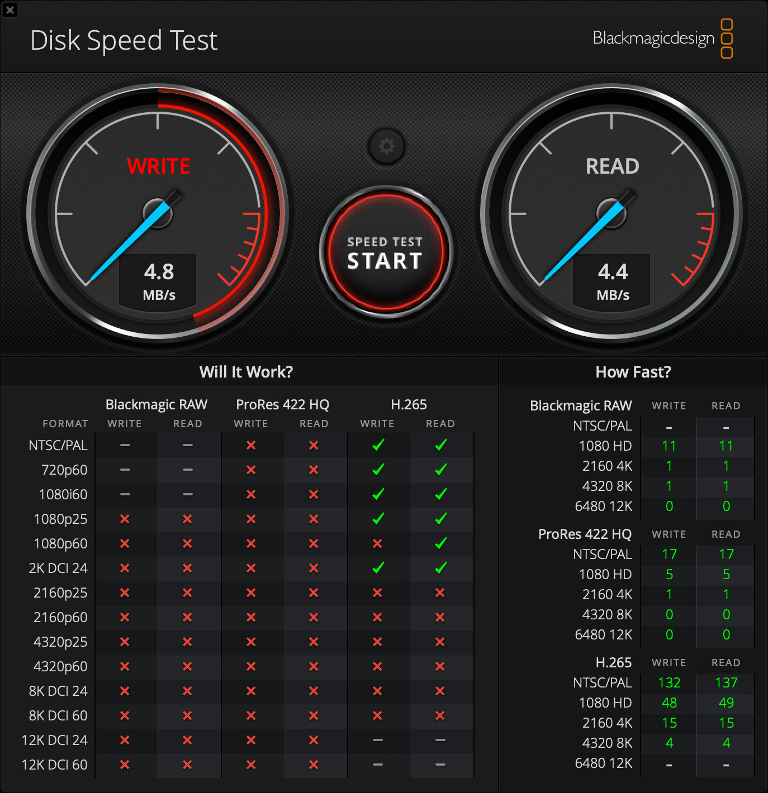

This is the fourth part of the Raspberry Pi Zero 2W-based Storage Server Shenanigans.


In this series, I'm transforming a Raspberry Pi Zero 2W into a super cheap storage server wannabe!

If you want to catch up on what I've done so far, check out the previous parts:

- [P1: Custom Case & Hardware](../../posts/pi-zero-storage-server-shenanigans-pt-1-custom-case-hardware/)
- [P2: Overclocking & Power Usage](../../posts/pi-zero-storage-server-shenanigans-pt-2-overclocking-power-consumption/)
- [P3: Drive Performance](../pi-zero-storage-server-shenanigans-pt-3-drive-performance/)
- [**P4: Mdadm and Samba**]() (CURRENT)
- [P5: OpenMediaVault](../pi-zero-storage-server-shenanigans-pt-5-openmediavault)

## Part Four: mdadm & Samba

---

In this blog post, we're finally gonna configure a bare-bones network attached storage server running RAID array. We're gonna do this with the help of `mdadm` and Samba. We'll look at some popular RAID options, set them up, and test their performance. Then we'll configure Samba for file sharing and finally test if the network transfer speeds match the local read/write speeds.

As with the previous part, I'm writing this blog post as I go. This is to show you the exact commands I'm using and to spare myself the trouble of trying to remember how I did things later. That said, I don't know the outcome yet, so you'll have to read along to see how it turns out.

## mdadm

---

`mdadm` is a Linux utility for creating software RAID arrays. Linux has a so-called "multiple devices" driver that handles software RAID without the need for any hardware RAID cards. We're gonna use this combo to create a RAID array on some flash drives.

A minor note here: I used to develop `mdadm` for a living. I did it for over 3 years: two years as an intern, and the rest as a full-time "System Software Development Engineer" at Intel. Good old times.

### Installing mdadm?

While `mdadm` can be installed from the Debian repositories, that version is seriously outdated. You don't have to take my word for it, let me prove it.

```text
timax@pistorage:~ $ sudo apt install mdadm
[...]
timax@pistorage:~ $ mdadm --version
mdadm - v4.2 - 2021-12-30 - Debian 4.2-5
```

Let's remove that version and compile `mdadm` ourselves.

```bash
timax@pistorage:~ $ sudo apt remove mdadm
```

### Compiling mdadm

Let's clone `mdadm` from the official repository on GitHub.

```bash
timax@pistorage:~ $ sudo apt install git
[...]
timax@pistorage:~ $ git clone https://github.com/md-raid-utilities/mdadm.git
Cloning into 'mdadm'...
[...]
timax@pistorage:~ $ cd mdadm/
```

Now let's check out the latest stable tag.

```bash
timax@pistorage:~/mdadm $ git checkout mdadm-4.4
```

Before we compile the utility, we need to install some required packages. The list can be found in the [README](https://github.com/md-raid-utilities/mdadm) in the `mdadm` repo.

```bash
timax@pistorage:~/mdadm $ sudo apt install pkg-config gcc make libudev-dev
```

Once that's done, `mdadm` can be compiled and installed with the following command.

```bash
timax@pistorage:~/mdadm $ sudo make -j$(nproc) install install-systemd
[...]
timax@pistorage:~/mdadm $ mdadm --version
mdadm - v4.4 - 2024-12-13
```

## Creating RAID arrays

---

We'll create and benchmark the most popular RAID levels: 0, 1, 5, and 10. Note that we're limited here by the bandwidth of the USB hub the drives are connected to. I expect much worse performance than what we saw when benchmarking bare drives.

Note: I won't go into detail about the RAID levels. This blog isn't meant to be a tutorial base. If you're interested in that topic, you can get up to speed on RAID via [Wikipedia](https://en.wikipedia.org/wiki/Standard_RAID_levels).

### RAID 0

The RAID 0 array was created using the following command snippet:

```bash
timax@pistorage:~/mdadm $ sudo mdadm --create /dev/md/raid0 --run --level=0 --raid-devices=4 --assume-clean /dev/sd*
```

Although the `--assume-clean` flag is redundant for RAID 0, I included it for consistency. This way, only the device name and RAID level need to change for other configurations.

```bash
timax@pistorage:~/mdadm $ cat /proc/mdstat
Personalities : [raid0]
md127 : active raid0 sdd[3] sdc[2] sdb[1] sda[0]
      423141888 blocks super 1.2 512k chunks

unused devices: <none>
timax@pistorage:~/mdadm $ lsblk
NAME        MAJ:MIN RM   SIZE RO TYPE  MOUNTPOINTS
sda           8:0    1  57.7G  0 disk
`-md127       9:127  0 403.5G  0 raid0
sdb           8:16   1  57.7G  0 disk
`-md127       9:127  0 403.5G  0 raid0
sdc           8:32   1  57.7G  0 disk
`-md127       9:127  0 403.5G  0 raid0
sdd           8:48   1 230.5G  0 disk
`-md127       9:127  0 403.5G  0 raid0
mmcblk0     179:0    0  28.8G  0 disk
|-mmcblk0p1 179:1    0   512M  0 part  /boot/firmware
`-mmcblk0p2 179:2    0  28.3G  0 part  /
```

In RAID 0, data is split into smaller chunks (stripes) and distributed across all drives. This means that during read/write operations, all drives should (in theory) be used sequentially and frequently. I’ve already created a partition and a filesystem on the RAID array, so let’s take a look at the benchmark results.

We'll use the same `fio` command for all benchmarks, changing only the `--rw` and `--name` parameters.

```bash
sudo fio --name=write_test --filename=/mnt/testfile --size=1G --bs=4k --rw=write --direct=1 --numjobs=1 --output-format=json
```

#### Benchmark Results

Here are the results.

| Direction | Avgr. Write Speed (Megabytes per second) | 0.01% latency (ms) |
| --------- | ---------------------------------------- | ------------------ |
| Write     | 2,183                                    | 893,38             |
| Read      | 6,118                                    | 70,77              |

- **Average write speed** is based on the `bw_bytes` parameter from `fio`.
- **Latency** is taken from the 99.99th percentile in the `fio` output.

To be honest, I expected much worse. I thought sequential read would doom any performance, but seems it does not really matter.

Next, let’s stop the array and remove the RAID metadata from the drives to prepare for the next setup.

```bash
timax@pistorage:~/logs $ sudo mdadm --stop /dev/md127
mdadm: stopped /dev/md127
timax@pistorage:~/logs $ sudo mdadm --zero-superblock /dev/sd*
```

### RAID 1

Here are the results for RAID 1:

| Direction | Average Write Speed (MB/s) | 99.99th Percentile Latency (ms) |
| --------- | -------------------------- | ------------------------------- |
| Write     | 0.891                      | 2634.02                         |
| Read      | 6.088                      | 21.36                           |

Well, my only comment is that I thought it would be worse. The available space isn’t great either.

…but hey, if our cheapo flash drives die, we've got 4 copies of the data.

### RAID 5

Let's see how RAID 5 is managing.

| Direction | Average Write Speed (MB/s) | 99.99th Percentile Latency (ms) |
| --------- | -------------------------- | ------------------------------- |
| Write     | 0.928                      | 2399.14                         |
| Read      | 5.986                      | 67.63                           |

Well, not much better.

### RAID 10

RAID 10?

| Direction | Average Write Speed (MB/s) | 99.99th Percentile Latency (ms) |
| --------- | -------------------------- | ------------------------------- |
| Write     | 1.333                      | 2365.58                         |
| Read      | 6.030                      | 88.6                            |

Well, a bit better, I guess?

### Oh the misery — sticking with RAID 10

Well, I expected nothing less from 4 flash drives attached via a USB 2.0 hub. While it's fun to experiment, I see no real practical use for such a setup. ...but since we've come this far, let's continue this misery.

Let's create the `mdadm` configuration file.

```bash
timax@pistorage:~ $ sudo mdadm --examine --brief --scan | sudo tee /etc/mdadm.conf
ARRAY /dev/md/raid10  metadata=1.2 UUID=33df8840:3d87a530:4ffbc86d:6379fe1b
```

Then we can simply add the directory where the share will be mounted.

```bash
timax@pistorage:~ $ sudo mkdir /media/share
```

Now let's check the UUID of the partition.

```bash
timax@pistorage:~ $ sudo blkid /dev/md127p1
/dev/md127p1: UUID="cb5cf87f-ff71-43f2-ac6f-8fdc7e5a1863" BLOCK_SIZE="4096" TYPE="ext4" PARTUUID="5ac780e8-916c-a34d-b9a6-0de368ddd9bc"
```

...and add an `fstab` entry to auto-mount the array on boot.

```bash
timax@pistorage:~ $ cat /etc/fstab
proc            /proc           proc    defaults          0       0
PARTUUID=27bf800a-01  /boot/firmware  vfat    defaults          0       2
PARTUUID=27bf800a-02  /               ext4    defaults,noatime  0       1
PARTUUID=5ac780e8-916c-a34d-b9a6-0de368ddd9bc	/media/share	ext4	defaults,nofail	0	2
# a swapfile is not a swap partition, no line here
#   use  dphys-swapfile swap[on|off]  for that
timax@pistorage:~ $ sudo systemctl daemon-reload && sudo mount -a
timax@pistorage:~ $ lsblk
NAME        MAJ:MIN RM   SIZE RO TYPE   MOUNTPOINTS
sda           8:0    1  57.7G  0 disk
`-md127       9:127  0 115.4G  0 raid10
  `-md127p1 259:1    0 115.4G  0 part   /media/share
sdb           8:16   1  57.7G  0 disk
`-md127       9:127  0 115.4G  0 raid10
  `-md127p1 259:1    0 115.4G  0 part   /media/share
sdc           8:32   1  57.7G  0 disk
`-md127       9:127  0 115.4G  0 raid10
  `-md127p1 259:1    0 115.4G  0 part   /media/share
sdd           8:48   1 230.5G  0 disk
`-md127       9:127  0 115.4G  0 raid10
  `-md127p1 259:1    0 115.4G  0 part   /media/share
mmcblk0     179:0    0  28.8G  0 disk
|-mmcblk0p1 179:1    0   512M  0 part   /boot/firmware
`-mmcblk0p2 179:2    0  28.3G  0 part   /
```

...and that is all for the array.

## Setting up share

---

Let's start by installing Samba.

```bash
sudo apt update && sudo apt install samba samba-common-bin
```

The next step is to assign the main user as the owner of the share directory and set the correct permissions. Note that this is for demonstration purposes only. If I were setting this up long-term, I'd create a separate user just for accessing the share.

```bash
timax@pistorage:~ $ sudo chown -R timax:timax /media/share
timax@pistorage:~ $ sudo chmod -R 775 /media/share
```

Now we can add the share configuration.

```bash
timax@pistorage:~ $ cat /etc/samba/smb.conf | tail
[Share]
   path = /media/share
   browseable = yes
   writable = yes
   only guest = no
   create mask = 0775
   directory mask = 0775
   valid users = timax
```

...and as the last step, let's set the Samba password for the user and restart the service.

```bash
timax@pistorage:~ $ sudo smbpasswd -a timax
New SMB password:
Retype new SMB password:
timax@pistorage:~ $ sudo systemctl restart smbd
```

That should be it.

### Accessing the share and speeds

Accessing the share is as easy as going into the Network section in Finder, logging in with credentials, and the share is ready to use.



Conveniently, the test file is already there, so we can use it to test network performance. Let's first try downloading the `testfile`.



My very scientific methods showed that the speed oscillates around ~5 MB/s, which is about what I was expecting. But the biggest surprise came when I tested the upload speeds.



I uploaded the `testfile` back, and to my great surprise, the upload speeds also oscillated around 5 MB/s. My explanation is that for `fio` I used very "restrictive" parameters: direct I/O (no caching), small block size, etc. Well, either way, I'm not complaining. While 5 MB/s is not fast by any means, I can see it being enough in some scenarios, and don't forget we have a RAID 10 array running underneath.

### It bugged me

It bugged me, so I re-ran the test using Blackmagic Disk Speed Test to confirm what I saw.



It’s about what I observed, but the results are all over the place. It oscillates around 4.5 MB/s, but sometimes the write speeds are actually higher than the read speeds.

## Summing it up

---

...and that's it. A basic, network-attached storage server with RAID 10 redundancy, running on a Raspberry Pi Zero 2W. Honestly, the results are much better than I anticipated, especially compared to the `fio` tests I ran earlier.

In the upcoming, possibly last part of the series, I'll attempt to install OpenMediaVault just to see how well it works.

[← Previous part](../pi-zero-storage-server-shenanigans-pt-3-drive-performance/) \| [Next part ->](../pi-zero-storage-server-shenanigans-pt-5-openmediavault)
