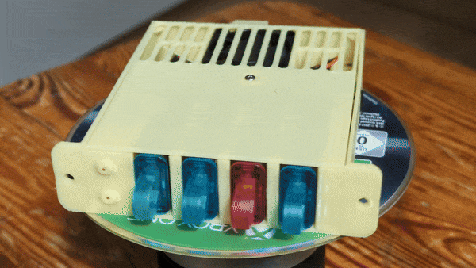
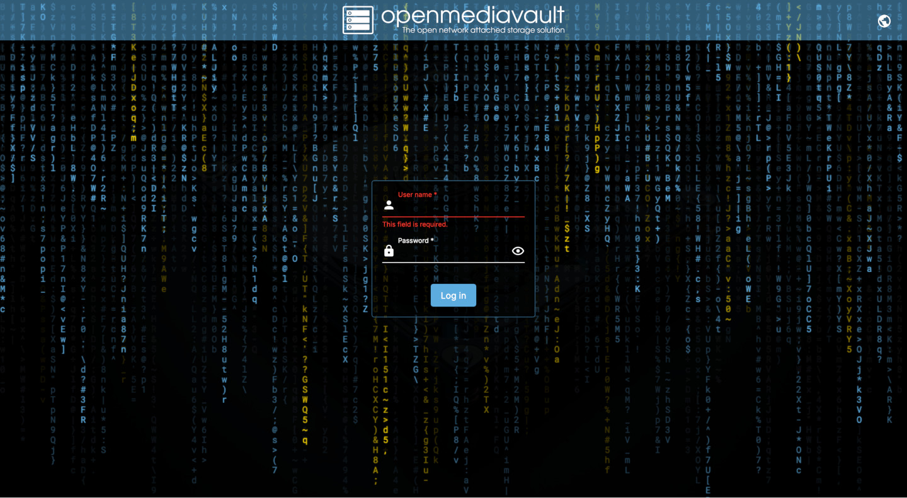
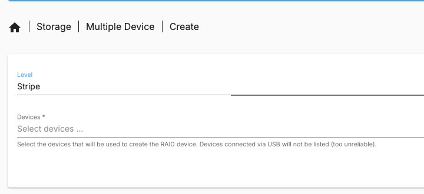
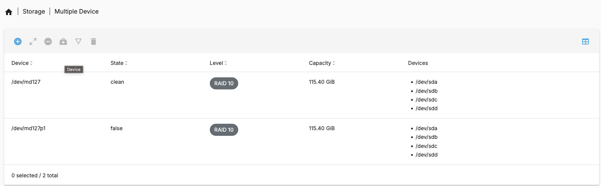
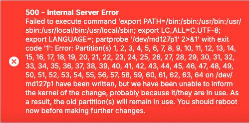
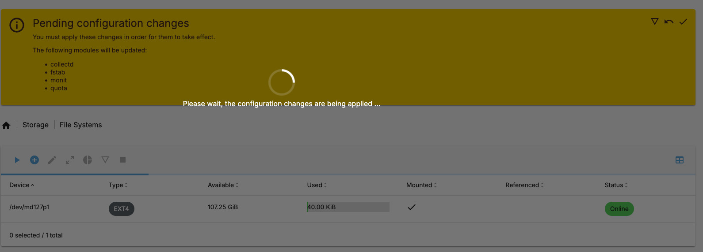
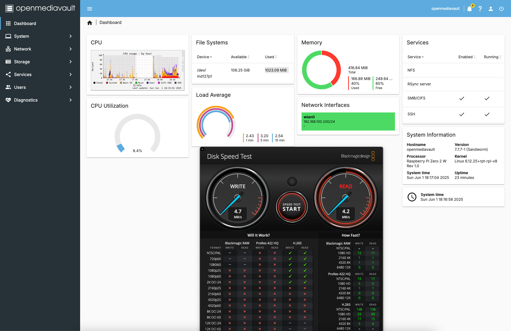

This is the fifth, and the last part of the Raspberry Pi Zero 2W-based Storage Server Shenanigans.



In this series, I'm transforming a Raspberry Pi Zero 2W into a super cheap storage server wannabe!

If you want to catch up on what I've done so far, check out the previous parts:

- [P1: Custom Case & Hardware](../../posts/pi-zero-storage-server-shenanigans-pt-1-custom-case-hardware/)
- [P2: Overclocking & Power Usage](../../posts/pi-zero-storage-server-shenanigans-pt-2-overclocking-power-consumption/)
- [P3: Drive Performance](../pi-zero-storage-server-shenanigans-pt-3-drive-performance/)
- [P4: Mdadm and Samba](../pi-zero-storage-server-shenanigans-pt-4-mdadm-and-samba)
- [**P5: OpenMediaVault**]() (current)

I've also made a YouTube video that showcases the project:

<iframe width="560" height="315" src="https://www.youtube.com/embed/4UGqJmxEyAk?si=-xSDnkFdW9fzZmPv" title="YouTube video player" frameborder="0" allow="accelerometer; autoplay; clipboard-write; encrypted-media; gyroscope; picture-in-picture; web-share" referrerpolicy="strict-origin-when-cross-origin" allowfullscreen></iframe>

## Part Five: OpenMediaVault

---

In the previous blog post, I created a simple network-attached storage server by setting up a RAID 10 array using the `mdadm` creating a network share with Samba. It turned out that real-life scenarios give much better results than testing with `fio`, though they're still nothing to brag about.

In this (last) blog post in the series, I'm gonna install OpenMediaVault, attempt to create a RAID array and a network share, and then re-test the results.

Same as with the other posts, I'm writing this as I go, so you'll have to bear with me to find out if I succeeded.

### Restoring the image

To avoid any dependency issues, I restored the image to the state it was at the end of Part 3 (no `mdadm`, no Samba share), so the OpenMediaVault installation has a clean start.

I did this with the following command:

```bash
xz -d -c pistorage-base.img.xz | sudo dd of=/dev/sdd bs=4M status=progress
```

## Installing OpenMediaVault

---

One of the inspirations for this project was [this video](https://www.youtube.com/shorts/H0OnKe1yvWY), for two reasons:

- I didn’t know the RPi could run OpenMediaVault and wanted to check it out.
- I got clickbaited by the fake handles for the drives. I wanted to prove I could do better. ...and even run RAID.

...so, let's install some OpenMediaVault.

I simply followed the [tutorial from Pi My Life Up](https://pimylifeup.com/raspberry-pi-openmediavault/), so let’s skip ahead to when I had OpenMediaVault up and running and discuss some caveats that were different in my case.

### Issue numero uno

Well, after some time during installation, the Pi disconnected. Sure, normal... After a while, I tried to log in to the Pi via SSH, and I was unpleasantly surprised that I couldn’t. The weird thing was, I had my public key exported, so it should’ve let me straight in.

I plugged the SD card into my PC, and sure enough, the OpenMediaVault installation had overwritten the SSH config.

```text
timax@pistorage:~ $ cat /etc/ssh/sshd_config
# This file is auto-generated by openmediavault (https://www.openmediavault.org)
# WARNING: Do not edit this file, your changes will get lost.
[...]
AuthorizedKeysFile .ssh/authorized_keys .ssh/authorized_keys2 /var/lib/openmediavault/ssh/authorized_keys/%u
PubkeyAuthentication yes
```

To resolve this, I added my user to the `_ssh` group in `/etc/group` and copied `/home/<user>/.ssh/authorized_keys` to `/var/lib/openmediavault/ssh/authorized_keys/<username>` (in this case, `<username>` is the name of the `authorized_keys` file). Then I set the permissions to `644`, changed the owner to `root`, and added an empty `ssh` file to the boot partition. That resolved the issue.

### Issue numero duo

I still couldn't access the web UI, so I wanted to check if port 80 was even listening. While trying to install some packages, I noticed this:

```text
timax@pistorage:~ $ sudo apt install ufw
E: dpkg was interrupted, you must manually run 'sudo dpkg --configure -a' to correct the problem.
timax@pistorage:~ $ sudo dpkg --configure -a
Setting up openmediavault (7.7.7-1) ...
Creating users/groups ...
Updating local package archive ...
Updating service units ...
```

Huh, seems like it didn’t finish installing. But after the command finally completed...



Eyyy.

### Was he slow?

It seems like almost every "command" I tried to execute via the web UI failed to complete successfully. I literally spent a few hours just trying to install updates. Everything finally succeeded after who knows how many attempts. Same story with installing the `openmediavault-md` plugin to handle RAID arrays. Had to do it from the CLI over SSH.

## Setting up

---

Oy fellas, looks like we're having an issue.



[Well, screw you computer, ama gonna do it anyway](https://www.youtube.com/shorts/BD9Eekm-Hlg).

### Creating RAID

Let's create RAID 10 via the CLI.

```text
timax@pistorage:~ $ sudo mdadm --create /dev/md/raid10 --run --level=10 --raid-devices=4 --assume-clean /dev/sd*
mdadm: largest drive (/dev/sdd) exceeds size (60505088K) by more than 1%
mdadm: Defaulting to version 1.2 metadata
mdadm: array /dev/md/raid10 started.
timax@pistorage:~ $ sudo mdadm --detail --scan | sudo tee /etc/mdadm/mdadm.conf
ARRAY /dev/md/raid10 metadata=1.2 name=pistorage:raid10 UUID=42d96e91:d6d7ca5c:cd631994:e47a0ddb
```

...and after refreshing the page, would you look at that.



### The struggle is real

Let's create a file-sys...



**WHY CAN NOTHING EVER WORK!?**

Alright, I did create a new ext4 partition on the RAID array manually. Let's see what it doesn’t like now.

```text
timax@pistorage:~ $ lsblk -o name,size,fstype
NAME          SIZE FSTYPE
sda          57.7G linux_raid_member
└─md127     115.4G
  └─md127p1 115.4G ext4
sdb          57.7G linux_raid_member
└─md127     115.4G
  └─md127p1 115.4G ext4
sdc          57.7G linux_raid_member
└─md127     115.4G
  └─md127p1 115.4G ext4
sdd         230.5G linux_raid_member
└─md127     115.4G
  └─md127p1 115.4G ext4
mmcblk0      28.8G
├─mmcblk0p1   512M vfat
└─mmcblk0p2  28.3G ext4
```



ehh...

```text
timax@MacBook-Air-Mateusz-2:~$ ssh timax@pi-zero
ssh: connect to host pi-zero port 22: Host is down
```

The Pi would reboot every time I tried to save the configuration. After a (looong while), I decided not to care and just carry on. I created a shared directory, attempted to apply the changes... And it worked? Yeah, no idea why.

...then I just proceeded to creating the share.

### I'm done

After half a day spent waiting for crashes, processes taking an eternity, and the web UI working maybe 10% of the time, I managed to create a network share on four flash drives running RAID 10 under OpenMediaVault on an overclocked Raspberry Pi Zero 2W with a custom 3D-printed case.

  
[_Source_](https://www.reddit.com/r/AAAAAAAAAAAAAAAAA/comments/ium50k/the_possum_goes_aaaaaaaaa/)

I hope I never have to do this again. It was basically a hackery to make it work. If you're gonna reattempt this, just stick with `mdadm` and Samba.

## Speed tests

---

Let's check the Blackmagic speed test results.



The speed results are the same as with the `mdadm` + Samba setup. I’ll repeat myself, but I expected nothing more from a flash drive RAID 10 array running on a USB 2.0-speed hub.

## Summary

---

This is the last part of the "Raspberry Pi Zero 2W-based Storage Server Shenanigans" series, so let’s do a quick recap.

### Recap

In this series, I created a custom 3D-printable case for the Raspberry Pi Zero (2W) that has a drive bay for 4 Kingston flash drives communicating with the Pi via a USB hub.

Next, I overclocked the Pi to 1350 MHz and tested individual drive performance. Finally, I prepared two setups for network-attached storage: one with `mdadm` and Samba, and the other by hacking together OpenMediaVault. ..both were running on a RAID 10 array.

One might say what I did was silly, but I managed to learn a few things in the process, like:

- Same brand and model flash drives can have different performance.
- `fio` stress tests are for worst-case scenarios; real-life usage might give better results.
- Sequential read/write on drives connected to a USB hub doesn’t limit their performance much.
- A basic radiator and fan make a major difference in stabilizing temperatures.
- The CPU can become unstable even without hitting thermal throttling.
- Running OMV on a Raspberry Pi Zero 2W is basically a hack...

Are any of these setups useful in real-life scenarios? Not really.

...so what's the point of all this? It’s the same kind of fun as running DOOM on devices that were never meant to do it.

After all, I managed to create:  
**The (Overclocked) Raspberry Pi Zero 2W-based network-attached storage server, with a drive bay for 4 flash drives running a RAID 10 array.**

### Goodbye words

As I said, I don’t have anything more planned for now, so this is the last blog post in the series. I desperately need to restore the Pi to being a Pi KVM so I can move on to a different project. That said, there’s an Orange Pi Zero 2W stuck in customs right now, awaiting delivery. ...so if things work out **Plug and Pray™**, I might revisit this project to see how USB-C improves the speeds.

Thanks for reading!

[<- Previous part](../pi-zero-storage-server-shenanigans-pt-4-mdadm-and-samba)
