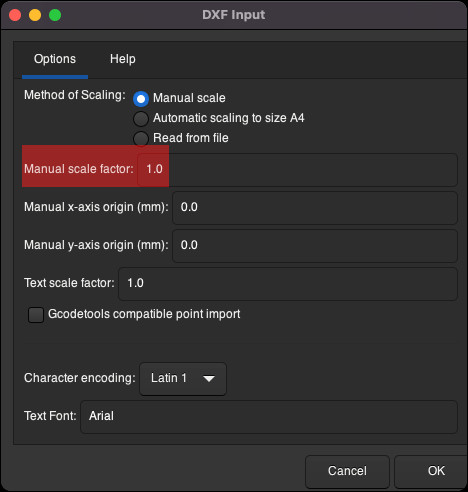

In today's blog post, I'm gonna share a method I recently learned for printing `.dxf` files
on a regular printer at a 1:1 scale by splitting the print across multiple pages.

The method shown here uses only free software (not open source) and works on Mac.

## Backstory

---

[Skip backstory ->](#printing-dxf-file)

I recently acquired a new 3D printer: the Creality K1 SE. It's a CoreXY 3D printer and the cheapest
in the K1 lineup because it was stripped of several features like the camera and, more importantly,
the enclosure. I chose it because I'm a cheapo and I like to make things harder for myself.

The thing is, I wanted to print myself an enclosure from ABS. But if you know anything about
printing with ABS, you need an enclosure to do it properly. ...and here we enter the paradox.

I decided I could make a temporary enclosure from cardboard. But rather than just slapping some
cardboard sheets on the printer and calling it a day, let's do it properly and make them
accurate. This way, if I decide to make the enclosure from something more solid in the future, I’ll
know this method is accurate.

...so, let me show you how I managed to convert a `.dxf` project to `.pdf` and print it on a regular
A4 printer by splitting it into multiple sheets.

## Printing dxf file

---

Let's start with the file. For the demo I'll be using these
[enclosure files for the Creality K1 SE 3D printer on Printables](https://www.printables.com/model/1195509-laser-cut-panels-for-creality-k1-series/files).
The files are in `.dxf` format.

### Why can't one print .dxf files directly

The `.dxf` project I downloaded is too big to be printed on a regular printer at a 1:1 scale.

While most CAD software can open and print this type of file, they usually lack options to split the
project across smaller pages for piece-by-piece printing. On the other hand, many programs do
support page-splitting, but they don't support `.dxf` files.

So, the first issue to resolve is converting the project to a common format that preserves the
scale.

### Converting dxf to pdf

One example of such a format is `pdf`, but again, not every CAD software will allow you to export
the project as a `pdf`.

So what software can open `dxf` files and export them as `pdf` while preserving the scale?

The answer is **Inkscape**.

#### Inkscape

I simply opened the `.dxf` file in `Inkscape` and confirmed that I wanted to import the file at a
1:1 scale.

When you open the file, you'll notice the project likely exceeds the borders of a default A4 page.
We need to change the sheet size to a larger one, A2 in my case. To do so:

1. Go to `File -> Document Properties`.
1. In the "Document Properties" dialog window, change the `Format` from the default `A4` to
   `ISO A -> A2`. The `Format` option should be the first item in the `Display` tab.
1. Close the "Document Properties" window.
1. Zoom out so you can see the whole project. To zoom in/out, hold `CTRL` and use the scroll wheel.
1. Select the project using the keyboard shortcut `CMD + A`.
1. Move the project so it fits within the borders of the sheet.

Now you're ready to go to `File -> Export` to export the project.

When exporting the project, make sure to export it as a `pdf` and increase the `DPI` (300 should be
enough) to preserve the quality.

#### Why not use online converters

Now is a good time to explain why you shouldn't use online converters for format conversion in this
case. The reason is simple: they do not preserve the scale. I tried multiple converters and couldn’t
find one that kept the project at a 1:1 scale.

### Splitting pdf into pages

Now that we’ve converted the project from `.dxf` to a common `.pdf` format while preserving the
scale, we need software that allows us to print the project split into parts, so a regular printer
can be used.

On Mac, one software that allows this is `Adobe Acrobat` (I know, I hate Adobe too).

#### Adobe Acrobat

Open the `pdf` file inside Adobe Acrobat and click the print icon. In the `Page sizing and handling`
section, change the mode to `Poster`. Leave the `tile scale` at `100%`. On the right, you’ll see a
preview of how the project will be split.

...and that is all!

## The result and goodbye

---

Here are the sheets I printed joined together, glued to a piece of cardboard.

Notice how I cut the corners of the sheets so I could align them by the "cut marks." I assume the
"cut marks" weren’t printed properly, but there were just enough of them to align the sheets.

Here’s the cardboard cut to shape and "mounted" onto the 3D printer.

...and that is all for this blog post. Now I can go back to this, as it was not as easy a process as
it seems, and I hope I helped somebody along the way.
