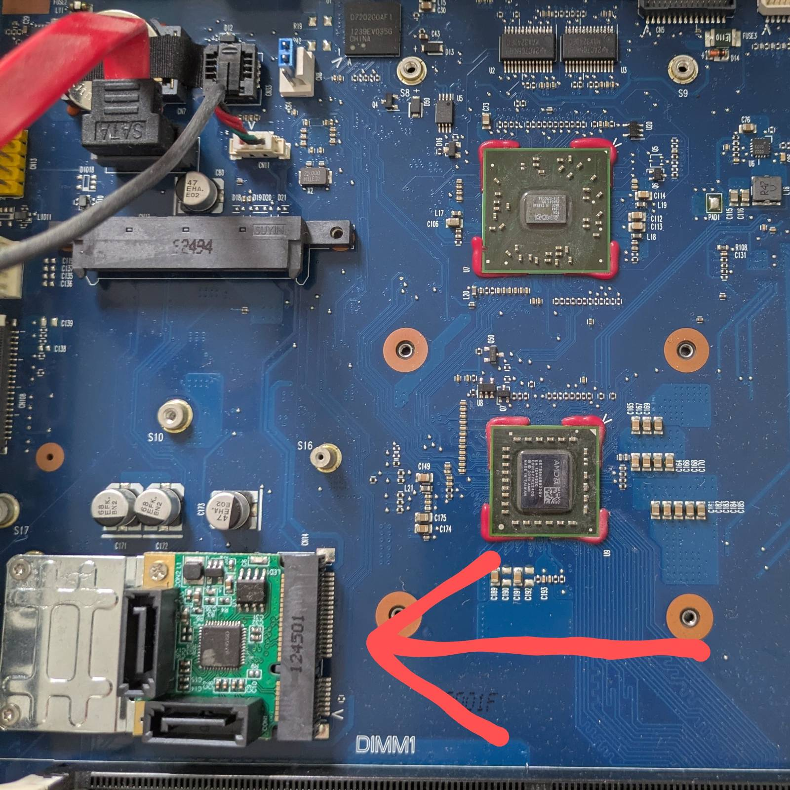
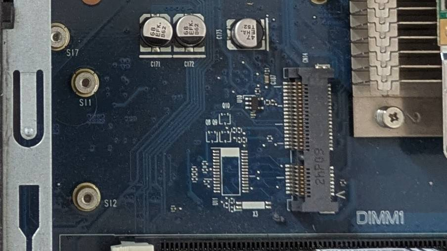
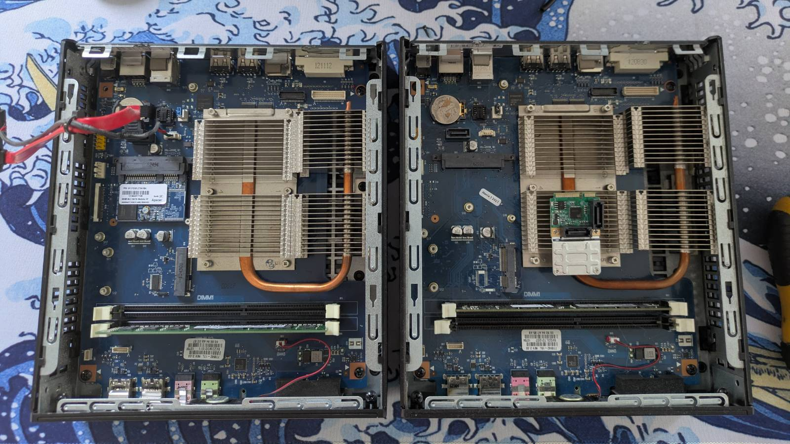
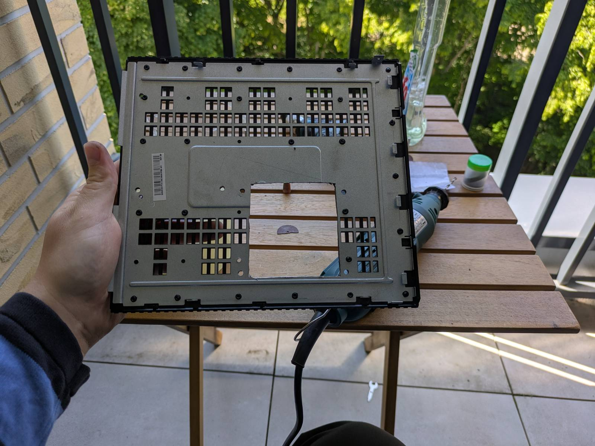
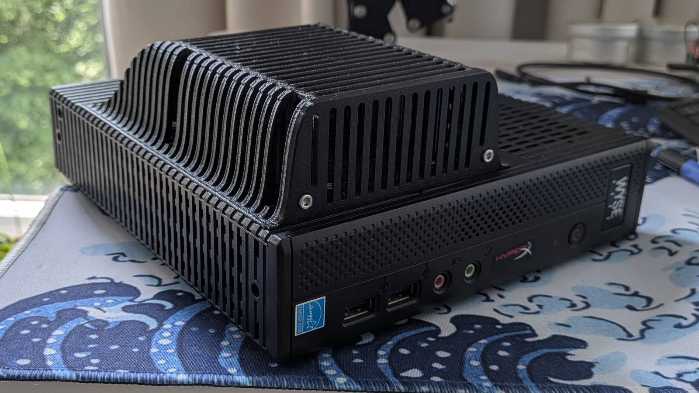
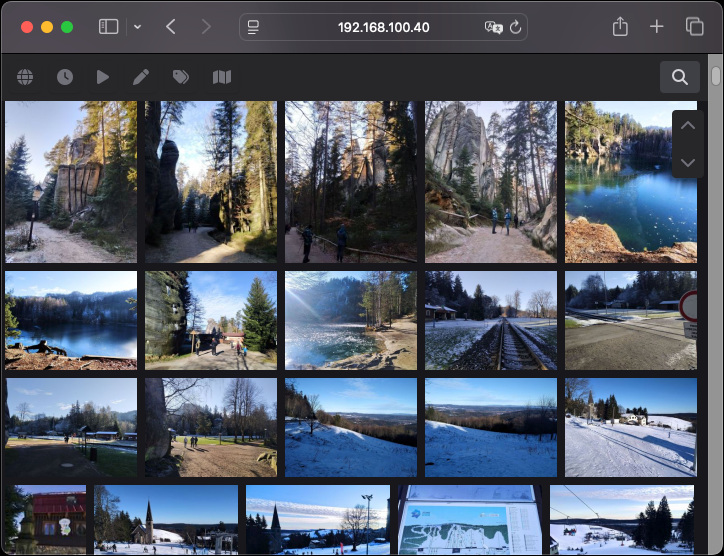
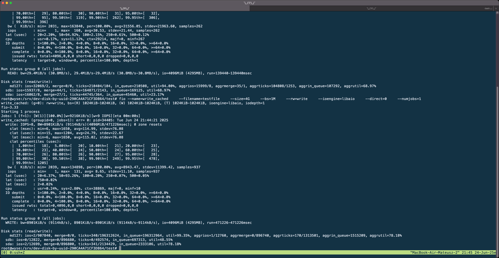

Two and a half years ago, I made this video showcasing the poor man's NAS I built.


_[Link](https://www.youtube.com/watch?v=eTSuSAn0o7c&t=384s&pp=ygUWZGFuY2Vzd2l0aG1hY2hpbmVzIG5hcw%3D%3D) in case you're interested._

I bought the Dell Wyse 7010 (Z90D7) thin client and a second 2.5" HDD, managed to squeeze the hard
drives inside the case using all available SATA ports, installed
[Puppy Linux](https://puppylinux-woof-ce.github.io/) on a flash drive, and _et voilà_, a NAS.

Was it cursed?

> "Sure." – Arthur Morgan

Did it work? For two and a half years, apparently.

## A Refresh

---

I bought a new 3D printer recently that has a built-in server, so I no longer need an additional
computer for [OctoPrint](https://octoprint.org/) or to do that dance with TeamViewer to set up prints
([the printer lives at Mom's](https://www.youtube.com/watch?v=w3UVF6Ipt-E&t=1s&pp=ygUkZGFuY2Vzd2l0aG1hY2hpbmVzIHJlbW90ZSAzZCBwcmludGVy)).
...but I still need to access the local network at my parents' place.

I decided to retire the OctoPrint server machine and just refresh the Cursed NAS I built to also
serve as an entry point for the VPN. The plan was simple:

- Add additional SATA ports so the OS can run from an actual hard drive. You know... A storage
  solution that's designed to handle the wear and tear of running an OS (wild concept, innit?).
- Find a way to mount 3 hard drives.
- Install an OS that’s actually up to the task.
- Set up the VPN.
- ...and maybe run some kind of gallery service, so the pictures my parents store (that's the main
  purpose of this NAS) can be viewed in a browser and cast to the TV via Chromecast.

What could go wrong, right? _(foreshadowing)_

### Adding SATA Drives

The Wyse 7010 has only 2 SATA ports, so I needed to find a way to work around that. I watch
[Hardware Haven](https://www.youtube.com/@HardwareHaven) from time to time (also a great source of
ideas for cursed builds), so I knew that bizarre interfaces like the mPCIe slot my Wyse has
shouldn't be overlooked.



As you can see in the bottom left corner of the picture above, I bought an mPCIe to SATA adapter.
Brilliant, right?

Well, it would be... If it worked...

#### That's Just the Beginning

The adapter didn’t work, so I started investigating what might be the issue. I noticed there were
some unpopulated pads for some kind of IC near the mPCIe port that were missing.



Moreover, the traces looked like they led directly to the port. Since not all Wyse units come with
a wireless card, I figured Dell must have cheaped out and left out these ICs in certain models.

Well, that wasn’t it. Want to know how I know this? Let’s take a look at the original picture I
cropped the above from:



**YES, I BOUGHT THE SECOND ONE** (aaaaaaa).

#### What Was the IC?

The IC is the `SL89635TT12`, or for those who don’t speak datasheets, a TPM module (bruh). I looked
it up, but I kind of suspected this already, since I now had two "identical" machines and one had
a TPM option in the BIOS while the other didn’t.

#### Why Didn’t the Card Work?

I have two suspicions as to why it doesn’t work (though these are just guesses):

- The UEFI/BIOS is really basic and cannot enumerate the card.
- The m**PCIe** slot doesn’t actually carry a PCIe lane
  ([yes, that can supposedly happen](https://superuser.com/questions/990765/how-to-determine-whether-a-mini-pci-express-supports-the-usb-interface)).

#### But It Wouldn't Have Worked Anyway...

Well, even if the adapter had worked, it wouldn’t have functioned as I would need it to. The adapter
is based on the `ASM1061` IC, which I later learned is not suitable for RAID setups. The issue is
that it is (as far as I understand) a switching-type multiplexer. This means it switches between the
drives and writes to them sequentially only one at a time
([Polish source](https://www.elektroda.pl/rtvforum/topic3700852.html#20812377), [English source](https://forums.gentoo.org/viewtopic-t-948964-start-0.html)).

### Mounting Hard Drives

I really wanted this to work, so I came up with a solution that would allow me to install 4 HDDs
"inside" this small potato PC case. How, you might ask...?
If you like cursed solutions, you’re going to love this.



**A GOOD OL CHOP CHOP**

#### But Wait, There's More

I cut the hole for a reason though.



Hell yeah brotha, this is what peak performance looks like.

Jokes aside, I came up with this 4-drive bay that nicely integrates with the Wyse's design. I hope
it shows I put actual work into designing this. I really wanted the outcome to be decent in its own
cursed way.

If, for some reason, you want to recreate this, the 3D model for the drive bay has been shared on
Thingiverse:
[https://www.thingiverse.com/thing:7075921](https://www.thingiverse.com/thing:7075921)

### Installing the OS

The two HDDs are for storage, and they’re running in a RAID 1 array, which means I’m left with no
spare SATA ports. Well, there was literally no choice left than to do this.


Just so you know, this is a different flash drive than the one this machine ran from for 2.5 years.
The reason being, despite PUPPY LINUX running entirely from RAM, it **SERIOUSLY** degraded for some
reason. It took an eternity to install OMV on it, and it was seriously sluggish. But it still
"works" after all that time though.

#### The OS

I ended up installing OpenMediaVault because I wanted to give it a try. While the documentation
leaves something to be desired, even when run from a flash drive, the system was snappy on such a
potato PC.

OpenMediaVault has a
[special plugin](https://docs.openmediavault.org/en/latest/installation/on_usb.html) for running
from flash drives, which reduces the number of writes to extend their lifespan.

I had no issues running OMV.

### VPN with Tailscale

For VPN, I ended up choosing [Tailscale](https://tailscale.com/) for two reasons:

- I didn’t want to expose the machine to the public.
- My parents’ ISP charges extra for having a public IP.

I’ve got to say, I’m positively surprised by how well it works. I thought I’d spend half a day
configuring the VPN, but in reality, it took at most half an hour, was stupidly simple to set up,
and worked flawlessly. If only all things were this simple.

### Gallery Web Service

I mentioned the NAS is mostly used for storing pictures, so I wanted to install some kind of gallery
service to access the photos from a browser. First, my first pick was PiGallery2. It is lightweight,
so it should run well enough on my not-so-little-anymore potato PC, right?

#### Illegal Instruction

Tl;DR: I couldn’t run PiGallery because I kept getting "Illegal instruction" errors from Node.
The most likely reason is the CPU’s age. The hot potato powering this contraption is an
[AMD G-T56N](https://www.cpu-world.com/CPUs/Bobcat/AMD-G%20Series%20G-T56N%20-%20GET56NGBB22GTE.html),
a low-end CPU from almost 15 years ago. Most likely, the issue is the
[lack of AVX instruction set](https://stackoverflow.com/questions/60930359/docker-containers-exit-code-132),
which I confirmed it does not support.

#### Alternative: HomeGallery

I found a working alternative though: HomeGallery. What’s nice about HomeGallery is that it allows
you to choose the backend. I switched the backend from Node to Wasp, and I got it running. Here’s
the Docker Compose file I ended up using.

```yaml
version: "3.9"
services:
  api:
    image: xemle/home-gallery-api-server
    environment:
      - BACKEND=wasm
    restart: unless-stopped

  gallery:
    image: xemle/home-gallery
    environment:
      - GALLERY_API_SERVER=http://api:3000
      - GALLERY_API_SERVER_CONCURRENT=5
      - GALLERY_API_SERVER_TIMEOUT=30
      - GALLERY_USE_NATIVE=ffprobe,ffmpeg,vipsthumbnail
      - GALLERY_OPEN_BROWSER=false
      - GALLERY_WATCH_POLL_INTERVAL=300
    volumes:
      - /srv/docker/data/homegallery/data:/data
      - /srv/sandbox/images:/data/Pictures
    ports:
      - "3000:3000"
    user: "1000:100"
    entrypoint: ["node", "/app/gallery.js"]
    command: ["run", "server"]
    restart: unless-stopped
```



## What Else Can Go Wrong?

---

To sum it up... I wasted a bunch of money and time trying to make this contraption halfway decent.
I’m still running the OS from a flash drive, and I’m still limited to two SATA drives for storage.
The bright side is that now the setup runs under the control of a purpose-built OS, and I have the
VPN and gallery service set up.

I could have lived with that until something broke, but for some reason computers (or rather my
own actions) seem to hate me.

### Hard Drives

Well, the hard drives (at least one of them) decided to turn into the Bee Gees and play
"[Stayin' Alive](https://www.youtube.com/watch?v=fNFzfwLM72c)." I left HomeGallery to run for some
time to let it index the files. After the second day of still indexing, I started suspecting
something was off.

I disabled the service to reduce the load on the drives, attached the share, and ran some simple
speed benchmarks. On the initial run, I saw about ~38MB/s writes and ~30MB/s reads. I looked up the
results from when the NAS was just assembled, and I was easily getting twice that amount back then.
…also, writes faster than reads?

I stopped running tests on the target and decided to test the RAID array directly with the `fio`
utility. The results were all over the place, sometimes showing speeds in KiB/s! Below is the
output of the exact run I’m talking about:



For the record, I also booted SystemRescue (a Linux distro) and ran `fio` there. The write speeds
averaged around 30MB/s. For reads, the speeds seemed suspiciously good, averaging 70MB/s. I reran
tests on two files: when testing a newly created file, the speeds were good, but when benchmarking
the first file, speeds dropped back to ~35MB/s. I suppose caching might have kicked in.

What I think is happening is that one (or two) drives are on the verge of death. I have no other
explanation for the variations I observed. I’m not afraid of losing the data since I regularly
back it up, but it’s just yet another thing that needs my intervention.

#### How Much Can You Cheap Out?

I reflected on what could have gone wrong and whether I could have prevented it.

It’s true I didn’t use any specialty drives for the RAID array. Knowing past me, I bet I simply
chose the cheapest **new** drives that had the capacity I wanted. The drives have been spinning for
about 2.5 years and saw occasional usage (I’m talking once a month). Could constant spinning alone
kill the drives? Or was it vibrations? Could specialty drives have prevented this? I can only guess.

…on the other hand, could RAID have saved me? I ran a check on the array and it completed without
any issues. Surely something seems wrong with the drives, but the array is still operational. It
seems RAID would help only in case of catastrophic drive failure, which highlights that backups
are much more important.

That leaves the question: are RAID 1 arrays really a good option for home NAS? Or would it be better
to have a single drive running constantly and spin up a second drive for scheduled backups once
in a while?

You know, it’s all fun and games and “I can do it better for cheap” until you realize your solution
has serious flaws.

## What’s Next?

---

What’s next for the NAS? Honestly, I have no idea. All I know is I can’t let it run in this state.
The fact is, the Wyse platform is not very future-proof. Sike, a single decent drive costs twice as
much as I paid for the second Wyse.

Is it time to stop being a cheapo and invest in something like the
[Aoostar R1](https://aoostar.com/products/aoostar-r1-2bay-nas-intel-n100-mini-pc-with-w11-pro-lpddr4-16gb-ram-512gb-ssd),
or sacrifice form factor and build a cheapo PC from used parts?

And one last question... anyone wanna buy a Wyse 7010? I happen to have two :D
