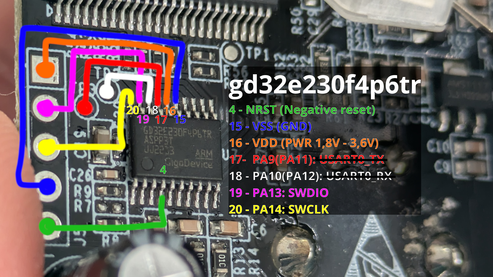
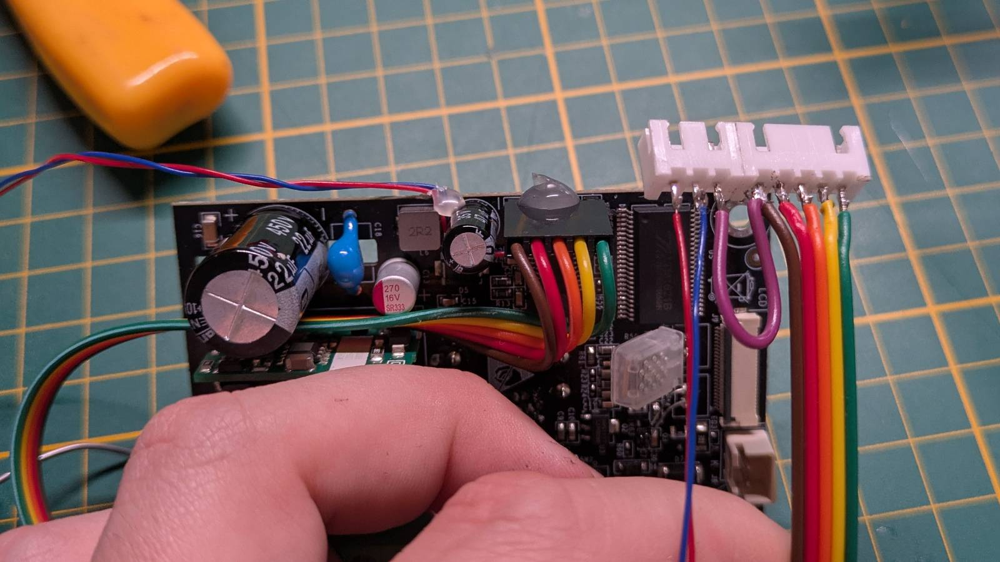
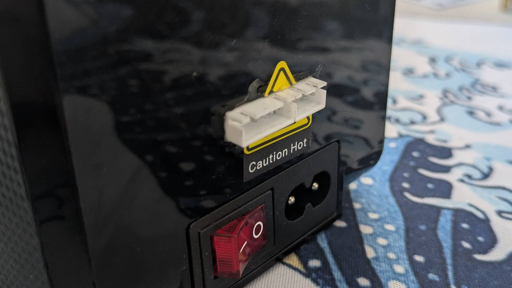
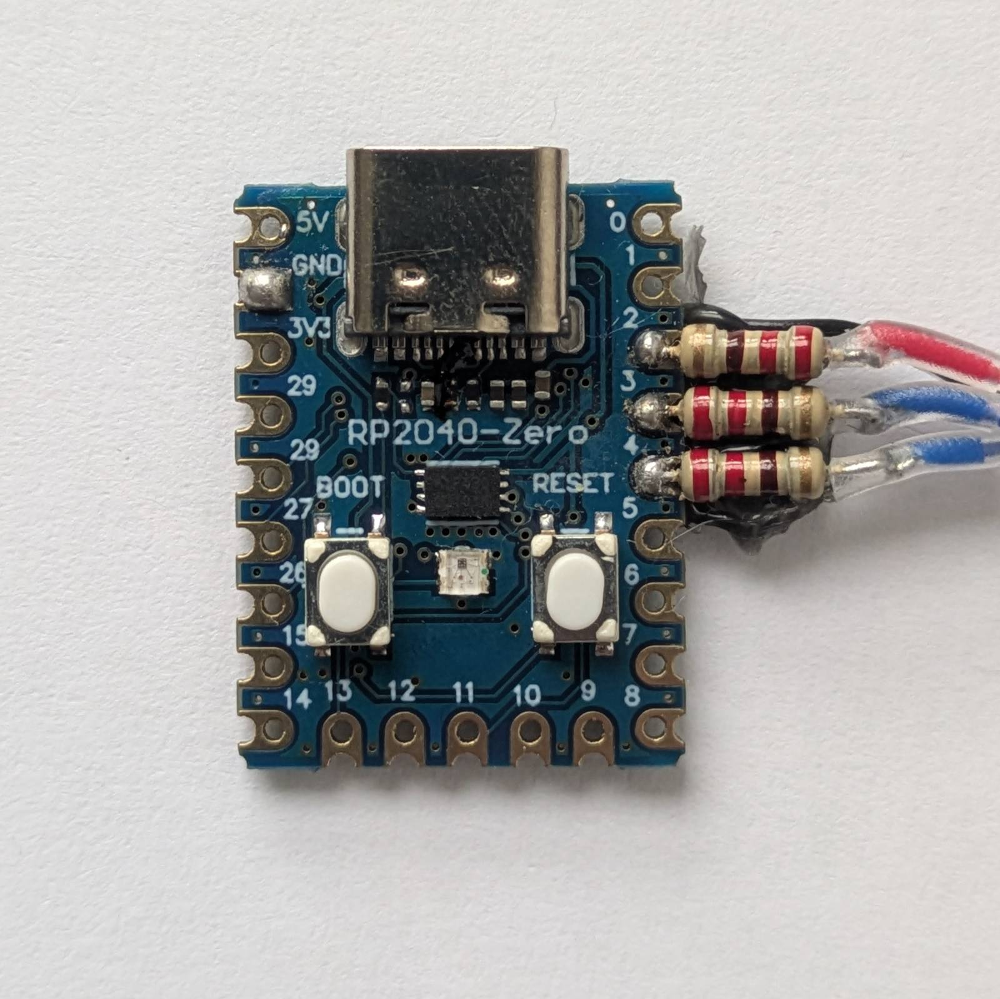
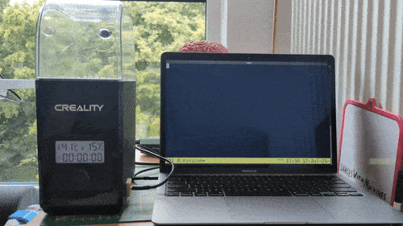

My 3D printer lives in my parents' basement. While the electricity there is free and the noise
bothers no one, there are some caveats, one of them being significant humidity. In the past, I dealt
with this issue by putting the filament spools into the dryer and asking my brother to turn it on
when I was planning to print something the next day. Although I could start a print job remotely,
changing the filament on a modified Ender 3 clone with a dual Z-axis mod requires someone who’s
comfortable handling that kind of hardware, so I had to do it myself.

Recently, I upgraded the printer to a Creality K1 SE, and I'm now on a quest to finally set up my
3D printer for proper remote management. The only things I'm okay with doing manually are switching
out empty filament rolls and removing finished prints from the plate.

So... in order to print anytime I want, I also need to be able to control the dryer remotely.
However, my
[Creality Filament Dry Box 2.0](https://store.creality.com/products/creality-filament-dry-box-2-0)
doesn't support anything like that. Since I didn’t want to spend money on a new dryer, I decided to
"hack” the one I already have.

I came across
[this Reddit post](https://www.reddit.com/r/3Dprinting/comments/zeae80/your_thought_on_the_creality_dry_box_i_just_got/),
which featured the picture of the dryer's PCB. On the board, I noticed an unpopulated header,
and that instantly gave me an idea.

## An Attempt with the Unpopulated Header

---

I disassembled the dryer (which wasn’t easy, hurt my eye in the process) and freed up the PCB. Sure
enough, even though the picture from the Reddit post was of the 1.0 version of the dryer, mine also
had an unpopulated header. So, with a multimeter in hand and the microcontroller's documentation
opened on my laptop, I traced the connections from the port and created this:

The picture shows the connections between the unpopulated header pins and the `GD32E230F4`
microcontroller, which is the brain of the device. TL;DR: I figured out that this is the debug
header for the `SWD` (Serial Wire Debug) interface, a proprietary debug protocol used in ARM chips.

...and while I _could_ (supposedly) play a game of dumping the memory, analyzing how it changes in
different device states, and then altering the memory to get the behavior I want... I felt like
managing the device through a debugger wasn’t the most convenient way to go about it.

_I’m trying to say, it would be **cursed**._

...especially if I wanted to make this solution public.

### UART

What I had hoped to find instead was a UART interface I could plug into. However, since Creality
left this debug header, the chances they were controlling the device via UART for testing were
almost zero.

The hope was still there, as some of the pins connected to test pads also could serve as UART.
I wanted to test this, so I:

- Soldered the pins to the unpopulated header and some wires to the test pads,
- Created some custom cables,
- Cut a hole in the case to mount the connectors,
- Assembled and sealed it, hoping it would magically work and that I wouldn’t need to touch it again.

  

One reason I sealed it up rather than testing it on the bench was that the PCB operates on mains
voltage, which is out of my comfort zone. ...but, as you might imagine, slapping something together
and hoping it works never ends well.

No, the test pads unfortunately were not configured for UART. When I attached the UART adapter, the
device simply froze and reset.

## Serious UART: The Second Encounter

---

The idea of controlling the dryer via UART really stuck with me, but I didn’t feel like
reverse-engineering a $36 device (as of today, there’s a sale on Creality’s website) that’s
essentially just a hair dryer in a box. I knew that if I wanted to actually finish this project,
I needed a much simpler solution.

### RP2040-zero

I figured, the dryer is entirely controlled with a single encoder, it can't be that hard to emulate
it. From my box of random embedded stuff, I picked out the
[RP2040-zero](https://www.waveshare.com/wiki/RP2040-Zero) (a clone, to be exact).
It turned out to be the perfect choice:

- Operates at 3.3V (same as the `GD32E230F4`, so no logic level converters needed),
- Has UART over USB-C,
- Great form factor,
- Dirt cheap (I’ve seen them go for as low as $2),
- And compared to Arduinos, it has a stupid amount of resources for a microcontroller.

Then it was just a matter of spending a few evenings soldering, coding, testing, and...

## I Did It!

---

What can I say, I actually managed to pull it off. Check out this demo!

As I mentioned earlier, the solution works by emulating the encoder's movement. The host (dryer) has
no idea it's being controlled by another microcontroller. Of course, this approach has some
limitations. There's no communication between the host and the RP2040-zero. ...but, I used some of
the RP2040’s hardware features, like hardware timer and built-in temperature sensor, to bring some
of the functionality back. I like the simplicity of it. For just $2 worth of parts, you can have a
DIY solution that works with any host. Potentially, the host might be event the 3d-printer itself,
I'm yet to test that but I see no reason why it shouldn't work.

Rather than repeat myself here, check out the public repo I created:

**Link to the solution:**
[github.com/dancesWithMachines/dryer_cntrl](https://github.com/dancesWithMachines/dryer_cntrl)

There I’ve described in detail how to disassemble the device, how to wire everything up, and all
the other stuff you’ll need to recreate this project.

## Sayonara! Do widzenia!

---

...and that's all for this post. I still need to figure out whether I should control the dryer
directly from the printer or via a dedicated ARM SBC. One thing’s certain: I’d like to automate this
further so instead of opening a UART console each time, I can just run an automated script,
or better yet, create a service that would set up the dryer for me.

I also need to relocate the run-out sensor to the side of the printer so both devices can sit next to each other.

...Generally, there’s still a lot ahead of me, but the core functionality is here:  
I can control the dryer remotely, by myself.
