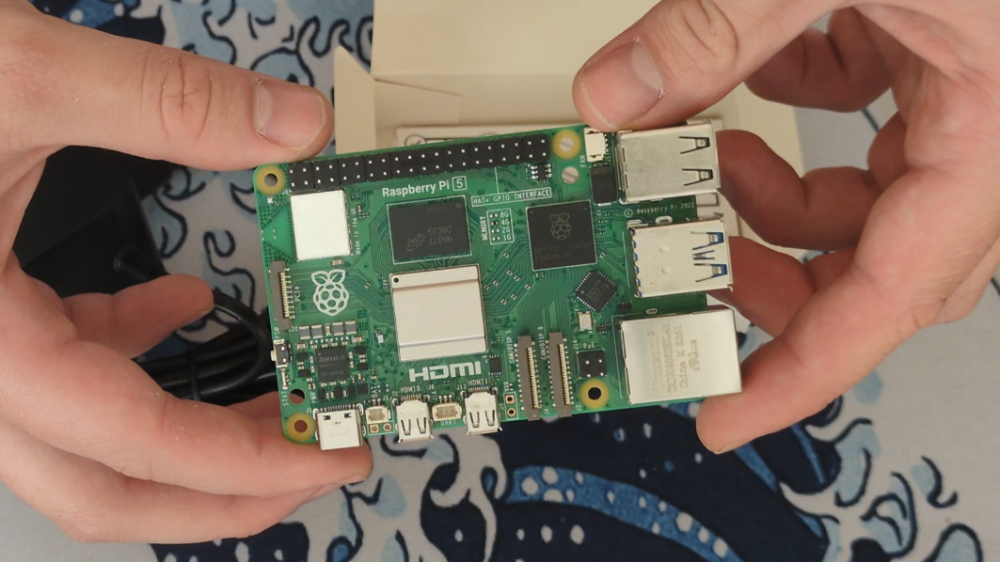
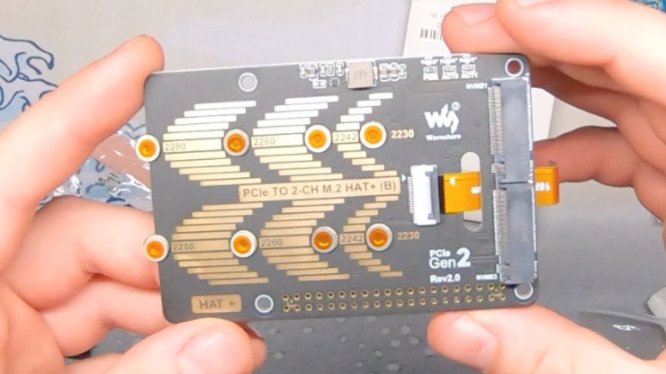

About a month ago, I posted a blog post about
[resurrecting an old Dell Wyse 7010-based NAS](../cursed-nas-gets-curser/), where almost everything
that could have gone wrong, went wrong. After that experience, I was no longer interested in another
attempt at Jerry-rigging it together, so I started looking for other options. One of those options
was just upgrading the computer I used to run as an OctoPrint server with a 10th-gen Intel i3 in a
motherboard, CPU and RAM combo. Sets like that are quite common on the second-hand market, and
while they should be energy efficient, they come with a downside: noise from the fans. NAS-dedicated
HDDs aren’t cheap either, so I wasn’t too keen on that solution.

The other option was using something ARM-based, but there aren't many boards with dual SATA or dual
NVMe support. (I liked the Orange Pi RV2, but while that would be interesting, I’d be on my own.)
I considered the RPi 5 + something like the
[Radxa Penta SATA HAT](https://radxa.com/products/accessories/penta-sata-hat/), but the 2.5" NAS
HDDs are even more expensive, and that HAT costs more than the freaking computer with all the
needed accessories, so I couldn’t be bothered.

...but I really liked the ARM-based server idea, so I started looking for other alternatives and
found out that NVMe HATs for the RPi 5 can be bought for cheap. I agreed with my parents that they
would cover the cost of the NVMEs and I’d provide the machine. This is how it was decided that I'd
be building a Raspberry Pi-based NAS.

## Components

---

Here's the list of components I had (or wanted) to buy:

- Raspberry Pi 5 4GB + official power supply + postage: 284,90zł + 56,90zł + 13,99zł (355,79zł)
- Geekworm H509 Passive Cooler: 28,29zł
- 2x M.2 SSD aluminium heatsinks: 10,78zł
- Waveshare [PCIe TO 2-CH M.2 HAT+](<https://www.waveshare.com/wiki/PCIe_TO_2-CH_M.2_HAT+_(B)>)
  (yes, that's the official name) – dual NVMe HAT: 77,39zł
- Samsung MB-MJ64KA 64GB High Endurance SD card: 48zł
- 2x WD BLUE SN580 NVMe SSD 1TB: 526zł

Total for the computer itself: 520,25zł (~€122.60)  
Total for the drives: 526zł (~€124)  
**Total: 1046,25zł (~€246.60)**

Auch...

Let's discuss the two core components I bought.

### Honey Honey Honey Pi

First, the computer itself, the Pi.

So, in the end, I went for the Raspberry Pi 5 4GB version. I chose the 4GB version as it was only
~30zł (~€7) more expensive than the base 2GB version, and I figured I might as well future-proof it
a bit. Speaking of future-proofing... the Pi 5 is still the newest platform in the Raspberry Pi
family. Knowing that the Raspberry Pi Foundation still supports (and releases OSes for) their first
Raspberry Pi ten years later, I have no worries that unless the SD card or the drives go bad, I’ll
have a platform that will keep serving me for the next 10 years. That was yet another reason _not_
to go with used x86 stuff. I can have a whole new computer for the price of used x86 gear that's
literally sipping power.

I also went with the official power supply. Sure, it might not be the greatest bang for the buck,
but I believe it's a fair price to pay for peace of mind, knowing I won’t run into power issues.

Going with the Pi has another benefit: unification. It’s possibly the most tested SBC in existence.
I’d even go as far as calling it a reference platform for many projects. You can be almost certain
that the solution you’re about to deploy was more or less tested on a Pi and it’ll surely work on
your setup too.

### Waveshare NVMe HAT

For the NVMe HAT, I went with the
[PCIe TO 2-CH M.2 HAT+](<https://www.waveshare.com/wiki/PCIe_TO_2-CH_M.2_HAT+_(B)>).

It's a dual NVMe HAT that supports all NVMe SSD sizes and utilizes the Pi's PCIe port. It supports
PCIe Gen 2 speeds, which is
[about 500 MB/s](https://nascompares.com/answer/what-is-pcie-speed-from-gen1-to-gen6/), so that
would be roughly half of that per drive.

Are we seriously capping the NVMe performance? Yes.

Is that a concern? Nope, because we’re limited to 1Gbps on the Ethernet port anyway, so _that_ is
the real bottleneck.

Waveshare is a well-established player in the Pi accessory and embedded game, so it's nice that I
could get a product from a reputable company at a reasonable price. It comes with some bells and
whistles like activity LEDs, onboard power monitoring, and an EEPROM chip. It's based on the
`ASM1182e` PCIe switch, and from what I briefly checked, there shouldn’t be any issues running a
RAID array on it. (I’m looking at you, `ASM1061`.)

#### What should you know?

#### What should you know?

I checked for reviews of this board and couldn’t find any, so here’s some stuff you should know about it:

- It works plug-and-pray - no additional config was needed in my case.
- The "2×20 Pin header x1" is included in the box, although many resellers don’t list it.
- The "2×20 Pin header x1" _is required_ to be installed, even though it’s not shown in the pictures.

  The reason is: the Pi's PCIe port can supply only up to 5W, while the maximum power draw for the WD
  drives I used is ~4.1W each
  ([source](https://www.techpowerup.com/review/wd-blue-sn580-1-tb/7.html)) and I’m running two.

  I asked Waveshare support and also probed it with a multimeter to check if the 5V power rail from the
  GPIO "flows through the board." Both Waveshare support and my test confirmed that power _is_ also
  drawn from the GPIO pins, which aren’t limited to just 5W.

## Configuration

---

I installed OpenMediaVault on the Pi, created a RAID array, set up a Samba share, deployed
PiGallery2 under Docker, and configured Tailscale for VPN. ...and that was it. Really. Everything
(for once) went smoothly. No content of me suffering for you this time, so… sorry not sorry.
This kinda proves my words about the Pi being basically a reference platform.

Actually, I did have one small hiccup: I configured Tailscale _before_ installing OMV, and that
messed something up and broke Tailscale. I didn’t bother figuring out why, I just reinstalled the
OS, installed OMV first, and this time had no issues.

Yes, my setup and what I run on it is really basic. I do eventually plan to automate backups and
maybe deploy some services I find convenient. I'm the kind of person who sees maintenance costs
everywhere, so I’m fine with a simple setup like this.

## Case

---

To make the project feel more complete, I also designed a simple 3D-printed case.

I experimented with fancier designs, but I didn’t want to restrict airflow since my NAS is
passively cooled. So, I just went with an open-frame design. The Pi is isolated from the surface
it’s resting on and in case it ever comes into contact with something else it has plastic bumpers.
IMO, it also just looks more complete.

I shared the design publicly on Thingiverse:  
[thingiverse.com/thing:7097741](https://www.thingiverse.com/thing:7097741)

## That's all

---

That’s all for this post. No cursing, no fightingWithMachines™ with the software or configuration,
it just worked this time, and hopefully will keep working in the years to come.

I can’t stress enough how nice, even relaxing, it is to go with a popular configuration.
But that does come at a cost (and my onion soul sips).
