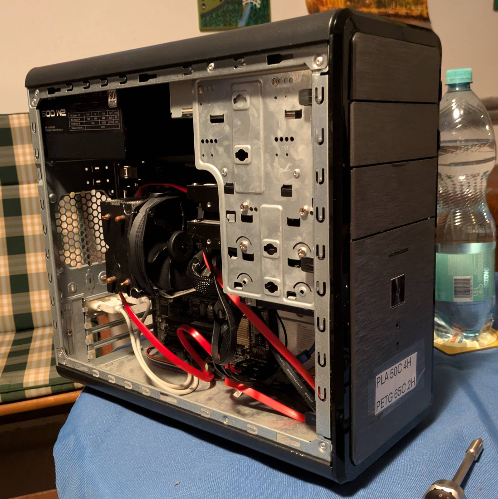
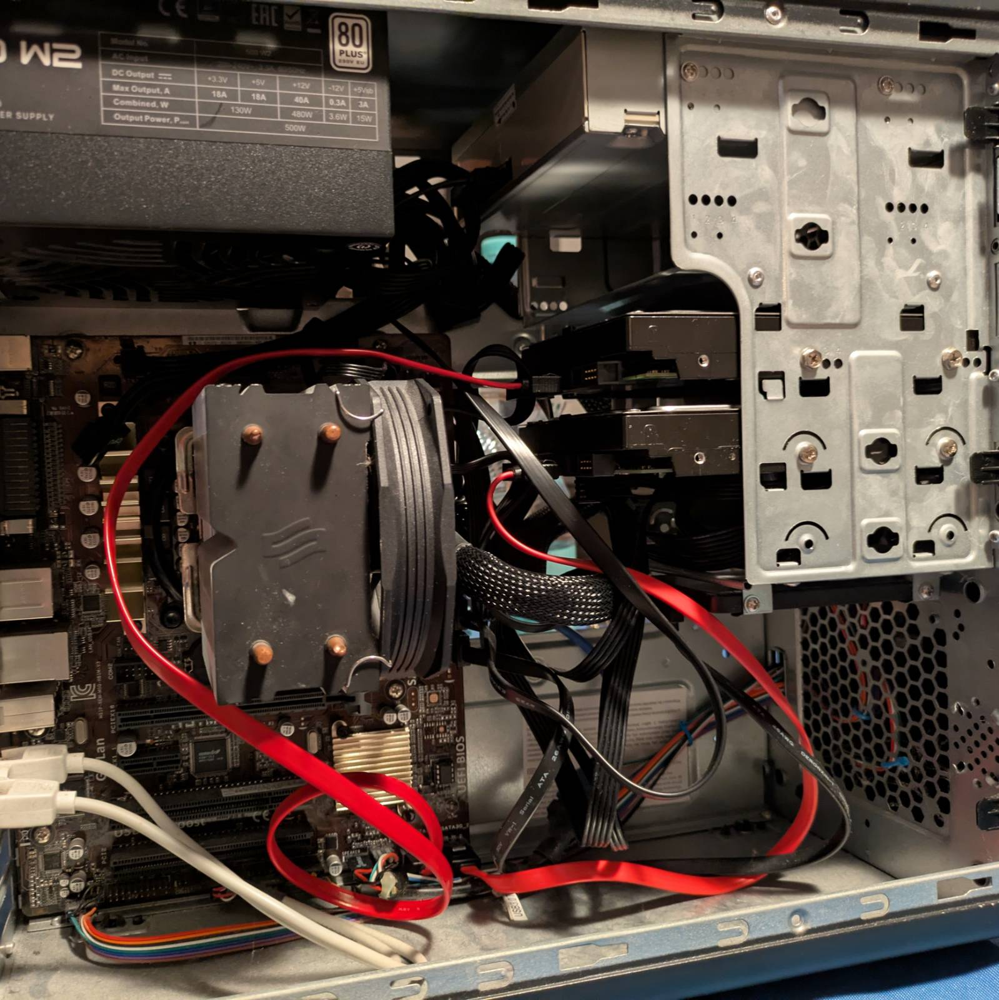
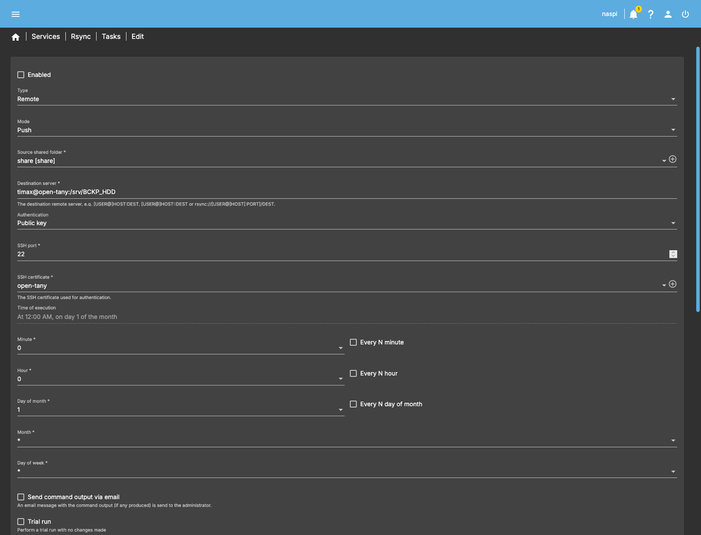

In this blog post, I'm going to showcase the automatic backup setup of an OpenMediaVault based NAS
I've recently committed. I'll showcase how fairly painlessly I set up OMV to start the backup server
remotely via WoL, sync the latest changes, and gracefully shut it down. This post isn't a how-to,
but if you have minimal technical skills, you should be able to figure most of the stuff out on your
own.

## Energy Efficient Backups: The Concept

---

I've recently set up a
[Raspberry Pi 5-based OpenMediaVault NAS server](https://danceswithmachines.github.io/posts/raspberry-pi-5-based-nvme-nas/)
for my parents. The NAS has been doing great. It features two 1TB drives running in RAID 1, but as
I had the chance to recently taste it by myself,
[RAID ain't backup](https://danceswithmachines.github.io/posts/cursed-nas-gets-curser/). ...so I
had to figure out the least painful way of doing backups.

### Doing Backups the Meh-ish Way

The way I used to do it before was that once every few months, I just plugged in a portable USB hard
drive. That worked okay, it even saved my parents’ data last time. The issue, however, was that it
was a tedious process. I had to go to the basement, plug in the hard drive, run `rsync`, wait for it
to finish, remove the drive, etc. The worst part, though, was remembering to actually do the backup.
I decided to change that and fully automate the process.

### What's Efficient About It?

Being the onion I am, I decided not to buy any more computers I don't need and instead utilize what
I already have. And it just so happens that I own an Intel
[i5-4590](https://www.intel.com/content/www/us/en/products/sku/80815/intel-core-i54590-processor-6m-cache-up-to-3-70-ghz/specifications.html)
based PC built from random parts, including an almost new power supply, a mismatched 12GB of RAM,
a busted HDMI port, and more importantly... A free SATA slot!



The only thing special about that machine is that it’s my brother’s first PC (or what’s left of it),
which he refuses to sell since it’s worth pennies. Other than that, it’s just a pile of random parts
that happen to make a working computer. I used it as an [OctoPrint](https://octoprint.org/) server
and for ripping CDs, but since I’ve got no more CDs and my new printer has a built-in server, it now
stays unused. Fun fact: it’s got a nickname, _“open-tany”_, from the Polish _“opętany”_, which
roughly translates to _“possessed”_ or _“cursed”_, since it was always moody (yes, I know it’s a
computer).

I know what ya thinkin’.

> Oi m8, ya stole that ancient garbage from a museum? Run this for a month or two and you'll
> spend on electricity more than it’s worth.

...and you’d be right, but...

What if I could boot it just to perform a backup once a month, then shut it down immediately after,
and do all that without any intervention on my side?

Sounds noice, innit? ...and the best part is, it’s fairly easy to do.

## Setting Up the Target

---

### Mounting the Hard Drive

First of all, I needed storage for the backup. I bought a `WD BLUE WD10EZEX` 3.5" 1TB (same size as
my RAID 1 array) hard drive and slapped it inside the case.



It’s not a NAS-grade drive by any means, but my logic is that it should withstand 12 boots and write
operations a year. Then it was just a matter of creating a mount point for the drive like
`/srv/BCKP_HDD`, partitioning and formatting it, setting up an fstab entry so it is mounted
by default, and finally assigning user ownership of that directory. Ideally, you’d want to
create a dedicated user just for backups, but I live by the rule _“safety third, security fourth”_
or something like that. Jokes aside, I should be fine as long as access to the NAS isn’t
compromised.

### Setting Up WoL

WoL stands for [Wake on LAN](https://en.wikipedia.org/wiki/Wake-on-LAN). There’s all that lore
about how the computer isn’t really off but in a “soft off”
[ACPI **sleep** state](https://uefi.org/htmlspecs/ACPI_Spec_6_4_html/16_Waking_and_Sleeping/sleeping-states.html),
hence **probably** the “wake” in the name. For mortals, however, we can just say WoL allows for
turning on a remote PC over a local network. It works by the host sending a “magic packet” to the
target, and then tiny gnomes living in the NIC of the target use it as fuel to power on the PC.
(I might have made up that last part…)

This protocol is very common even in consumer-grade PCs, to the point that the lack of it may be
considered a deviation.

WoL needs to be enabled both in the OS and in the BIOS/UEFI. On the software side, you can check if
your NIC is WoL-capable via `ethtool`. If it is, enable it using something like `nmcli` (Debian
default) and that should be it.

Firmware settings vary from OEM to OEM. On my motherboard, which is slightly more
business-oriented, I just had a plain “Enable WoL support” (or something similar) option and that
was it. For other OEMs, getting WoL working might be tied to PCI power settings in certain sleep
states. I’d love to say “consult your motherboard manual,” but unfortunately, it’s often a matter of
figuring it out yourself or googling to see if someone else has tried it.

After enabling WoL in both the OS and firmware, the next step was learning the target’s MAC
address. I ran `tcpdump` on the target and then ran `wakeonlan <mac>` to see if the WoL packets were
being delivered, and they were. Then I tested it properly by actually turning off the target. That
worked too.

### Allow Non-Root Shutdown

On Linux, you often need root (sudo) privileges to shut down the machine, so I had to grant my
non-root user permission to execute the shutdown command. I simply ran `visudo` and gave my user
access to the `systemctl poweroff` command.

```shell
timax ALL=NOPASSWD: /bin/systemctl poweroff
```

I admit, this is more of a trick than a real solution. It still requires using `sudo`, but no longer
asks for a password. It is a case of root privilege escalation. With this set up, I can run all the
backup commands and then shut down the PC from a non-root account.

### OS?

I’m running Debian 13 on the target, but the OS itself doesn’t really matter. The only requirement
is having the `rsync` utility installed.

## Setting Up the OMV Host

---

This is where the fun begins. OpenMediaVault obviously supports various types of automatic
backups, but it doesn’t support WoL in automated backup workflows. This meant I had to cheat…
gracefully.

What does “gracefully” mean? It means that rather than doing some shell hack jobs, I tried to
utilize OMV workflows and do most of the setup through the web UI. You’ll see what I mean as we go
along.

### Creating and Exporting SSH Key Pairs

The first step for this setup to work is creating SSH key pairs and exporting the public key to the
target. In OpenMediaVault, keys are used per `rsync` job rather than per user, as you might be
used to. This means you can have multiple key pairs for different `rsync` jobs.

To create an SSH key pair, it’s sufficient to go to `System -> Certificates -> SSH` and create a
new certificate (Ed25519 in my case). The
[documentation](https://docs.openmediavault.org/en/stable/administration/general/certificates.html)
states that the public key can be found at:

`/etc/ssh/openmediavault-<uuid_suffix>.pub`

Sure enough, if I look at the directory contents, I get:

```shell
timax@naspi:/etc/ssh $ ls openmediavault*
openmediavault-776a9d92-8c0f-4ad7-8cae-f2d699c4c3ab  openmediavault-776a9d92-8c0f-4ad7-8cae-f2d699c4c3ab.pub
timax@naspi:/etc/ssh $ cat openmediavault*.pub
ssh-ed25519 AAAAC3N... open-tany
```

Then it was just a matter of copying that public key to the target for my user.

```shell
ssh-copy-id -f -i openmediavault-776a9d92-8c0f-4ad7-8cae-f2d699c4c3ab.pub timax@open-tany
```

Bada bing, bada boom, I can now execute rsync (not all jobs, but more on that later) on the
target.

### Creating a Rsync Job

`rsync` is a utility for synchronizing files across systems. Its party trick is that instead of
performing a full copy each time, it only copies the difference. OMV supports `rsync`, so that’s
what I’m using.

To create an `rsync` task, go to `Services -> Rsync -> Tasks` and create a new task.



Setting up an `rsync job` is straightforward. Above, you can see part of my configuration. Key
aspects are:

- **Type:** Remote — to copy files across the network.
- **Mode:** Push — to create a backup rather than pull it.
- **Source shared folder:** Must point to a share.
- **Destination server:** This is `<user>@<server-name>:<remote path>` (server name is configured in `/etc/hosts`).
- **SSH certificate:** Should point to the certificate created in the previous section.
- **Delete:** Shall be unchecked. This way, `rsync` won't delete files on the target that are still on
  the host, which preserves backups in case of accidental file removal.

The most important thing, however, is that the job must be left **DISABLED**, thus the execution
time doesn’t matter. This is because `rsync` jobs have no way of triggering WoL to kickstart the
target backup server.

Instead, I needed to create a wrapper script that would wake up the target via WoL, execute this
disabled `rsync` job, and then turn off the target. Why bother creating a job in the web UI instead
of just using the CLI? The answer is manageability. This way, I can control `rsync` job details
directly from the web UI, have it properly listed, and avoid doing a dance of editing a zillion
`rsync` parameters in a script.

### Creating a wrapper script

This is a wrapper script I came up with, with the help of Chat-GPT.

```bash
#!/bin/bash

PC_MAC="<redacted, sorry>"
REMOTE="timax@open-tany"
TARGET="BCKP_HDD"   # remote backup directory on PC

# Load OMV helper functions (for omv_log / omv_error)
. /usr/share/openmediavault/scripts/helper-functions

# Find the rsync job file containing the target string
RSYNC_JOB=$(grep -l "$TARGET" /var/lib/openmediavault/cron.d/rsync-*)
if [ -z "$RSYNC_JOB" ]; then
    omv_error "No rsync job found targeting $TARGET"
    exit 1
fi

# Extract SSH identity file path from rsync job definition
SSH_KEY=$(grep -oP "(?<=-i ')[^']+" "$RSYNC_JOB")
if [ -z "$SSH_KEY" ]; then
    omv_error "Could not extract SSH key from $RSYNC_JOB"
    exit 1
fi

omv_log "Waking up PC..."
wakeonlan "$PC_MAC"
sleep 30

omv_log "Running OMV rsync job: $RSYNC_JOB"
sudo "$RSYNC_JOB"

if [ $? -eq 0 ]; then
    omv_log "Rsync job targeting $TARGET completed successfully. Shutting down PC..."
    ssh -i "$SSH_KEY" "$REMOTE" "sudo systemctl poweroff"
else
    omv_error "Rsync job targeting $TARGET failed, skipping shutdown."
    exit 1
fi
```

The flow is more or less like this:

1. Source the OMV built-in helper functions script to use internal logging.
2. Look up the `rsync` job that contains the matching target directory name
   ([docs](https://docs.openmediavault.org/en/stable/administration/services/rsync.html) show where to find `rsync` cronjobs).
3. Extract the SSH key name from the `rsync` job. This ensures the same key pair is used for the
   target, so we can later execute the shutdown command. Remember, keys are not assigned to a user.
4. Wake up the PC and wait 30 seconds for it to boot.
5. Execute the `rsync` job by running the job file.
6. Finally, shut down the target PC on success.

In case you’re wondering, here’s what the `rsync` job file looks like.

```bash
#!/usr/bin/env dash
# This file is auto-generated by openmediavault (https://www.openmediavault.org)
# WARNING: Do not edit this file, your changes will get lost.
. /usr/share/openmediavault/scripts/helper-functions
cleanup() {
    omv_kill_children $$
    rm -f "/run/rsync-d0fefb5c-144d-4b4e-b7c9-57f5daf72c74"
    exit
}
[ -e "/run/rsync-d0fefb5c-144d-4b4e-b7c9-57f5daf72c74" ] && exit 1
if ! omv_is_mounted "/srv/dev-disk-by-uuid-39e46b29-a857-4fd3-9b35-a56f32e2be33/" ; then
    omv_error "Source storage device not mounted at </srv/dev-disk-by-uuid-39e46b29-a857-4fd3-9b35-a56f32e2be33/>!"
    exit 1
fi
trap cleanup 0 1 2 5 15
touch "/run/rsync-d0fefb5c-144d-4b4e-b7c9-57f5daf72c74"
omv_log "Please wait, syncing </srv/dev-disk-by-uuid-39e46b29-a857-4fd3-9b35-a56f32e2be33/share/> to <timax@open-tany:/srv/BCKP_HDD> ...\n"
rsync --verbose --log-file="/var/log/rsync.log" --rsh "ssh -p 22 -i '/etc/ssh/openmediavault-776a9d92-8c0f-4ad7-8cae-f2d699c4c3ab'" --archive /srv/dev-disk-by-uuid-39e46b29-a857-4fd3-9b35-a56f32e2be33/share/ timax@open-tany:/srv/BCKP_HDD & wait $!
if [ $? -eq 0 ]; then
    omv_log "The synchronisation has completed successfully."
else
    omv_error "The synchronisation failed."
fi
exit 0
```

As you can see, it's more than just plain `rsync` command.

### Scheduling the Rsync

Now that I’ve created a wrapper script that not only performs the backup but also wakes and shuts
down the target machine, I needed to restore the ability to schedule when it should be executed.
Luckily, OMV supports this by default.

I created a simple scheduled task under `System -> Scheduled Tasks`. I enabled it, set it to
execute monthly, and in the `command` field, I just pasted the full path to the script, which in
my case is:

```shell
/srv/dev-disk-by-uuid-39e46b29-a857-4fd3-9b35-a56f32e2be33/scripts/wake_and_sync.sh
```

...and that’s it. Just remember to make the script executable if you’re attempting the same.

## Demo

---

I prepared a demo to showcase the final result.

<iframe width="560" height="315" src="https://www.youtube.com/embed/vTbtyM5OzX8" title="YouTube video player" frameborder="0" allow="accelerometer; autoplay; clipboard-write; encrypted-media; gyroscope; picture-in-picture; web-share" referrerpolicy="strict-origin-when-cross-origin" allowfullscreen></iframe>

For the demo, I executed the task (the one that triggers the wrapper script) manually and set up
the `rsync` job to run in “dry mode” (no actual changes). On the left side, you can see the OMV
admin panel, while on the right side, there’s a preview of the target PC booting via PI-KVM.

## Summary and Sayonara

---

That’s it, my take on energy-efficient remote backups via WoL. While it isn’t perfect, I’m happy
that I managed to rely mostly on OMV workflows to set it up. I’d hate it if it were just a cron
job defined who knows where, etc. The way I’ve set it up means I can update the job via the web UI
and it’ll still work, and the only thing I have to remember is that it’s triggered via a scheduled
task.

That’s the penultimate step for the Pi-NAS project to be fully done. One last thing I want to do is
back up the SD card the system boots from, and that should be it.
