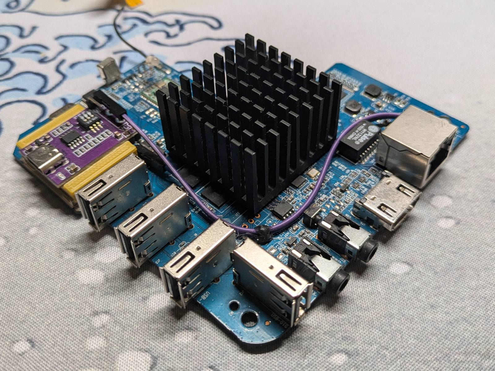
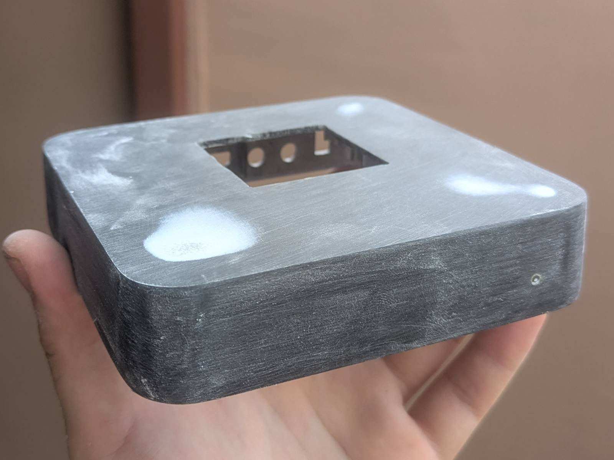
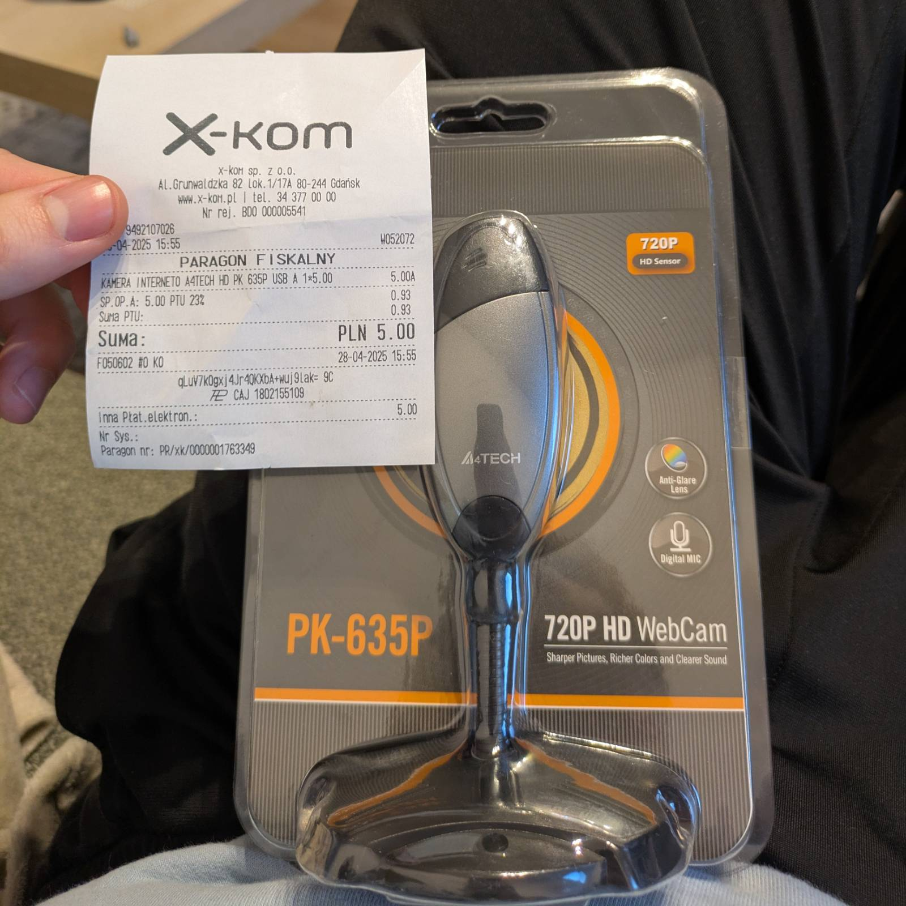
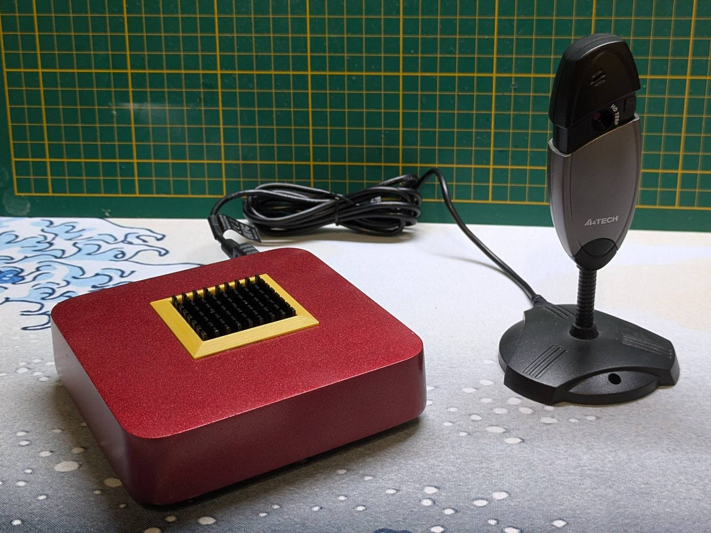
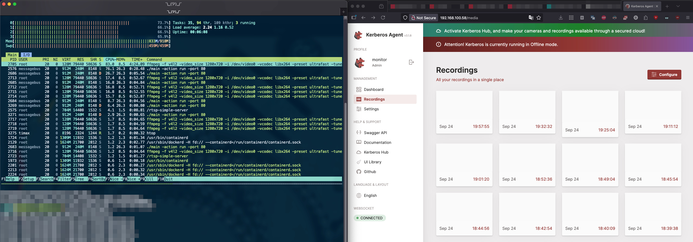
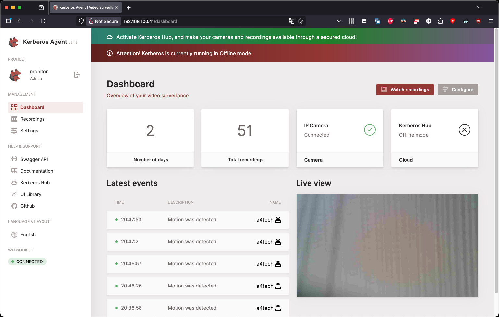

Today’s blog post is a write-up on how I converted an el cheapo, spyware Android TV box into a
“self-hosted” surveillance camera system. I’ll cover my deployment of the
[Kerberos.io agent](https://kerberos.io/product/agent/), briefly talk about running Linux on TV
boxes, the _modifications_ I made to my unit, and the general logic of small, self-hosted
surveillance systems.

## Small, Self-Hosted Surveillance Systems. Why?

---

Let's start from the last point and define what I call a **small** self-hosted surveillance system.

When you think of a monitoring system, the first thing that probably comes to mind is one of those
self-contained, VHS-player-shaped boxes that record feeds from multiple cameras. These often
require no internet connectivity and will happily run in an isolated environment. I consider the
recording unit + cameras a surveillance system.

On the other hand, for home usage, there are all those "smart cameras." These are indoor or
outdoor, cheap, self-contained devices, meaning the physical camera and the processing unit are
embedded into a single device. Most of these are controlled via some kind of Android or iOS
app, with various levels of "remote management" capabilities. As a product, you get the device
itself + some cloud features. So what's the issue?

### Issues with So-Called Smart Cameras

Actually, there are many issues and considerations with these types of solutions, including:

- **Where is your data stored?** Can you be sure no one other than you has access to the recordings?
  Can you trust the manufacturer to keep these recordings safe, encrypted, and not used, for
  example, to feed machine learning algorithms?
- **Is the device "safe"?** Can you trust the manufacturer to implement the latest security
  standards, and that the device would withstand malicious attacks?
- **Auditability** - do you know what kind of stack the camera is running, or is it just a magic
  black-box?
- **Lock-in to the manufacturer's ecosystem** - there are two aspects here. One is turning your
  smartphone into a direct advertising machine by installing the app. The other is: can you be sure
  the things that are “free” right now won’t turn into a subscription later?
- **Obsolescence** - do you know how long the device will be supported? Won’t it just become a fancy
  paperweight once support ends?

### The Meaning of "Small"

When I think of a **small**, self-hosted monitoring system, I imagine a single physical camera
paired with some open-source software running on low-power hardware. I basically want to achieve
the functionality of those smart cameras, but without "sacrificing my soul". The key aspects for me
are:

- I can audit the code (or let others do it) and verify it doesn’t do anything malicious.
- I control where the data ends up, who has access to it, and ensure that it’s kept in a safe
  environment (unless I mess up the configuration).
- I don’t need more garbage advertising apps sending telemetry to some server somewhere for who
  knows what.

There’s also a niche of replacement firmware for proprietary cameras, like
[OpenIPC](https://openipc.org/) or [yi-hack-MStar](https://github.com/roleoroleo/yi-hack-MStar).

Would I call such modified cameras surveillance systems? Probably... Dunno.

Look, I ain’t no professor. I’m just a moron about to turn a TV box into a monitoring system,
remember?

## TV Boxes and Linux

---

Speaking of TV boxes... Yes, you can take cheap Android TV boxes and turn them into small ARM Linux
mini-computers. I've done it here...

<div style="width:100%">
  <iframe
    src="https://www.youtube.com/embed/8Sfh7vml3gE"
    title="YouTube video player"
    allow="accelerometer; autoplay; clipboard-write; encrypted-media; gyroscope; picture-in-picture; web-share"
    referrerpolicy="strict-origin-when-cross-origin"
    allowfullscreen
    style="width:100%; aspect-ratio:16/9; border:0;"
  ></iframe>
</div>

...and there...

<div style="width:100%">
  <iframe
    src="https://www.youtube.com/embed/d9u-pe_GYpE"
    title="YouTube video player"
    allow="accelerometer; autoplay; clipboard-write; encrypted-media; gyroscope; picture-in-picture; web-share"
    referrerpolicy="strict-origin-when-cross-origin"
    allowfullscreen
    style="width:100%; aspect-ratio:16/9; border:0;"
  ></iframe>
</div>

TV boxes were a cheap replacement for ARM SBCs during the Raspberry Pi shortages a few years ago,
but now they are probably just a gimmick (although I still think it’s cool to “free” e-waste).
The key aspects of running Linux on a TV box:

- **Do not buy them new** - it’s a waste of money. You’re much better off buying something like
  an Orange Pi Zero 2W with an extension board.
- **Specifications are a gamble** - you’ll never know which processor you’re going to get, despite
  the exterior looking the same.
- **Various levels of support** - the main OS for TV boxes are community-maintained builds of
  [Armbian](https://www.armbian.com/soc/s905/). Not every TV box is supported and sometimes the
  hardware (like Wi-Fi NICs) is so “wild” there are no Linux drivers for it.
- **Hardware quirks** - you’ll find various types of processors from different OEMs like Amlogic,
  Rockchip, etc. They all behave differently. From my experience, Amlogic-based boxes will
  happily boot from an SD card, while Rockchip-based will default to internal memory if they find
  something to boot. Just another thing to keep in mind.

**Tl;DR:** If you find one for a few bucks and want to play with it for the sake of entertainment,
go for it. Otherwise, you’re much better off buying any other SBC.

I won’t repeat myself too much, as I already made two videos on TV boxes (and I still stand by
what I said back then). If you’re keen on learning how to boot Linux on TV boxes, refer to those
videos.

## Weapon(s) of Choice

---

From the title of the blog post and previous sections, you probably already know that I’ll be
running the whole stack on a TV box. Did I buy a new one? Nah, I already have five of them:
three in a cluster project (it’s at the very, very, very end of the “I feel like doing” list),
one converted to a [RetroPie emulation station](https://www.youtube.com/watch?v=d9u-pe_GYpE)
(the second video from the previous section), and one I attempted to make
[look like a Mac Mini](https://www.youtube.com/watch?v=8Sfh7vml3gE) (the first video in section
above).

...and this is the one I’m using. It features a 4-core
[Amlogic S905 SoC](https://wiki.postmarketos.org/wiki/Amlogic_S905) (jeez, this thing is 10 years
old-time flies) and is backed by 1 GB of RAM.

### The Modifications

I made a few modifications to that platform to prepare it for the workload.



First of all, I replaced the tiny heatsink it came with with a beefy one. It’s glued with a
thermo-silicon, so the bond is more or less permanent. ...but it’s not like I’m ever going to change
it.

The second modification was adding a USB-C power module that can negotiate power, so I can use it
with "smart power bricks" that do handshake power negotiation. These TV boxes need 5V and come
with a barrel plug by default. Today, I would just use the original power brick, but since I
yeeted the barrel port when I did the "Mac Mini" thing, I just improved the solution.

The "USB-C everything" approach is generally a good idea, but in this scenario I probably went
overboard, creating an unnecessary expense in the form of needing an extra charger.

### ...but there's more

If you saw the "Mac Mini wannabe" video, you’ve seen how I butchered the case. I couldn’t stand it
either and decided to fix it. I cut holes for the heatsink and USB-C port to pass through,
then sanded down the case to prepare it for a new paint job.



**...and then I painted it metallic cherry red haha!**


Why? Because why not?

Since the main theme of this project is "as cheap as possible," I decided to use what I already had
in stock. I had painted a moped with this paint and was left with half a can. The perk is, since
this is automotive paint, it should be pretty hard and resistant, and besides that...

It has been scientifically proven that red things are 10% faster than the same thing in other
colors, so it’s basically like a free overclock 😉.

### Eye of the Tiger

There’s yet another hardware component I needed for the setup: the camera.

I have to confess, I went on a little shopping spree and bought the camera brand new. It almost
ruined me financially. Here’s the camera and the receipt:



> Psst... The joke here is 5 PLN was worth about ~€1.17 on the day of purchase...

Jokes aside, I had been thinking about doing something like this for a while, and the discount for
the webcam was just the trigger. I learned about it from a site where users share discounts they
find. The cost of shipping would have been higher than the price of the cam itself, but it so
happened that I pass by the shop, every day on my way to work. I ordered a pickup at the shop and
scored a camera cheaper than a knock-off package of chips.

In terms of quality, I am positively surprised. It produces images and video as good as (if not
better than) the webcam built into my 2020 M1 MacBook Air. Both share a maximum resolution of 720p.

## The Setup

---

Let's briefly discuss the setup.



In the picture above, you can see all the necessary components. The Linux distribution I’m running
on the TV box is Armbian, and the system runs from an SD card. The S905 SoC in my TV box doesn’t
support installing the OS to internal memory, so I’m left with the SD card. The recordings will
also be saved to the same SD card.

Is there a chance the SD card will degrade quickly, break, and cause crucial recordings to be lost?
Absolutely! ...but if I intended to rely on it long-term, I wouldn’t have chosen a TV box as the
host. I treat this as a proving ground, for entertainment and to learn something.

That said, I will be deploying this somewhere. I backed up the entire SD card image, so in case
the SD card breaks, I can buy another for a few bucks, quickly restore the image, and have the
camera up and running again.

## Running the Kerberos.io Agent

---

Running the Kerberos.io agent is straightforward and well-documented both in the
[docs](https://doc.kerberos.io/agent/installation/) and the
[README](https://github.com/kerberos-io/agent). I’ll only discuss it briefly here, so for the
full setup guide, refer to those documents.

### Setting Up the Camera

First of all, the Kerberos.io agent does not natively support USB cameras. Instead, it expects an
RTSP stream as input. The Kerberos.io team anticipated this and created a simple Docker container
that runs an RTSP server, taking a webcam as the input device. All it needs is a small
configuration file change. Refer to
[this](https://github.com/kerberos-io/agent?tab=readme-ov-file#thinking-prerequisites) and
[that](https://github.com/kerberos-io/camera-to-rtsp) for more information.

#### Custom udev Rule

I'll show you my configuration in a while, but first let's discuss one additional thing I had to
do that isn’t described in the README. That is, creating a symlink udev rule. On Linux, device files
under the `/dev/` directory are created dynamically, and their numbering depends on detection order.
On my system, when the camera is plugged in, I have a total of 3 video devices (`/dev/video[0-2]`).
On each boot, the real camera could end up being any of these, so I can’t reliably use `/dev/videoX`
directly.

To solve this, I created a udev rule that matches my webcam by its USB serial number and capture
capability. Then it creates a persistent symlink `/dev/a4tech_cam` (the name of the camera
manufacturer). This way, regardless of which `/dev/videoX` number it gets assigned, I can always
access my camera consistently.

I’ve showcased it all in the following snippet:

```bash
timax@aml-s9xx-box:/srv/kerberosio$ ls /dev/video*
/dev/video0  /dev/video1  /dev/video2
timax@aml-s9xx-box:/srv/kerberosio$ cat /etc/udev/rules.d/99-usb-camera.rules
SUBSYSTEM=="video4linux", ENV{ID_USB_SERIAL_SHORT}=="SN0001", ENV{ID_V4L_CAPABILITIES}==":capture:", SYMLINK+="a4tech_cam"

timax@aml-s9xx-box:/srv/kerberosio$ ll /dev/a4tech_cam
lrwxrwxrwx 1 root root 6 Sep 23 22:30 /dev/a4tech_cam -> video1
timax@aml-s9xx-box:/srv/kerberosio$ v4l2-ctl --list-formats-ext -d /dev/video0
ioctl: VIDIOC_ENUM_FMT
        Type: Video Capture Multiplanar

        [0]: 'NM12' (Y/UV 4:2:0 (N-C))
timax@aml-s9xx-box:/srv/kerberosio$ v4l2-ctl --list-formats-ext -d /dev/video1
ioctl: VIDIOC_ENUM_FMT
        Type: Video Capture

        [0]: 'MJPG' (Motion-JPEG, compressed)
                Size: Discrete 1280x720
                        Interval: Discrete 0.033s (30.000 fps)
                        Interval: Discrete 0.033s (30.000 fps)
                Size: Discrete 800x600
                        Interval: Discrete 0.033s (30.000 fps)
                Size: Discrete 640x480
                        Interval: Discrete 0.033s (30.000 fps)
                Size: Discrete 320x240
                        Interval: Discrete 0.033s (30.000 fps)
                Size: Discrete 1280x720
                        Interval: Discrete 0.033s (30.000 fps)
                        Interval: Discrete 0.033s (30.000 fps)
        [1]: 'YUYV' (YUYV 4:2:2)
                Size: Discrete 640x480
                        Interval: Discrete 0.033s (30.000 fps)
                        Interval: Discrete 0.033s (30.000 fps)
                Size: Discrete 1280x720
                        Interval: Discrete 0.100s (10.000 fps)
                Size: Discrete 800x600
                        Interval: Discrete 0.050s (20.000 fps)
                Size: Discrete 320x240
                        Interval: Discrete 0.033s (30.000 fps)
                Size: Discrete 640x480
                        Interval: Discrete 0.033s (30.000 fps)
                        Interval: Discrete 0.033s (30.000 fps)
timax@aml-s9xx-box:/srv/kerberosio$ v4l2-ctl --list-formats-ext -d /dev/video2
ioctl: VIDIOC_ENUM_FMT
        Type: Video Capture
```

#### Camera Settings

Now that we’ve discussed the custom udev rule, here are the settings I’m using for the stream:

```yaml
# rtsp-simple-server.yml for USB camera

# Define a path for our USB camera
paths:
  usbcam:
    runOnInit: "ffmpeg -f v4l2 -video_size 1280x720 -i /dev/video0 -vcodec libx264 -preset ultrafast -tune zerolatency -pix_fmt yuv420p -profile:v baseline -r 15 -g 30 -f rtsp -rtsp_transport tcp rtsp://localhost:8554/usbcam"
    runOnInitRestart: yes
```

The main point I want to draw your attention to is passing the `/dev/video0` device. This is because
the server is running in the Docker container, and `/dev/a4tech_cam` will be mapped to `/dev/video0`.

As for the other settings, frankly, I don’t know what some of them do. I do know that the resolution
is set to 720p at 15fps. I also set the preset to `ultrafast`, as otherwise the stream was choppy.

### Agent Setup

Now, let's discuss the agent setup. Here's the directory structure I created on the host:

```log
timax@aml-s9xx-box:/srv/kerberosio$ tree .
.
├── agent
│   ├── config
│   │   └── config.json
│   ├── logs
│   └── recordings
├── docker-compose.yml
├── readme.txt
├── restart.sh
└── rtsp-config
    └── rtsp-simple-server.yml
```

The structure more or less follows what Kerberos.io
[recommends](https://github.com/kerberos-io/agent/tree/master/deployments/docker#attach-a-volume).
I created the directory under `/srv` since this basically acts as a service.

You’ve probably noticed that I use Docker Compose to deploy the solution. Here's the contents of
`docker-compose.yml`:

```yaml
services:
  rtsp-server:
    image: kerberos/rtsp-simple-server:latest
    container_name: rtsp-server
    restart: always
    group_add:
      - video
    devices:
      - /dev/a4tech_cam:/dev/video0
    tmpfs:
      - /dev/shm:exec
    volumes:
      - /srv/kerberosio/rtsp-config/rtsp-simple-server.yml:/rtsp-simple-server.yml:ro

  kerberos-service:
    image: "kerberos/agent:latest"
    container_name: kerberos-service
    restart: always
    ports:
      - "80:80"
    environment:
      AGENT_NAME: "usb-agent"
      AGENT_CAPTURE_IPCAMERA_RTSP: "rtsp://rtsp-server:8554/usbcam"
      AGENT_KEY: "1"
      AGENT_USERNAME: "likeim"
      AGENT_PASSWORD: "gonnatellya"
    volumes:
      - /srv/kerberosio/agent/config:/home/agent/data/config
      - /srv/kerberosio/agent/recordings:/home/agent/data/recordings
      - /srv/kerberosio/agent/logs:/home/agent/data/logs
    depends_on:
      - rtsp-server
```

I’m using a single `docker-compose` file to start both containers: `agent` and `rtsp-server`.
The rest of the settings are mostly self-explanatory. What struck me is that the login and password
for the web UI are just environment variables. Doesn’t feel very secure, but I guess it can be worked out.

All that’s left is to set up directory permissions as described
[here](https://github.com/kerberos-io/agent?tab=readme-ov-file#configure-and-persist-with-volume-mounts),
and the configuration via configs is more or less done.

### Swap Increase

As I was just about to publish this post, I noticed a funny dependency.

I left the camera recording for a day to get some demos for you, and noticed that when I opened
the `Recordings` tab, the host froze almost immediately. I removed the majority of the recordings
and left the 20 newest, but the issue persisted.

I found out that, despite everything running smoothly on a freaking TV box, entering the
Recordings tab quickly uses all available `RAM` and `SWAP` memory, and the whole device freezes.



**My bet:** the algorithm for generating thumbnails is inefficient and loads all videos fully at
once to generate them. I hate this in all file explorers. Why on earth do they prioritize loading
thumbnails instead of indexing the files first? Ugh.

Additionally, I noticed the recordings are huge for what they are. The daytime sample video
I linked in the "[samples](#camera-samples)" section is about ~60MB. For what it is (720p, 15fps
stream), the size seems ridiculously high.

The good news is, however, I created a 16GB swap file, and the issue no longer occurs.

## The Contraption is Alive

---

You know, it’s always hilarious seeing stuff do things it was never supposed to do. My TV box, for
example, just got turned into a surveillance system…



Under the web UI, there were a few settings to be made:

- I enabled "Offline mode", as I do not intend to use the rest of the Kerberos.io services for now,
  and just let the TV box + camera combo be a standalone surveillance system.
- I changed the maximum directory size for recordings.
- I set up the "Region of Interest," specifying the area in which motion should be detected. I believe
  that without setting this, no videos would be recorded.

...and that’s really it.

### How Is It?

Before I decided to try the Kerberos agent, I tried running
[Motion](https://motion-project.github.io/), and that thing had a definite "my_first_website.html"
vibe. Let me tell you, this is night and day difference.

The verdict is "I like it":

- The whole deployment is described in detail.
- The solution works great even on a freaking TV box.
- The web UI is simple and clear once you get to know it.
- ...and above all, it’s open source.

The `agent` isn’t the only Kerberos.io solution. Others are `Vault` and `Hub`. As far as I
understand, `Vault` is for storing recordings, and `Hub` is the management system for multiple
cameras (`agent` instances). The `Hub` is subscription-based, with plans starting from €2 and
reaching as high as €1999 for the enterprise plan ([source](https://kerberos.io/product/hub/)).

That said, this “deploy for free, pay for smart management” approach works as intended, you’ll be
having a feeling of missing some features (unless you pay), and you’ll be reminded of it by the two
notifications at the top of the screen each time you log in.

Having said that, as long as the agent is capable on its own, I have no problem with that. This is
common practice in the open-source world. Even if I were to manage multiple cameras, since the
solution is open source, it can be easily integrated with others (like Ansible or something).

#### Camera Samples

Here are some sample videos I managed to record with my new contraption. It looks like I’ll
have to tweak the settings, as they’re a bit too "soapy."

The video from daytime:

<div style="width:100%">
  <iframe
    src="https://www.youtube.com/embed/Il0v43gPkFc"
    title="YouTube video player"
    allow="accelerometer; autoplay; clipboard-write; encrypted-media; gyroscope; picture-in-picture; web-share"
    referrerpolicy="strict-origin-when-cross-origin"
    allowfullscreen
    style="width:100%; aspect-ratio:16/9; border:0;"
  ></iframe>
</div>

...and one at night:

<div style="width:100%">
  <iframe
    src="https://www.youtube.com/embed/bmvRngX3ZDE"
    title="YouTube video player"
    allow="accelerometer; autoplay; clipboard-write; encrypted-media; gyroscope; picture-in-picture; web-share"
    referrerpolicy="strict-origin-when-cross-origin"
    allowfullscreen
    style="width:100%; aspect-ratio:16/9; border:0;"
  ></iframe>
</div>

## Summary

---

I’ve achieved what I aimed to do, that is self-hosting a surveillance system. I admit, the
deployment took its usual cursed spin, as it often does with my solutions. As I said in one of the
sections, I’m doing this mostly for fun. ...so, sorry not sorry. It’s great to know there are
high-quality, open source alternatives for self-hosting a monitoring system on the cheap.

As for where I’ll be deploying it, I haven’t decided yet. I was going to give it to a family member,
but the plans have changed. Although, I do have a cursed idea...

Supposedly, there are [mobile internet offers](https://aero2.pl/) that can cost as low as 5 PLN
(~€1.17, same as the webcam) per year. An “off-grid, remote TV box surveillance system”???

Maybe, maybe...
