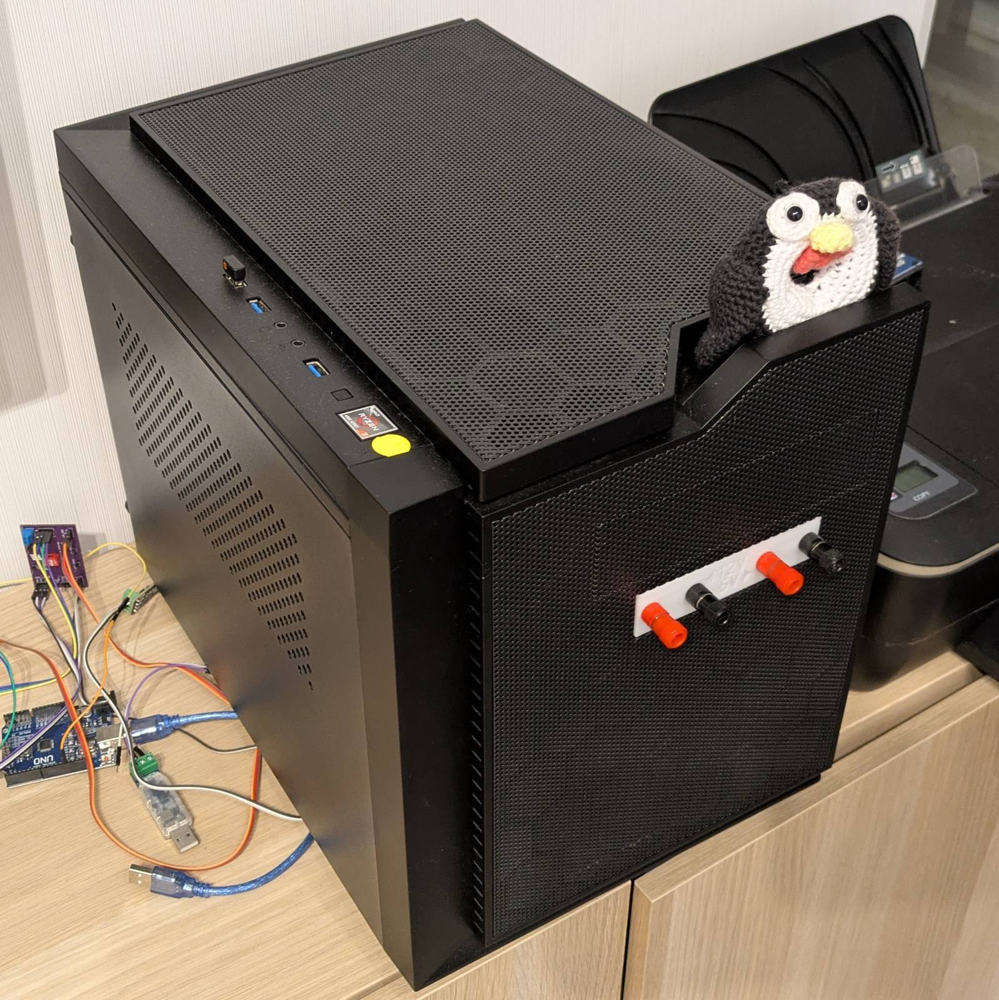
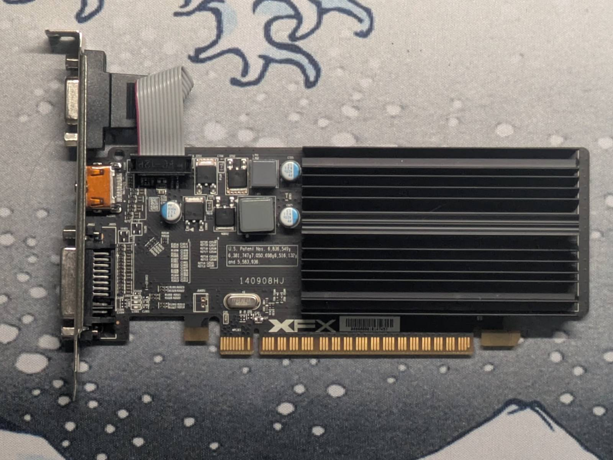
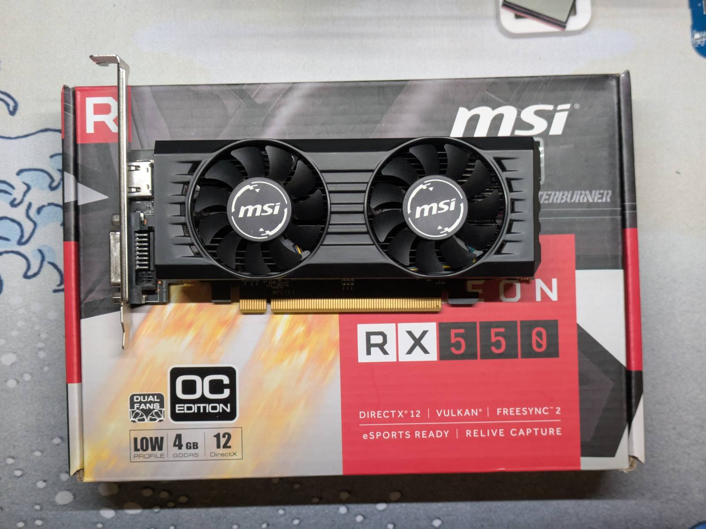
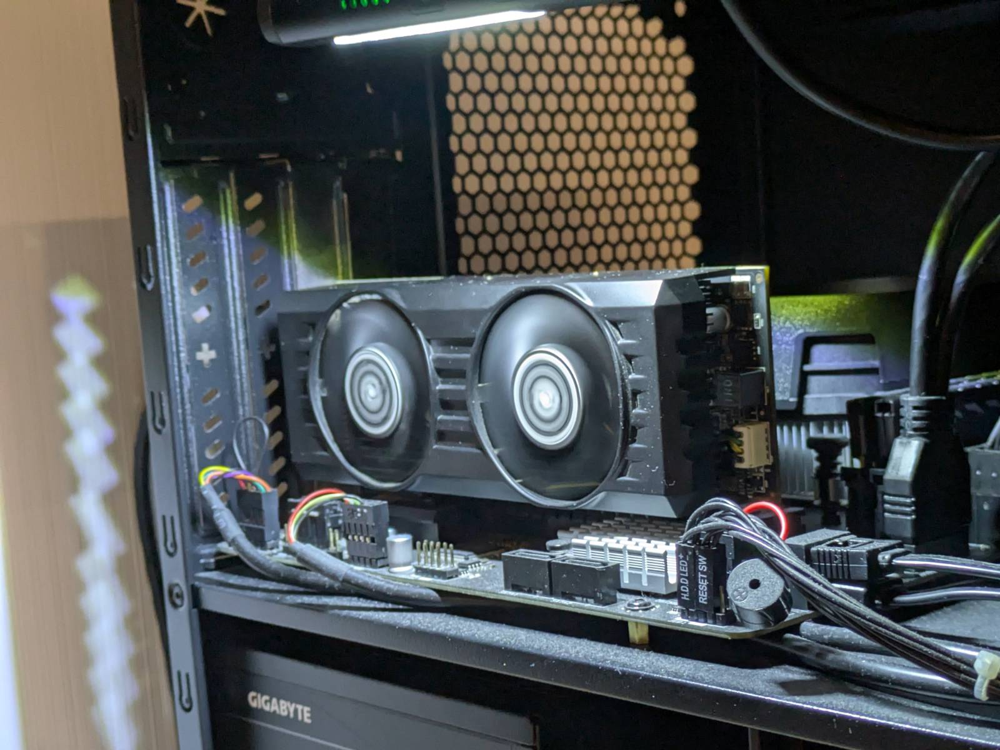

It's been a while since the last blog post, and I finally have something worth sharing. It's not
that nothing has been happening, it's just that with the limited time I have after work, progress
tends to be slow, especially with more complex stuff (a weak excuse, I know). I've crossed out many
of the smaller tasks from my "TO DO" list, so now it's time to tackle the bigger, more ambitious
projects I've been procrastinating on.

...but you know how it is. Sometimes you just want to buy a GPU for your server, thinking it's just
a little escape from the list, and suddenly you find yourself reinstalling the OS from scratch and
creating full automation to restore it to its previous state.

...yeah, anyway...

In this blog post, I'll describe why I wanted to install a GPU in my server and how it went, as well
as share my newfound love for Ansible, and my hatred towards configuring Samba. This post will be
more relaxed than usual, so if that's something that interests you, feel free to read on.

---

## Meet the cube

This is my "SeRvEr," nicknamed "cube".



I often call it my "SeRvEr," but in reality, it's my "throw whatever at it" Linux machine. The thing
with me is, I like keeping my everyday laptop relatively clean and minimal. I don't store any data I
care about on it, I don't run software I don't trust (or like) on it, and I don't host any services
on it. The laptop is basically a glorified terminal for me, which is why I like having a separate
device I can offload stuff to. Currently, the cube does the following:

- runs a RAID 1 array on two 3.5" HDDs where I store things I want to preserve,
- serves that array as a network share via Samba,
- serves the printer via CUPS,
- runs `scanservice.js` for document scanning on the printer,
- and was (or rather, _used to be_ until recently) the only x86 machine I had, so it doubled as a VM
  host, e.g. for running Windows if I
  [needed it for something](2025-01-19-hacking-car-instrument-cluster-lin-pt2.md) a few times a
  year. (I'd rather burn in hell than run Windows outside a VM.)

...and, additionally, I use it to run some Linux-only software.

You might say that's a pretty weak setup for a homelab server, and you'd be right. I rent a 40
square-meter apartment, and the cube lives right in the center of the living room, not even a meter
away from my desk. Unfortunately, el cheapo hardware often means substantial fan noise, and that's
exactly the case with this machine. I only boot it up when needed; otherwise, I'd go crazy from the
fan noise it produces. If I could move it to a basement, like
[I do with machines at my parents'](FIXME), that would be a different story, but for now, it only
gets powered on when in use.

Staying on the hardware topic...

### Specification

Here's the specification for the machine, along with the prices I paid, in case you're interested.

| Component    | Name                                    | Price (in PLN) |
| ------------ | --------------------------------------- | -------------- |
| Power supply | Gigabyte P450B 450W                     | 169.97         |
| CPU          | Ryzen 3 4100                            | 237.81         |
| Motherboard  | MSI B450M-A PRO MAX II                  | 219            |
| Case         | Chieftec Cube                           | 214            |
| RAM          | LEXAR THOR DDR4 3200MHz CL16 (2×8 GB)   | 149.94         |
| Boot drive   | KIOXIA EXCERIA NVMe™ G2 M.2 2280 500 GB | 129.99         |
| —            | —                                       | **1120.71**    |

_Note: I built the PC at the end of 2023._

I aimed to build a sub 1000zł (~€235 today) PC, but once I finished assembling it, I realized I
needed something to actually boot off, so I ended up going a bit over budget. All the components
were bought new; some were on sale, and the CPU was a customer return, so it came with a discount.

I built this PC as I was moving out from my parents’. Originally, I wanted something like the
[Aoostar R1](https://aoostar.com/products/aoostar-r1-2bay-nas-intel-n100-mini-pc-with-w11-pro-lpddr4-16gb-ram-512gb-ssd):
small and compact, but I ditched that idea. It was too expensive for what it offered,
non-upgradeable (future-proof), and the form factor was too limiting. ...and above all, I was well
aware that I’m a moron and that sooner or later I’d start doing stupid stuff to that PC, so I needed
it to be as general-purpose as possible.

-pt1/setup.jpg>)

_...and I was not wrong..._

So here it is, my not-really-a-server server: the cube.

---

## Let's add a GPU

The Ryzen 3 4100 that powers this contraption doesn’t have integrated graphics. Turns out, they are not
really necessary. I could VNC into GNOME or my VMs just fine with a few extra tweaks. The only
inconvenience was that I needed to have a spare GPU lying around in case I wanted to change some
settings in the BIOS or something. ...so I kept an ancient Radeon HD5450 in a drawer for
those occasions.



That thing was so old it was basically just a display adapter, but whenever I needed it, I’d
temporarily plug it in, and it worked. ...so what do I mean by “adding a GPU”?

### I'm an onion

You see, I figured quite a while ago that the sound of air being pushed around inside beeping metal
boxes near me is _not_ my passion. Yet, over the years, I’ve built up a small library of games on
Steam that I suddenly felt like playing again. I have an Xbox, but I’m not about to sponsor
Microsoft by buying those games a second time just to play them there (not that I even could for
some titles).

I figured, I already have this computer in the living room, right next to the TV, doing nothing most
of the time. Why not buy an older GPU and play some games on it?

...and "it was at this moment, that he knew".

### Weapon of choice

TL;DR: I sold the ancient HD5450 I had and bought a used RX550.



I knew I wanted something with the performance level of a GTX 1050 Ti, since I knew the games I own
would run fine on it, but I didn’t want to deal with Nvidia driver bulls\*\*t, so I went with Radeon
instead.

The issue is, the RX550’s performance is actually closer to a GT 1030 than a GTX 1050 Ti, but this
is what happens when you trust ChatGPT a bit too much. If I had known that, I’d have gone for the
2 GB version instead of the 4 GB one I ended up buying, since it’s half the price.

Thankfully (depending on how you look at it), the “landlord special” TV that came with my apartment
is barely above HD resolution, so I don’t think the oldies I plan to play will be too demanding for
it.

### The struggle begins

So, as mentioned in the previous section, I sold the old HD5450 to morally justify buying a "new"
card. ...and that was my first mistake.

You see, I think either computers are secretly self-aware and all of them hate me, ...or somebody
has put a curse on me. The leitmotif of me and computers is that I seem to attract misfortune. All
the trivial things you’d _expect_ to work, like... I dunno... Plugging in a graphics card and
expecting it to output anything... Somehow don’t work for me...

Okay, nothing serious, I thought. Probably some BIOS version issue, nothing that an update couldn’t
fix.

Right… too freakin’ bad I had just sold a known-working GPU and my CPU lacks an iGPU.

> AAAAAAAAAAAAAAAAAAAAAAAAAAAAAAAAAAAAAAAAAAAAAAAAAAAAAAAAAAAAAAAAAAAAAAAAAAAAAH

TL;DR: I “borrowed” a GTX 1030 from work (I asked, don’t worry), updated the BIOS, and the RX550
magically came back to life as expected. Yet, what should have been a 15-minute job turned into a
2 day ordeal.



### ...but wait, there's more

Obviously, it would be naive of me to expect the computer to just boot after a BIOS update. There
were two issues.

#### Secure Boot dance

The first issue was Secure Boot. Being a reasonable person I am, I leave Secure Boot turned on.
...too bad the proprietary BIOS doesn’t allow altering boot options in any meaningful way. I had to
manually select the shim to boot off via the EFI shell, boot the OS, add a custom boot option via
`efibootmgr`, reboot the PC, and… still nothing. The changes didn’t persist.

After some time, I finally managed to add a custom boot option (I’m not entirely sure what I did
that made it stick), yet for God’s sake, I still cannot remove the default boot option, which
doesn’t work with Secure Boot. My **assumption** is that it (BIOS) sees that path every boot and
adds it automatically.

A workaround was simply changing the boot order to use my custom entry first, yet it bugs the hell
out of me that I cannot remove a freakin’ boot option from **my** own computer.

#### Configs lost in space and time

I had my OS configured to run without a graphical user interface or rather, so the GUI was available
only via VNC (remember, I had no GPU). It had been about two years since I set it up, so I had no
idea what I did to make it work.

Sadly, when "restoring" configuration to start `graphical.target` by default, the session refused
start to automatically, I had to manually restart the GUI server.

> ...though, **sometimes** GUI started automatically, suggesting some kind of race condition.

TL;DR: Instead of playing archaeologist, digging through what I might have done and ending up with
the OS in an unknown state, I decided to yeet it all out and start fresh, but this time, properly.

---

## Ansible

Before diving into this, I had a general idea of what [Ansible](https://github.com/ansible/ansible)
is, mostly thanks to [Jeff Geerling](https://www.youtube.com/c/JeffGeerling), but I had never
actually used it. I knew it was a tool that could automatically set up general-purpose OSes (yes,
I know NixOS exists, but I like Debian and got life, so deal with it), meaning it could deploy
configurations, install packages, create users, and so on. In reality, it can do much more than
that. From what I’ve learned so far, where it really shines is performing automated configurations
at scale.

I’m not claiming to know everything about the tool I just discovered, so if you’re curious,
here’s the [Ansible GitHub page](https://github.com/ansible/ansible) and
[Jeff Geerling’s playlist: Ansible 101](https://www.youtube.com/playlist?list=PL2_OBreMn7FqZkvMYt6ATmgC0KAGGJNAN).

My use case only scratches the surface of what Ansible can do. What I mainly wanted was:

- A "one-click" solution for setting up any of my machines.
- To know _what_, _how_, and _where_ things are installed. The problem with general-purpose Linux
  distros is that everybody seems to have a different idea of where and how software should reside.
  Some examples:

  - Some software you install via the package managers.
  - Some you download as `.deb`, `.rpm`, or other formats.
  - Some you just grab as precompiled binaries and place them in `$HOME/because/f/u/thats_why/`
    because developers think everyone else is stupid except them...
  - Sometimes you download `AppImages` and need some third-party launcher because "they" refuse to
    integrate with the GUI by default.
  - And finally, some you compile from scratch.

  It quickly gets out of hand, and the lack of control over it drives me nuts.

- To have all configurations (and documentation) backed up and stored in a single repository.
  Until now, I’ve re-setup everything manually, time to change that.

The reason I often reinstall OSes on my machines is either because they break and I don’t want to
waste time figuring out why, or because things just got out of hand (like the software example
above), making the machine feel "dirty" or slow.

### Helpless automation

I purposefully decided not to copy any configuration before yeeting the old system, as I wanted to
fully "re-understand" the configs. This way, I could not only "re-understand" why certain things
were configured the way they were, but also prepare proper documentation on why.

This is the file structure I ended up with:

```log
$ tree -L 3
.
├── README.md
├── ansible.cfg
├── bootstrap.sh
├── group_vars
│   └── all.yml
├── host_vars
│   └── cube.yml
├── inventory.yml
├── playbooks
│   ├── local_init.yml
│   └── setup_cube.yml
└── roles
    ├── cups
    │   ├── README.md
    │   ├── handlers
    │   ├── tasks
    │   └── templates
    ├── hosts
    │   ├── tasks
    │   └── templates
    ├── ohmyzsh
    │   ├── tasks
    │   └── templates
    ├── packages
    │   └── tasks
    ├── printer
    │   ├── README.md
    │   └── tasks
    ├── samba
    │   ├── README.md
    │   ├── tasks
    │   └── templates
    ├── scanservice
    │   ├── handlers
    │   └── tasks
    ├── share
    │   ├── README.md
    │   └── tasks
    ├── ssh
    │   ├── tasks
    │   └── templates
    ├── suspend_disable
    │   ├── README.md
    │   ├── handlers
    │   ├── tasks
    │   └── templates
    └── tmux
        ├── tasks
        └── templates
```

What you’re looking at is the minimal Ansible configuration set I needed to more or less restore
the cube after a system wipe. Mostly, it’s just setting up network resources (shares, printer,
scanner, hosts) and some general-purpose tweaks to make navigating the system easier. This isn’t,
by any means, the final configuration. I’ll be adding more stuff as needed. The task for now was
simply to restore minimal service set and not get killed by my girlfriend needing to use the printer
(joke).

Some aspects I wanted to touch on..

#### Bootstrap script

A bootstrap (bash) script prepares the host to run Ansible. I decided to extend my bootstrap script
to also handle minimal configuration of the target. Here’s what my `bootstrap.sh` does:

- Verifies that Ansible can run on the host; if packages are missing, they are installed.
- Launches the "local-init" playbook to ensure `/etc/hosts` is configured and generates missing SSH
  keys for both the "ansible" and default user for all hosts in the inventory.
- Copies over SSH public keys to the target for the default user.
- Gives the default user sudo access (it’s a Debian thing).
- Creates an `ansible` user, grants them sudo privileges, and copies over their SSH public key.
- Verifies that Ansible can run on the target.

I’m aware I may have gone a bit overboard. The whole point of Ansible is to avoid writing custom
bash scripts. Yet, it’s a bit of a paradox... I already need some things configured before Ansible
can do its magic. Could I have done it more "properly"? Probably. But at the same time, I believe it
fits within the rule of "do just enough so that Ansible can run".

#### READMEs

As you’ve seen, for some of the roles I added `README.md` files. These describe the reasoning behind
why certain things are configured the way they are. Here’s an example for the `suspend_disable`
role:

````markdown
# Suspend Disable

This role handles disabling system suspend the way Debian manual recommends:
<https://wiki.debian.org/Suspend>

The "modern alternative" listed there is to create `/etc/systemd/sleep.conf.d/nosuspend.conf`
with the following content

```text
[Sleep]
AllowSuspend=no
AllowHibernation=no
AllowSuspendThenHibernate=no
AllowHybridSleep=no
```

This works for Debian 10 and newer.
````

I just like to know why I did things the way I did them.

#### Inventory

In my inventory file, I maintain all the machines (not exactly just computers) I manage, and I
differentiate which are Ansible maintainable and which are not.

```yaml
---
all:
  children:
    unmanaged:
      hosts:
        open-tany: { ansible_host: 0.0.0.0 }
        printer: { ansible_host: 0.0.0.0 }
        printer-outlet: { ansible_host: 0.0.0.0 }
        nas: { ansible_host: 0.0.0.0 }

    managed:
      children:
        x86:
          hosts:
            cube:
              ansible_host: 0.0.0.0
              ansible_user: ansible
              ansible_become: true
              ansible_ssh_private_key_file: "{{ ssh_key_dir }}/<redacted>"

    local:
      hosts:
        localhost:
          ansible_connection: local
          ansible_become: true
```

_Note: I’ve redacted hostnames and IPs._

This setup allows me to automate tasks like generating a valid `/etc/hosts` file, while also
helping me keep track of all IP addresses for the machines I manage and ensuring consistency
across different platforms.

### Ah Samba...

I decided to give Samba its own section in this post just to rant about it. No joke, I spent like
two evenings reconfiguring Samba to my liking, and I still feel dirty and defeated after it.
Where do I even start?

Samba is this contraption that's supposed to do it all and yet it does nothing well. It comes with
this massive configuration file that you study for an hour, only to realize it’s just the tip of the
iceberg. Every setting is somehow related to three others, and there are, like, a freaking trillion
of them. The
[default manual page](https://www.samba.org/samba/docs/current/man-html/smb.conf.5.html)
looks like it came straight out of [TempleOS](https://pl.wikipedia.org/wiki/TempleOS): a single page
that’s 190+ "PAGES DOWN" long (and that’s only for the config file)…
**AND ALL THAT JUST FOR SOME SERVICE TO SHARE FILES ACROSS THE NETWORK**.

Sharing printers? “Good luck”, I just defaulted to CUPS...

Samba users are not system users; they must be added manually, yet there’s no option to show shares
per user. So if your system user (which you have to create anyway) doesn’t have a home directory,
but you’ve got `homes` enabled, Samba will point to the void for the user’s home dir, making the
clients crash.

Don’t even get me started on how counterintuitive some settings are named…

> Ehhhhhhh...

#### Never again

After two evenings wasted, I finally have a Samba config that works (though I still hate it) and
a full automation framework behind it. Hopefully, I’ll never have to look at it again… just deploy
and forget.

---

## Summary

So here we are... What was supposed to be a simple GPU installation turned into automating
configuration deployment across my machines. Besides all the extra time I had to spend on it, it
went relatively smoothly, without any major hiccups (Samba aside, of course).

I love Ansible and don’t know how I ever lived without it. Now I know how and why everything I care
about is configured. If I ever need to reinstall a system for whatever reason, I’ve got an almost
one-click automation setup ready to deploy. More importantly, maintaining the automation framework
itself is now mostly hands-off. Other than the bootstrap script, I can ensure the tools I need are
always up to date.

As for what’s next, I still need to set up my new laptop (expect a post or video on that soon) via
Ansible, so more roles and playbooks will be coming. As for the cube… I think it’s finally time to
install Steam and play some childhood classics 🤣.
