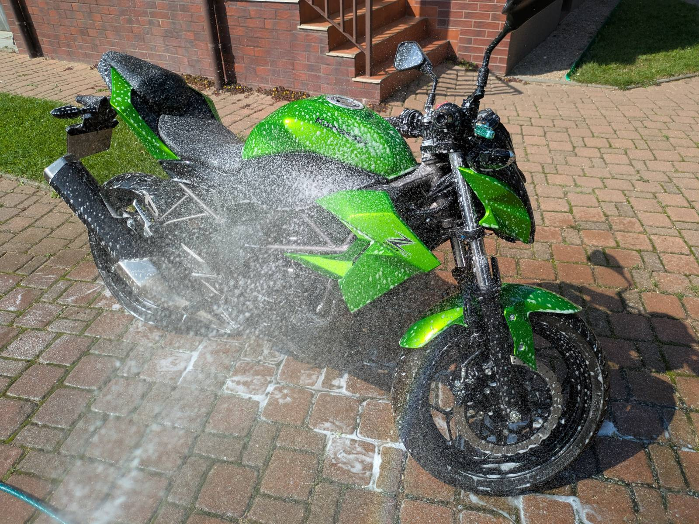

While this blog is mostly focused on "computer stuff", I do have other hobbies
that will pop up here from time to time. One of these is motorcycles, and here’s
my machine:

I own a 2016 Kawasaki Z250SL (no ABS). This is my first motorcycle, and my first
full season of riding is coming to an end, which means: **annual maintenance**.
I did a full service at the beginning of spring, but being the genius I am, I
was too lazy to write down all the parts and procedures that would make my life
easier next time. Well, the time has come, and it’s finally time to fix that
oversight.

The idea for this post is to turn it into a knowledge source about the
**Kawasaki Z250SL**. Mostly for me, but it might just be helpful for others as
well. Instead of doing multiple posts about this machine, I’ll keep this post up
to date by adding content here.

So, to all three people who read this blog regularly: don’t worry, you won’t be
spammed with my little green runabout.

---

## Parts

### How to search for parts

To search for parts, go to official Kawasaki parts website
([polish one](https://sklep.kawasaki.pl/wyszukiwarka?typ=STM&nickname=Z250SL&year=2016&modelcode=BR250EGF&color=51P&country=WV&page=1))
and fill it your motorcycle information. Kawasaki has great "exploded diagrams"
showing every part categorized. Grab Kawasaki part number from here, and you
should be able to find cheaper replacements online.

### List of parts

Here's a list of parts (numbers) that get's replaced annually:

| Part name              | Kawasaki part no.      | Replacement part no.       | Link                                                                                          |
| ---------------------- | ---------------------- | -------------------------- | --------------------------------------------------------------------------------------------- |
| Brake pads F/R         | 43082 (430820128)      | MCB615 TRW                 | [link](https://allegro.pl/oferta/klocki-hamulcowe-trw-do-kawasaki-z-250-sl-17124575486)       |
| Brake fluid            | -                      | MOTUL DOT-4 LV (109434)    | [link](https://allegro.pl/oferta/plyn-hamulcowy-motul-dot-4-lv-0-5l-16117473126)              |
| Engine oil             | -                      | Motul 10W40 1L (5100)      | [link](https://allegro.pl/oferta/olej-motul-10w40-1l-5100-4t-motocykle-17407309431)           |
| Air filter (pre-oiled) | -                      | MIW (MEIWA) K2202 (265146) | [link](https://skyseba.pl/miw-meiwa-filtr-powietrza-kawasaki-z-ninja-250/3-858-32678)         |
| Oil filter             | 52010-1053             | HIFLO-FILTRO HF112         | [link](https://allegro.pl/oferta/filtr-oleju-kawasaki-z-250-sl-2015-17588812389)              |
| Oil bolt washer        | 92065-097              | -                          | [link](https://allegro.pl/oferta/podkladka-korka-spustu-oleju-kawasaki-92065-097-10872695333) |
| Oil filter cover oring | 92055-1577 (920551577) | -                          | [link](https://rafracing.pl/o-ring-kawasaki-52-6x2-4mm,170,3497.html)                         |

Misc:

- Oil plug washer also fits from Toyota part no. 3029
- Oil cover oring size is 52,6mm x 2,4mm
