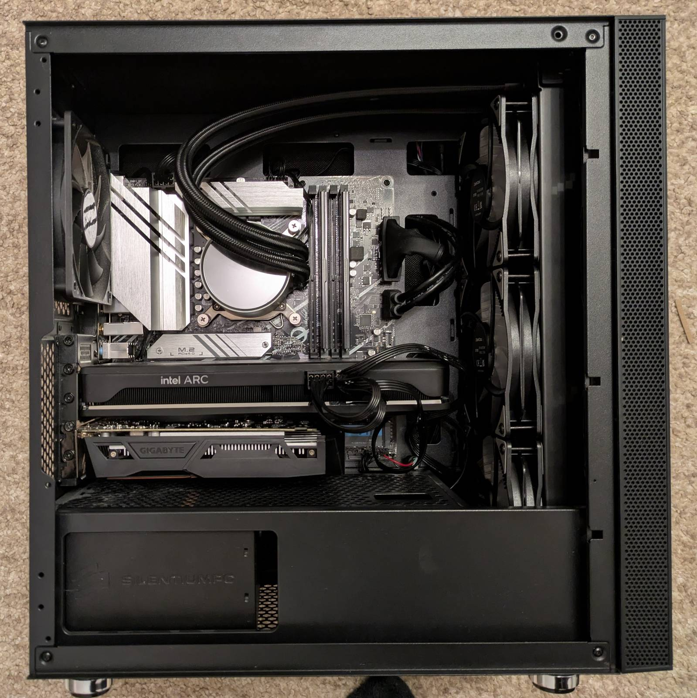
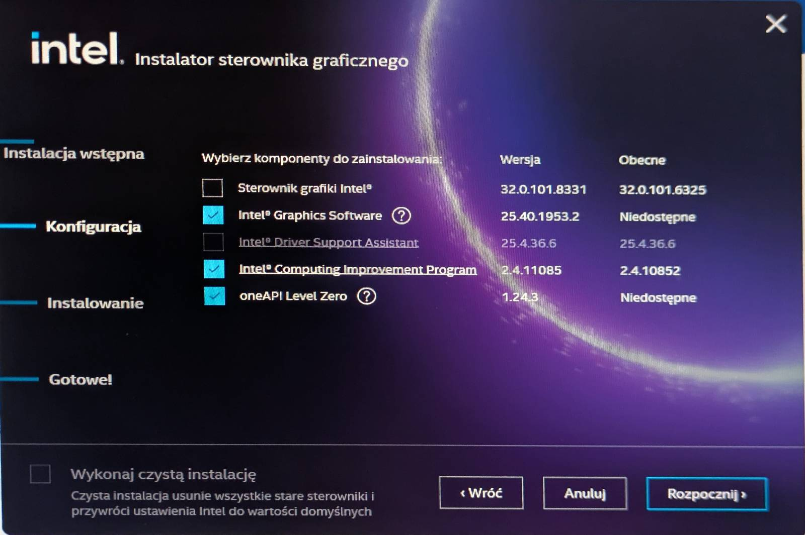

Today's blog post is dedicated to all Intel ARC A750 owners who get
[BSOD](https://pl.wikipedia.org/wiki/Blue_screen_of_death) when attempting to update drivers on
Windows-based machines. I'll describe the symptoms, how I managed to work out the solution,
and finally how to resolve the issue. Let's hope Google indexes this post and suggests it to all
the folks who are getting BSODs during driver updates on Arc GPUs.

_Note: No, it's not related to a dual-GPU setup. I've tested it without Nvidia._

## Trivia

---

For quite some time, I had issues with updating the drivers for the Arc A750 on my brother's
Windows PC. During the driver update, the PC would BSOD. These BSODs resulted in serious issues,
including filesystem corruption. Files on the filesystem could get corrupted, I assume, as a
result of a broken (partial) update. Knowing this, I did not proceed with further attempts on the
"primary system" and instead waited for the winter break to debug the issue in a safe sandbox.

### Sandboxing

To safely reproduce the issue, I unplugged all the drives from the PC, including the system drive,
and instead plugged in a clean drive, onto which I installed Windows 11. This way, the reproduction
environment was identical, and if the issue did not reproduce, that would indicate a problem with
the particular Windows instance.

### Spinning up Windows

As stated in the previous section, I installed a fresh Windows 11 on a spare NVME drive. I've
created a local account and ensured the system downloaded and installed all updates, including
drivers and other Windows components. No additional software was installed.

A crucial thing to note from this step is that Windows will install Arc A750 drivers by default as
part of Windows Update!

### Installing drivers and software

I've downloaded the newest
[Arc drivers install suite from the Intel website](https://www.intel.com/content/www/us/en/products/sku/227954/intel-arc-a750-graphics/downloads.html),
version `32.0.101.8331 WHQL Certified` (newest as of 13.01.2026). I started the installer,
agreed to give my soul to the greedy corporation (joke, agreed to all EULAs), and proceeded to
component selection. I selected all components, including:

- The driver itself
- Intel Graphics Software
- Intel Driver & Support Assistant
- Intel Computing Improvement Program
- oneAPI Level Zero

I **did not** select the `clean installation` option.

**Not long after, the installation resulted in a BSOD.**

This confirms the issue is not tied to the particular Windows instance on the primary drive.
Moreover, after restarting the system and attempting to start the installer once again, the
installer exits with no errors or warnings after a while. This behavior is consistent across
multiple attempts, but more on that later. The installer cannot be started in CLI mode and it seems
(I did not verify this) to be logging to `tmp`, which gets lost after the BSOD. Due to the
proprietary nature of the software, this situation is unrecoverable: there is no insight into why
the installer quits and no way to inspect logs. As a result, the system ends up in a dead spot
where further attempts at installing the driver are not possible.

### "Reinstalling" Windows

> A year without reinstalling Windows is a lost year - me, a Linux user.

I had to "reinstall" Windows multiple times that day to test all scenarios and combinations, as each
unsuccessful update would put the system in the dead spot described in the section above. The
fastest way to achieve a "clean-enough" Windows deployment I found was using the factory reset
option in Windows settings and selecting to keep user files. This spared me from reinstalling
Windows from the ground up and going through the dance of creating a local account via some shady
methods.

While I'm unsure how "clean" the system is after a factory reset, it is clean enough for the Arc
install suite to run again. The factory reset option also removes all drivers, so they are
reinstalled again during Windows Update.

### Exhausting all combinations

Now that I knew the issue reproduces on a clean setup, I ended up testing multiple combinations
(and therefore reinstalling Windows multiple times) until I found a successful path for installing
the newest drivers. By “combinations” I mean things like:

- Installing just the driver (_no_ "clean install", no
  [additional software](#installing-drivers-and-software)) - spoiler: that failed.
- Installing the software first, and then the driver (_no_ "clean install") - spoiler: that failed
  too, at the driver update stage.
- etc.

…but instead of describing every failed attempt, let's focus on the successful path, which I
describe in the next chapter.

## Installing the drivers, a proven method

---

Here's a list of steps that worked for me to update the Intel Arc A750 drivers to the newest
version.

## Prerequisites

**Note that if you want to follow this reproduction, you are doing so at your own risk!**

I have two monitors connected: one to the external GPU (Arc) HDMI port, and the other to the HDMI
port on the motherboard, driven by the integrated GPU. The steps I describe might differ if you are
running a single-monitor setup. There were many cases where I was getting a desktop only on the
iGPU. I do not know how this setup behaves with a single monitor.

### Remove all Intel Arc software (if already deployed)

This step is required if you already have the Intel Arc software suite installed on your computer.
By the software suite, I mean all user-space applications that get installed alongside the driver.
The exact components were listed in the
"[Installing drivers and software](#installing-drivers-and-software)" section.

Uninstall all software components that make up the suite. The reason is to ensure all software
components are at their most recent versions before attempting a driver update. If you have
successfully installed the suite in the past, please remove the software components first.

When uninstalling the "Intel Graphics Software" application, the uninstaller will ask whether the
driver should be removed as well. **Do not check this option**, the aim is to get rid of user-space
software only (applications, not drivers). The driver should remain installed.

### Install the suite only

The next step is to download the installation utility from the
[Intel website](https://www.intel.com/content/www/us/en/products/sku/227954/intel-arc-a750-graphics/downloads.html)
and install only the user-space applications, without updating the driver.

Proceed with the installation until you are prompted for component selection. Exclude the driver
itself from the selection, and **do not** choose the "clean installation" option.

You will be prompted to reboot the computer afterwards. Once that is done, your PC should be running
the newest suite components and the older, not-yet-updated driver.

### Attempt clean driver installation

Once the newest suite is installed, you can attempt a driver installation. Start Intel Graphics
Software and go to the Updates tab. You should see an information about newer drivers being
available for installation. Start the update process from Intel Graphics Software (IGC).

From what I managed to establish, the IGC downloads and executes the
`gfx_win_101.<driver_version>` installer underneath anyway. Therefore, once the update process
starts, after a while you will be greeted with the familiar component selection menu. This time,
however, all other options (suite software) should be unchecked so that only the driver is updated.
Additionally, **this time select** the "clean installation" checkbox. This is supposed to remove the
older driver before installing the new one. Selecting this option is absolutely crucial. We are
installing just the driver to avoid the suite corruption described earlier.

When the software selection matches the above description, proceed with the update.

The update can end in two ways:

- The update utility might report that it successfully installed the driver, but in reality the
  older driver has been removed and the new one was not installed. This is obvious because, after
  rebooting, as only the monitor connected to the motherboard port is working. This was the behavior
  on the sandbox Windows installation.
- The update utility might report a failure, but still successfully remove the older driver without
  installing the new one. This was the behavior on the main system, not the sandbox.

Regardless of whether this happens in the sandboxed environment or the "production system", the end
result is the same: the older driver gets removed, but the new one is not installed. The BSOD
**does not** occur.

After the driver utility finishes, you will be prompted to restart the system.

Note that after rebooting, Windows Update might kick in and start reinstalling drivers for the Arc
GPU if you wait for too long. This happened to me during one attempt, but it did not appear to have
any negative effect on the process.

### Attempt driver installation once again - success

Once rebooted, repeat the procedure from the previous step. This time, the driver update should
succeed, and after another reboot you will be running the newest available driver.

In my case, the IGC initially displayed a non-existent driver version dated 2006, if I remember
correctly. Device Manager, however, reported a valid `.8331` version, which was the newest one
available at the time. The IGC later corrected itself and started reporting the version properly.

## Extra

---

Here is some other stuff I wanted to discuss.

### Is this really the most effective way?

I do not claim it is. It is simply that, among the approaches I tested, this was the least cursed
way to perform the upgrade using just Intel tools. As you just read, installing the suite together
with the driver will likely corrupt the filesystem, and performing a clean update initially
(regardless of whether it reports success or failure) also does not work on the first try. After
reinstalling Windows multiple times that day, this ended up being my path to success.

If I ever have to redo this in the future, assuming some suite version and a non–Windows-Update
driver are already installed, I would try to remove the driver from Device Manager and then perform
the driver installation via IGC as described (just the driver, no suite). My feeling is that this
would spare the initial failed driver deployment.

A lesson for the future is definitely to never attempt a suite update and a driver update at the
same time.

### Whose fault is it?

In my opinion, the party to blame in this situation is Intel.

I simply cannot comprehend how a BSOD during such a basic operation as installing a driver on a
clean system has not been caught during validation.
[I am not the only one facing this issue](https://community.intel.com/t5/Graphics/Intel-ARC-A750-update-causes-Win-11-blue-screen/td-p/1471684).
This is an Intel GPU on an Intel platform, it does not get better than this, yet I am clearly not
alone. My blind guess is that the installer performs some illegal operation on the drivers, causing
Windows to BSOD, but that is just a working theory.

My other issue is that the driver installer size is dangerously close to 1 gigabyte. It prompts the
user to install four additional bloatware applications, none of which actually perform the driver
update. Instead, the same installer, just updated with a newer driver version, is downloaded in the
background and launched. This, to me, is a really wacky design, giving users a proprietary blob they
cannot debug if anything goes wrong.

More than that, the driver update utility also performs firmware updates on the GPU. This is stated
directly in the installer. For this update, it seems no firmware updates were applied, as the
installation logs did not include any related information. Still, I would not want to test what
would happen if the system BSODed during a firmware update.

I am simply disappointed that I have to debug after a billion-dollar corporation because they
cannot implement a reliable driver update process, and that I have to resort to setting up a
sandboxed environment just to avoid breaking my configuration. Again, disappointing and wacky.

## That's all

---

That's all for this post. I hope it helps someone, or at least serves as a reference for me in the
future if this issue persists. In the next post, I'll return to my usual cursed schedule. I've
got something big planned already.
