Homelabbing, as I understand it, is running free (as in free will) versions of popular cloud services
(like storage, video streaming, or, lately, LLMs) locally, on your own hardware. There are many
reasons for doing so. Some people just like messing with hardware and computers, others enjoy
[cosplaying as sysadmins](https://www.jeffgeerling.com/blog/2022/cosplaying-sysadmin/), and I want
to be just slightly more free from our
[tech overlords](https://www.ie.edu/uncover-ie/top-tech-companies-in-the-world/). It seems that,
year after year, we get used to big tech pulling ever-growing anti-consumer practices without any
consequences, while simultaneously being targeted with more ads and subscription services. I don’t
want to play missionary and tell everyone to use only open-source software (that would make me a
hypocrite), but I do believe it’s important to push back and be less reliant on corporations. This
is why, at the end of last year, I decided to slightly de-Googlify my life by building a
cheap-to-buy and cheap-to-run [ARM SBC](https://dev.to/tonyhe8688/what-is-an-arm-sbc-and-why-is-it-ideal-for-embedded-design-2me3)-based server and setting it up.

In this blog post, I’ll cover building that server, and in a future post, I’ll cover how I set it
up. As is often the case with my projects, there’s a twist: I built that server with a spin, by
putting one computer inside another computer. Here’s a photo of the final setup to keep you
interested...

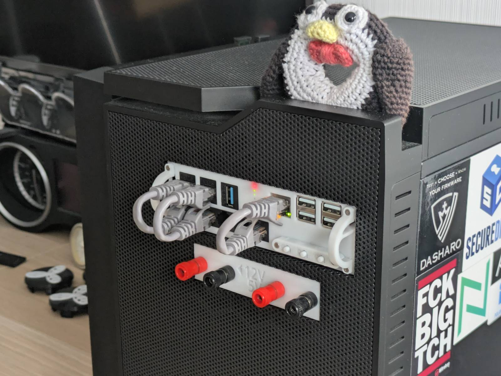

## The idea

---

Since I built [an RPI-based NAS for my parents](../raspberry-pi-5-based-nvme-nas), I’ve been wanting
to build something similar for myself: a passively cooled, ridiculously low-power server I could run
24/7, using it as cloud storage, as a entry point to my local network, and to run a few services.
The problem was that I rent a 40 square-meter apartment, the only available Ethernet port was
already taken by my
["throw everything at" PC](../never-configuring-samba-again-ansible/#meet-the-cube), and I didn’t
feel like turning my already crowded living room into even more of a junk storage.

> Hmm, but do I have to stack that junk?

### ...and then it hit me

Ever heard of [mini racks](https://youtu.be/776-6ph7zsQ)? It’s a fairly new niche in the homelab
space. I really liked the idea, as it finally seemed like something made for mere mortals. ...you
know, people without redundant time, space, or money. But to print something like this would have
felt wasteful. I already have a perfectly valid PC case that I like. All of that just to repackage
my PC and add an SBC?

> ...but what if I did it the other way around?

### Let's put a computer in a computer

What I realized is that my PC case has perfectly standardized openings that should fit a small SBC
without a problem. This way, I could avoid wasting extra space and keep all my computer junk in a
single unit. A few base measurements later, some refinements of the idea, and the project `arm_bae`
(yup, it’s the same joke [again](../pi-zero-storage-server-shenanigans-pt-1-custom-case-hardware/#the-drive-bae))
was born.

## arm_bae

---

Let’s briefly discuss what `arm_bae` is. `arm_bae` is essentially a 3D-printable housing with a face
and a rail system, designed to fit into a 5.25" PC optical drive bay. It accommodates an SBC,
a gigabit switch, a USB-to-UART converter, and has three slots for standard
[keystone modules](https://en.wikipedia.org/wiki/Keystone_module). The body is designed for
pre-selected [hardware](#hardware), but at the concept stage, my idea was a bit more ambitious.

### What I wanted it to be

Originally, I intended to turn it into some kind of standard, like racks have, but I quickly
realized it’s easier said than done. At first, things went pretty smoothly. I designed a fancy,
single-piece, no-support-needed rail with a built-in compensation mechanism. It took me about six
iterations to refine the design, but in the end, I was happy with the result and thought it was a
good start.

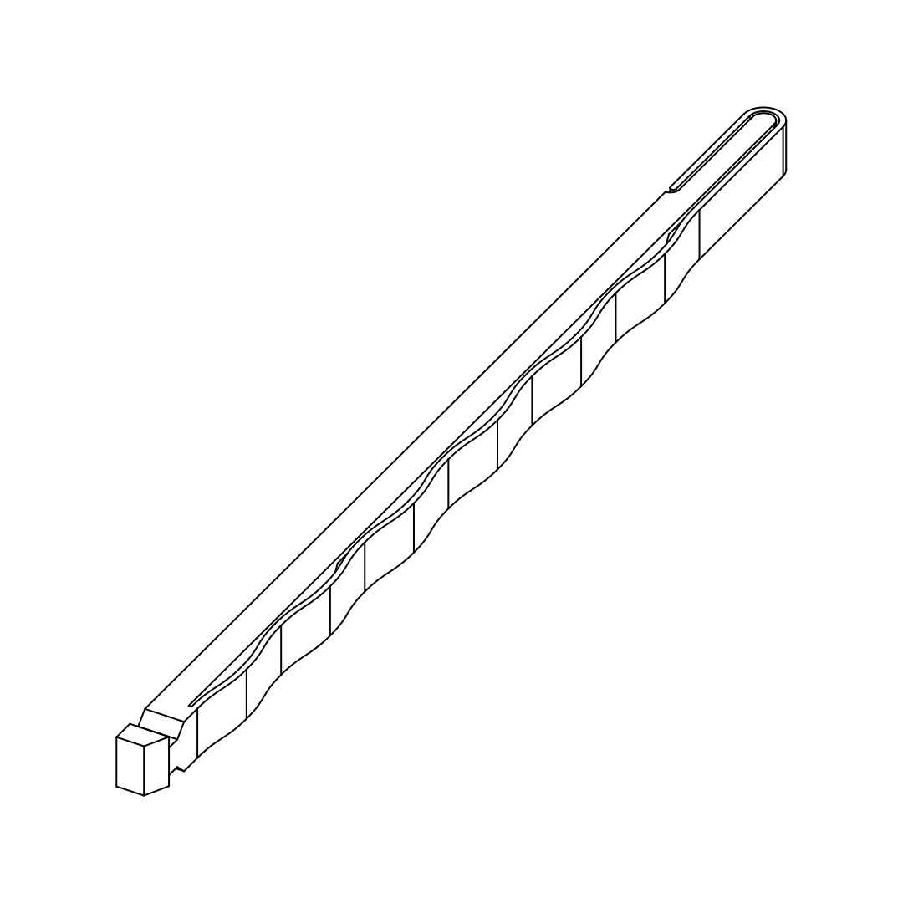

...but then I started designing the body, and OMG...

I realized I had put myself into a “Mission Impossible” scenario, trying to fit so much hardware
into such a small space while also attempting to make it standardized. Once I realized this was a
game of scraping tenths of a millimeter for everything to fit, I gave up on that idea and instead
focused on modeling it for my own hardware.

Yet, in my humble, subjective opinion, the rails I came up with
[are a beautiful design](https://youtu.be/EEj3jn1csxE) in their simplicity. If the idea of putting
ARM computers, or other devices, into 5.25" bays ever takes off, I’d be happy to work on turning the
rails and front plate into a specification or standard for more people to use. If you think you
could use something like this, or are just interested in seeing it developed, feel free to contact
me or leave a comment on the YouTube video once it’s released.

## Hardware

---

As mentioned earlier, I designed the entire solution around specific hardware, which I will briefly
discuss in this section.

### Orange Pi 4A — the heart

The core component of the whole project is, of course, a computer, or an SBC to be exact. This SBC
will become my "server," where I’ll deploy a bunch of services. You’ve read the section title
already, so you know I ended up choosing the [Orange Pi 4A](http://www.orangepi.org/html/hardWare/computerAndMicrocontrollers/details/Orange-Pi-4A.html) 4GB version.

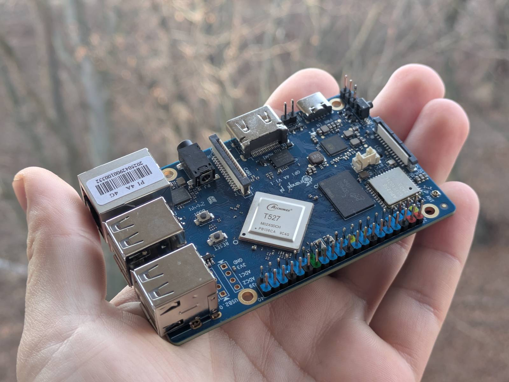

The deciding factors for choosing this one over other SBCs were...

#### Price

I managed to buy the beefiest 4GB version with a 64GB eMMC storage module for just 251.32 zł (~$69).

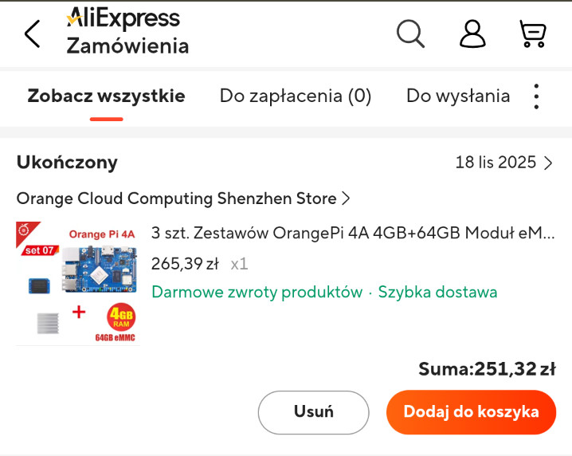

…well, that’s a small lie. I got it as a Christmas present from my GF, but I was responsible for
hunting down the deal and sending her the link.

Comparing this to probably the most popular SBC... The Raspberry Pi 5 4GB version,
[before the price increase](https://www.raspberrypi.com/news1gb-raspberry-pi-5-now-available-at-45-and-memory-driven-price-rises/),
would have cost around $60. The bundle I got, already comes with the memory included, plus I’m
saving money on features that the Raspberry Pi doesn’t have (built-in), but more on that later.

In the screenshot I attached, you can see that the ~$69 price was from 18.11.2025. Sadly, with
today’s ever-growing RAM and storage price crisis, just the SBC would now cost
[$78.26](https://aliexpress.com/item/1005008980024063.html), and the eMMC module adds an additional
[$25.79](https://aliexpress.com/item/1005010241741381.html). If I’m not mistaken, by the time I
opened my Christmas present (on Christmas Eve), the prices had already skyrocketed. Ouch…

#### Storage

Regarding the eMMC module mentioned in the previous section, another important requirement for me
was having a reliable storage medium for the base image.

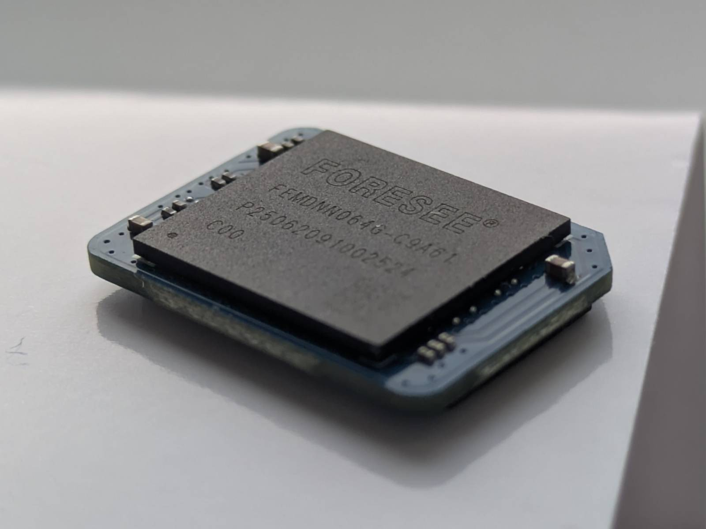

The Orange Pi 4A has a slot for eMMC storage modules. While it isn’t much faster than the good ol’
SD cards, it is far more reliable. Sure, you can buy "high endurance" SD cards and use software
tricks to limit I/O to the persistent storage (exactly what I did in the NAS for my parents), but if
I can get better reliability for the same price (at the time I bought the kit), why not go for it?

#### Even more storage

Yet another killer feature that the Raspberry Pi 5 doesn’t have, but the OPI 4A does, is a built-in
M.2 slot for full-length NVMe drives.

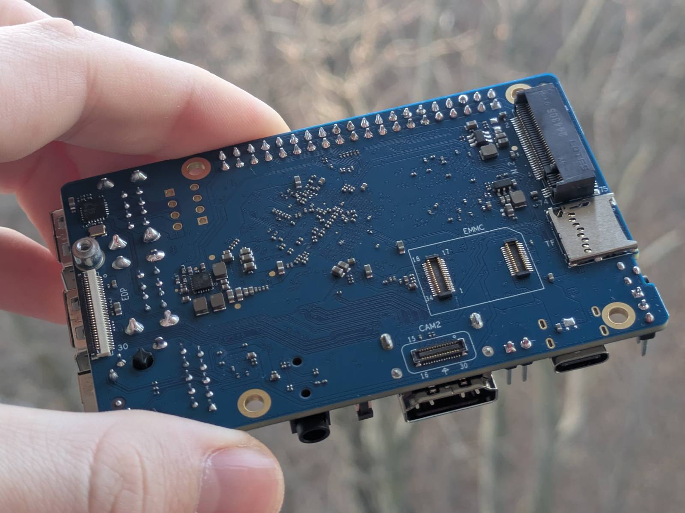

Yes, the RPI has many official and third-party HAT designs that add that feature, but it comes at
extra cost and makes the device bulkier. The advantage here is simple: the OPI 4A has the NVMe slot
already integrated and costs less. I specifically wanted a slot that fits standard-sized NVMe
drives, as these are more common and therefore often cheaper.

> Have I mentioned I’m an onion?

Why is the NVMe slot crucial? I plan on running just the OS (and maybe a few services) from the
eMMC, while the NVMe drive will be used as a "cloud drive". I’ll explain this concept more in a
future blog post about setting it up.

#### Performance

The Orange Pi 4A features the `Allwinner T527` octa-core SoC.

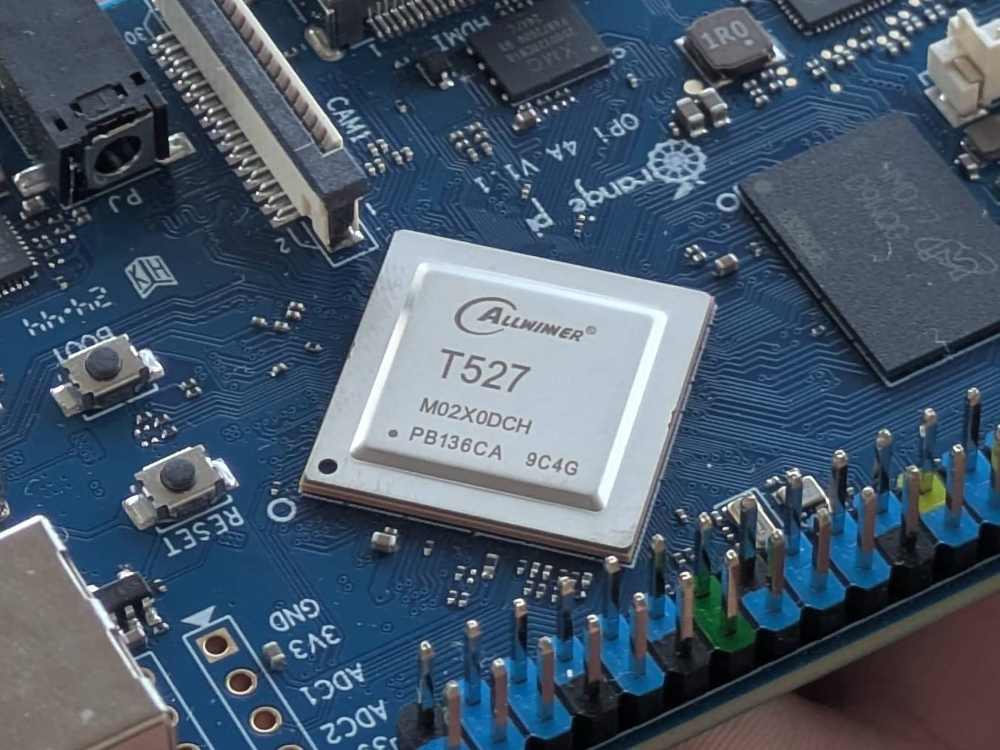

Here are links to two comparisons from Geekbench v6:

- [Orange Pi 4A compared to Raspberry Pi 4](https://browser.geekbench.com/v6/cpu/compare/9961209?baseline=265980)
- [Raspberry Pi 5 compared to Orange Pi 4A](https://browser.geekbench.com/v6/cpu/compare/9919608?baseline=9961209?baseline=265980)

In raw computing power, compared to the RPI 4, the OPI 4A has slightly lower single-core performance
but stands out in multi-core performance with 66% higher score. However, the RPI 5 outclasses the
OPI 4A by more than two times in the multi-core score.

> Hmm, looks as if that extra cost might have been for a reason XD

Jokes aside, I was aware of this when deciding which SBC to go with, and for what I plan to run on
it, I believe (and hope) it will be sufficient. I’m planning to run some containerized workloads,
and my working theory is that the double number of cores might prove handy for such "server"
workloads.

#### The ugly

…but it’s not all sunshine and roses. There are valid reasons not to go with the Orange Pi 4A, and
they can all be summarized as: because it _is_ an Orange Pi, precisely.

The Raspberry Pi has never had the greatest hardware, but it built its leader position in the SBC
market through support and community engagement. Even the first RPI, now more than 10 years old, is
still receiving software updates.

The Orange Pi doesn’t have that. The OPI 4A was
[released in November 2024](https://linux-sunxi.org/Xunlong_Orange_Pi_4A), the last official
released image is dated April 2025 (it is now January 2026) and I doubt it will receive any more
updates. Of course, the sources are publicly available, and you can build your own images if you
know a thing or two (in fact,
[I did exactly that](https://github.com/dancesWithMachines/orangepi-4a-build)), but it’s a classic
“buy yourself a problem” situation. If something breaks or doesn’t work, you’re on your own to patch
it. Same goes for obsolescence.

That said, I think I kind of understand what they’re going for. It seems that the goal of the Orange
Pi platform is to create these boards, provide reference OSes with core functionality, prepare some
demos, and push them to developers. Developers then have the sources to turn those dev boards into
actual products.

I have “embedded systems developer” in my job title (and I’m a masochist), so I’m fine with bringing
this curse upon myself (for now). However, if you’re new to SBCs and are thinking of building
something similar, this is probably the worst choice you could make. My advice is to stick with
Raspberry Pis in that case.

As a side note, the community-maintained
[Armbian port](https://forum.armbian.com/topic/49353-opi-4a-allwinner-t527/page/5/) already seems
to be in the works.

#### SoC quirks and features

Here are some fun facts about the board, or rather the Allwinner T527 SoC, that I wanted to share
while I’m at it. The Orange Pi 4A comes in a maximum 4GB RAM variant, and all USB ports are only
2.0. On the other hand, it has an NVMe slot and eMMC storage support. Seems like an odd design
choice, doesn’t it?

It turns out this is a limitation of the SoC. The
[wiki for the A523 series](https://linux-sunxi.org/A523) states the following:

> The USB 3.0 controller and the single lane PCIe 2.1 controller share the output pins, via a
> combo-PHY, so cannot be used at the same time.

As for the RAM, it features a 32-bit DRAM controller, which means it cannot address more than 4 GiB
of memory (ahh, the good ol’ `Win XP` 32-bit days).

The wiki also notes:

> It (Allwinner A523) is mainly targeted at tablet computers...

…which helps explain some of the design choices.

[The wiki](https://linux-sunxi.org/A523) is a great resource if you want to learn more.

### Other hardware

There are two additional electronic devices that complete the final product, and they are...

#### Gigabit switch

The gigabit switch I used is a [Tenda SG105](https://www.tendacn.com/product/SG105), just freed from
its case.

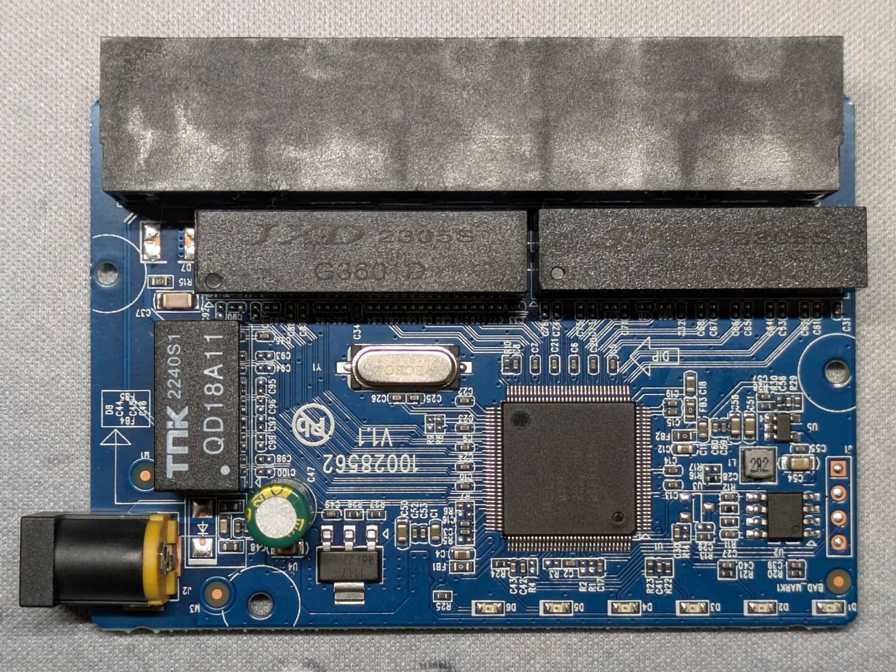

Why this particular switch? I had it lying around, as I’d bought it for another project. The
important points are that it’s a gigabit switch (so it shouldn’t bottleneck the network), it’s tiny,
runs on 5V, and it’s cheap.

#### UART to USB converter

The UART converter I used is a [CH340G](https://aliexpress.com/item/1005008789522930.html). Again,
it was chosen because I already had it lying around and it’s cheap. I don’t mind keeping it embedded
in a build, as I also have the
[FT232](https://allegro.pl/oferta/ft232-konwerter-usb-uart-rs232-ttl-arduino-6704592461), which is
much better for debugging.

I’ll discuss the UART converter later in the blog post.

## 3D model

---

Since the 3D-printed, custom-designed body is the backbone of the whole project, I guess we should
talk a bit about the model I created.

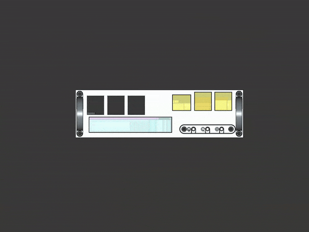

The project consists of seven individual models, not counting the OPI and switch PCB mockups and
mirrored parts. These are:

- the "fancy rails" - ...I’ve already shown you, nothing to add here,
- the body - the body and front plate are a single unit,
- switch support - it has been made a separate element due to the complex geometry, space
  constraints, and for easier printing,
- handles - used to pull the server in and out; they have an embedded locking mechanism that latches
  onto the rail,
- front panel - houses three buttons for the OPI: power, reset, and boot select,
- fiber support for the OPI - we’ll talk about these later,
- switch plate - a 0.2 mm thick plate that goes under the switch PCB to prevent shorts.

For 3D modeling, my "[weapon of choice](https://youtu.be/wCDIYvFmgW8?t=45)" is none other than
[**FreeCAD**](https://www.freecad.org/). It took me a total of nine revisions until I was happy with
the results. …though:

- the first six revisions were just for the rail (I designed the rail first, then the rest),
- in the next one, I made the opening for the keystone adapters too small,
- next one was functional but I hated how unoptimized it was, and my internal urge for a nice design
  made me redo it again (no regrets),
- and the final one is the one I was happy enough with.

So, a total of about three major revisions (not counting the rail experiments and minor refinements)
isn’t bad at all!

> Though to be fair, the switch support had a single additional major redesign.

This is easily my most complex design so far, and probably the "nicest" one too. Not to brag, but…

> Good job, me

### Download

**It's freeeeeeeeeeeeeee…**

  <iframe
    src="https://www.youtube.com/embed/cd4-UnU8lWY?&amp;start=34"
    title="YouTube video player"
    allow="accelerometer; autoplay; clipboard-write; encrypted-media; gyroscope; picture-in-picture; web-share"
    referrerpolicy="strict-origin-when-cross-origin"
    allowfullscreen
    style="width:100%; aspect-ratio:16/9; border:0;"
  ></iframe>

…no paywalls, no strings attached.

I upload all my models (that have any chance of broader adoption) to
[Thingiverse](https://www.thingiverse.com/dancesWithMachines/designs), where you can download both
all `.stl` models and the FreeCAD source file if you want to have a go at it.

Here’s a link to the model:  
[https://www.thingiverse.com/thing:7283750](https://www.thingiverse.com/thing:7283750)

You’ll also probably want this, but don’t click it yet if you don’t want to spoil yourself on how
this contraption is connected:  
[https://www.thingiverse.com/thing:7268388](https://www.thingiverse.com/thing:7268388)

## Let's talk design...

---

Okay, this chapter is the one where I’ll be tickling my own ego. Here, I’ll discuss my favorite
design aspects of my contraption.

…but first, let me show you the assembled product in all its glory (on the bench for now).

…and for a better view of the components…

Look at it... Isn’t it a beaut? Where do I start…

### Battle against tenths of millimeters

When I design stuff for 3D printing, I commonly use the following constants:

- Wall thickness: `1.6mm` (sometimes `0.8mm` for Z axis only)
- X/Y axis margin: `0.4mm`
- Z axis margin: `0.2mm`

Why these values? The most common nozzle in 3D printers is `0.4mm`, which is also the thickness of a
single wall, and `0.2mm` is a common (vertical) layer thickness for "standard" quality. The second
value isn’t a strict requirement, but it scales nicely and is easy to add. The `0.2mm` vertically
and `0.4mm` horizontally basically define my resolution, or in other words, the smallest unit I can
print.

I’ve probably said it many times already, but I can’t stress enough how much of a fight this was
against size restrictions. You might think:

> Oh, I’m sure there were at least a couple millimeters to spare.

**No, there weren’t.** Just take a look at the example below.

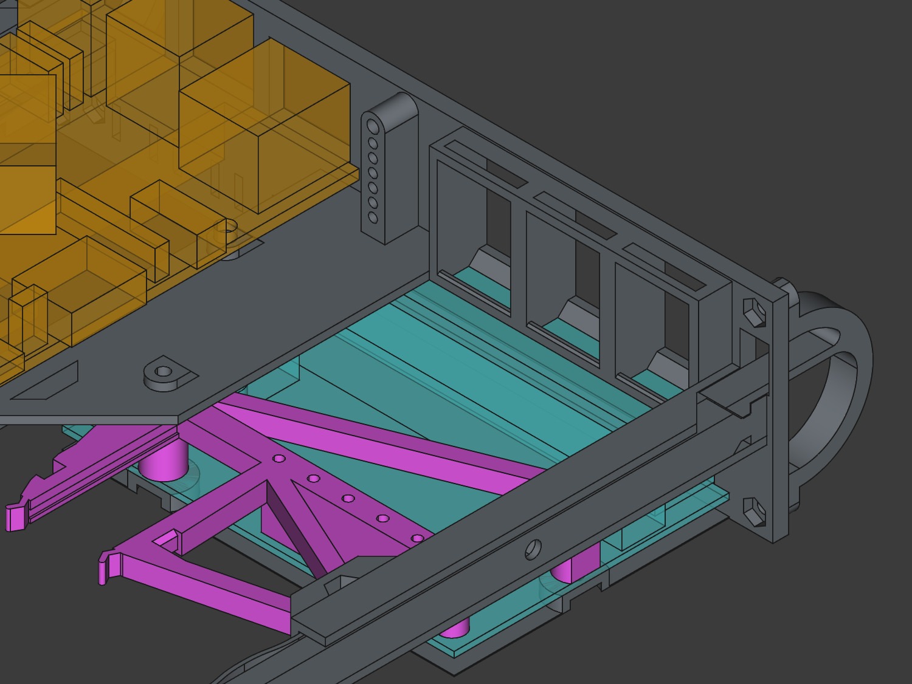

What you’re looking at is a section that holds the keystone modules and the switch, one above the other. In this space, I had to account for all of the following:

- First, `~1.2mm` is used solely for the margins of the face, switch hole, and keystone openings
  (`0.4mm` per "thing").
- Then comes the face, which I also refer to as the bezel or front plate. This part is slightly
  larger than the space available for the main body, as defined in the specification (lost the link,
  sorry). That little vertical wasted space you see is a result of this.
- Next, from the bottom up, is the Ethernet switch unshielded PCB. I had to leave space for the
  shroud under the PCB to avoid short circuits (though it’s only `0.2mm` thick). …and the PCB isn’t
  flat underneath either. The barrel plug port has some loooong legs, at least at this scale...
- The remaining space is almost exactly the fingerprint of the
  [keystone module](https://www.truecable.com/cdn/shop/files/KYINSTBLK_SideDimensions.png?v=1722980572)
  (`+/- 0.3mm`, if I remember correctly). See these holes on top and bottom? It's not that I wanted
  them here, they’re there because there’s simply no room for proper walls. This design only works
  because the body is printed lying on the face (bezel). That orientation makes it about three times
  stronger than if it were printed vertically.

So, summing this section up: if any of the components in that vertical space had been even a
millimeter thicker, they would not fit. The stars have aligned for me once.

### Printing springs

In the picture from the previous section, you could see how the locking mechanism works. This is yet
another element I find neat. ...I mean, using plastic properties to my advantage.

The plastic is pretty bend-resistant and springs back into place. I’ve used this property to create
simple yet effective locks, so the whole body is secured in the PC case and won’t slide out during
transportation (yeah, designing features, as if I ever need them).

[I've already told ya bout the rails](#what-i-wanted-it-to-be), it’s a single-piece unibody design,
symmetrical and all that fancy stuff. …but the thing I’m most proud of on this element is the
compensation mechanism.

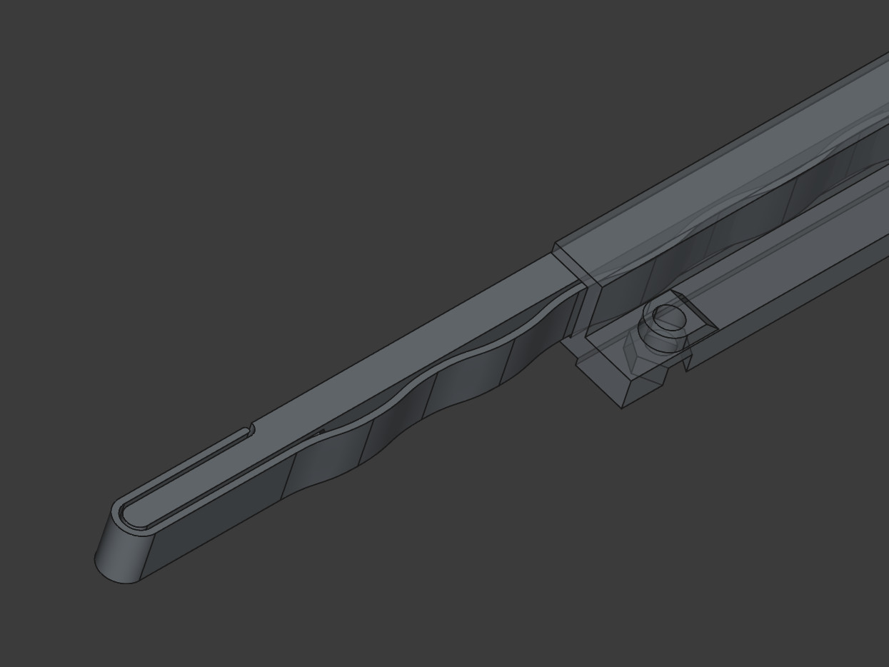

It’s this [slim](https://youtu.be/eJO5HU_7_1w?t=147), wavy element that runs alongside the main body
and wraps at the end. Essentially, it’s yet another spring, but this time designed to compress. As
the spring compresses, its length slightly extends, which is why it's designed to never rejoin the
main body. The wrap at the end is purely for aesthetic and comfort reasons, simply so it doesn’t
flap around.

You might ask, why is this compensation mechanism needed? Well, specifications are one thing and
implementation is another. I noticed that if I designed everything strictly according to the
specification, the body would flop side to side on the rails. Why? Because Chieftec (the producer of
my PC case) either left additional margin or simply didn’t meet the standard. Instead of adjusting
the dimensions for my specific case, I came up with this compensation mechanism to ensure I stay
within the specification, allowing this design to be reused in other cases.

See? I told ya I was serious about all that standardization.

### Fibers

Yet another design choice I’m proud of is the use of fibers to transfer the lights from both the
Orange Pi and the switch to the front of the case.

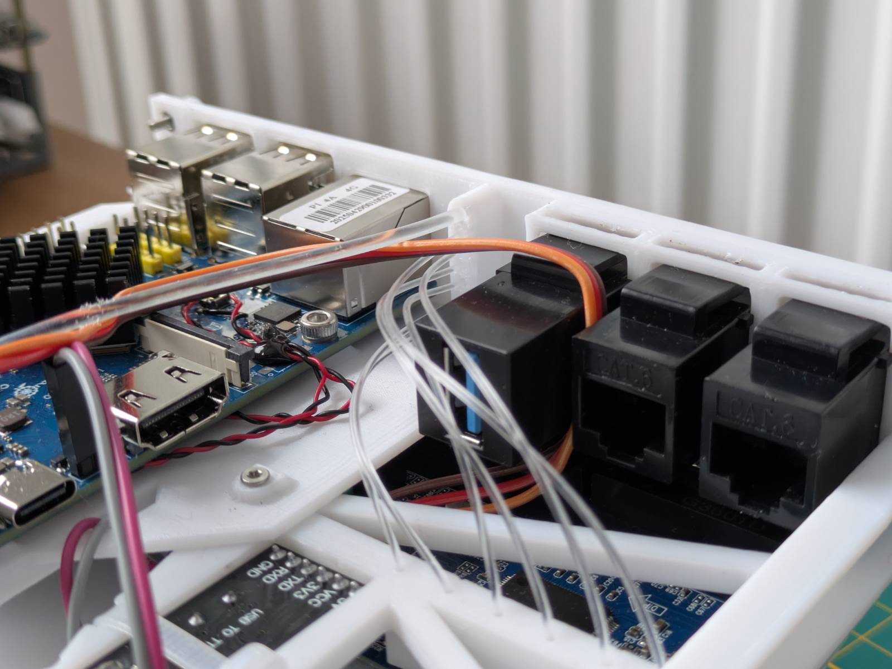

For the OPI, I designed a dedicated bracket that secures the fiber in place. All three lights on the
SBC are transferred to the front via a single 2mm diameter fiber wire. I had to put it in boiling
water to achieve such an aggressive bend, but it works, and all three LEDs are distinguishable.

As for the switch LEDs, I embedded the fiber channels directly into the support.

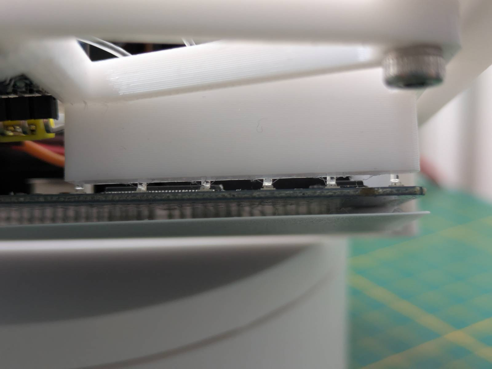

I have to say, this works extremely well. The only thing I should probably do is secure them with
hot glue on the face side at least. As you can see, when they’re not touching the walls directly,
one LED can appear dimmer than another. The problem doesn’t seem to occur on the support side,
though.

The choice to stack them vertically was intentional. I was aiming for that
[modular synth](https://www.lookmumnocomputer.com/kosmo-20) / VU-meter vibe, and in my humble
opinion, it looks pretty nice.

Also, notice that I didn’t make the holes on the front-plate passthrough. I intentionally left a
`0.2mm` wall so the fibers can rest on it, using the plastic’s property of passing light to my
advantage.

If anyone is interested in the fibers I listed the exact specification and thicknesses in the
"[Parts list](#parts-list)" section.

### Other smaller bits and bops

There are also other smaller design choices I’d like to mention, though they don’t deserve a
dedicated section.

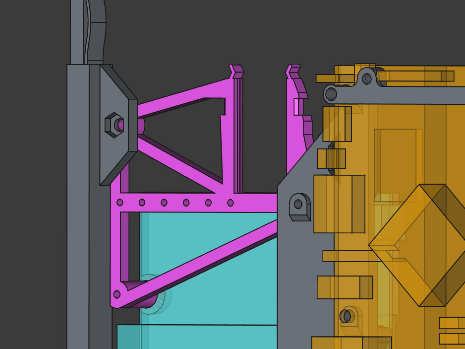

These include:

- **Support optimization:** In the design, I really took printing orientation into account to avoid
  printing unnecessary supports. Many protruding parts start at a 45 degree angle. Exceptions are
  the previously mentioned keystone holders and two "nut cutouts" for the nuts that secure the OPI.
- **Switch support:** The switch support was too complex to follow the 45-degree rule, so I made it
  a separate part. Besides keeping the switch and fibers in place, it also serves as a brace.
- **UART adapter:** It fits in the space where there aren’t any protruding components on the switch
  PCB. I couldn’t orient it facing up, as it would interfere with cables going out to the keystone
  extensions. I also incorporated a dedicated spot for a zip tie, which squeezes the walls and
  ensures the UART adapter stays firmly in place. Sometimes the simplest solutions are the best.
- **Nut cutouts:** Wherever there is space, I’m using cutouts for nuts instead of heated inserts.
  Why? Because heated inserts are expensive, and bolt cutouts work just as well.

### Things that are meh

There are also two things I’m not a fan of, but at the same time, they don’t bother me much and I
can live with them.

#### No space for the antenna

The antenna that comes with the Orange Pi is simply too short to reach the front panel in my design.
I considered incorporating some kind of internal holder, but there isn’t really much gain in doing
so, as it would be basically enclosed in a metal box anyway.

After finishing the design, I did a little research and found that the solution to my problem was
really simple and cheap. I could have used this type of antenna:

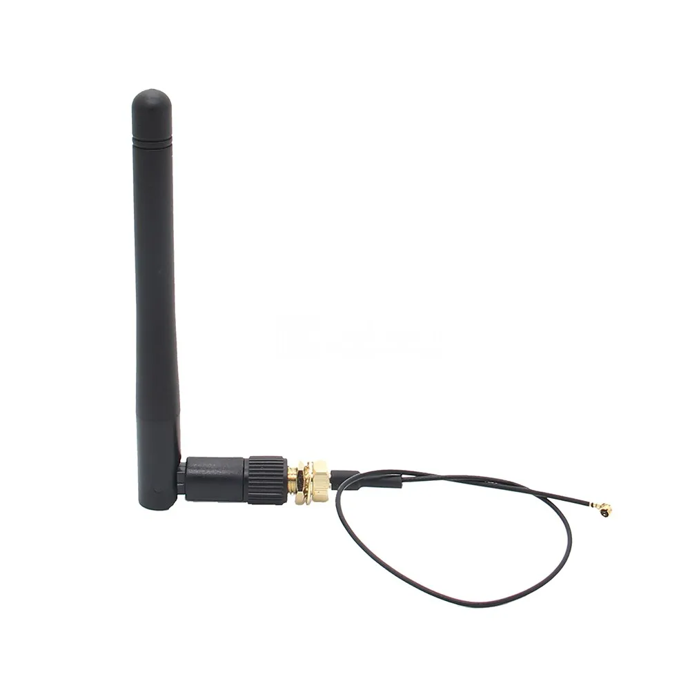

_Source: [Geekworm (Aliexpress)](https://aliexpress.com/item/1005005390950901.html)_

I probably could have squeezed that antenna mount if I made the front panel lights asymmetrical by
moving them closer to the keystone area. That said, I incorporated a whole-a\*\* switch into the
design, so I don’t think I’ll be forced to use Wi-Fi, and it doesn’t bother me much.

The reason I’m not adding it afterwards is due to how 3D modeling works. The model is made of
layers, which represent individual changes. The fiber holder is in the middle of all the layers. To
do it properly, I would have to remove all the top layers, add the antenna mount, and then redo
them. I could obviously do a hack-job, removing the existing holder as a new top layer and adding
the new one plus the mount for the antenna, but I despise this kind of butchery.

#### Buttons

My design features a button panel for controlling the Orange Pi. This panel secures and extends
regular `6mm` contact switches that are wired in parallel to the ones on the SBC PCB.

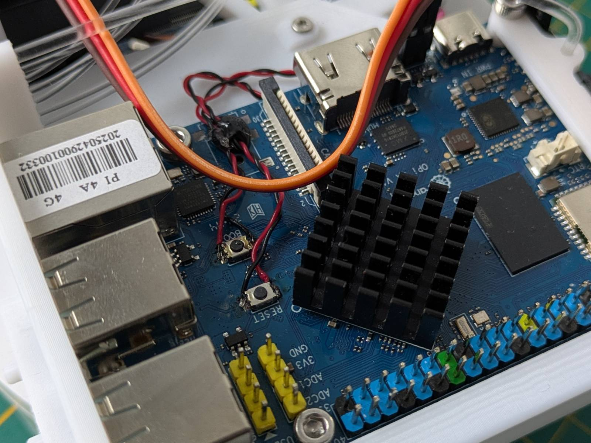

There are two reasons I find it “meh.” First, the wires are soldered directly to the Orange Pi, so
the OPI cannot be easily removed from the body without desoldering the switch wires. Moreover, the
OPI does not have any probe points for the onboard switches I could solder to, so I had to wire in
parallel to the existing switches on the PCB. Initially, I considered designing mechanical linkages
to the PCB buttons, but then the incident happened… I accidentally lifted the PCB by the mini-jack
audio port, effectively ripping it off along with the solder pads. Once the computer had been
desecrated and felt dirty, I just said screw it and decided on the switches-and-wires combo.

The other “meh” aspect is that the switches are secured between two 3D-printed elements instead of
using a dedicated PCB with a connector. I’m aware that doing this would be overkill, yet my internal
perfectionist says that would be the “tip-top” way of handling it. Thankfully, the other voice in my
head, the “good enough guy”, won the argument.

## How it all goes together

---

By now, you probably have an idea of what I’m trying to make here, but I assure you, I still have
some tricks up my sleeve. So far, I’ve discussed how I have a computer, a gigabit switch, and a UART
adapter mounted in a custom body that gets installed inside the 5.25" drive bay. Still, some
questions remain, like:

- How is this contraption powered?
- What are the keystone ports for?
- How will I interact with this thing? (Though for more technical readers, that one is obvious.)
- Etc.

In this section, I’ll cover it all.

### More 3D printing

The `arm_bae` body I designed is not the only 3D-printed element used in this build. I also needed a
neat way of, let’s say, transferring signals through the case. Could I have removed a PCI bracket
and routed the cables through an empty space? Maybe, but I’d hate that. Instead, I came up with this:

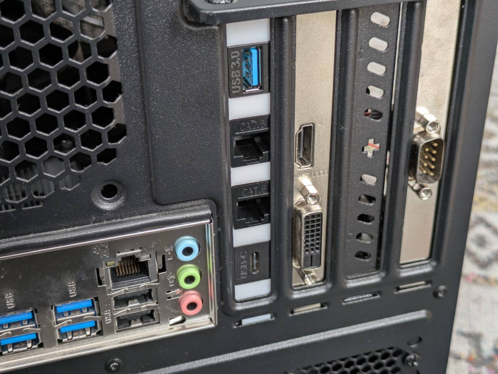

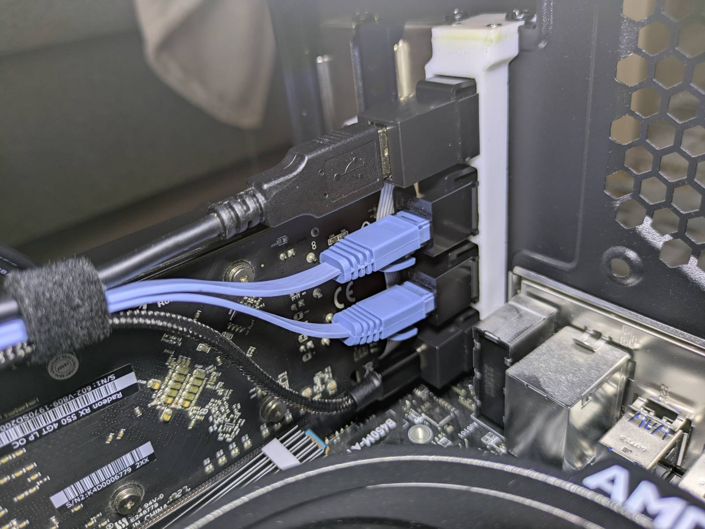

Yup, it’s yet another keystone adapter, this time in the form of a PCI bracket. Ain’t it clean?

It houses 4 keystone adapters:

- **Two Ethernet adapters:** These connect to the same two adapters on the `arm_bae` front plate.
  The main cable coming from the wall is connected to the Ethernet port in the PCI bracket that goes
  to the switch in front, then the second one comes from the switch to the back again. The second
  one is connected to the main PC Ethernet port, so both the PC and OPI are connected via the same
  switch.
- **The USB adapter:** This one is connected to the USB 2.0 header on the OPI PCB. This header is
  not soldered in by default. In the picture in the but last section, you can see the yellow headers
  I added. This port is needed as I intend to drive the printer with the OPI and share it across the
  local network.
- **The USB-C adapter:** Feeds power to the OPI 4A. Yes, this means one power cord goes to the main
  PC and the second to the OPI. It’s sub-optimal, but this way I can power on the OPI independently,
  even if the main host is shut down.

I’ll elaborate on wiring in the upcoming sections, but first, a quick note about the bracket itself.

#### 3D-printed PCI-keystone adapter

Describing the lore behind the keystone-to-PCI bracket adapter is redundant here, so I’ll keep it
short. It’s a remix and refined version of a 3D model I found on Thingiverse. I had to do a pretty
major redesign so all 4 ports would fit with modern motherboards. If you look at the model, you’ll
see I used the same "open-wall" design as in the `arm_bae` front plate, again, due to space
constraints.

This model is also available to download for free from Thingiverse:  
<https://www.thingiverse.com/thing:7268388>

> It’s this thing I asked you not to click to avoid spoilers. Now you know.

### Connections

Rather than attempting to explain every connection, I’ve prepared the following diagram to give you
a clue about how everything is connected.

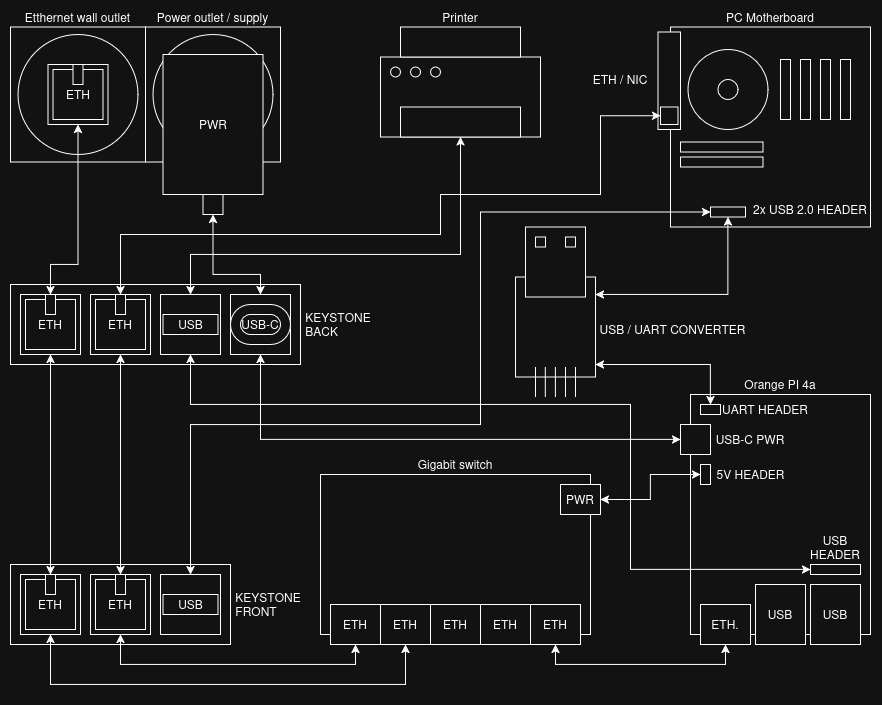

Additionally, a few comments:

- **OPI 4A 5V header:** I’m using it to power the gigabit switch. I verified this header is
  connected directly to the 5V pins on the GPIO header. I soldered wires to the barrel port legs on
  the switch PCB, and crimped `2.54mm` female connectors on the other end so they fit the header.
- **Keystone USB ports:** These are not connected with each other. Instead, the USB port on the rear
  is connected to the USB 2.0 header on the Orange Pi, and the front USB is connected to the PC
  motherboard. This is because one of the OPI’s USB ports supports OTG and ADB. If I ever need this
  functionality, I can simply connect the OPI to the PC via a USB-to-USB cable.
- **UART adapter:** For less technical folks, UART adapter is used to communicate with the Orange Pi
  from the main host (PC). It allows direct console access to the target. It’s mostly needed for
  initial setup but also comes in handy for debugging boot issues. I’ve prepared a little demo
  below:

  

The rest, I believe, is self-explanatory…

#### Cables, wires, etc.

While the obvious stuff like: Ethernet cables, an angled USB-C cable, or a PC USB-to-USB header
cable, etc. ...I could simply buy, some of the cables I prepared myself.

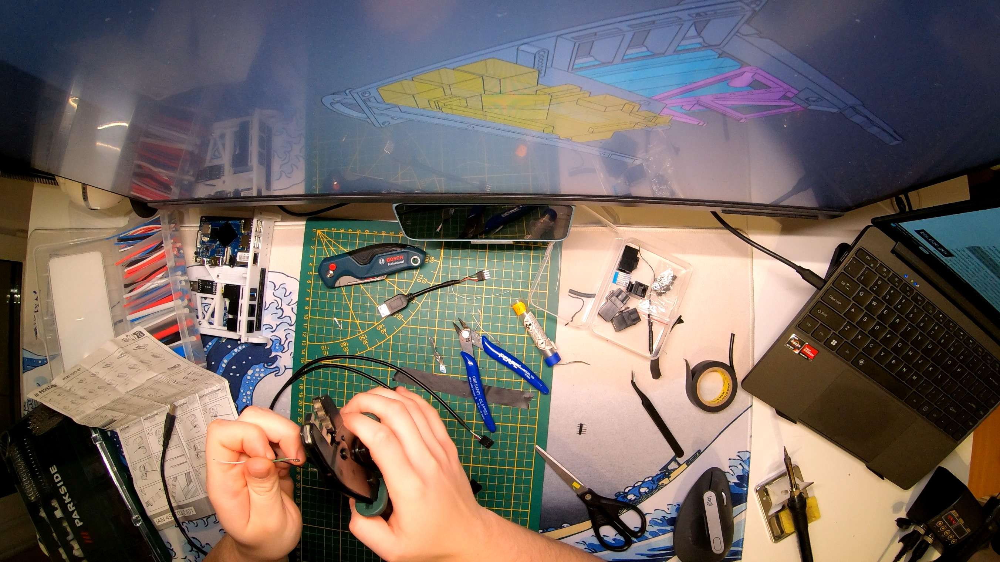

The main three cables I had to make:

- **Female USB-A to `4x2.54mm` male:** UART converter to PC USB header extension cable.
- **`4x2.54mm` male to USB-A male:** Connects the OPI to the USB keystone port on the PCI adapter at
  the back.
- **USB-A male to `4x2.54mm` male:** Connects the keystone USB port on the `arm_bae` front panel to
  the PC USB header extension cable.

I’m not claiming that these cables are impossible to buy, it’s just that I had a bunch of scrap
wires and the required tools to make them myself. I wanted to include this to give anyone trying to
reproduce this a clue about how it is physically wired.

## Parts list

---

I suppose some people will be interested in reproducing this project, or simply curious about
certain components. This section lists all the hardware needed to assemble the project. If you’re
only interested in the story, feel free to skip this one.

_Note: This list does not include obvious items like filament for printing the case or generic
wires (e.g., for connecting front panel buttons)._

_Note 2: Items marked as "(exact listing)" indicate the specific listing I bought them from. You
don’t need to buy from these listings, and none of the links are affiliate links._

Parts list:

- [Orange PI 4a (exact listing)](https://aliexpress.com/item/1005009718078715.html)
- [Orange PI power supply (exact listing)](https://aliexpress.com/item/1005008999261190.html)
- [Angled USB-C Cable (exact listing)](https://aliexpress.com/item/1005008765247136.html)
- [USB 2.0 extension cable (female to female) (exact listing)](https://aliexpress.com/item/1005006719692411.html)
- [OPI heatsink (20x20x10mm) (exact listing)](https://aliexpress.com/item/1005004246625859.html)
- 3x [Ethernet cables for the front (10cm length) (exact listing)](https://aliexpress.com/item/4000285093826.html)
- 1x [Flat ethernet cable (15cm) (exact listing)](https://www.aliexpress.com/item/32842014328.html)
- 2x [Flat ethernet cable (50cm) (exact listing)](https://www.aliexpress.com/item/32842014328.html)
- 2x [Keystone USB-A adapter (exact listing)](https://www.aliexpress.com/item/1005009430447241.html)
- 4x [Keystone Ethernet adapter (exact listing)](https://www.aliexpress.com/item/1005009430447241.html)
- 1x [Keystone USB-c adapter (exact listing)](https://www.aliexpress.com/item/1005009430447241.html)
- [1mm fiber wire (exact listing, polish)](https://allegro.pl/oferta/swiatlowod-1mm-na-metry-wys24h-4156-9657034918)
- [2mm fiber wire (exact listing, polish)](https://allegro.pl/oferta/swiatlowod-2mm-na-metry-wys24h-4335-9702861771)
- [M2 bolts and nuts kit (exact listing, polish)](https://www.amazon.pl/dp/B0DD7G2W25)
- [M3 bolts and nuts kit (exact listing, polish)](https://www.amazon.pl/dp/B093GNHWKR)
- [CH340 UART converter (exact listing, polish)](https://allegro.pl/oferta/konwerter-usb-uart-na-ch340-3-3v-i-5v-ttl-rs232-17224068493)
- [Tenda SG105 gigabit switch](https://www.tendacn.com/product/SG105)
- 3x `3mm` tact switch
- Male USB-A cable to `4x2.54mm` female cable (made myself).
- Male USB-A cable to `4x2.54mm` male cable (made myself).
- Female USB-A to `4x2.54mm` male cable (made myself).

## That's all for now

---

...and [that's all](https://www.youtube.com/watch?v=Vzyn60Zns-E&t=1s), it seems. This, I believe,
is all you need to know about the hardware side of the `arm_bae` project. I’ve covered why I did it,
walked through the design, reviewed the hardware used, and explained how to connect it all.

It’s been more than a month from when I received the OPI on Christmas Eve to where we are today. By
January 5th, the project itself was mostly finished, but you know how it goes... Creating content in
the midst of life takes time too. But I’m diverging…

You can expect a short YouTube video coming on the `arm_bae` within a few weeks probably. I’ll
update this post once it’s released too. Once that video gets made and uploaded, I will start doing
the software-side setup of my new ARM server. So, realistically, in a month or two there will be a
second blog post (and video) on the software setup, the services I’m running on it, and obviously
what went wrong.

Till then, thank you for reading, and one last pic of my creation for a good end.

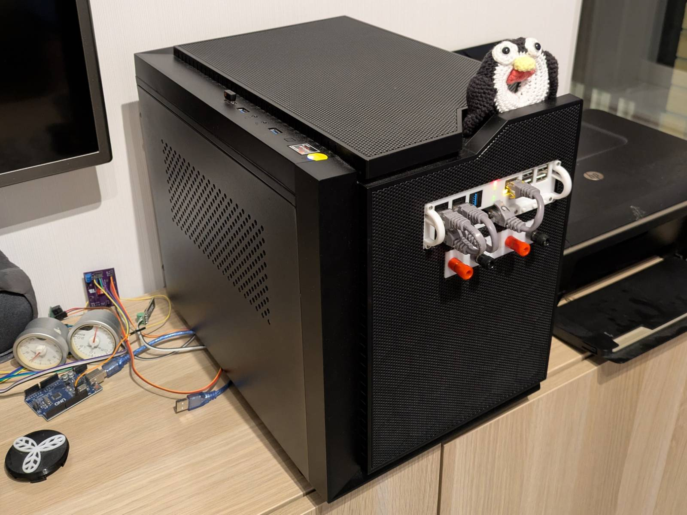
