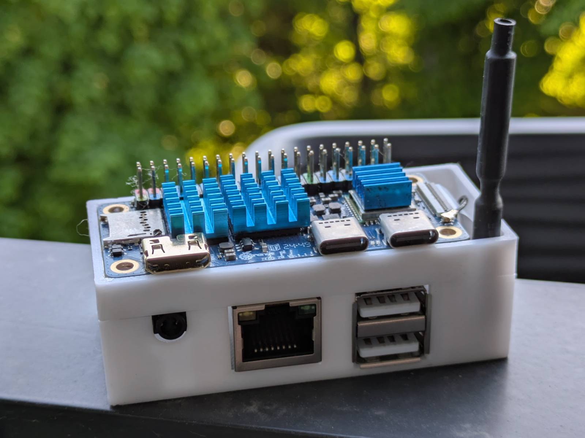
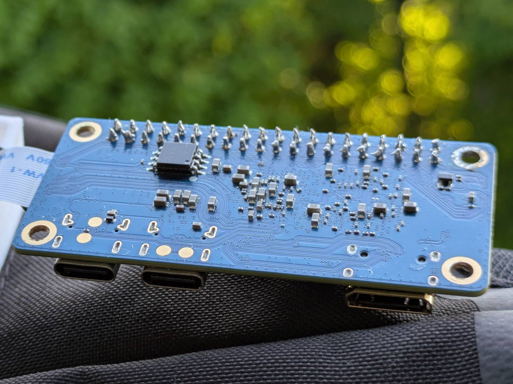
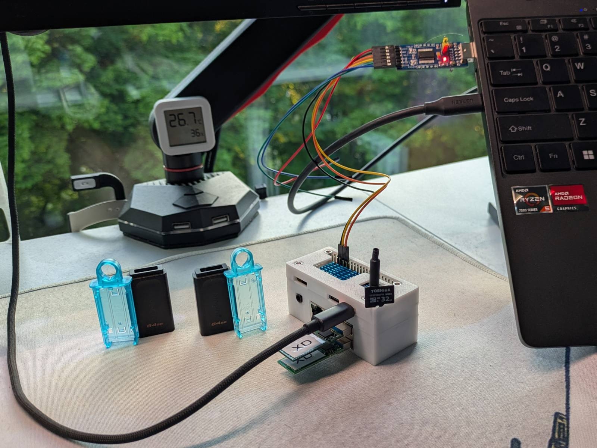
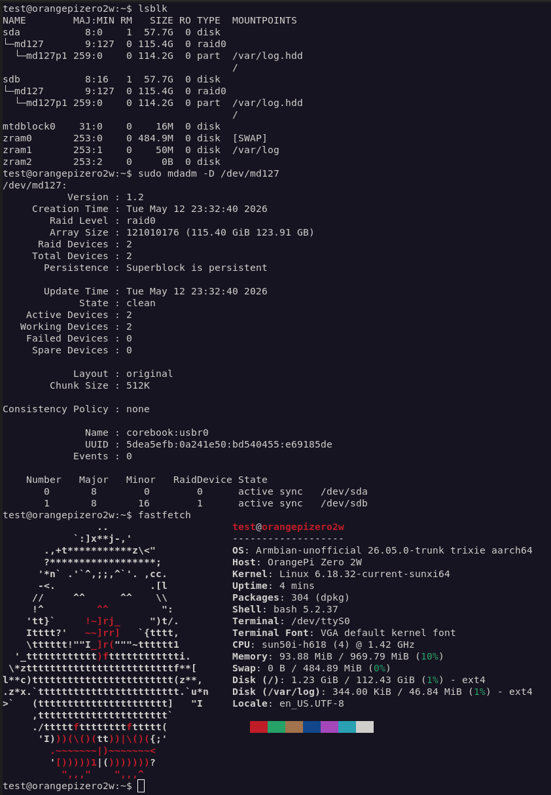

Hello there... It's already been 3 (busy) months since I've last posted anything here. A lot has
happened since then, including me changing a job. ...and without going into details, I'm doing
RAIDs again. That said, I've enjoyed being an "Embedded systems developer", and embedded Linux,
firmware or playing with hardware is still a thing I'm keen on doing. I figured, why not use the
skills I've learned at my previous job and remind myself how the whole "MD" on Linux works by doing
myself a little challenge, and the challenge is: Booting OS on RAID 0 on ARM with no EFI and no
dirty tricks (I'll explain what I mean later). As far as I know (I spent a whole 10 minutes Googling),
this hasn't really been done in this configuration, so this will be a nice proof of concept in my
regular "cursed" spin. You know...


...but don't worry, this is a reminder-task for me too, so I'll try to keep it simple so anybody can
follow along.

## Trivia: Booting RAID 0 md arrays

I did choose RAID 0 as a target RAID level for two reasons:

1. It requires only a minimum of 2 drives to function, which is a requirement since my target
   platform has only two USB-A ports. (yup, we're doin it...)
2. It involves striping, which is crucial for the point I'm trying to make.

[Striping](https://en.wikipedia.org/wiki/Data_striping) (in my caveman explanation) is fragmenting
data into chunks and spanning and balancing those chunks across multiple storage media. This
effectively allows turning multiple physical drives into a single logical storage medium. This can
have benefits like the logical drive having a greater size, increased r/w speeds... However, the
aspect I care about is, without assembling the array, the "data" is just garbage. You can compare
this to a Lego set. If you took every second piece from the set and threw it away, you wouldn't
complete half of the build, you likely wouldn't even be able to get started.

I need striping because that is the real challenge here. It is so that the data is only accessible
when the array is assembled, and so I cannot resort to...

### Cheating

Booting a RAID 1 array is no cheating, it's not even an attempt. Since in RAID 1 data is simply
cloned between the drives, it can be read without even assembling an array. The motherboard firmware
and the bootloader will simply ignore the superblock (a place on the drive where RAID array
metadata is stored) and will start executing the kernel from a single drive. Then if the kernel
has the `MD driver` (responsible for handling RAID arrays on Linux) and `mdadm` (the RAID utility)
is present in `initramfs`, it will assemble the array before doing
[switchroot](https://man7.org/linux/man-pages/man8/switch_root.8.html) (mounting the target
filesystem).

The main reason I discussed RAID 1 is to showcase that neither motherboard firmware (BIOS, EFI),
nor the bootloader has to "understand" the RAID metadata for Linux to support booting from a RAID 1
array. The situation differs in RAID levels that use striping. If these components don't understand
RAID metadata and therefore cannot assemble the RAID array, from their perspective there is nothing
to boot from, since the drives are filled with garbage.

...but, there are subtle methods to work around that, and they are what I would consider cheating
in this PoC. They all rely on putting the `/boot` partition outside the RAID array, so that Linux
can boot and assemble the raid array, similarly to how it works for RAID 1. The two most common
approaches are:

- putting the `/boot` partition on a separate drive. (ugh, [discustin](https://youtu.be/nyhKZSXt2FM?t=16))
- or doing slightly more cursed, but with extra points for style, RAID on partitions:

  ```log
  λ lsblk -o name,size,label,type
  NAME          SIZE LABEL            TYPE
  sdb          28.7G                  disk
  ├─sdb1        512M BOOT             part
  └─sdb2       28.2G corebook:example part
    └─md127    28.1G                  raid1
  ```

Either way, I still consider these workarounds, and it is not something I wanna do. Instead I want
to put everything behind RAID 0 array and striping, so all system components are in one place and I
cannot access any system component without assembling the array first.

...and that is a real challenge: I need some boot-process element that will assemble the array so
Linux can start executing, but before I tell you how I'm gonna do it, let me introduce you to the
test platform.

## Platform: Orange Pi Zero 2w

This is the Orange Pi Zero 2w, a "Raspberry Pi Zero form factor" SBC, featuring an Allwinner H618
quad-core ARM SoC and a whole 1 Gigabyte of LPDDR4 RAM.



The SBC is connected to the official expansion board that adds additional ports including two USB
2.0 ports we will make use of later.

Why this platform in particular? Simply because I got it for a steal back in 2025 and
it has crucial features I need to pull this experiment off. These are:

1. [**Armbian community support**](https://armbian.com/boards/orangepizero2w). Armbian is the target
   operating system I want to run on the board. It supports a variety of boards, though for me, the
   killer feature is its very user-friendly and reproducible build system. This is crucial, as I will
   need to bake additional components into the system, but we will discuss this later. ...also, I
   despise these Frankenstein systems the Orange Pi supplies.
1. **Support in the mainline kernel**. This opens up possibilities, as if the SBC has upstream support,
   it is very likely it is also supported by the various "embedded Linux frameworks" (foreshadowing),
   but this too will be discussed later.
1. ...and finally, a hint for what I'll be doing... **It includes an onboard 16 Megabyte SPI flash
   memory**.



## The approach plan

No, I ain't putting `/boot` partition to SPI flash, that's:

- too easy,
- cheating,
- and above all, a fully featured kernel and initramfs would not fit within 15 megs (1 megabyte for
  the bootloader) of free space.

I am much more sophisticated than that (haha, sure).

### The prototype

I feel like the line between what is considered "firmware" and "operating system" is very thin. For
example, in the context of [BMCs](https://www.supermicro.com/en/glossary/baseboard-management-controller),
we refer to the stack it runs as firmware, but in reality it is just yet another embedded Linux
distribution. For example, OpenBMC is based on the Yocto embedded Linux build system.

A less known one, but closer to what I am attempting to do here, is the
"[heads firmware](https://osresearch.net/)", a firmware based on Coreboot and Linux that ditches the
classic EFI. It basically attempts to load Linux as fast as possible, perform necessary operations
under this minimal Linux, and then execute the target system. This approach is the answer to my
problem, as I have no control over the real firmware on the OPI platform.

### Where am I

What I'm going to say next is a **GREAT** simplification of how the boot process works, so please
firmware fellas, don't eat me.

On this platform, what is considered firmware is the `Boot ROM` (`BROM`) that lives in the Allwinner
SoC itself. As the name suggests, it is read-only and uncontrollable. It will initialize the SoC and
then attempt executing the bootloader in stages if it finds one. The bootloader in this case is the
mighty "[Das U-Boot](https://u-boot.org/)", which is the first thing I have control over in the
boot process. The issue is, at this point I am past the firmware stage, and instead I am in the
bootloader stage.

U-Boot normally lives in the same storage medium the rest of the system does (often SD card), so
on RAID 0 it too is split into chunks and divided between the disks, so it is not readable by
the firmware, and the firmware I cannot change.

...the answer to this problem is ripping off the mechanism the heads firmware uses.

### This is how we do it

Enough of these mysteries, this is what we do...

While I technically could put only U-Boot to SPI flash and add support for assembling RAID arrays
to it, it would take me months and I don't even know if I'm capable of that. So, why not use the
stack that is here, just waiting to be used?

All I need to do is:

- build a custom, very small (less than 15 megs) Linux distribution (just
  kernel, `DTB`, and `initramfs`)
- ensure mdadm and MD driver are baked in respectively,
- flash it properly to the onboard SPI flash memory,
- create some automation so mdadm assembles the array when drives appear
- read the contents (target kernel and initramfs) from the RAID array
- start executing target kernel with [kexec](https://man7.org/linux/man-pages/man8/kexec.8.html)
- the target kernel and initramfs will then take care of handling the RAID array, I just need to
  ensure the target Armbian has `mdadm` and MD driver baked in by default.

Easy peasy right?

The best thing is that **it works**! Though with caveats, which I'll cover eventually.

In the next sections I'll try to briefly cover what I did to make it work, but I will skip the failed
attempts, hours of debugging and reasons I had to recompile the Linux kernel a few times a day for
the last two weeks.

> Recompiling Linux kernel at 1AM is cannon, 10/10 Linux experience. I recommend anyone to try.

We'll go straight for "the meat".

## Custom Linux distribution 101

As far as I would like to say...

> Yeah, I've created my own Linux distribution. What did you do?

...the reality is, if you can compile Linux kernel, you can do the same. Tools like
[`buildroot`](https://buildroot.org/) (which I am using), make it stupid easy.

> ...also, calling the result a Linux distribution isn't fair. "Embedded Linux distribution" is more
> like it.

### What's in my Linux distro?

I named my contraption the `mdboot` since booting from MD devices is the only thing it does. It
includes only 3 tools:

- [busybox](https://busybox.net/) - provides core Linux utilities (find, blkid, etc.) compiled into
  a single binary.
- [mdadm](https://github.com/md-raid-utilities/mdadm) - a utility that assembles MD RAID arrays
- [kexec](https://man7.org/linux/man-pages/man8/kexec.8.html) - a tool that will shut down the
  currently running Linux kernel, and start executing the next one.

Everything else that wasn't required for my target was completely stripped. I skipped building the
target filesystem and instead built just initramfs. I still had to use compression though, so I
had a chance of fitting everything within those 15 megabytes. The resulting compressed initramfs was
just 2.5 megabytes in size.

```log
$ ls -lh output/images/
total 44M
drwxr-xr-x 2 timax timax 4.0K May 24 19:43 allwinner
-rwxr-xr-x 1 timax timax  37K May 14 21:37 bl31.bin
-rw-r--r-- 1 timax timax  400 May 24 19:43 genimage.cfg
-rw-r--r-- 1 timax timax 6.7M May 24 19:43 Image.gz
-rw-r--r-- 1 timax timax 1.3K May 24 19:43 kernel.its
-rw-r--r-- 1 timax timax 9.1M May 24 19:43 mdboot.itb
-rw-r--r-- 1 timax timax 5.2M May 24 19:43 rootfs.cpio
-rw-r--r-- 1 timax timax 2.5M May 24 19:43 rootfs.cpio.gz
-rw-r--r-- 1 timax timax 2.5M May 24 19:43 rootfs.cpio.uboot
-rw-rw-r-- 1 timax timax  16M May 24 19:43 spi-flash.bin
-rw-r--r-- 1 timax timax 724K May 18 23:21 u-boot.bin
-rw-r--r-- 1 timax timax 802K May 18 23:21 u-boot-sunxi-with-spl.bin
```

### Kernel

The kernel was a similar story, but it's much harder to strip down since there are many options I
had no idea what they do, or if they were required.

> For example I had to restore power states to make legacy, system kexec work.

Things I've yeeted out (in the build configuration) included:

- Support for all SoCs other than Allwinner,
- Networking support,
- Modules support,
- SATA and NVME support (if you haven't figured it out by now, I'll be booting from flash drives XD).
- VM machines related stuff
- Debugging stuff

I only need to ensure that kexec is supported and the MD driver along with its "submodules" is being
built in. The resulting kernel image also had to be compressed and it takes up just about 6.7
megabytes.

### DTB patching

> I'm gonna simplify stuff yet again, so please purists don't be mad at me.

The [Devicetree](https://docs.kernel.org/devicetree/usage-model.html) is the Linux kernel way of
describing the hardware. The device tree files come in two flavours: as source files (`.dts`, `.dtsi`),
and as compiled (and flattened) blobs (`.dtb`). By providing the Linux kernel with a proper `.dtb` file,
we describe to it what hardware it is running on, how to handle it, and what it has at its
disposal.

What a surprise it was when I first booted `mdboot` only to figure out that the USB flash drives
are not being recognized when connected to the ports on the extension board. Since there is no IC on
the extension board, I figured the USB ports must be controlled by the same entity that controls
the other two USB-C ports onboard the OPI. Being the experienced embedded Linux developer I am
(yeah, sure), I had suspicions that the device definitions might be missing from the Devicetree. I was
only partially wrong, since the definitions were there, just disabled. Makes sense since not everybody
has the extension board.

I've checked out the local Linux kernel to the same tag that is being built, created a simple commit
that enables the ports, exported it as a patch and placed it in a proper directory in `buildroot` so
it is picked up by default.

```patch
From 2b449a0fb0f097b5a4bdb054fcad69c1cdd5603a Mon Sep 17 00:00:00 2001
From: Mateusz Kusiak <timax2@wp.pl>
Date: Sun, 24 May 2026 19:36:27 +0200
Subject: [PATCH] OPI zero2w: Enable USB ports on extension board

This commit enables usb ports on the official extension board for Orange
Pi zero 2w.

Signed-off-by: Mateusz Kusiak <timax2@wp.pl>
---
 .../allwinner/sun50i-h618-orangepi-zero2w.dts   | 17 +++++++++++++++++
 1 file changed, 17 insertions(+)

diff --git a/arch/arm64/boot/dts/allwinner/sun50i-h618-orangepi-zero2w.dts b/arch/arm64/boot/dts/allwinner/sun50i-h618-orangepi-zero2w.dts
index 6a4f0da97233..6af91415af9d 100644
--- a/arch/arm64/boot/dts/allwinner/sun50i-h618-orangepi-zero2w.dts
+++ b/arch/arm64/boot/dts/allwinner/sun50i-h618-orangepi-zero2w.dts
@@ -63,6 +63,21 @@ &ehci1 {
 };

 /* USB 2 & 3 are on the FPC connector (or the exansion board) */
+&ehci2 {
+	status = "okay";
+};
+
+&ohci2 {
+	status = "okay";
+};
+
+&ehci3 {
+	status = "okay";
+};
+
+&ohci3 {
+	status = "okay";
+};

 &mmc0 {
 	cd-gpios = <&pio 5 6 GPIO_ACTIVE_LOW>;	/* PF6 */
@@ -177,5 +192,7 @@ &usbotg {

 &usbphy {
 	usb1_vbus-supply = <&reg_vcc5v>;
+	usb2_vbus-supply = <&reg_vcc5v>;
+	usb3_vbus-supply = <&reg_vcc5v>;
 	status = "okay";
 };
--
2.47.3
```

...and after rebuild the ports were working as expected.

### Custom mdadm script

While the script was the last thing I've added (I've been running the commands by hand till then),
it makes sense to talk about it within the context of the system.

TL;DR: modern `mdadm` is very `systemd` and `udev` dependent, and those components are **heavy**,
there is no reason to incorporate them into the target system. Having said that, mdadm will work
perfectly fine without them, we just need to catch the devices appearing and pass them to mdadm
ourselves.

I've created a simple script that starts during `mdboot` boot and waits for `/dev/sdX` devices to
appear. On every device it triggers an `mdadm --incremental` command, which prepares the array but
does not start it until all members are present. Then it's simply a matter of detecting when
the array has been started, mounting it somewhere, loading kernel and initramfs to ram, syncing,
unmounting and finally triggering `kexec` execution.

The `kexec` stuff I will discuss in a separate section later.

### Packing it up

Packing it up was, I believe, the hardest part of the whole shebang. You cannot simply create a
`/boot` partition image, throw the files in there and call it a day, oh no. Instead, you must
create a flash image, write the "files" to proper offsets as raw binary streams and then tell U-Boot
how to read those.

In my naive initial attempt, I created such an image by writing the contents to predetermined
offsets and created an env file so U-Boot knew at what offset to look for the files. There was however
an issue with that approach, being: my `rootfs` `gzip archive` turned into `gzip archive + garbage`
due to padding. This resulted in half-succeeded, half-failed decompression (and a fun game of
"guess what's wrong"). The symptoms included: the `mdadm` binary being present in the resulting
initramfs, but `kexec` not.

The proper way to approach this was to create a so-called
[FIT image](https://docs.u-boot.org/en/stable/usage/fit/index.html). The FIT Image still consists of
raw binary streams written at proper offsets in the file, with the major difference being the
presence of a U-Boot readable data header describing the layout of the flash memory. This layout
includes not only the offset of the "file" but also its size, so the file is loaded into memory
without additional garbage.

Weirdly enough, while `buildroot` includes proper tools for creating the FIT image, there is no
automation to create those by default. Instead, a custom post-processing script is required that
will be triggered once the major components are built.

> NGL, I called for Claude's help for this.

### Flashing

Flashing the built image is as easy as running a dd command with the target being the SPI flash.

```log
$ lsblk
NAME        MAJ:MIN RM   SIZE RO TYPE MOUNTPOINTS
mtdblock0    31:0    0    16M  0 disk
mmcblk0     179:0    0  28.8G  0 disk
└─mmcblk0p1 179:1    0  28.5G  0 part /var/log.hdd
                                      /
zram0       253:0    0 484.7M  0 disk [SWAP]
zram1       253:1    0    50M  0 disk /var/log
zram2       253:2    0     0B  0 disk
$ sudo dd if=~/spi-flash.bin  of=/dev/mtdblock0 bs=16M oflag=direct
```

No flashrom, no external programmers, just SCP to target and `dd` to flash.

## Custom Armbian

As stated earlier, Armbian is my target operating system of choice. We will discuss what
changes I had to make to it, but first let me tell you how to actually install Armbian on the RAID 0
array.

### OS on RAID: The installation

Installing OSes on ARM SBCs often relies on plugging the SD card into another computer and then
flashing it with the target OS image. On the first boot, the provisioning scripts will kick in
and will perform initial setup of the system (eg. extending partitions, setting up users, etc.).
Some systems, like Armbian, will make you also set up the system during the first boot. Seems trivial,
but I figured I might as well say it.

To "install" Armbian on the RAID array, I simply plugged the flash drives into my daily laptop,
created a RAID array there, flashed the OS image to the RAID array with `dd`, then stopped the array
and finally unplugged the drives. Since the array information is stored in the metadata on the drives,
the RAID arrays are portable between systems. That is all there really is to it.

### Customizing the Armbian

The issue with the stock Armbian image for the OPI zero2w is that it comes with neither
mdadm preinstalled, nor MD driver and personalities compiled in (ask me how I know). Thankfully,
Armbian folks are pretty serious about build reproducibility, so on
[the download page](https://armbian.com/boards/orangepizero2w) you have the direct build command the
image was built with. All I needed to do was clone Armbian's
[build repository](https://github.com/armbian/build) and do some "basic modifications" so that
the MD driver and mdadm are built into the resulting image.

In Armbian, this is done with so-called extensions. I again used Claude's help to generate an
extension script that does 3 things:

1. Installs `mdadm` and `fastfetch` (more on that later) in the target rootfs.
2. Adds MD driver support and all RAID personalities to the target config.
3. Removes the stock mdadm.conf file that for some reason is being installed.

...and then, after waiting more than an hour for the Ryzen 3 to spit out the kernel, I had an Armbian
image that was ready to boot from an MD RAID array.

If you are interested in the sources, I linked them in the final chapter.

## Proof of concept: This is it

And so, here we are...



The SPI has been flashed with `mdboot` and the flash drives were configured in RAID 0 and
flashed with custom Armbian with MD support. I had to remove the shells from the flash drives
so they could fit.

> XD

It looks cursed but...

### It works!

Yeah, it works. But don't believe my words, see for yourself. Here's the video:

<div style="width:100%">
  <iframe
    src="https://www.youtube.com/embed/pDxWM6nQSLI"
    title="YouTube video player"
    allow="accelerometer; autoplay; clipboard-write; encrypted-media; gyroscope; picture-in-picture; web-share"
    referrerpolicy="strict-origin-when-cross-origin"
    allowfullscreen
    style="width:100%; aspect-ratio:16/9; border:0;"
  ></iframe>
</div>

Here's the screenshot...



...and [here are the logs](../../assets/posts/poc-os-on-raid-with-no-efi-on-opi-zero2w/mdboot.log)
in case you wanted to investigate them closer.

### One of a kind

As stated earlier, I have not seen evidence online that anybody has attempted booting a RAID array
on ARM with kexec, like I just did. While I can't say I was the first in the world to do this, I
think it would be fair to say I was the first who pulled it off and documented it. It is a victory
nevertheless, although it's mostly thanks to folks who came up with all those pieces and designed
them to work the way they do.

## It's not all sunshine and roses

While I've proved the concept of booting OS on RAID with kexec works, it is far from being perfect,
and it's mostly related to how "wild west" the world of Linux on ARM is.

Take a look at this log snippet:

```log
test@orangepizero2w:~$ ip a
1: lo: <LOOPBACK,UP,LOWER_UP> mtu 65536 qdisc noqueue state UNKNOWN ...
    link/loopback 00:00:00:00:00:00 brd 00:00:00:00:00:00
    inet 127.0.0.1/8 scope host lo
       valid_lft forever preferred_lft forever
    inet6 ::1/128 scope host noprefixroute
       valid_lft forever preferred_lft forever
test@orangepizero2w:~$
```

Pretty empty in there, isn't it?

### The kexec limitation

The issue is related to passing DTB (FDT) between `mdboot` and the target system, and to the ARM
architecture. There are two types of `kexec`, the classic one and the file based one.

Starting from the file based one, which I ended up staying on, the issue is simple...
While the `kexec` command will happily take a `dtb` path as an argument, it is being ignored without
any additional warning.

```bash
kexec -s -l /mnt/boot/vmlinuz-6.18.32-current-sunxi64 \
--initrd=/mnt/boot/initrd.img-6.18.32-current-sunxi64 \
--dtb=/mnt/boot/dtb/allwinner/sun50i-h618-orangepi-zero2w.dtb \
--command-line="root=UUID=72fcd36d-bbff-42bc-a6a2-5b8970763332 rootwait rootfs type=ext4 ro console=ttyS0,115200"
```

This means the target kernel is getting the DTB belonging to the Linux 6.12 kernel of
`mdboot`, the one [I've patched](#dtb-patching), and not the one built for Armbian. Very likely, this
dtb has no definitions of the NICs onboard the OPI, and since the definitions are missing,
the drivers don't know how to handle the hardware and the network interfaces never appear. The other
issue is... Even if the dtb was complete, mixing DTBs from different kernel versions (Armbian has
6.18) is asking for trouble. The definitions could have changed in the newer version and might no
longer be understood by the drivers.

As for the "classic kexec" approach, I've prepared an ELF image and tried to boot it too.

```bash
kexec -d -c -l /mnt/boot/vmlinux-6.18.32-current-sunxi64 \
--initrd=/mnt/boot/initrd.img-6.18.32-current-sunxi64 \
--dtb=/mnt/boot/dtb/allwinner/sun50i-h618-orangepi-zero2w.dtb \
--command-line="root=UUID=72fcd36d-bbff-42bc-a6a2-5b8970763332 rootwait rootfstype=ext4 ro console=ttyS0,115200"
```

Here the issue was much more critical: the target kernel would stall before printing anything
to serial. Now, I'm a noob at this, but from what I understand the ARM boot protocol is
"Image-shaped" and not ELF shaped. While it should be technically possible to boot an ELF image,
it is said to be fragile, so I ditched this approach.

The truth is, I only wanted to have wifi working so I could pull `fastfetch` from repos via `apt`,
but I gave up since this is just a PoC and I'm not planning to use this contraption daily.

> OS on RAID 0 on flash drives unreliable? Go figure...

### But it can be done...

Still, I believe this could work reliably, since the support for the board is in the upstream Linux
kernel. It would be sufficient to align the kernels between the Armbian and buildroot build systems.
The patches are there, Armbian supports all the board features; it should just be a troublesome
job of aligning the two, and maintaining it.

But is maintaining two "Linux distros" that work just on a single platform worth it? And that I leave
without an answer.

## Sources

If for some reason, anyone wants to reproduce this, you can find the sources at
[my buildroot fork, at `mdboot` branch](https://github.com/dancesWithMachines/buildroot/tree/mdboot).
The armbian extension script is also there.

## Thank you

And that is all I wanted to say. A pretty fun experiment and a nice reminder task to remember how
all that MD stuff works, and also a testimony of what I learned as an embedded Linux developer. Maybe
I was even the first to do something like this.

For all two people that read these blogposts (hi mom), I'm done working on the second iteration
of [arm_bae](../two-computers-one-case-project-arm_bae-hardware/) and I'm beginning to configure it,
so the next post will likely be about that.
