It's finally the time to revisit and complete my
[arm_bae project](/posts/two-computers-one-case-project-arm_bae-hardware/), the one based on putting
an ARM SBC inside the PC case, effectively making two computers out of a single one. I said at the
end of the last blog post, that...

> ...in a month or two there will be a second blog post (and video) on the software setup...

Well, I lied... The reality struck, life got in the way, the things have escalated and all those
excuses. But...

After all that wait, the `arm_bae` is up and running!

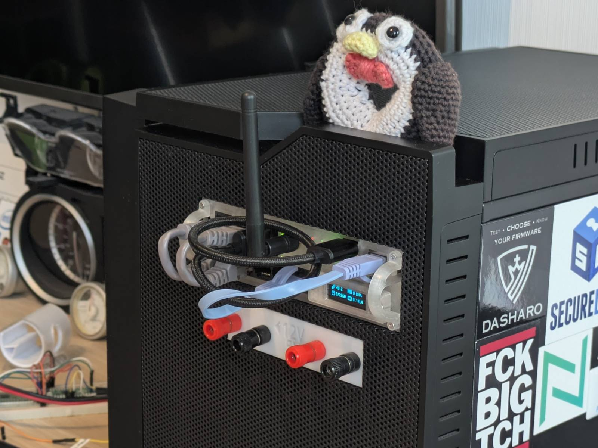

In this post I will cover two major topics:

- why `arm_bae v2` has been created,
- and what I am running on it.

If you're new here (or you just missed it), please read the
[part I](/posts/two-computers-one-case-project-arm_bae-hardware/) for the full context. Here I will
only cover what has changed.

## YouTube Video

---

Here's a summary of this blog post in video form on YouTube.

<div style="width:100%">
  <iframe
    src="https://www.youtube.com/embed/pncNTwmlheA"
    title="YouTube video player"
    allow="accelerometer; autoplay; clipboard-write; encrypted-media; gyroscope; picture-in-picture; web-share"
    referrerpolicy="strict-origin-when-cross-origin"
    allowfullscreen
    style="width:100%; aspect-ratio:16/9; border:0;"
  ></iframe>
</div>

## Oh my Pi

---

The main reason the project took so long to complete was my initial choice of the platform. The
[Orange Pi 4a](http://www.orangepi.org/html/hardWare/computerAndMicrocontrollers/details/Orange-Pi-4A.html)
I planned on using turned out to have (let's say) mixed support in the upstream.

I admit, I was too full of myself thinking I could take the current
[Armbian image](https://forum.armbian.com/topic/49353-opi-4a-allwinner-t527/) the community has come
up with, investigate Orange Pi sources, and add missing stuff by myself. I tried, and made some
progress. For example, I did get the emmc memory to at least be detected by the system and that was
really it. I spent like two weeks of evenings trying to make sense of the whole DTS situation,
comparing Armbian and Orange Pi sources, and once I finally got a view of it, I realized...

> I know s\*\*t about (networking) drivers.

I also had this naive vision that fixing definitions in the Devicetree is magically most of
what it takes to make it work.

> Well, no, not at all.

...and in such a way, the project has been put on the back burner. Oddly enough, what motivated me
to get back to it was my (then) boss making a purchase of a server for which the case alone was
worth more than all the computers in my possession combined. I somehow felt pathetic that people are
stacking proper servers in their homes and I can't finish a sub $100 "server" build.

### God's second lonely programmer

Before we move on to what has changed in `arm_bae v2`, let me quickly share the upstream status
for the Orange Pi 4a.

The Armbian image for OPI 4a can be built from the
[Armbian buildsystem](https://github.com/armbian/build); it boots an up-to-date upstream kernel (it
was 6.18 I believe the last time I tried it). What was not working since I tried it was the
networking stack and the emmc memory. The ethernet node device would appear but would not be usable,
and the emmc would not appear at all. What should be noted is that there are no proprietary drivers
used in the Armbian system, only upstream support, and that was frankly the main source of the
headache I had while comparing the sources.

The real MVP here is [Chen-Yu Tsai](https://wens.tw/) who (if I am not mistaken) singlehandedly adds
support for this board to upstream as a part of the [linux-sunxi](https://linux-sunxi.org/Main_Page)
initiative. A part of this is adding support to open-source drivers for handling stuff like
networking. I can't even imagine how huge of a task this is, and what experience one must have to
pull this off. Massive respect.

## arm_bae v2

---

I won't be keeping you in suspense, here's the `arm_bae v2` in all its glory.


The updated model can be found [on Thingiverse](https://www.thingiverse.com/thing:7283750) for free.

### A new SBC

Probably the biggest change is a change of the SBC. I've dropped the support for the OPI 4A and
instead the `arm_bae v2` houses the
[Raspberry Pi Compute Module 4](https://www.raspberrypi.com/products/compute-module-4/?variant=raspberry-pi-cm4001000)
on a [Waveshare CM4-IO-BASE-A carrier board](https://www.waveshare.com/wiki/CM4-IO-BASE-A).

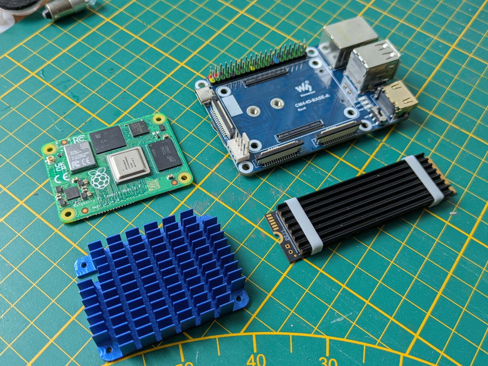

Why CM4? For two reasons:

1. I managed to snag the beefiest version (built-in wifi, 32GB emmc storage, 8GB of ram) brand new
   for a steal of 260zł ($71 in today's money) + 21zł for shipping. (And let me remind you, we're in
   the middle of a ram crisis.)

   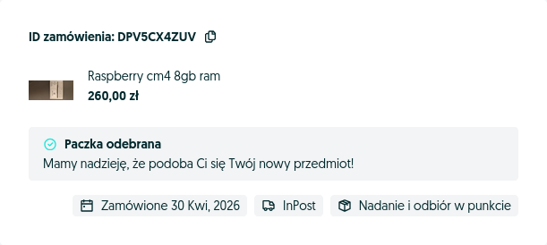

1. It fulfills all the requirements I had for the OPI, that are:
   - emmc for reliable storage
   - nvme drive support (CM4 has a single lane of PCI, the regular RPI 4 doesn't)

   ...plus, the Raspberry Pis have **excellent** support in upstream, so I don't have to mess with
   the OS itself as I would need with the Orange Pi. It's as plug and play as it gets, and honestly
   it is the route I should have taken in the first place.

### More features

I did remodel the project almost from the ground up (I will talk about why in the next section),
and addressed the main two things I didn't like in V1. These were:

- Front (button) panel - since the carrier board does not have any physical buttons or a header to
  connect them, I replaced the front panel with the 0.91" OLED screen for displaying momentary
  device stats.
- No external antenna - I've added a hole for mounting an external antenna and shifted switch
  status lights further to the left. I have to admit though, with the one I have it looks kinda like
  a unicorn :D

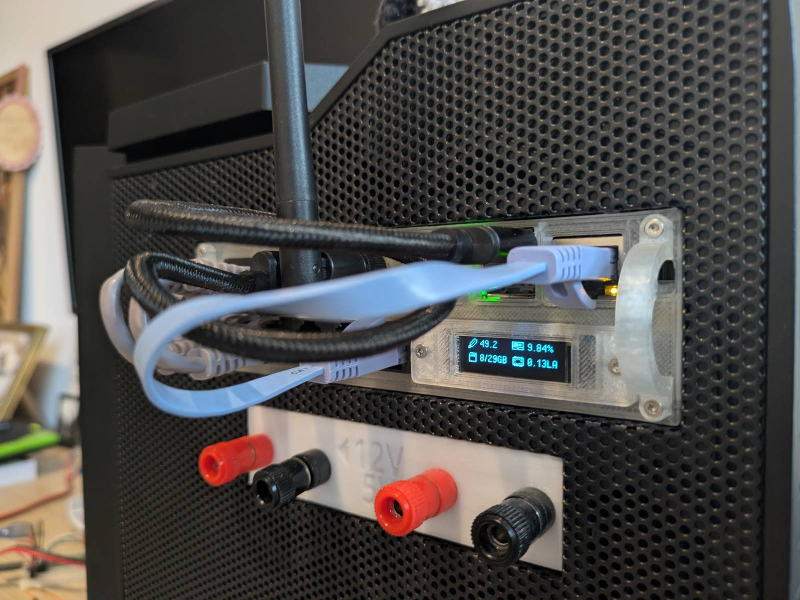

> Yup, I need shorter cables, I know...

### But wait, there's more

Other than fulfilling my internal urge of making the things I do be at least "OK"
(non-cursed, non-perfect) I did the remodelling for one more reason.

In parametric modeling you have to keep in mind two things: order and mutability. Any change to
earlier layers also recalculates the upper layers, and if you are not planning things well, a change
to the parameters might un-fixably break some portion of the top layers, and you have to remodel
them again. That was the exact issue with the `v1` model. I did the handles last, so as I was making
improvements I had to remodel them at least a few times. It also didn't help that I had reference
chains, that not only made recomputing slower (FreeCAD still calculates everything on a single core)
but would also lead to dependency related issues.

In `v2` I fixed these issues. First, I made rails, handles and body unrelated objects (meaning they
share dimensions, but are not dependent on each other). This reduced computing times and gave me
fewer dependency errors. The second thing I did was reorder the assembly. I did model the holes for
the handles on the main body first, and that single change allowed me to export templates/blanks.

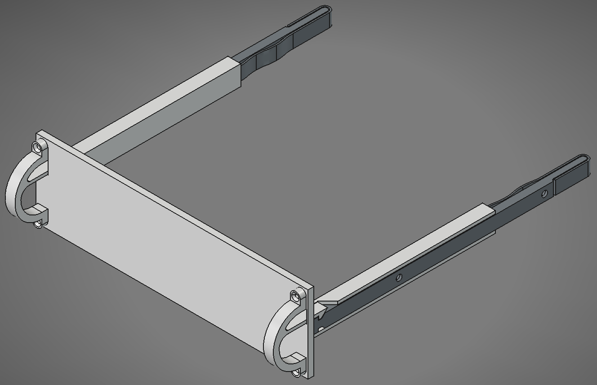

I know that my choice of SBC is quite unpopular, therefore, I've also shared templates on
Thingiverse for the people who want to remix the project for their SBC of choice. If this project
ever grew I would love to host a repo on GitHub with configurations of `arm_bae` for various SBCs
and switches. Sadly, while there is interest, I think the times of cases with 5.25" bays are gone
and I'm filling the niche by myself.

## Connections and hardware

---

A quick recap from the
[part I](/posts/two-computers-one-case-project-arm_bae-hardware/#more-3d-printing)...

The `arm_bae` connects to the PC case backplate internally. All the ports, except the UART adapter,
live on the [pci slot cover to keystone adapter](https://www.thingiverse.com/thing:7268388). The
UART adapter is connected directly to the USB 2.0 header on the motherboard.

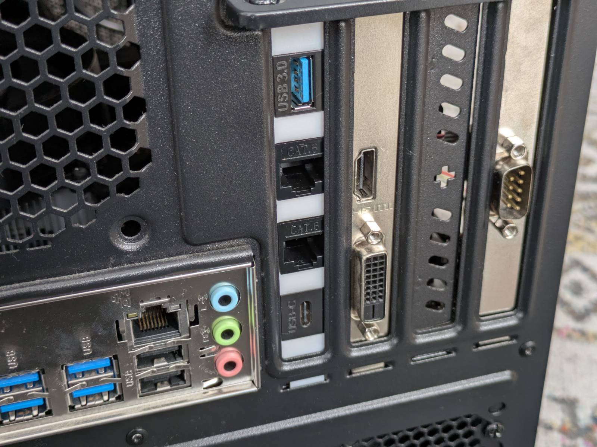

Since I've updated the SBC I also had to introduce a minor change in the connections. The picture
below shows the diagram from the
[part I](/posts/two-computers-one-case-project-arm_bae-hardware/#connections), updated to reflect
the current state.

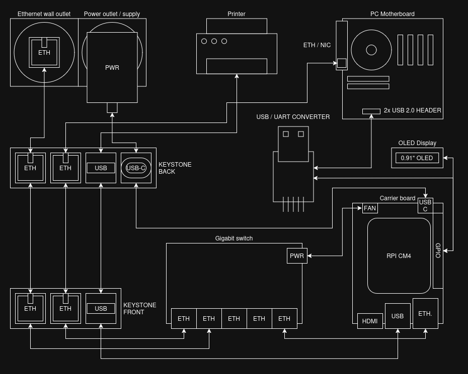

The 3 notable changes are:

- The ethernet switch is now getting power from the fan header on the carrier board (it is connected
  directly to the 5v rail).
- Both the OLED screen and USB-UART converter attach to the GPIO on the carrier board.
- The USB port to the printer is now wired in externally as there is no internal USB header on the
  carrier board, which was present on the OPI 4a.

### Parts list

Here's an updated parts list if you wanted to assemble this yourself.

_Notes:_

- _This list does not include obvious items like filament for printing the case or wires._
- _Items marked as "(exact listing)" indicate the specific listing I bought them from. You
  don’t need to buy from these listings, and none of the links are affiliate links._

SBC stuff:

- [Raspberry PI CM4](https://www.raspberrypi.com/products/compute-module-4/?variant=raspberry-pi-cm4001000)
- [Waveshare 19887 CM4-IO-BASE-A (exact listing)](https://kamami.pl/en/carrier-boards-and-accessories/586276-cm4-io-base-a-mini-base-board-for-raspberry-pi-cm4-modules-5906623425563.html)
- [(Orange PI) 5V power supply (exact listing)](https://aliexpress.com/item/1005008999261190.html)
- [Alloy heatsink for CM4 (exact listing)](https://www.aliexpress.com/item/1005009267532572.html)
- [Alloy heatsink for NVMe (exact listing)](https://www.aliexpress.com/item/1005008025504295.html)
- Some thermopads and thermal paste for the heatsink.

Other electronic pieces:

- [Tenda SG105 gigabit switch](https://www.tendacn.com/product/SG105)
- [CH340 UART converter (exact listing, polish)](https://allegro.pl/oferta/konwerter-usb-uart-na-ch340-3-3v-i-5v-ttl-rs232-17224068493)
- [0.91" SSD1306 OLED screen](https://aliexpress.com/item/1005011929267814.html)

Cables, antennas, and adapters (note the length may vary in your case):

- [Antenna with SMA Male Connector with U.fl ipx to Sma Female Connector Cable (exact listing)](https://aliexpress.com/item/1005007957230793.html)
- 2x [Keystone USB-A adapter (exact listing)](https://www.aliexpress.com/item/1005009430447241.html)
- 4x [Keystone Ethernet adapter (exact listing)](https://www.aliexpress.com/item/1005009430447241.html)
- [Keystone USB-c adapter (exact listing)](https://www.aliexpress.com/item/1005009430447241.html)
- 2x [Ethernet cable for the front (10cm length) (exact listing)](https://aliexpress.com/item/4000285093826.html)
- Ethernet cable for the front (~15cm length)
- Male USB-A to male USB-A ~15cm cable for the front
- [Internal male USB-C to male USB-C cable (exact listing)](https://www.aliexpress.com/item/1005006117724690.html)
- Internal ethernet cable
- Internal male USB-A to male USB-A cable
- Internal female USB 2.0 header to female USB cable (made myself)

Nuts and bolts:

- [M2 bolts and nuts kit (exact listing, polish)](https://www.amazon.pl/dp/B0DD7G2W25)
- [M2.5 bolts and nuts kit (exact listing, polish)](https://www.amazon.pl/dp/B0CY1YZZC8)
- [M3 bolts and nuts kit (exact listing, polish)](https://www.amazon.pl/dp/B093GNHWKR)

Misc:

- [1mm fiber wire (exact listing)](https://www.aliexpress.com/item/4000776943110.html)
- Zip ties

## What's on my NAS?

---

> The title is intended reference to "What's on my X" videos. Cringe, I know...

Allright, now that the hardware part is finally complete, it's time to talk a bit about the
configuration. Before I begin, let me talk a little bit about my approach.

I am a fan of simplicity, minimalism and "deploy and forget" approach. The less stuff to maintain
the better. My "server", "NAS" or whatever, is as bare bone as it gets, some examples:

- I don't need to deploy a full Google-like suite in the form of Nextcloud,
- I don't need my garbage photos I take to be synced up automatically, nor do I need to browse
  them in the browser.
- I don't need Jellyfin as I don't have collection of movies and like every other regular Joe, I use
  streaming services for that (I don't claim that is good, but it's convenient).

I can replace all of the above simply by connecting my computer to a share, and use desktop native
apps. That said, I am not a complete nomad and there are services I do find useful, convenient or
that simply need to be hosted somewhere, and I will talk about those.

### OS

My OS of choice is the one and only (not much else is there for ARM I believe)
[openmediavault](https://www.openmediavault.org/) 8 running on top of regular Raspberry Pi OS Lite.

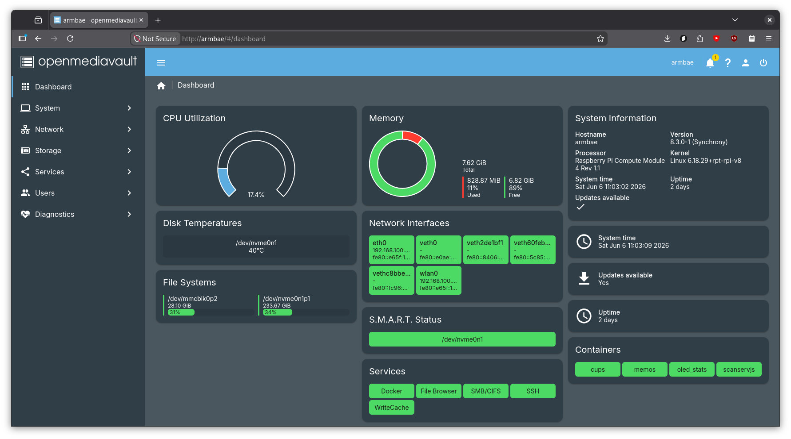

The OMV is my favorite type of solution, which is the "it just works" solution. It does all you
would need a NAS OS to do, like:

- Disk/filesystem management
- Access management
- File shares
- Sync jobs
- Running docker containers
- Management from web-ui

It's fast to pick up and (at least to me) logical once you spend some time with it. Additionally,
I have the following extensions pre-installed
(these require [omv-extras](https://wiki.omv-extras.org/) installation):

- `openmediavault-compose` - Used for docker automation
- `openmediavault-writecache` - Reduces writes to the OS filesystem to extend the life of the
  storage device
- `openmediavault-wol` - Allows waking up hosts via WOL (I'll talk about that later)
- `openmediavault-filebrowser` - "Google-drive like" service for browsing files in the browser.
- `openmediavault-scripts` - For managing python and bash scripts.

The downside of the OMV I see however is it being web-ui centric. This does not really align with
my recent "home-infrastructure-as-code" approach, mixed with "ansible-everything" recent mania. The
approach I landed on is:

- Manual OMV installation
- Configuring base Debian stuff via `ansible` (Shell, installing packages, deploying /etc/hosts,
  etc.)
- Installing all OMV services via `ansible`,
- Preserving the configuration files (mostly docker and docker-compose-files) in the ansible repo,
- Performing configuration manually from the web-ui, pasting configurations.

It ain't perfect (not configuring OMV itself automatically), but the OMV is so easy to manage, I am
confident I could pull all of that in less than an hour, so it doesn't bother me much.

### Storage

For the share storage I am using a 250GB NVME drive I had lying around. Yup, it ain't much and to be
honest it is not even enough for me to copy over the main share I am running on the 1TB RAID 1 array
(of HDD drives) on [the cube](../never-configuring-samba-again-ansible/#meet-the-cube)
(the main x86 host, the case belongs to). The thing is, even the "good-value" NVME drives are almost
twice the price of the whole freaking server, and I ain't paying this much. Until the prices
stabilize, my solution was simply to not copy over the share in its entirety. I had to leave
my collection of ripped CDs (~170GB) and Windows VM image (~40GB) on the RAID array on cube.
I will elaborate on this more in the upcoming sections.

### Built-in services and setup

Let's start discussing the configuration from the built-in services and functionality, including the
ones installed as a part of `omv-extras`.

#### Share and backup

To "share the share" across the network I use SMB. This allows me to connect to it from all kinds
of devices. The setup is just as easy as ticking a few checkboxes and off it goes, nothing to
write home about.

The more interesting is the backup automation. I basically copied over my
[wol + rsync setup](/posts/energy-efficient-backups-omv-wol-rsync/), but more cleanly this time.
This is what I've done:

1. I've used the WOL extension to add the `cube` to known devices. (This has a side effect that I
   can turn it on even if I'm outside the home. Neat.)
1. Then I've configured an rsync job in web-ui **but left it disabled**. (The rsync flow does not
   support waking up the target via WOL.)
1. Then I created a bash script in web-ui (this is what the `scripts` extension was for) that will:
   - read the WOL configuration, wake up the target, and wait 2 minutes for it to boot.
   - execute the rsync script that was created in step 2.
   - shut down the target if rsync has succeeded.
1. ...and finally, set up a cron job that will fire this script at the beginning of every month
   to back up the `arm_bae` drive to the RAID 1 array on the `cube`.

That RAID 1 probably doesn't make much sense at all since it does not really have to be "online",
but at the same time it does not hurt anything I believe. I must think of a 3rd place for backup
though.

#### File Browser

[File Browser](https://github.com/filebrowser/filebrowser) is a lightweight file explorer in your
browser. The easiest thing to compare it to would be a web-based Google Drive.

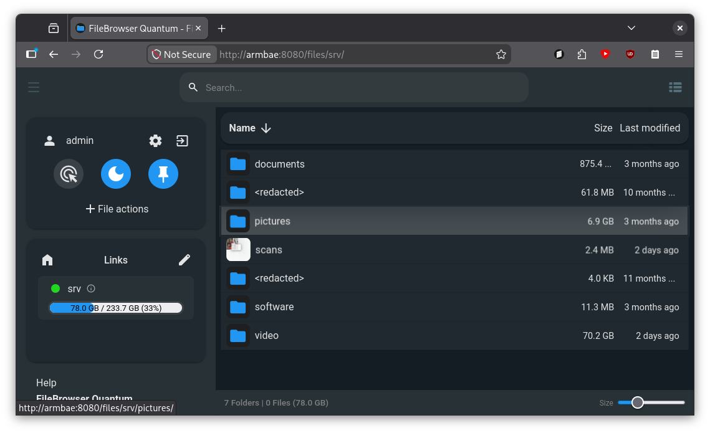

I find `File Browser` useful on mobile devices, as I do not have to install any 3rd party client
apps that would connect to my share. Tailscale (more on that later) makes connecting to such a
service from the phone a breeze. I simply open up Firefox, click a shortcut to the `File Browser`,
log in and I am already in my "privately hosted Google Drive" with space limited only by the
capacity of the drive I have. No subscriptions and no storing my data god knows where.

> Take that Google...

Again, `File Browser` is an official OMV extension and configuring it is literally 3 clicks.

### Other services

Let's now discuss services that I configured, that are not part of the OMV functionality.

#### Tailscale

Tailscale is my VPN solution of choice and it is the only one of the services that are in this
section that is installed directly on the host, rather than in a docker container.

Why Tailscale? Because it is freaking good. It's stupid easy to set up, works on everything, the
interface is great, has features like static DNS names even in the free tier, and it "just works".
My anecdote for Tailscale is when I was setting up a VPN for the first time I thought I'd spend days
setting it up. In reality, half an hour and I was completely done. For the stupid SMB share you have
to have a PHD in "Patience and Administration" and a few evenings of free time (if you're playing
with the conf file manually) and the freaking VPN was child's play compared to this.

Tailscale is what makes accessing everything possible, starting at the SMB share, to
`File Browser` and ending up at all the other services I'll discuss later. I can connect to the
`arm_bae` wherever I am, from both my laptop and a phone.

Still, while being based on open-software, Tailscale is a corporation, you're giving partial
access to your devices, and it is a valid concern if you're against it. My take on this is, if I
really want to keep it "budget", there is no way I won't be using any 3rd party service along the
way, so it is a necessary evil I have to accept. If I were to "rent" a VM somewhere, it would still
run on someone else's infrastructure, I don't see an escape from it sadly.

#### OLED stats docker service

Now onto the docker services, let's start from the `stats` first. This container is simply for
displaying the stats (RAM usage, CPU usage, CPU temp and root partition usage) on the OLED screen.
It is based on the [OLED Stats](https://github.com/mklements/OLED_Stats) project with some hackery
added on top of it. The issue with it is that it has that "I put it as a concept in my spare time"
quality to it, so:

- it requires a bunch of obscure libraries pulled in,
- you have to edit the source code to accept smaller screens (my 0.91"),
- and finally, instead of setting up a service, the manual says to set up a cron job that calls the
  python script on every boot (I consider this a crime).

My solution to this is simply to pull the container, do some inline `sed` dance to the script, and
run the script inside of the container.

```yaml
---
services:
  oled_stats:
    build: https://github.com/mklements/OLED_Stats.git#main
    container_name: oled_stats
    restart: unless-stopped
    privileged: true
    devices:
      - /dev/i2c-1:/dev/i2c-1
      - /dev/gpiomem:/dev/gpiomem
    environment:
      - TZ=Europe/Warsaw
      - OLED_ROTATION=1
    entrypoint: ["/bin/sh", "-c"]
    # There are 4 files to choose from: stats.py | status.py | monitor.py | psutilstats.py
    # We use monitor.py and adapt it for a 2-row 128x32 panel:
    # * sed screen height 64 -> 32
    # * raise the rows: "top + 5" -> "top", "top + 25" -> "top + 20"
    command:
      - |
        sed -i 's/HEIGHT = 64/HEIGHT = 32/' *.py
        sed -i 's/top + 5/top/g' monitor.py
        sed -i 's/top + 25/top + 20/g' monitor.py
        exec python monitor.py
```

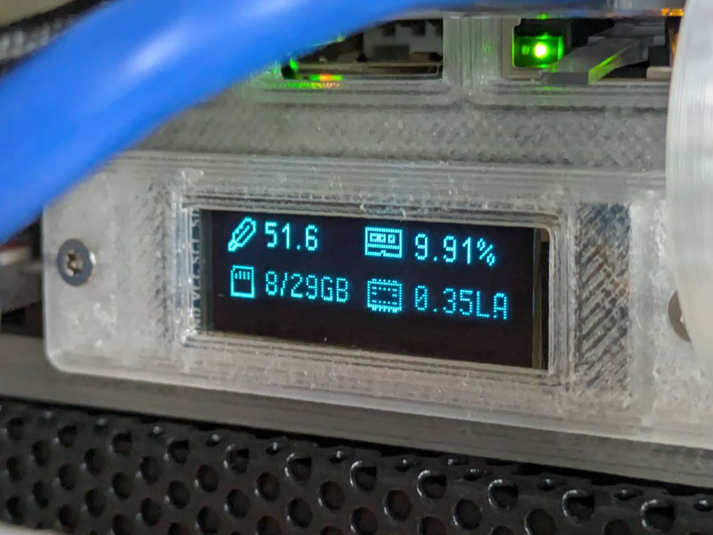

Is it cursed? Slightly, but as long as it lives inside the container and not on the host itself I'm
fine with it.

#### Memos

The next one in the list is [memos](https://github.com/usememos/memos), a simple service for "sticky
notes" type notes. I do not yet know if I'll use it, but I'm trying to make myself solve a problem
with myself that is making notes and not remembering where I made that note. I figured, if I
had a common place for all of my quick notes, then I might not be losing them.

#### CUPS

This, and the next one are for sharing the (paper) printer across the LAN. CUPS is a standard open
source printing server for Linux. The reason I have it in the docker container is not the CUPS
itself, but the `hplip` and other HP `bs-ware™` for my DeskJet printer. The thing with `hplip` is
that it technically is open-source, but they don't take external contributions and some printers
require proprietary plugins to work. Every time I have used it in the past, it gave me that vibe of
it being held together by dreams and hopes. What I didn't like the most is it doing god knows what
to the system without asking. Therefore, containerizing it was the only logical thing to do, and I
am happy to report it works without a hitch. I had to prepare a custom docker container though, but
that also can be done with the `compose` extension web ui.

#### Scanservjs

[Scanservjs](https://github.com/sbs20/scanservjs) is a web-ui frontend for SANE, and it is the
solution I've been using for a while now to use the scanner that's built into my printer.

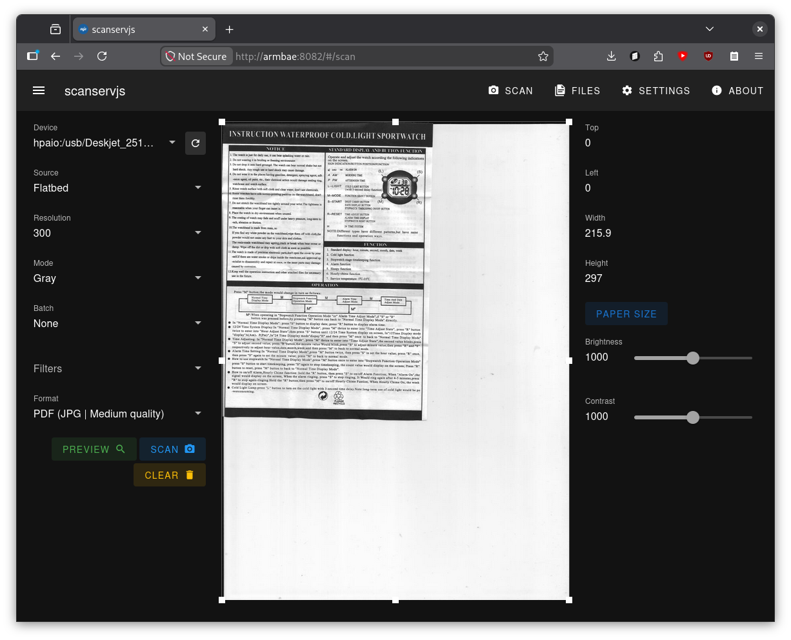

Again, custom hp libraries are required, although I would have put it in a docker container
even without them, as it is yet another web service.

## That's all there is to it

...and that's all there is to it. I wasn't lying, my "server" is bare bones, but I like it this way.
With all those services running, I'm barely using ~800MB of the 8GB of available RAM. If I ever feel
like I'm missing something, I'll just deploy it. There is no point for me to forcefully deploy a
bunch of stuff on it just to utilize more resources.

On that note, the next likely thing that's coming to the `arm_bae` is
[Home Assistant](https://www.home-assistant.io/) as I finally need to get rid of the corporate spy
in my home that is my Nest Speaker (yet another small step toward being less reliant on Google).

> Yet another side note. I wanted to deploy the `Pi-hole` to fight against YouTube ads on TV, but
> sadly, the ads are coming from the same domain the videos do, so that's a no go.

I consider the `arm_bae` (both the model and deployment) finished for now. This is definitely my
best custom computing project yet.

I'm planning on releasing a YouTube video on this. Once it is done, I will update this post. For
now, however, thanks for reading.
