[Skip to the mod itself 👇](#adding-uart-to-bmc-on-x11ssh-platform)

Look fellas, I have acquired a junk...

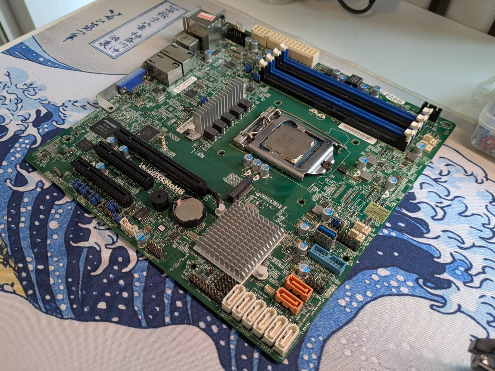

Yup, it's 2026 and I've bought [x11ssh-f](https://www.supermicro.com/en/products/motherboard/x11ssh-f)
entry-server/workstation motherboard, for 7th gen Intel CPUs.

> Ahh, yes. The times when 4 cores 8 threads was state of the art in consumer CPUs.

It cost me 150USD (with shipping from China), and even if I put in the beefiest CPU this mobo supports
it would still lose to a freaking
[Ryzen 3 4100](https://www.techpowerup.com/cpu-specs/ryzen-3-4100.c2757) I have in my
["throw-anything-at-PC"](../never-configuring-samba-again-ansible/#meet-the-cube)
(multi core, according to [cpubenchmark.com](https://www.cpubenchmark.net/compare/3158vs4832/Intel-Xeon-E3-1285-v6-vs-AMD-Ryzen-3-4100)).
In fact, the said Ryzen 3 + motherboard can be bought brand new for cheaper than I spent on this
relict of the past.

> So the question is why?

You see I spent some time playing with similar board (`x11ssh-ctf`) when I was working at
[3mdeb](https://3mdeb.com/). I was working on porting [OpenBMC](https://openbmc.org/) to that board,
but as it is with life, other more important projects came and I didn't have a chance to finish it.
What I managed to do back then was compile and run OpenBMC on the board, but I couldn't get it to
communicate with the x86 host. I can tell this to you as it's all public data, you can check the
posts I did on it back in the day:

- [The Beginning - Porting OpenBMC to the X11SSH Platform](https://blog.3mdeb.com/2025/2025-04-28-zarhusbmc/)
- [The second encounter - Porting OpenBMC to X11SSH part II](https://blog.3mdeb.com/2025/2025-07-29-zarthusbmc-se/)

The thing with this motherboard is, it is a good playground. It is after all a server motherboard,
so even if little old, same principles (like BMC, onboard FPGAs) are still used on modern-day
hardware. ...and at the same time, it's (relatively) cheap. I can't afford modern server hardware
on my own, but if I end up breaking this one, it won't hurt me too much. The tools have progressed
a lot since I last had a chance to play with it, so it's my chance to get even with it. I want to try
building [Coreboot](https://www.coreboot.org/) for it (supposedly some work has been already done),
and take a second chance at porting that OpenBMC.

> Will I succeed?

Who knows, but even if I don't I'll at least have something to complain about on this blog. This is
also my attempt at staying relevant with the world of firmware/embedded since I'm doing something
completely different at work. That said, I'm going to be laid back about it, so you can expect some
posts on it from time to time, but I'm not going to push all the resources onto it.

Today's topic is already a slightly cursed one: we need to solder a bunch of wires
to the motherboard to get UART shell access to the BMC.

## What's BMC?

_Note: This is just my lazy caveman-style explanation, this topic goes much deeper._

I'm not even gonna try to come up with a "computer" definition, as the amount of nested
"computers" in a "computer" is astonishing. Physically, what we commonly refer to as computer is
some circuitry that has a CPU, RAM memory and some storage to read the files from, right?

So what if I told you, the majority of the server motherboards actually contain two computers on a
single motherboard?

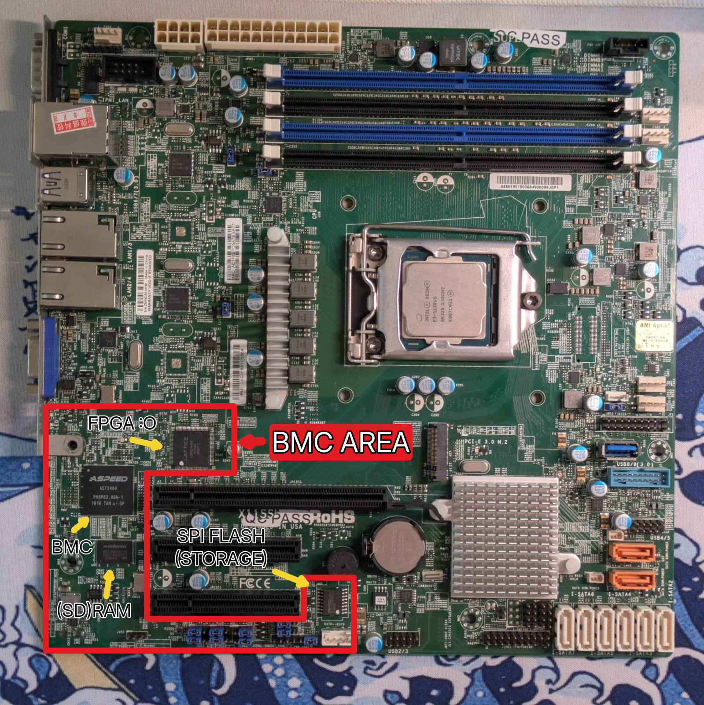

_Note: The "BMC AREA" is for reference only, it's just how I like to call it._

The BMC stands for
[Baseboard Management Controller](https://www.supermicro.com/en/glossary/baseboard-management-controller?Look-a-page-from-supermicro-Kinda-ironic-aint-it)
and as the name suggests, its role is to provide remote server management support. (Pretty sure I
made that joke already, but) It's like a KVM on steroids. You can have access to keyboard and mouse
from the internet browser, but also control low level stuff like power states, flashing firmware,
checking hardware state and the list goes on. ...and while a KVM would be dangling somewhere off the
VGA port, this is built directly into the motherboard.

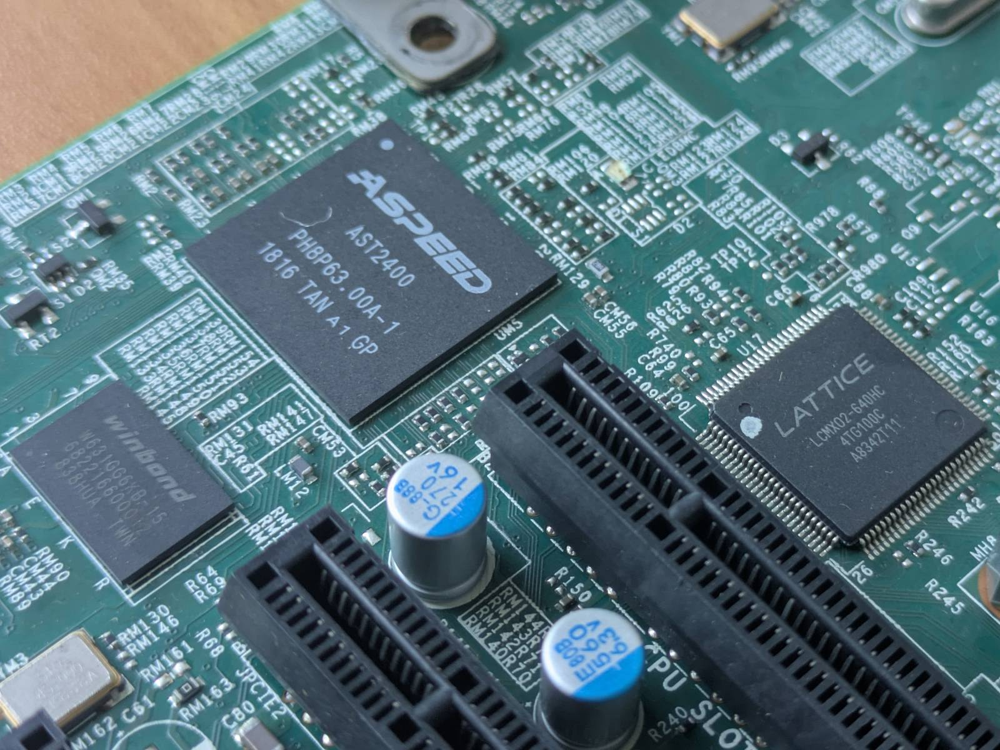

The "chip" that makes the BMC is just an ARM SoC often made by [Aspeed](http://www.aspeedtech.com/),
and the "firmware" is just yet another embedded Linux distribution. Other than it being able to
"communicate with the x86 host", there's nothing special about it. The bootloader is often
[u-boot](https://u-boot.org/) and it runs some Linux based on Aspeed's downstream Linux kernel.

> Saying it's a built-in Raspberry Pi (with KVM features) isn't that much off from reality. More
> like OrangePi though, since there's a lot of proprietary BS and juggling with downstreams.

### Hot take

I think I understand why BMCs exist. It's because end users want beautiful fancy windows and
browser access to manage their machines. ...but I side with Oxide here, that it is an absolute state
of uncontrollable bloat. There are many issues with it, some of which:

On most machines I got a chance to play with (including this one), access to the Linux system
that's running on the BMC is restrained and un-auditable. You basically plug in a small ARM Linux
computer running Gods know what into your infrastructure, that has monitor and keyboard access to
the main x86 machine. The issue is not even about being suspicious of the malicious intends of the
manufacturer running some spyware there, but about maintainability. The extra "computer" onboard
is yet another machine to maintain. You know, doing security updates and all that fun stuff. Well,
too bad only the manufacturer can do it, and when they decide the machine is obsolete then GLHF with
hackers waiting to exploit known vulnerabilities (We're talking enterprise grade hardware).
...and it's Linux, not some bare metal firmware.

...the other issue, more personal to me, is how freaking long the mobos equipped with the BMC boot.
The issue here is that modern BMCs easily take at least 2 minutes to boot, and only when the BMC
boots, it can drive the FPGA to do the "power state dance" for the x86 CPU to start booting. The total
boot time after total power loss can take like 5 minutes. Now I know that when you buy a server
you boot it once and never switch it off again. ...but in my kind of work, I reboot the machines at
least few times a day, and I'm tired of playing a game of "Panie Janie, czy to wstanie™"
(losely translated as "Is it bootin, Brother John?"). I lately often do:

```bash
date; ping <BMC_IP_ADDRESS>
```

...and if I don't see a ping within 3 minutes I start doubting, after 5 I know there ain't no chance.
Can't say much, but let me say I've seen the truth, and I know there are better, less bloated ways
to do what BMC does.

### What I'm trying to do

Since the BMC firmware is just Linux, as any other distro, it also has a CLI (or SHELL) so you can
navigate the system. The issue is, some boards give the user shell access to the BMC, this one does
not. You can't ssh onto it and there is no UART header onboard either. That said...

Back at 3mdeb, and with community effort, I managed to trace the UART pins from the Aspeed SoC
to unpopulated pads on the motherboard PCB, effectively restoring the capablity to access BMC
shell via UART. You can read about it here:

[ZarhusBMC: The second encounter - Porting OpenBMC to X11SSH part II](https://blog.3mdeb.com/2025/2025-07-29-zarthusbmc-se)

_(or on [Hacker News](https://news.ycombinator.com/item?id=44387904))_

We will talk about how and who made it possible later, but for now I wanted to give credit to
[3mdeb](https://3mdeb.com/) since I was doing this on their behalf. Today I'll be reproducing this
just for my own sake, and I'll just do exactly the same, but I will go through it once again as
a reminder to myself and to document it slightly better.

## Adding BMC UART - the theory

The Aspeed AST2400 SoC the X11ssh board features comes in a
[BGA package](https://en.wikipedia.org/wiki/Ball_grid_array), 408 pin LFBGA to be exact. This means
all the connections are under the SoC and we cannot simply solder a patch wire to the leads. The
fact that the motherboard is multilayer, does not help us either as the traces run deep inside
the PCB so we cannot trace them by eye.

Now, going back to the community I talked about in the previous section, there are two MVPs that
made restoring UART possible, and they are:

- [Keno Fisher](https://github.com/Keno), who almost 10 years ago played with these boards and
  [managed to find the `Tx` (Transmit) pin of the BMC UART](https://github.com/Keno/bmcnonsense/blob/master/blog/03-serial2.md)
  by simply probing the board with the oscilloscope.
- [Tim Ansell](https://github.com/mithro), who provided
  [gerber files for the motherboard](https://github.com/mithro/x11ssh-f-pcb).

My role in completing the puzzle was to simply:

- Find the pin Keno found on the motherboard.
- Trace back connections to the SoC with the gerber files, and figure out the pin it connects to.
- Find matching Rx (Receive) pin in the manual.
- Finally, follow the route from the pin on the SoC to where it exits on any of the top layers on
  the PCB.

Quite easy, it's just a matter of reproducing it.

## Adding BMC UART - the practice

_Note: I have dedicated section that shows exactly what you need to do, this one just explains
the process of figuring it out._

Allright, so the first thing is to find the solder pad Keno talked about in his blog post.

> The TX signal is on one of the pads of each of the RM33 and RM39 resistors. These are unpopulated
> on my board, but are located very close to the bottom left of the AST2400.

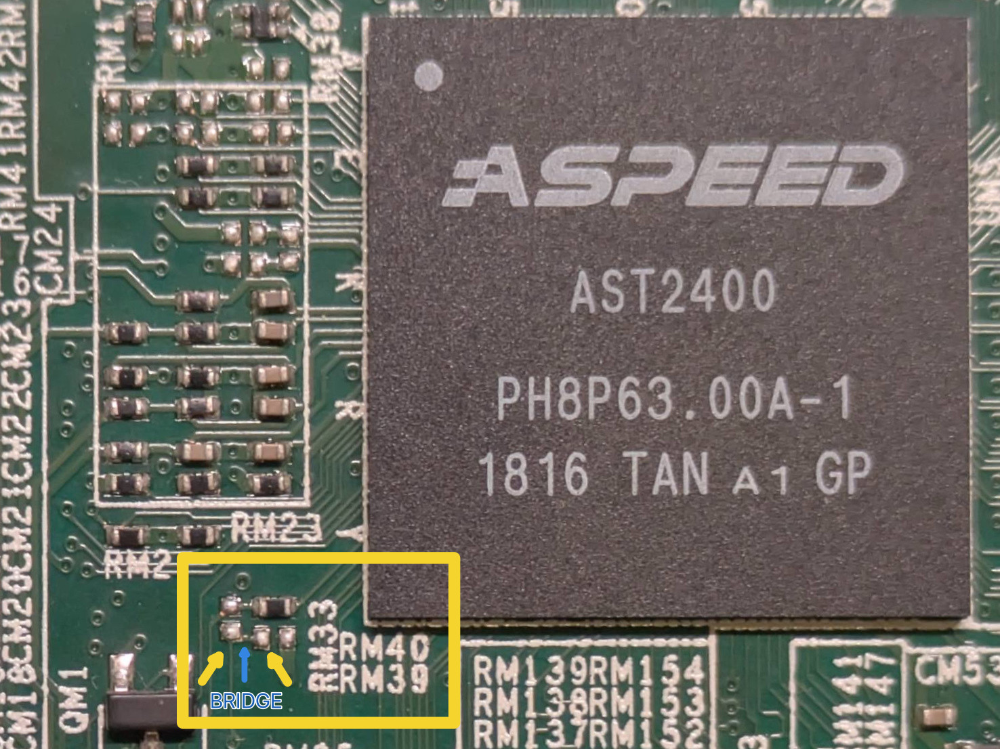

The pads in question are the ones I marked with the yellow arrows. We can see a trace (bridge) on
the top PCB layer so we know they are connected.

### Gerbers

The next thing is opening up the Gerbers, I've downloaded KiCad and opened all files in the gerber
viewer. Then it was a matter of playing with layers and finding our two pads.

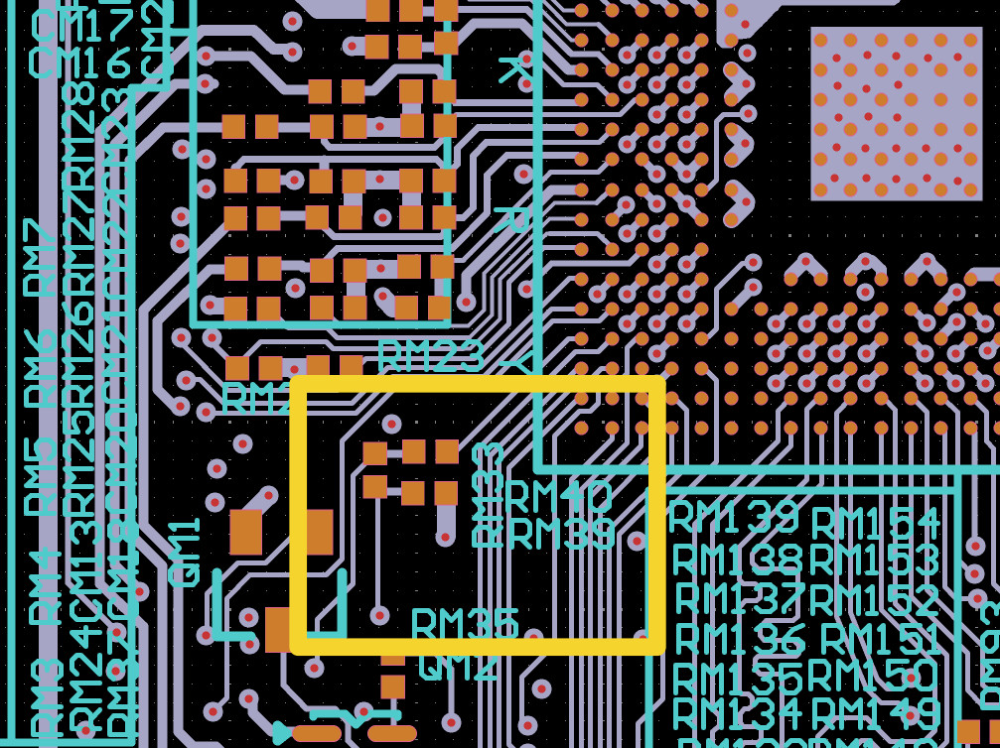

As you can see I've found them and marked with yellow rectangle. Indeed two pads are connected.

Now the tricky part is tracing this connection back to the SoC, by playing with the layers in the
gerber viewer. Thankfully the SoC is nearby so it's not that tedious.

The traces lead us to this pin on the SoC:

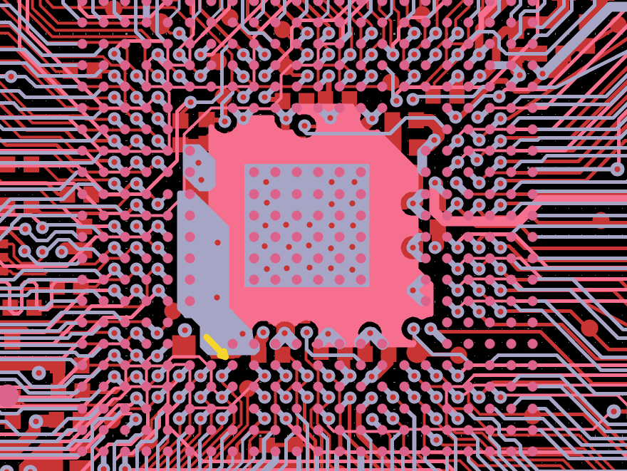

Now, we simply need to check what's the pin definition in the docs (keeping in mind, the SoC is
turned 90 degrees anti-clockwise on this diagram). The pin definition is `TXD5` so we simply find
`RXD5` and trace back the route to the first place it exits the motherboard via a pad.

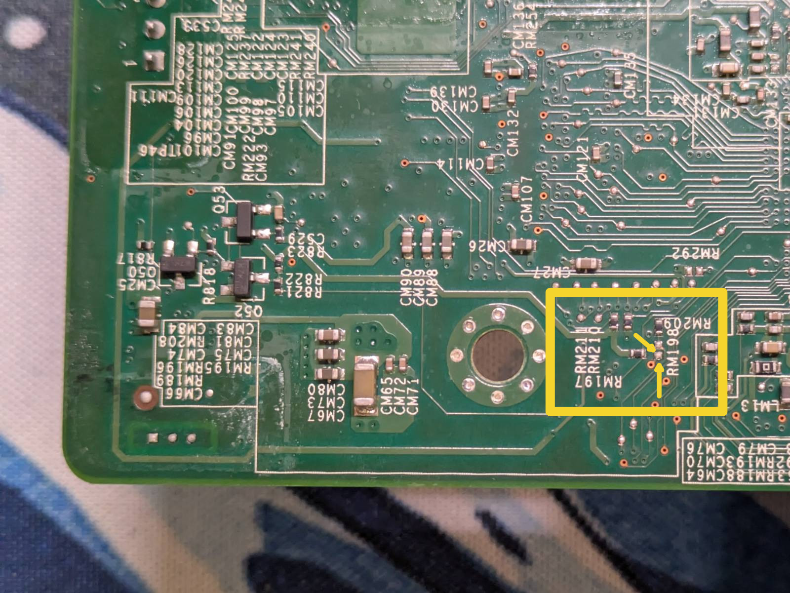

The "exit" is on an unpopulated pad next to the `RM198` label. ...and that's all there is to it. Now
it's time to solder some wires to these pads.

### Soldering

For soldering you gonna wanna use a very thin wire.

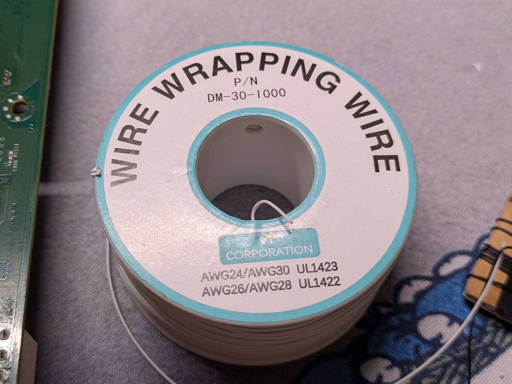

What I like to do with these single wire types is make a tiny loop at the end so there is more
surface area.

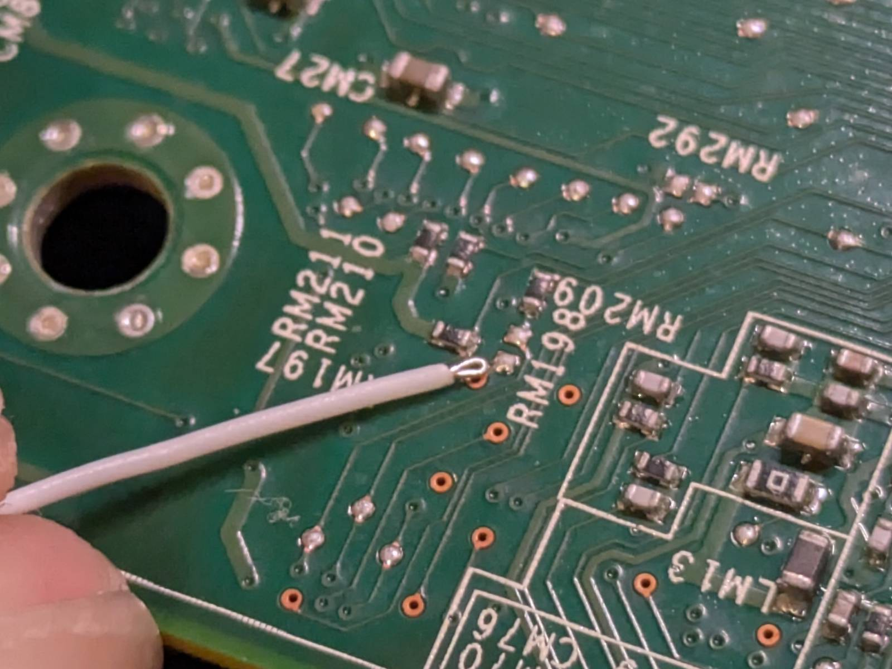

My method for soldering is as follows:

- Add a little solder to existing pads. The reason is when the stock solder mixes with the "homebrew"
  one it's easier to solder, the temperatures do not have to be as high.
- Cover the wire tip in solder
- Align a wire with the pad, and a gentle tap is often all it takes so the two are firmly joined
  together.

The pictures below show my end result.

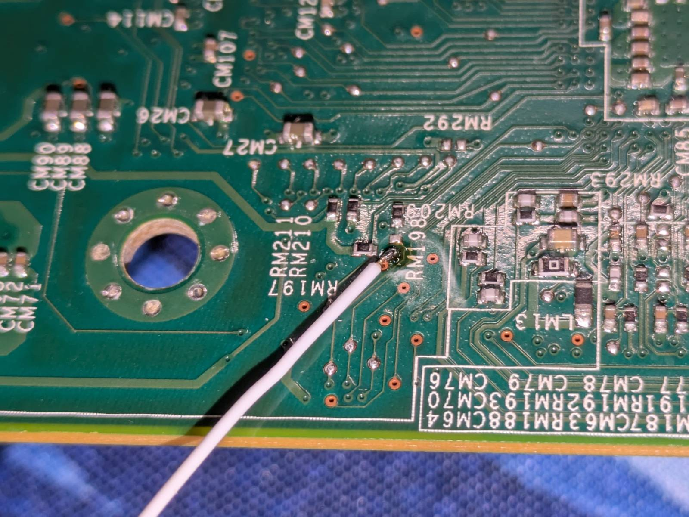
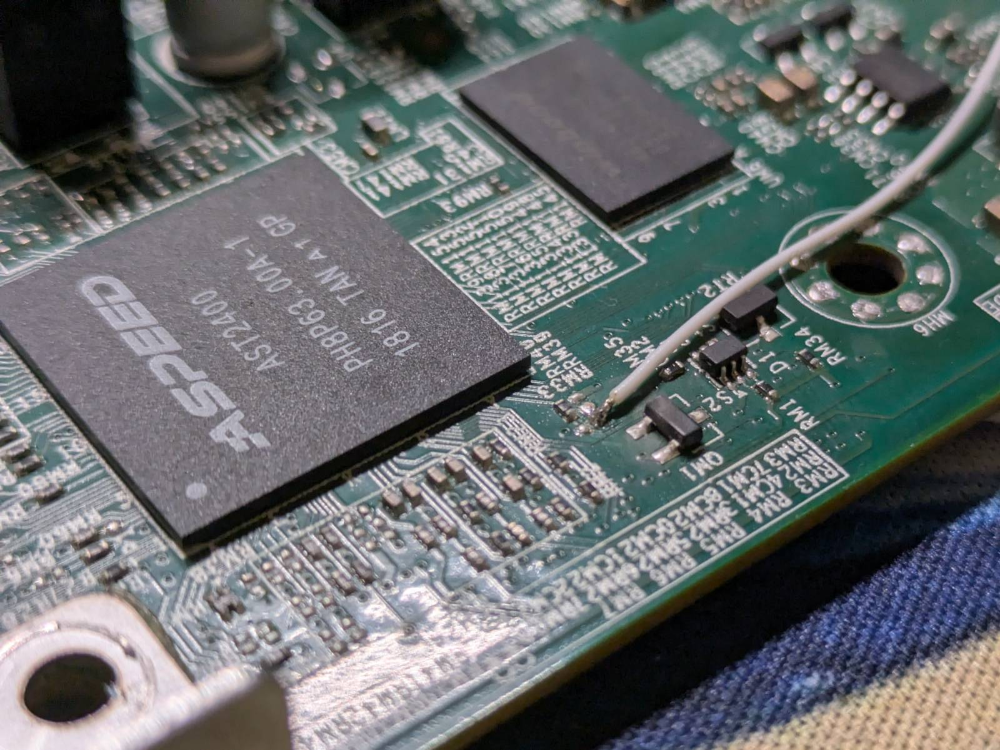

...and finally I stole some ground from an empty capacitor passthrough.

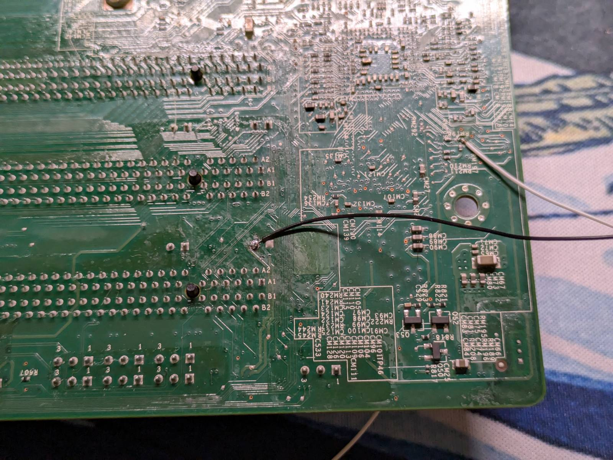

Then I secured the dangling wires with some black hot glue so the pads don't get ripped off by
accident and soldered the regular probing wires with female 2.54mm headers on the end.

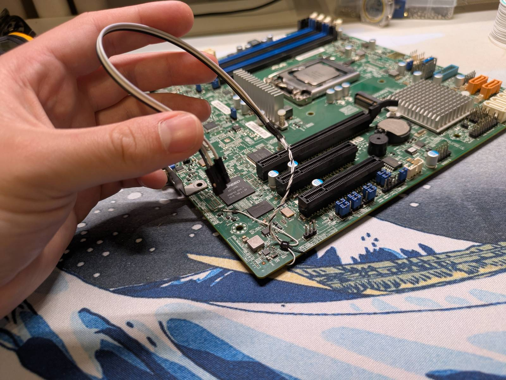

The only thing I regret not doing is somehow aligning those wires so they don't look like a
hack-job. But well... It's a hackjob after all, so as long as it works I don't really care.

### Putting it all together and testing

I am happy to report that when assembled everything works as expected. Below are some pictures as
well as a video showcasing the initial boot logs.

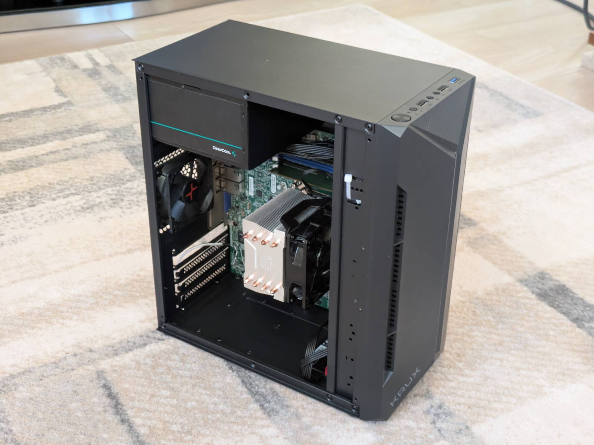
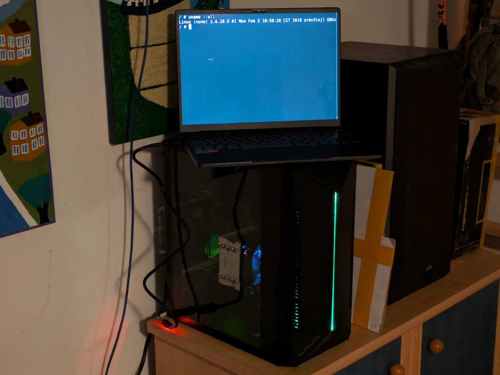

<div style="width:100%">
  <iframe
    src="https://www.youtube.com/embed/hzbPuItm95c"
    title="YouTube video player"
    allow="accelerometer; autoplay; clipboard-write; encrypted-media; gyroscope; picture-in-picture; web-share"
    referrerpolicy="strict-origin-when-cross-origin"
    allowfullscreen
    style="width:100%; aspect-ratio:16/9; border:0;"
  ></iframe>
</div>

## What's coming

Step one, which is "hacking" a motherboard to add BMC shell access via UART, is done. The next
steps for me are the initial setup, so configuring the stock BMC, taking a look at the firmware
(supposedly I have some special chinese version) and installing some OS as a sanity check to confirm
it's working before I start messing with it. I've already ordered a flash programmer from Aliexpress
so once it arrives we will dump and back up the motherboard and BMC firmwares. ...and once that's
done, the sky is the limit.

As stated at the beginning, I'm taking the laid back approach on this. There will be more parts on
`x11ssh` but when and about what, we will figure out together.

The last incoming section is a quick summary on how to perform this modification, for those
interested in just that. Thank you for your time.

## Adding UART to BMC on x11ssh platform

_Disclaimer: You're reproducing the following steps on your own responsibility, I do not take
responsibility if you hurt yourself or your device._

### Introduction

The Supermicro X11ssh family of boards does not have a BMC UART header. The following modification
allows accessing the BMC Linux shell over TTL UART by soldering the wires directly to unpopulated
pads on the motherboard.

The pictures showcase the `x11ssh-f` board, but this modification should also work for other boards
in the `x11ssh` family like `x11ssh-ctf`, but the label positions might be different.

### Locating the pads

The `TX` (transmit) set of pads is located at the front, at the bottom left corner of the Aspeed BMC
SoC.


The pads are marked in a yellow square box. You can use either of the pads marked with yellow arrows
as they are interconnected.

The `RX` (receive) pad is located on the back side of the motherboard, above the bottom mounting
hole on the I/O side.


_Note: On the picture, the board is rotated 90 degrees clockwise. We are looking at the edge of the
I/O side._

The pad is highlighted in a yellow square box. It is located next to the `RM198` silk screen label.

For the ground, you can use an unpopulated through-hole where the capacitor would go.


The picture above shows the black ground wire soldered to the ground through-hole, as well as the
soldered `RX` wire.

### Soldering

To perform the modification you'll need a thin wire, I used `30AWG 0.25mm`. To solder in the wires:

- Strip a small amount of the insulation from the wire.
- Make a small loop at the end of the wire.
- Add a bit of solder to the pad on the motherboard.
- Cover the now rounded tip of the wire with solder.
- Align the wire with the pad and a firm tap with the soldering iron should be enough to join the
  two together.


To avoid accidentally ripping off the pads, you can secure the wires with a drop of hot glue. Choose
a place on the motherboard where there are no pads or vias to do so.

### Connecting UART adapter

To connect to a USB-TTL-UART adapter you'll need to merge the wires with ones ending in a `2.54mm`
female plug. The logic level is `3.3V`.


