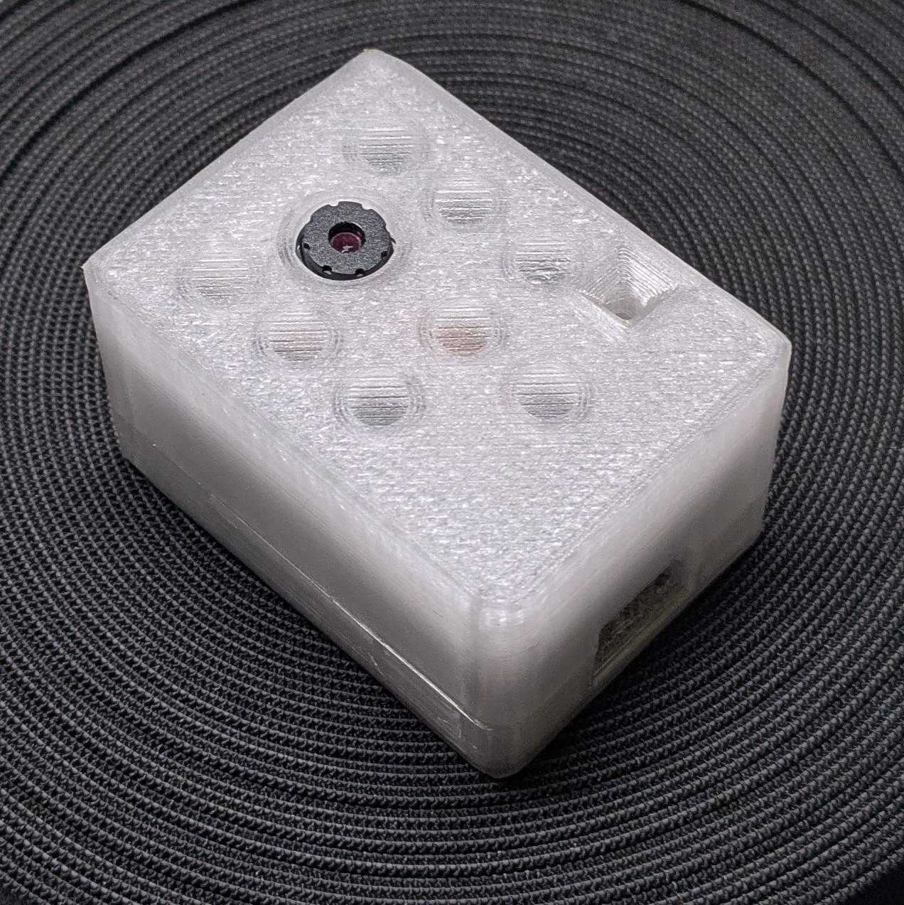
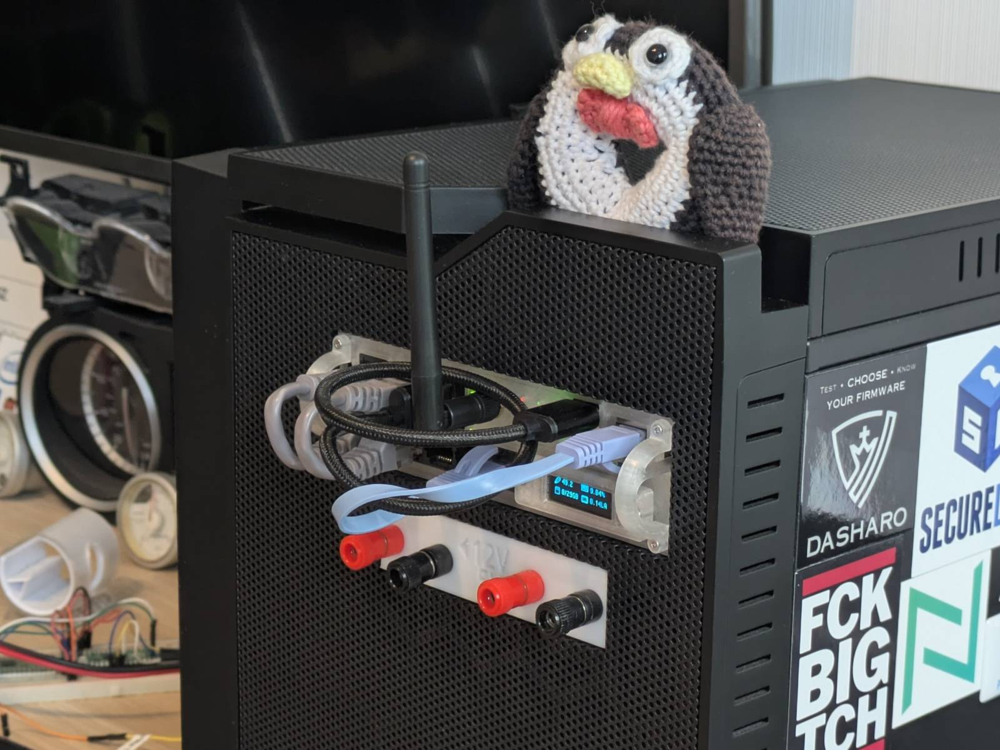
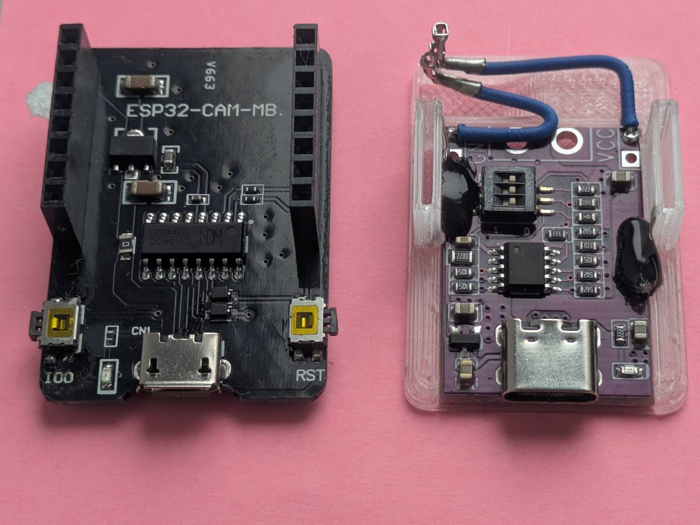
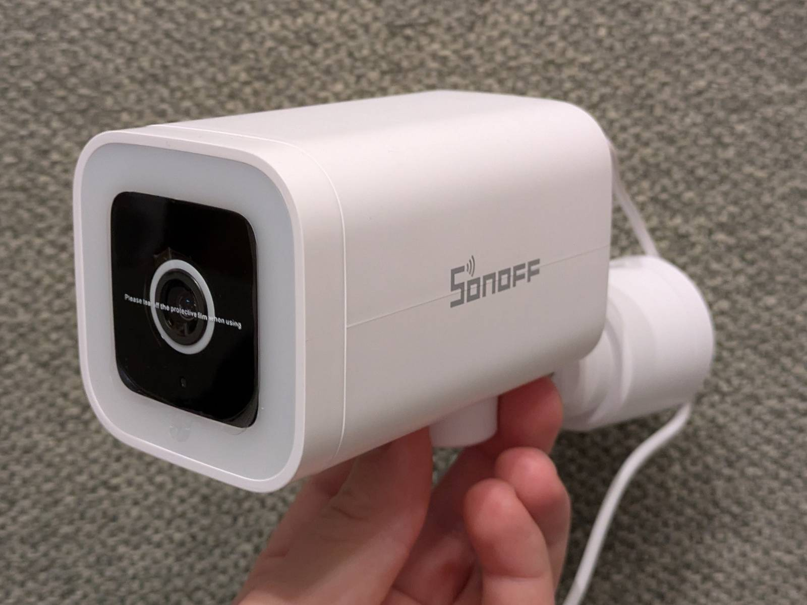
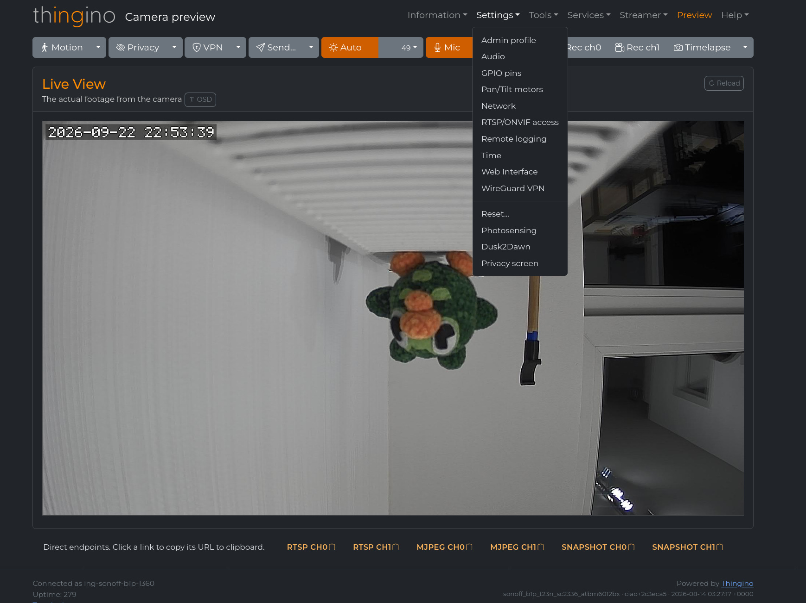
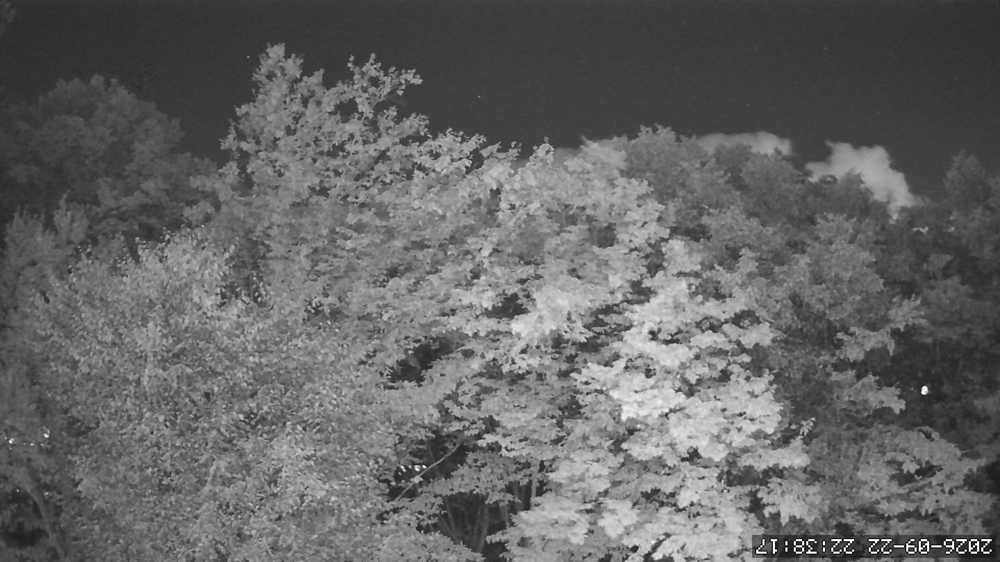
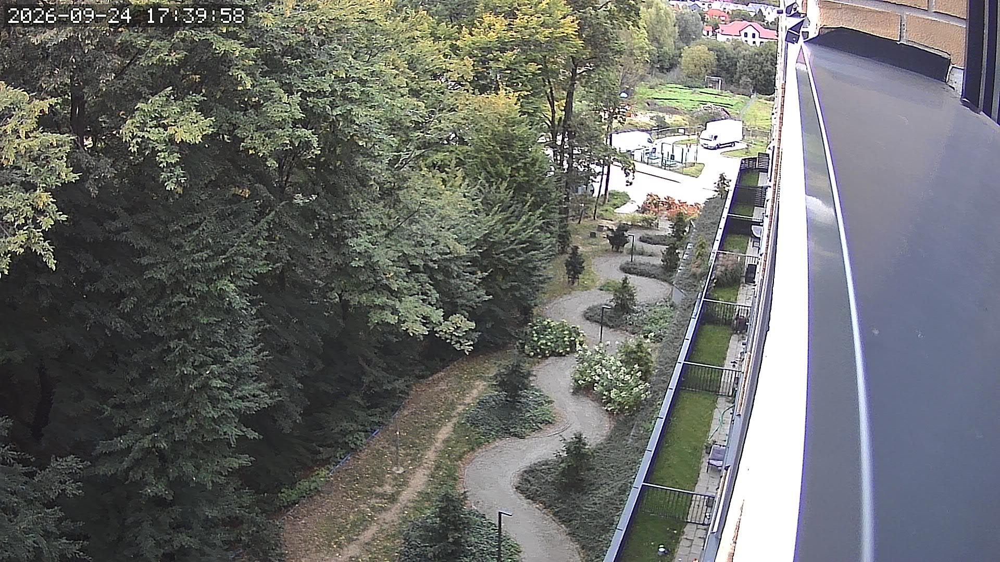
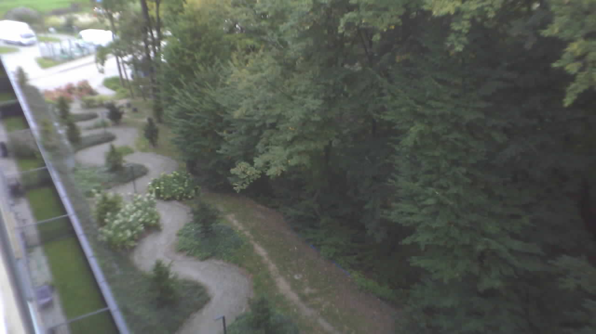

Not long after I set up the [arm_bae v2](../arm_bae-v2-new-version-and-omv-setup/),
my RPI CM4 based server, I installed [Home Assistant](https://www.home-assistant.io/) on it, just
to see what the fuss is about. I rent an apartment, so I don't have much stuff to automate, yet
you know... Self-hosting stuff and local processing on potato-powered computers sparks joy, and so
I started looking for things I could add to my pretty empty HA dashboard. ...and the first
thing that came to my mind was a camera.

My parents have this IoT security camera they can access from wherever, through Chinese servers
of course, and so I wanted to have that, but with open firmware and running 100% locally. ...and
I did it, in two ways actually. This blog post basically describes why you should avoid DIY
solutions like `esp32-cam` and head straight for Thingino. If you are interested in my IoT
camera journey, why `esp32-cam` makes an awful security camera, or how to turn a proprietary
off-the-shelf camera into an open-source one, keep on reading.

## I could use a camera

---

At work we have a Prusa MK4 3D printer with an external camera setup running on an Intel NUC
of some sort. Once I learned the sole job of this PC is to forward the camera stream (it bugs me
to this day), I searched for alternatives and found
[this blog post](https://blog.prusa3d.com/development-of-the-open-source-camera-firmware-solution-from-the-community-for-prusa-printers_94421/)
on the Prusa website about turning a cheap `esp32-cam` development board into an open-firmware
camera. ...and I thought to myself, I could use that.

I was intrigued by the concept of an IP/IoT camera with open-source firmware, and since:

- I wanted to have some sort of preview of my apartment when I'm away on holidays,
- I'm planning on buying a standalone garage, and I was thinking of a cheap camera system either way,

...I decided to buy one myself and give it a go.

## Cha cha real smart

---

The main concern for me, aside from the moral ones, is someone getting unauthorized access to the
camera that points at my living room. I've watched enough
[Benn Jordan's videos](https://www.youtube.com/@BennJordan) to know that being paranoid about
cameras is a desirable trait, and so I started wondering how I can make this setup reasonably secure.

For starters, I didn't want my ISP or LAN devices to even sense the camera is there, and so I
decided to utilize my CM4's Wi-Fi chip as an AP for a dedicated, sandboxed network.

### Sandboxed AP network details

I've created myself an Ansible role that does the following:

- Takes the RPI Wi-Fi network interface out of `NetworkManager` management, and runs `hostapd` on
  it instead. The passphrase is generated dynamically (but reused on role re-runs) and the SSID is
  hidden (not for security-by-obscurity reasons, just so neighbors don't see it).
- Sets up a `dnsmasq` DHCP service on the interface.
- Sets up a `chrony` NTP server on the interface.
- Applies custom `iptables` rules (via a oneshot service) to ensure no device in LAN can route to
  the sandboxed network via the server and vice versa. This is a workaround for `Docker` enabling
  forwarding system-wide.
- ...and finally, tells the Pi to use the external antenna instead of the built-in one (compute
  modules have this configurable).

The result of the above is a sealed AP island for various IoT devices I wanna integrate with HA,
with no additional hardware needed. An additional perk is that I made static IP address assignment
via DHCP Ansible-managed, simply by having a dedicated inventory file for IoT devices and a
dedicated playbook to update the configuration and reload the services.

### Getting access

Docker containers that should have access to the sealed network simply run in host network mode.
That works plug and play and no extra configuration is needed.

For configuring the devices attached to the AP via web UI, the trick is to use SSH tunneling,
either the classic one or SOCKSv5. The classic one works `Plug&Pray™` with browsers, yet you must
make sure you forward all the ports the web UI calls, otherwise stuff breaks and you've got
debugging to do. On the other hand, a SOCKS proxy is trivial to set up but is not picked up by
browsers by default. Firefox, for example, respects system settings by default, so a quick fix for
me was to set up the proxy in GNOME settings and turn it on on demand.

> Wouldn't just connecting to the AP from a laptop and accessing the camera web UI work too?

I don't have any rules that would block this (dunno, a MAC allow-list for example), yet try pulling
this off when the AP is N kilometers away from ya.

## esp32-cam, a dead end

---

Alright, now that I've flexed my AP setup on ya, let's talk about why `esp32-cam` is an awful
security camera.

### Legacy

The `esp32-cam` was released in 2019, so it's not a new product by any means. If you go to
Thingiverse and search for it, there are literally tens of pages with various cases, mounts, robots,
etc. for it. The same goes for YouTube. People put those everywhere: drones, tanks, submarines and
also wannabe security cameras.

### Under-performance (rant)

I don't really wanna torment this piece much, as I've spent enough time on it already, so here is
some basic information I think you should know about it:

- The performance sucks. At HD resolution (`1280x720`)
  [you'll be lucky if you hit 2FPS](https://arxiv.org/html/2505.24081v1).
- The module gets unpleasantly hot to the touch, possibly the hottest MCU I've ever worked with.
- The smart charger I have showed power usage exceeding 0.2A at 5V (1W).
- The stock programming board can't even be used to deliver power to the board, and I had to
  commit [this abomination](https://www.thingiverse.com/thing:7409274):
  
  If your `esp32-cam` resets randomly or drops Wi-Fi like crazy, this is probably why.

To me this is off-putting enough, but if you need more reasons not to use it, I'll provide them
soon.

### The tale of two firmwares

I've tried running two types of firmware on my unit:

- ESPHome-based one - which had a nice feature set, yet I can't give you a proper review of it
  since at that time I still didn't know why the camera kept disconnecting (power issues).
- [esp32cam-rtsp](https://github.com/rzeldent/esp32cam-rtsp) - which is what I ended up using.

I prefer the [RTSP](https://en.wikipedia.org/wiki/Real-Time_Streaming_Protocol) based firmware as
it is simply more flexible. It works well enough with HA and at the same time works with NVR-type
tools. The downside is that changing settings is less convenient, as you must do it via the web UI
rather than in HA directly. An additional gimmick with the `esp32-cam` is that it streams Motion
JPEG, which is slightly less common.

If (you ignored my recommendations, and) your goal is simply to have a preview in HA, then going
with the ESPHome route is also a valid choice. You gain better integration (e.g. controlling the
built-in LED from the dashboard), but the camera is tied to HA only, since it speaks some
proprietary binary protocol.

In case it didn't come across clearly enough, let me stress that HA itself is not monitoring
software. To capture and store the footage, you'll need some kind of integration, and I suspect
getting it to work with ESPHome-based firmware might be tricky (not that it's worth it anyway).

### Why not use esp32-cam?

It's finally time to answer that question definitively...

Don't get me wrong, I think there are real use cases for this module, yet a security camera is not
one of them, especially in current times. It works well enough as a live-ish preview of some
sort, if you don't care about recording capabilities. As stated earlier, I use mine to check if
I haven't been robbed yet when I'm not home for a few days. That said, possibly the best use case for
them I've seen is [monitoring analogue gauges](https://youtu.be/iUgxwbfkIqU) with the help
of [OCR](https://en.wikipedia.org/wiki/Optical_character_recognition).

But the final nail in the coffin is the existence of [Thingino](https://thingino.com/), an
open-source replacement firmware for off-the-shelf IoT cameras. You've probably heard of brands
like TP-Link (which I personally despise), Sonoff or Xiaomi. All these companies (Thingino
supports many more) sell both indoor and outdoor IoT cameras that you can use as a host for
Thingino firmware. I've personally chosen...

## Sonoff B1P

---

The slick fella in the picture below is the
[Sonoff B1P](https://sklep.sonoff.com.pl/pl/products/bezpieczenstwo-w-domu/zewnetrzna-inteligentna-kamera-wifi-sonoff-cam-b1p-2k-54834)
outdoor camera.

The cheapest `esp32-cam` I could find was 45zł (~10 EUR). This thing is currently just 80zł
(~18 EUR) on Amazon, and compared to the `esp32-cam`:

- It is `IP65` rated for water and dust resistance.
- Features a **motorized** pan system.
- Has auto-focus.
- Has a genuine mechanical ICR filter.
- On Thingino firmware it can do smooth 1080p 25fps (Sonoff claims 2K stock, but the sensor is a
  2MP SC2336).
- ...and flashing is as easy as preparing an SD card, plugging it in, and giving it a few minutes
  to dump the old firmware and write the new one.

From my perspective, there is absolutely no reason to use `esp32-cam` when such things exist, and
this camera is just an example. It's better in every aspect, waterproof, and flashing the firmware
is as trivial as it gets. It's great bang for the buck, considering you get an almost ready-to-go
package with so many comfort features and better image quality.

### Flashing Thingino

As I said, the core of flashing Thingino firmware is preparing an SD card and letting it do its
thing. If you by any chance have this camera, you can follow
[this video by WLTechBlog](https://youtu.be/6ZB_Z8tFD7Y) or
[this wiki](https://github.com/themactep/thingino-firmware/wiki/Camera:-Sonoff-Cam%E2%80%90S2-and-B1P)
if you, like me, prefer the text form.

## Thingino, the star of the show

---

The hardware is one thing, but the real MVP is the Thingino firmware itself. I'm blown away that
such a thing is distributed for free.

Thingino offers an overwhelming amount of features and settings you can play with. For the camera
itself, it supports stuff like:

- Motion detection
- Pan control
- Built-in RTSP, MQTT (for HA integration), ONVIF
- Photosensing
- Timelapse and local video recording

...but it also integrates quality of life services like:

- Built-in WireGuard VPN support
- "Send to" automations with email, FTP, Telegram, webhook, ntfy, Gotify and even Google Photos

If you really want to, you can also SSH into your camera and play with the system that way.

I used the word "overwhelming" not without reason. It can feel like too much at first, but thanks
to this the firmware feels complete, and everything works without a hiccup.

> 11/10, would recommend

## Some comparisons

---

I think it goes without saying that the modded Sonoff camera outclasses the `esp32-cam` in every
aspect. Yet, here are some stills from both cameras so we can have a laugh.

Note: All the stills you see were taken via the "Download snapshot" option in the HA dashboard.

### NIGHT VISION

First of all, night vision. Here's a still from the Sonoff B1P.

The only thing I did was rotate the picture. The ICR filter kicks in automatically when it detects
dusk. And now a photo from the `esp32-cam`, same location, same environment.

> XD

...though to be fair, the esp camera can be modded for night vision. Yet, the B1P does the
switching dynamically.

### Daytime

Here are the pictures taken during the day. First, the B1P...

...and then the `esp32-cam`...

Here the biggest limitation of the `esp32-cam` is obviously the lack of auto-focus, so the whole
picture looks as if I took it with a bar of soap. The second thing is a mix of resolution and
framerate. I could bump the resolution of the `esp32-cam` to near Full HD, but it already struggles
to produce a 1 FPS HD slideshow, which I can't really call a "video".

Both pictures were taken with the cameras in "automatic" mode, meaning I left brightness, gain and
other similar settings on automatic. This matters, as this was my second attempt at capturing
those. The previous day I couldn't get a usable picture out of the `esp32-cam`. I literally thought
I had broken it somehow. I believe what happened instead is that whatever algorithm it's running is
easy to confuse. I pointed the camera at the sky while it was booting and the stream was dark as
night.

For clarity, the picture being mirrored is just down to my settings, and it can be flipped back.

## Summary

---

...and that is pretty much all I've got to say for now. The goals of:

- having a camera preview of the apartment,
- doing research on what's out there for homebrew monitoring systems

...I consider done. There's this not-really-a-joke "First rule of engineering" I've heard
somewhere, and it goes:

> Don't build something you can buy

...so, if you want a cheap IoT/IP camera, don't waste your time with the `esp32-cam`, and instead
go buy an off-the-shelf camera and flash it with Thingino.

If you are interested in NVR/camera related topics, you can also check my past post about
[running a Kerberos.io server with a webcam on a TV box](../tv-box-surveillance-system-kerberosio-agent/).
...though that one had a cursed spin to it.

For sure, however, I'll revisit this topic once I get the garage and need some kind of persistent
storage for constant-ish writes that doesn't cost millions.
