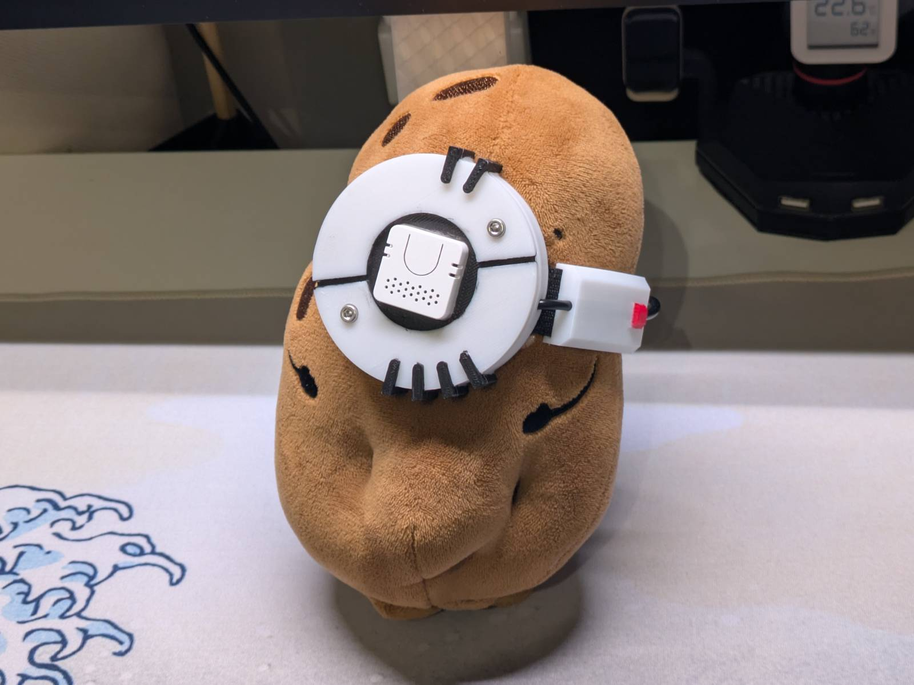
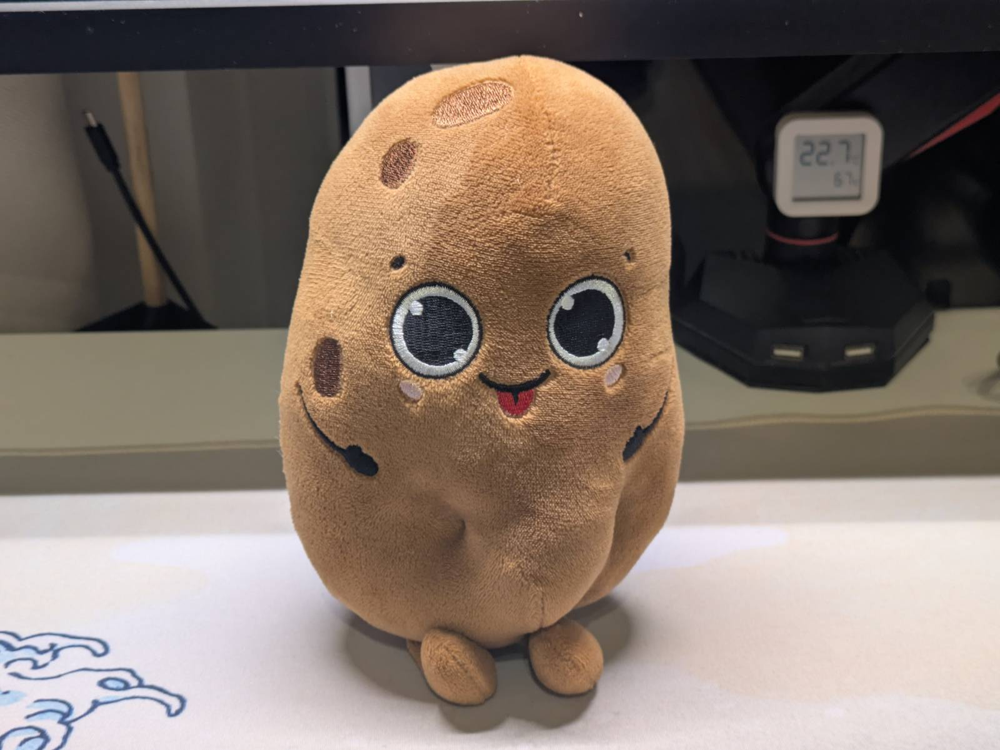
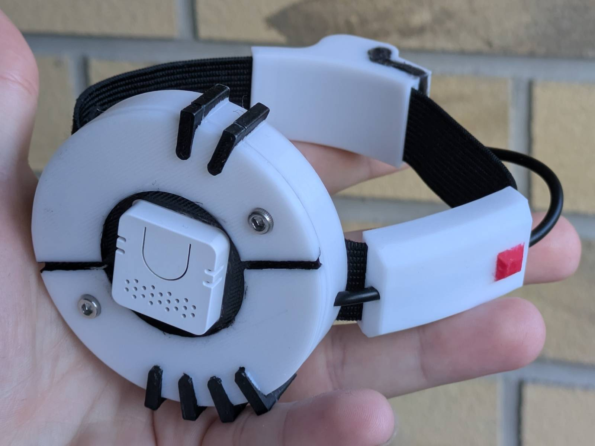

I have a problem with scope creep in my personal projects. I set out to just test how the
[Home Assistant](https://www.home-assistant.io/) Voice control works before I go buying more
expensive hardware, and I ended up with this instead:



This is a smart speaker (though not a very good sounding one) in the form of
[GLaDOS](https://theportalwiki.com/wiki/GLaDOS), a character from the
[Portal](https://store.steampowered.com/app/400/Portal/) video game series, in "her" potato form.
It connects to my Home Assistant instance so I can control my smart-home appliances, or, being
realistic, set up timers with my voice. If you're interested in how I made it and how it works, and want
to learn some "Polish lore" along the way, continue reading.

## Why?

---

I have a
[Google Nest Mini](https://support.google.com/googlehome/answer/7072284?hl=en#zippy=%2Cgoogle-nest-mini-nd-gen)
speaker, which was gifted to me a while ago. I use it to drive a few smart bulbs I have, play some
music, set up timers and make it ring my phone if I don't know where I left it. The main issue
with it, however, is that there's a non-zero chance Google might be listening. ...and since I've recently been
trying to protect my privacy to at least some reasonable extent, it's time to ditch it and have
everything processed locally, on my [RPi CM4-based server](../arm_bae-v2-new-version-and-omv-setup/).

### Voice satellite

There exists the [Home Assistant Voice Preview Edition](https://www.home-assistant.io/voice-pe/),
a `Plug & Pray™` voice satellite made specifically for HA. The thing is, it costs nearly as much as I
paid for my CM4 module, and at the time I didn't know if my server would be capable of running
the "voice stack" anyway.

I found out you can make a Home Assistant voice satellite for a fraction of the price, with the
[M5 Atom Echo](https://www.home-assistant.io/voice_control/thirteen-usd-voice-remote/). It's basically
an ESP32 with a built-in microphone and speaker, and it cost me 65zł (~$17). I spun up a few
containers, configured HA, did some tests and I was impressed by how little you need to make this
all work.

### Screw it, I'm making GLaDOS

You know how some random experiences or impressions make ideas "click"? This is exactly that kind
of chain...

As you might imagine, the sound coming out of such a tiny speaker is distorted. The voice
I initially settled on in `piper` settings (more on that later) was "SAM", which, flat and muffled,
sounded kinda like GLaDOS [falling down the elevator shaft](https://youtu.be/ulzFrZNAKq0) in
the Portal 2 game. That single thought made me realize:

- The whole stack is running on a Raspberry Pi, which is basically a potato among computers.
- I live in Poland, where for some reason we turn potatoes into mascots.

Hmm...

> Allright fellas, we doin it

## Cosplaying Mr. Ziemowit as GLaDOS

---

Here's a quick lesson in "Polish lore" for you.

We have this chain of stores named "Biedronka" (eng. Ladybug), which is
[the biggest (by revenue)](https://next.gazeta.pl/next/7,151003,32910547,piec-najwiekszych-sieci-spozywczych-w-polsce-ranking-gigantow.html)
chain of "mostly-grocery" stores in Poland. Every year, they come back with this brand-loyalty
type promotion, where every X złoty spent earns you a sticker, and if you collect a certain number
of stickers you can get a free plushie. Each edition additionally increases the "bar of absurdity"
by making the plushies more bizarre. Examples of the ones I myself used to have:

- a roll of toilet paper plushie
- a slice of bread plushie
- a wiener plushie

You think I'm joking, but in fact I am not.


> If you wanna learn what other things they turned into cursed plushies, just google any of these:
>
> Gang Świeżaków, Gang Słodziaków, Gang Fajniaków, Gang Swojaków, Gang Bystrzaków, Gang Mocniaków,
> Gang Produkciaków, Gang Biedroniaków, Gang Zaradniaków

The point is, in one edition there was a
"[Ziemniak Ziemowit](https://gang-swiezakow.fandom.com/pl/wiki/Ziemniak_Ziemowit)"
(Ziemowit the potato, it's actually in the gif above), which is an ideal GLaDOS body material.
All I needed to do was hunt one down on OLX.



7zł + postage later (and a round in the washing machine) I had acquired the cursed potato plushie.

### Cosplay

The next thing on the "TO DO" list was creating a cosplay for the plushie that would turn it into the
potato GLaDOS. Since I don't have any skills at sewing, I went with the non-destructive approach,
meaning the whole GLaDOS kit had to be a separate detachable piece. This means I had to simplify it
quite a bit, and get rid of the nails and the wires ending in alligator clips that Valve's
design had. My aim was never to make a perfect copy, but rather:

- imagine what V2 could have looked like if it was in the game,
- make sure that if people see it, they would recognize "potato GLaDOS" in it.

I came up with something like this.



Here are a few design choices I made:

- I've put the Atom Echo in the center to mimic the "core" the original design had,
- I've kept the asymmetric line that visually splits the two halves,
- I've replaced the red LED on the core with 2 M3 screws. These are functional and sandwich the two
  parts together, as inside there's a spring that holds the Echo in place,
- I turned the wires the core had into radiator-like fins,
- I kept the core-submodule and made it a cable guide.

Functionally, all this design does is relocate the USB-C port from the Atom Echo to the back of the
body and add a mounting hole so it can be placed on a 10mm rod. All the components mount on a
[20mm wide elastic band](https://www.amazon.pl/dp/B0G2M24T8X) I bought on Amazon.

Since my 3D-printer only does single-color prints, I just printed it in white and painted the
details with acrylic paint using a small brush. I'd say the result is good enough, though someone more
skilled (and with more patience) would probably do a much better job than me.

### Model's on Thingiverse

As with any other design I do, this one is also free to download on Thingiverse from this link:

[https://www.thingiverse.com/thing:7418839](https://www.thingiverse.com/thing:7418839)

You can do whatever you want with it, all I ask for is attribution.

## Home Assistant integration

---

All you need to know regarding enabling voice control in Home Assistant is condensed into
these two instructions:

- [How to set up the Assist pipeline](https://www.home-assistant.io/voice_control/voice_remote_local_assistant)
- [How to set up the Atom Echo as a voice satellite](https://www.home-assistant.io/voice_control/thirteen-usd-voice-remote/)

Here I will only cover the quirks and my own experiences.

### Spinning up containers

The main operating system on my CM4 based server is
[OpenMediaVault](https://www.openmediavault.org/), and I am simply running Home Assistant in
the official Docker container. The limitation of this setup is that add-ons cannot be installed
directly in HA, and instead I had to spin up additional containers "by hand".

To make our GLaDOS hear and speak, I needed containers with TEXT-TO-SPEECH and SPEECH-TO-TEXT
engines. For speech, the recommended engine is [piper](https://github.com/OHF-Voice/wyoming-piper),
and for speech-to-text you can use:

- [speech-to-phrase](https://github.com/OHF-voice/speech-to-phrase) - (closed-ended),
  which is lightning fast even on the Pi, but is limited to only a subset of Assist’s voice
  commands.
- [whisper](https://github.com/OHF-Voice/wyoming-faster-whisper) - (open-ended), which transcribes
  everything, but is unusably slow on the Pi (I'll come back to this later).

I settled on the following compose file:

```yaml
services:
  piper:
    image: rhasspy/wyoming-piper:latest
    container_name: wyoming-piper
    restart: unless-stopped
    ports:
      - "10200:10200"
    volumes:
      - "CHANGE_TO_COMPOSE_DATA_PATH/wyoming/piper:/data"
      - "/etc/localtime:/etc/localtime:ro"
    environment:
      - TZ=Europe/Warsaw
    command: --voice en_US-sam-medium

  speech-to-phrase:
    image: rhasspy/wyoming-speech-to-phrase:latest
    container_name: wyoming-speech-to-phrase
    restart: unless-stopped
    ports:
      - "10300:10300"
    volumes:
      - "CHANGE_TO_COMPOSE_DATA_PATH/wyoming/speech-to-phrase/models:/models"
      - "CHANGE_TO_COMPOSE_DATA_PATH/wyoming/speech-to-phrase/train:/train"
      - "/etc/localtime:/etc/localtime:ro"
    environment:
      - TZ=Europe/Warsaw
    # HA is host-networked, so it isn't reachable by container name.
    extra_hosts:
      - "host.docker.internal:host-gateway"
    # Retrains on start (~1-2 min on a CM4) to pick up newly exposed entities.
    command: >
      --hass-websocket-uri ws://host.docker.internal:8123/api/websocket
      --hass-token ${HASS_TOKEN:?set HASS_TOKEN in the stack environment}
      --retrain-on-start
```

Once the services were up and running all that was left to do was adding the `Wyoming Protocol`
integration in HA.

### Making it sound like GLaDOS

At this point I had everything up and running, I used `SAM` as the default voice, and this is when
I had a flash of genius as described in the "[Screw it, I'm making GLaDOS](#screw-it-im-making-glados)"
section. The potato form was nice, but to make it a true GLaDOS I would need 3 additional things:

- Make it sound like GLaDOS
- Make it a true "AI"
- Make it react to "GLaDOS"

The first part turned out to be much simpler than I anticipated, because someone
([rokeya71](https://huggingface.co/rokeya71) or [dnhkng](https://github.com/dnhkng/GlaDOS/)) has
already bothered making
[the GLaDOS VITS model](https://huggingface.co/rokeya71/VITS-Piper-GlaDOS-en-onnx/tree/main)
for Piper. All that needs to be done is downloading the `.onnx.json` and `.onnx` files into the piper
data directory.

```bash
B=https://huggingface.co/rokeya71/VITS-Piper-GlaDOS-en-onnx/resolve/main
curl -fL "$B/glados.onnx"      -o glados.onnx
curl -fL "$B/glados.onnx.json" -o glados.onnx.json
```

...then in the HA it's a matter of reloading the piper integration and setting up the GLaDOS voice
in the Assist pipeline.

_Note: While it isn't stated anywhere, the audio files from the game might have been used to
create the voice model. The source audio is Valve's copyrighted work, and it is the result of Ellen
McLain's voice acting and the work of sound engineers. I leave the decision whether it is right to
use such a model to your own morality._

### Not a true AI

I thought making my potato GLaDOS AI powered would be the cherry on top of this project, and sadly
I failed, but not for the reasons you might think.

As previously stated, the CM4 is a potato on its own and I had to work around that if I wanted
to make everything local. First I investigated tiny home-automation models like
[Needle 3 by Cactus Compute](https://cactuscompute.com/needle) and
[home-llm models by acon96](https://github.com/acon96/home-llm). The first one is a fresh solution
and would require a lotta hackjobs to play with HA nicely, and I didn't want to maintain those.
The second one I got deployed successfully, but quickly realized the limitation of such models, which
is that they are not "chat" models. They just output the JSON HA can take, but ask them about the
weather and they get confused.

Home Assistant gives you a setting to forward the task to AI only if it can't be handled by the
internal pipeline. ...and so my next plan was to spin up a small chat-type model I could use to talk
with GLaDOS (more for a demo than actual work), and let HA pipelines do the automation. The model
I settled on was [SmolLM2:360M](https://huggingface.co/HuggingFaceTB/SmolLM2-360M), simply because
it was small and created sentences that made sense. I spun up an `ollama` container, loaded the model
up, and I was getting `~4.5–5 tok/s` (which is near reading speed), so not half bad on the Pi.
What ended up biting me instead were 3 things:

1. I needed to change from `speech-to-phrase` to `whisper` to use the full vocabulary. On the Pi
   this is unbearably slow (the HA page says 8s to process, and I can confirm that), to the point it
   is unusable.
1. HA had issues differentiating what should be handled by the internal pipeline and what
   should be passed to AI. Simple commands like "set a timer" were improperly passed to SmolLM,
   which spat out gibberish.
1. There were issues with the model in that after a few exchanges it fixated on giving the same
   answer. While I bet people who self-host LLMs would know what was wrong right away, I'm
   still new to this and due to the two issues above I wasn't really keen on figuring out what was
   wrong.

The `whisper` speed has really put me off and unfortunately it's not something I can reliably
work around. Therefore, my GLaDOS is sadly just a pattern recognition algorithm.

### Hey GLaDOS

Wake words are the short phrases that make assistants wake up and listen. You probably
know "Hey Google" or "Hey Siri". By default you get to choose from 3 wake words, but you might
as well train your own wake command, like "Hey GLaDOS". I planned to do this initially, but I
lost interest when I couldn't get the AI pipeline to work. Yet, I've learned some things while planning
this, and if you decide to push this project further, they might be interesting to you.

First of all, someone has bothered to make the wake word for "Hey GLaDOS".
[Here's a link to the PR that adds it](https://github.com/esphome/micro-wake-word-models/pull/25).
...so if it truly works, you can skip the training part.

Secondly, the Atom Echo has a beefier successor in the form of
[Atom VoiceS3R](https://shop.m5stack.com/products/atom-echos3r-smart-speaker-dev-kit). This matters
as supposedly the on-device micro wake word is kinda stretching the original Atom Echo's capabilities,
and non-fine-tuned models might run flaky on it. If you wanna have a go at it, consider using the
newer board. The obvious downside, however, is that [it is blue](https://youtu.be/68ugkg9RePc?t=33).

## Demo

---

Alright, so I guess I owe you some kind of demo, where GLaDOS says "the line". Here's a YouTube
short I made:

<div style="width:100%; max-width:360px; margin:0 auto;">
  <iframe
    src="https://www.youtube.com/embed/T_5mpHbUrIY"
    title="YouTube video player"
    allow="accelerometer; autoplay; clipboard-write; encrypted-media; gyroscope; picture-in-picture; web-share"
    referrerpolicy="strict-origin-when-cross-origin"
    allowfullscreen
    style="width:100%; aspect-ratio:9/16; border:0;"
  ></iframe>
</div>

## This was a triumph

---

That's it ladies and gentlemen. One more project crossed out from my never-ending "TO DO" list. The
GLaDOS assistant potato edition is up and working and holds a spot on my desk. I will test it for
a while and eventually decide if I need better hardware.

If you want to print the GLaDOS cosplay kit yourself, the link to the 3D models is here:

[https://www.thingiverse.com/thing:7418839](https://www.thingiverse.com/thing:7418839)

...along with the instructions on how to assemble it.
