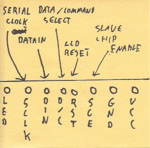
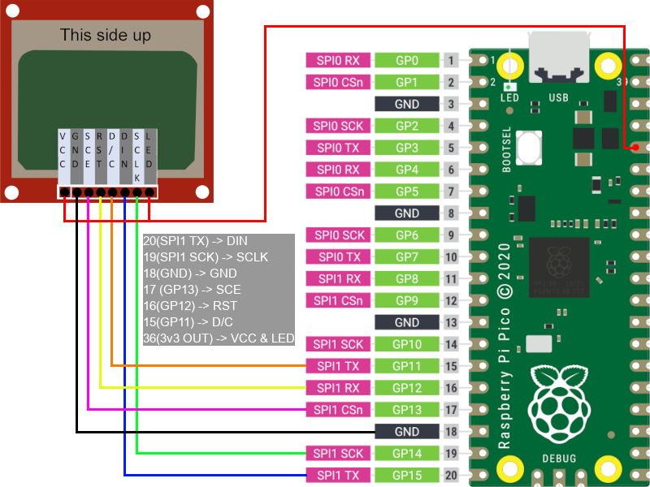

[⬅️ Main page](./index.md)

# dwm\_pico\_5110\_LCD - C Nokia display library for pi pico
This is a quick start guide for how to use Nokia 5110 LCD on Raspberry Pi Pico using dwm\_pico\_5110\_LCD library.

This guide covers the basics of LCD operation, how to connect LCD display to Pi Pico and how to interact with it using library. Remember, this guide provides information necessary to get you started using the display with Raspberry Pi Pico. If you need specific information about the display, or any topic covered here, you should look elsewhere.

**Contents:**
1. [Prerequisites](#prerequisites)
2. [LCD Basics](#lcd-basics)
    1. [Communication](#communication)
    2. [Pinout - pin functions](#pinout---pin-functions)
3. [Connecting to Pi Pico](#connecting-to-pi-pico)
    1. [SPI interface](#spi-interface)
    2. [Connecting LCD to Pi Pico](#connecting-lcd-to-pi-pico)
4. [Operating display with dwm\_pico\_5110\_LCD](#operating-display-with-dwm\_pico\_5110\_LCD)
    1. [Compiling example](#compiling-example)
    2. [Adding library to your project](#adding-library-to-your-project)
    3. [Initiating library](#initiating-library)
    4. [Function types](#function-types)
5. [Licensing](#licensing)

## Prerequisites
The following document partially uses master/slave nomenclature that is now abandoned. This is because the topics discussed here were invented when this was still a standard, and there's no possibility to omit them without creating potential misunderstanding.

## LCD Basics
This chapter explains basic principle of operation of LCD.

### Communication
Nokia 5110 display module uses a variant of the Serial Peripheral Protocol (SPI) for communication with primary (master) device. The main thing that distinguishes it from the standard, is that this communication is one way only, which means that LCD can only receive data. The display also features additional signal ports like RST, that are not present in standard SPI. Port properties are explained in detail in [pinout chapter](#pinout---pin-functions), refer to this chapter for details on how the display operates.

### Pinout - pin functions
 
Pinout and functions:
* LED - display backlight. Can be connected to power source, or be controlled digitally via PWM (not part of library).
* SCLK - SERIAL CLOCK (SPI STANDARD) - Used to establish communication speed. Display supports maximum SPI speed of 4Mhz.
* DIN - DATA IN (SPI STANDARD (MOSI)) - Input pin for SPI data. This would be MOSI in standard SPI communication.
* D/C - DATA / COMMAND (SELECT) - This pin is used to notify display whether data or command is send. Low for command, high for data.
* RST - RESET - Used to clear display registers. Low state should be set for about 100 nanoseconds (don't quote me on that), then set to high, and left alone.
* SCE - SLAVE CHIP ENABLE (SPI STANDARD (CHIP SELECT)) - This pin is used to mark what "device" (for lack of better word) should process the data if there are multiple connected to single SPI bus.
* GND - Common ground.
* VCC - Power source. LCD operates between 2.7v and 3.3v so connecting to 3.3v provided by Pi Pico **should** be safe.

## Connecting to Pi Pico
This chapter briefly explains how to connect the display to Pi Pico.
### SPI interface
Raspberry Pi Pico has two SPI interfaces, as shown in the picture below (either SPI1 or SPI0, marked with dark pink color). 
 
Source: [Raspberry Pi Pico documentation https://www.raspberrypi.com/documentation/microcontrollers/images/pico-pinout.svg](https://www.raspberrypi.com/documentation/microcontrollers/images/pico-pinout.svg)

Attention should be paid to the acronyms corresponding to each SPI LINE like: SCK, TX, CSn... This library uses hardware SPI, thus it is important for some of the display pins to connect the, to pins with certain function! This is explained more in the next chapter.

### Connecting LCD to Pi Pico
Below is an example of connecting 5110 LCD display to Raspberry Pi Pico. 
 
Note: Pi Pico picture was taken from the previous picture, provided by Raspberry Pi Team.

The basics of connecting the display to Pi Pico are as follow:
* DIN pin must be connected to any SPI<N> TX pin on Pi Pico (where <N> is number of SPI interface of choice).
* SCLK pin must be connected to any SPI<N> SCK pin on Pi Pico, **under the same SPI interface like DIN pin!**
* Pins: SCE, RST, D/C can be connected to any general purpose (GP) pin of Pi Pico.
* LCD has operating voltage between 2.7-3.3v. VCC and LED pins can be connected to Pico's 3v3(OUT) pin.
* GND can be connected to any ground pin on Pi Pico.

## Operating display with dwm\_pico\_5110\_LCD
This chapter briefly explains, how to use dwm\_pico\_5110\_LCD library.

### Compiling example
After obtaining the repository, open CMakeLists.txt and edit PICO_SDK_PATH, set your SDK path accordingly.

Next, add directory called `build` inside main repo directory `./`.

Switch to newly created directory and run command `cmake ..`.

If no errors were reported, you can run `make` command inside the same directory, to build the project.

After running the command you should get executable file called `example.uf8` which you can drag & drop to Pi Pico when connected in flash mode.

Additional notes: 
If your connection scheme does not match the one provided in previous chapter, you should edit macros at the beginning of `example.c` file, to suit your setup.

### Adding library to your project
Copy `dwm_pico_5110_LCD` library directory (the one inside the repo) to your project, add necessary lines to CMakeLists.txt and you should be good to go.

Don't forget to include library in your project and add necessary lines to CMakeLists.txt. For your convenience these are marked with `# <--` in example provided.

### Initiating library
Before using any methods, the library must be initiated first. 
**...and before initiating library, SPI must be initiated first!**

This is done this way, to make the user aware, that they are running SPI with 4MHz clock speed (which is not a full potential of Pi Pico, but limitation of 5110 LCD display).

Also, make sure that pins are assigned to LCD display.

Please check out `main` function in `example.c` file to see proper library initialization in practice.

### Function types
All functions start with `LCD_` prefix. This helps keeping track that the library is used, and helps with autocomplete.

There are 4 types of functions in the library:
* Setters - this function are used only on init, to assign the pins and spi interface to the LCD. This type of functions always start with `LCD_set`.
* Getters - this are helper functions. They are mostly used to get some values. These should start with `LCD_get` prefix.
* Writing functions - these are used to interact with the display on demand, meaning any of this functions somehow triggers screen when executed. This type of functions allow to change display parameters (like inverting color) or displaying text on the display.
* Draw functions - these functions are mostly used for drawing shapes on the screen, but key difference (regarding "Writing functions") is that changes are written to buffer rather to the screen directly. All the changes made to the buffer are kept in memory, and can be passed to LCD via `LCD_refresh` methods.

If you need the list of functions, they can be found in `dwm_pico_5110_LCD.h` header file.
All the functions should have description provided, and your editor should be able to handle them, providing snapshot when function is used. If for some reason this does not work, you can check function descriptions directly in `dwm_pico_5110_LCD.c` file.

## Licensing
dwm\_pico\_5110\_LCD library is shared under General Public ~~Virus~~ License 3.0.  
Detailed licensing terms are a part of library repository.